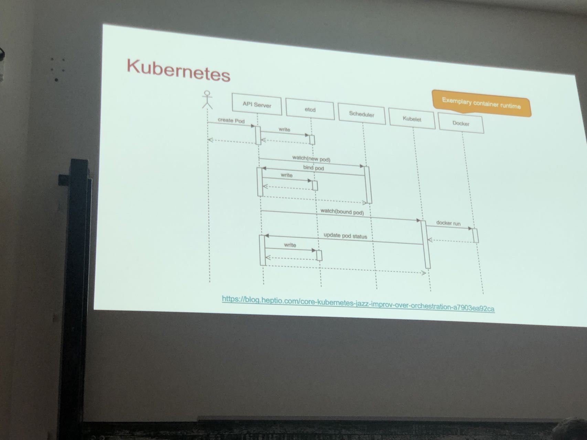

https://gitee.com/yooome/golang/tree/main/20-k8s%E8%AF%A6%E7%BB%86%E6%95%99%E7%A8%8B-%E7%AC%AC%E4%BA%8C%E9%98%B6%E6%AE%B5#%E4%BA%8Ckubernetes-%E6%9E%B6%E6%9E%84

# 1 构架图 


> **ApiServer** : 资源操作的唯一入口，接收用户输入的命令，提供认证、授权、API注册和发现等机制
> **Scheduler** : 负责集群资源调度，按照预定的调度策略将Pod调度到相应的node节点上
> **ControllerManager** : 负责维护集群的状态，比如程序部署安排、故障检测、自动扩展、滚动更新等
> **Etcd** ：负责存储集群中各种资源对象的信息
> ccm: cloud control manager: 云控制器管理器（Cloud Controller Manager）允许你将你的集群连接到云提供商的 API 之上， 并将与该云平台交互的组件同与你的集群交互的组件分离开来。


Kubernetes 主要由以下几个核心组件组成：
- etcd 保存了整个集群的状态。
- apiserver 提供了资源操作的唯一入口，并提供认证，授权，访问控制，API注册和发现等机制；
- controller manager 负责维护集群的状态，比如故障检测，自动扩展，滚动更新等；
- schedule 负责资源的调度，按照预定的调度策略将 POD 调度到相应的机器上；
- kubelet 服务维护容器的生命周期，同时负责 Volume（CSI）和网络（CNI）的管理；
- Container runtime 负责镜像管理以及 Pod 和容器的真正运行（CRI）；
- kube-proxy 负责为 Service 提供 cluster 内部的服务发现和负载均衡；

除了核心组件，还有一些推荐的插件，其中有的已经成为 CNCF 中的托管项目：
- CoreDNS 负责为整个集群提供 DNS 服务。
- Ingress Controller 为服务提供外网入口。
- Prometheus 提供资源监控。
- Dashboard 提供GUI。
- Federation 提供跨可用区的集群。


下面是一个更抽象的一个视图：


## 1.1 master-node 构建 


K8S架构主要包含两部分：Master（主控节点）和 node（工作节点）

一个Kubernetes集群至少包含一个控制平面(control plane)，以及一个或多个工作节点(worker node)。
k8s 集群控制节点，对集群进行调度管理，接受集群外用户去集群操作请求；

- **Master**：主控节点
    - **控制平面(Control Plane)= Master（主控节点) :** 控制平面负责管理工作节点和维护集群状态。所有任务分配都来自于控制平面。
    - API Server：集群对外的统一入口，以restful风格进行操作，同时交给etcd存储
        - 提供认证、授权、访问控制、API注册和发现等机制
    - scheduler：节点的调度，选择node节点应用部署
    - controller-manager：处理集群中常规后台任务，一个资源对应一个控制器
    - etcd：存储系统，用于保存集群中的相关数据, 例如 pod 数据, services 数据 等等 
    - 
- **Work Node**：工作节点
    - **工作节点(Worker Node) :** 工作节点负责执行由控制平面分配的请求任务,运行实际的应用和工作负载。一个node 中 包含若干个 Pod
    - Kubelet：master派到node节点代表，管理本机容器
        - 一个Pod集群中每个node节点上运行的代理，它保证容器都运行在Pod中
        - 负责维护容器的生命周期，同时也负责Volume(CSI) 和 网络(CNI)的管理
        - kubelet发命令给Docker, 让Docker 在这个node 上 的Pod 跑起来一个 container 
    - kube-proxy：提供网络代理，负载均衡等操作, 提供集群内部的服务发现和负载均衡, 通过 kube-proxy 来访问 某个Node 中 的某个服务
        - 和 master 节点中的 ApiServer 的区别: 通过ApiServer 来安排 整个集群的干活 
    - **Docker** : 负责节点上容器的各种操作
    - 
- Pod：
    - docker run 启动的是一个 container（容器），容器是 Docker 的基本单位，一个应用就是一个容器。
    - kubectl run 启动的是一个应用称为一个 Pod ，Pod 是 Kubernetes 的基本单位。
    - Pod 是对容器的再一次封装。
    - Pod 类似于 Java 日志体系中的 Slf4j ，而 Docker 中的容器类似于 Java 日志体系中的 Logback 等日志实现。
    - 一个容器往往代表不了一个基本应用，如：博客系统（WordPress，PHP + MySQL）；但是一个 Pod 可以包含多个 Container，一个 Pod 可以代表一个基本的应用。
- 容器运行环境【**Container Runtime**】
    - 容器运行环境是负责运行容器的软件
    - Kubernetes支持多个容器运行环境：Docker、containerd、cri-o、rktlet以及任何实现Kubernetes CRI (容器运行环境接口) 的软件。
- fluentd：是一个守护进程，它有助于提升 集群层面日志


## 1.2 分层架构 


Kubernetes 设计理念和功能其实就是一个类似 Linux 的分层架构，如下图所示。
- 核心层：Kubernetes 最核心的功能，对外提供API构建高层的应用，对内向提供插件式应用执行环境。
- 应用层：部署（无状态应用，有状态应用，批处理任务，集群应用等）和路由（服务发现，DNS解析等），Service Mesh（部分位于应用层）。
- 管理层：系统度量（如基础设施，容器和网络的度量），自动化（如自动扩展，动态Provision等）以及策略管理（RBAC，Quota，PSP，NetworkPolicy等），Service Mesh （部分位于管理层）
- 接口层：kubectl 命令行工具，客户端SDK以及集群联邦。
- 生态系统：在接口层之上的庞大容器集群调度的承台系统，可以划分为两个范畴
    1. Kubernetes 外部：日志、监控、配置管理、CI/CD、Workflow、FaaS、OTS 应用、ChatOps、GitOps、SecOps 等。
    2. Kubernetes 内部：[CRI](https://gitee.com/link?target=https%3A%2F%2Fjimmysong.io%2Fkubernetes-handbook%2Fconcepts%2Fcri.html)（容器运行时接口）、[CNI](https://gitee.com/link?target=https%3A%2F%2Fjimmysong.io%2Fkubernetes-handbook%2Fconcepts%2Fcni.html)（容器网络通用接口）、[CSI](https://gitee.com/link?target=https%3A%2F%2Fjimmysong.io%2Fkubernetes-handbook%2Fconcepts%2Fcsi.html)（容器存储接口）、镜像仓库、Cloud Provider、集群自身的配置和管理等。


/usr/local/mongodb/bin./mongod --dbpath=/usr/local/mongodb/data/ --logpath=/usr/local/mongodb/logs/mongodb.log --logappend --port=27017 --fork

```
mongod --dbpath /usr/local/mongodb/data --logpath /usr/local/mongodb/logs/mongo.log --port=27017 --fork

/usr/local/mongodb/bin/mongod --dbpath=/usr/local/mongodb/data/ --logpath=/usr/local/mongodb/logs/mongodb.log --logappend --port=27017 --fork

mongod  --shutdown  --dbpath /usr/local/mongodb/data/
```

```
$MYSQL test -u root << EOF
show databases;
show tables;
selec
```

```
mongo 127.0.0.1:27017 -u appdb -p fox --authenticationDatabase=appdb

curl -fsSL https://get.pnpm.io/install.sh | env PNPM_VERSION=8.4.0 sh -


 WARN  using --force I sure hope you know what you are doing
Copying pnpm CLI from /private/var/folders/qr/htx6ks8n6hl9kblb8wjqzv2w0000gn/T/tmp.SpsPQsGI/pnpm to /Users/yooome/Library/pnpm/pnpm
Appended new lines to /Users/yooome/.zshrc

Next configuration changes were made:
export PNPM_HOME="/Users/yooome/Library/pnpm"
case ":$PATH:" in
  *":$PNPM_HOME:"*) ;;
  *) export PATH="$PNPM_HOME:$PATH" ;;
esac

To start using pnpm, run:
source /Users/yooome/.zshrc
yooome@192 ~ % 
```

## 1.3 kubernetes 基于list-watch机制的控制器的构架




- 通过Kubectl提交一个创建RC（Replication Controller）的请求，该请求通过APlserver写入etcd
- 此时Controller Manager通过API Server的监听资源变化的接口监听到此RC事件
- 分析之后，发现当前集群中还没有它所对应的Pod实例
- 于是根据RC里的Pod模板定义一个生成Pod对象，通过APIServer写入etcd
- 此事件被Scheduler发现，它立即执行执行一个复杂的调度流程，为这个新的Pod选定一个落户的Node，然后通过API Server讲这一结果写入etcd中
- 目标Node上运行的Kubelet进程通过APiserver监测到这个"新生的Pod.并按照它的定义，启动该Pod并任劳任怨地负责它的下半生，直到Pod的生命结束
- 随后，我们通过Kubectl提交一个新的映射到该Pod的Service的创建请求
- ControllerManager通过Label标签查询到关联的Pod实例，然后生成Service的Endpoints信息，并通过APIServer写入到etod中，
- 接下来，所有Node上运行的Proxy进程通过APIServer查询并监听Service对象与其对应的Endponts信息，建立一个软件方式的负载均衡器来实现Service访问到后端Pod的流量转发功能


# 2 例子 

## 2.1 例子: 部署一个nginx服务


下面，以部署一个nginx服务来说明kubernetes系统各个组件调用关系：

1. 首先要明确，一旦kubernetes环境启动之后，master和node都会将自身的信息存储到etcd数据库中
2. 一个nginx服务的安装请求会首先被发送到master节点的apiServer组件
3. apiServer组件会调用scheduler组件来决定到底应该把这个服务安装到哪个node节点上
   在此时，它会从etcd中读取各个node节点的信息，然后按照一定的算法进行选择，并将结果告知apiServer

4. apiServer调用controller-manager去调度Node节点安装nginx服务
5. kubelet接收到指令后，会通知docker，然后由docker来启动一个nginx的pod
   pod是kubernetes的最小操作单元，容器必须跑在pod中至此，

6. 一个nginx服务就运行了，如果需要访问nginx，就需要通过kube-proxy来对pod产生访问的代理

这样，外界用户就可以访问集群中的nginx服务了


## 2.2 如何让 Kubernetes 部署是一个 Tomcat 应用

- 0 ：开机默认所有节点的 kubelet 、master 节点的s cheduler（调度器）、controller-manager（控制管理器）一直监听 master 的 api-server 发来的事件变化。
- 1 ：程序员使用命令行工具： kubectl 
    - kubectl create deploy tomcat --image=tomcat8（告诉 master 让集群使用 tomcat8 镜像，部署一个 tomcat 应用）。
- 2 ：kubectl 命令行内容发给 api-server，api-server 保存此次创建信息到 etcd 。
- 3 ：etcd 给 api-server 上报事件，说刚才有人给我里面保存一个信息。（部署Tomcat[deploy]）
- 4：controller-manager 监听到 api-server 的事件，是 （部署Tomcat[deploy]）。
- 5：controller-manager 处理这个 （部署Tomcat[deploy]）的事件。controller-manager 会生成 Pod 的部署信息【pod信息】。
- 6：controller-manager 把 Pod 的信息交给 api-server ，再保存到 etcd 。
- 7：etcd 上报事件【pod信息】给 api-server 。
- 8：scheduler 专门监听 【pod信息】 ，拿到 【pod信息】的内容，计算，看哪个节点合适部署这个 Pod【pod 调度过后的信息（node: node-02）】。
- 9：scheduler 把 【pod 调度过后的信息（node: node-02）】交给 api-server 保存给 etcd 。
- 10：etcd 上报事件【pod调度过后的信息（node: node-02）】，给 api-server 。
- 11：其他节点的 kubelet 专门监听 【pod 调度过后的信息（node: node-02）】 事件，集群所有节点 kubelet 从 api-server 就拿到了 【pod调度过后的信息（node: node-02）】 事件。
- 12：每个节点的 kubelet 判断是否属于自己的事情；node-02 的 kubelet 发现是他的事情。
- 13：node-02 的 kubelet 启动这个 pod。汇报给 master 当前启动好的所有信息。


# 3 kubectl 

命令行工具管理 kubernetes集群 


# 4 master_控制平面_主控节点

控制平面组件会为集群做出全局决策，比如资源的调度、检测和响应集群事件。


## 4.1 kube-apiserver

如果需要与Kubernetes 集群进行交互，就要通过 API。

`apiserver`是 Kubernetes 控制平面的前端，用于处理内部和外部请求。

It acts as front end for the Kubernetes control plane. It exposes the Kubernetes API 

Command line tools (like kubectl), Users and even Master components scheduler, controller manager, etcd) and Worker no e components like (Kubelet) everything talk with API Server.

## 4.2 kube-scheduler

集群状况是否良好？如果需要创建新的容器，要将它们放在哪里？这些是调度程序需要关注的问题。

`scheduler`调度程序会考虑容器集的资源需求（例如 CPU 或内存）以及集群的运行状况。随后，它会将容器集安排到适当的计算节点。

Scheduler is responsible for distributing containers across multiple nodes. 
It watches for newly created Pods with no assigned node, and selects a node for them to run on.

## 4.3 etcd

[etcd](https://www.redhat.com/zh/topics/containers/what-is-etcd)是一个键值对数据库，用于存储配置数据和集群状态信息。

Consistent and highly-available key value store used as Kubernetes' backing store for all cluster data. It stores all the masters and worker node information.

## 4.4 kube-controller-manager

控制器负责实际运行集群，`controller-manager`控制器管理器则是将多个控制器功能合而为一，降低了程序的复杂性。

`controller-manager`包含了这些控制器：

- 节点控制器（Node Controller）：负责在节点出现故障时进行通知和响应
- 任务控制器（Job Controller）：监测代表一次性任务的 Job 对象，然后创建 Pods 来运行这些任务直至完成
- 端点控制器（Endpoints Controller）：填充端点（Endpoints）对象（即加入 Service 与 Pod）
- 服务帐户和令牌控制器（Service Account & Token Controllers）：为新的命名空间创建默认帐户和 API 访问令牌


Controllers are responsible for noticing and responding when nodes, containers or endpoints go down. They make decisions to bring up new containers in such cases.
• Node Controller: Responsible for noticing and responding when nodes go down.
• Replication Controller: Responsible for maintaining the correct number of pods for every replication
controller object in the system.
• Endpoints Controller: Populates the Endpoints object (that is, joins Services & Pods)
• Service Account & Token Controller: Creates default accounts and API Access for new namespaces.


## 4.5 cloud-controller-manager

控制平面还包含一个可选组件`cloud-controller-manager`。
云控制器管理器（Cloud Controller Manager）允许你将你的集群连接到云提供商的 API 之上， 并将与该云平台交互的组件同与你的集群交互的组件分离开来。
如果在自己的环境中运行 Kubernetes，或者在本地计算机中运行学习环境， 所部署的集群不需要有云控制器管理器


• A Kubernetes control plane component that embeds cloud-specific control logic.
• It only runs controllers that are specific to your cloud provider.
• On-Premise Kubernekes clusters will not have this component.
• Node controller: For checking the cloud provider to determine if a node has been deleted in the cloud after it stops responding
• Route controller: For setting up routes in the underlying cloud infrastructure
• Service controller: For creating, updating and deleting cloud provider load balancer


# 5 Worker Node 组件

节点组件会在每个节点上运行，负责维护运行的 Pod 并提供 Kubernetes 运行环境。


## 5.1 kubelet
是一个 agent

kubelet 和其他组件都不同, 他是一个进程, 并没有运行在容器中 

kubelet 会在集群中每个[节点（node）](https://kubernetes.io/zh-cn/docs/concepts/architecture/nodes/)上运行。 
它保证[容器（containers）](https://kubernetes.io/zh-cn/docs/concepts/overview/what-is-kubernetes/#why-containers)都运行在 [Pod](https://kubernetes.io/zh-cn/docs/concepts/workloads/pods/) 中。
当控制平面需要在节点中执行某个操作时，kubelet 就会执行该操作。
Kubelet 用于监控容器的状态， 确保他们都是与健康状态 

• Kubelet is the agent that runs on every node in the éluster
• This agent is responsible for making sure that containers are running in a Pod on a node.

## 5.2 kube-proxy

是个网络代理 

[kube-proxy](https://kubernetes.io/zh-cn/docs/reference/command-line-tools-reference/kube-proxy/) 是集群中每个[节点（node）](https://kubernetes.io/zh-cn/docs/concepts/architecture/nodes/)上运行的网络代理，是实现 Kubernetes [服务（Service）](https://kubernetes.io/zh-cn/docs/concepts/services-networking/service/) 概念的一部分。

kube-proxy 维护节点网络规则和转发流量，实现从集群内部或外部的网络与 Pod 进行网络通信。

It is a network proxy that runs on each node in your cluster.
It maintains network rules on nodes
In short, these network rules allow network communication to your Pods from network sessions inside or outside of your cluster.


## 5.3 容器运行环境（Container Runtime）

容器运行环境是负责运行容器的软件。
Kubernetes 支持许多容器运行环境，例如 [containerd](https://containerd.io/docs/)、docker或者其他实现了 [Kubernetes CRI (容器运行环境接口)](https://github.com/kubernetes/community/blob/master/contributors/devel/sig-node/container-runtime-interface.md)的容器。

• Container Runtime is the underlying software where we run all these Kubernetes components.
• We are using Docker, but we have other runtime options like rkt, container-d etc.


