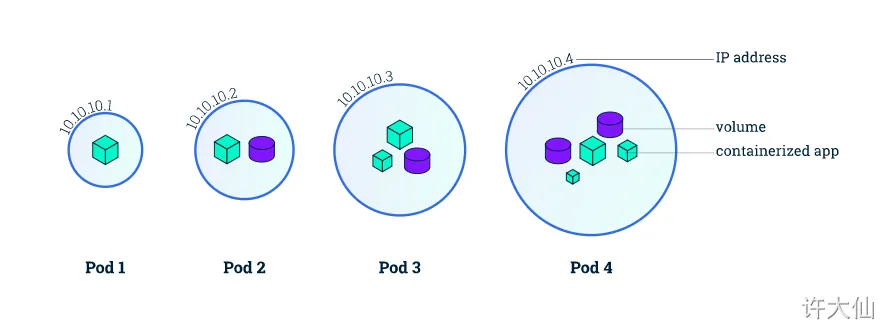

# 1 k8s核心概念

Master**：集群控制节点，每个集群需要至少一个master节点负责集群的管控
**Node**：工作负载节点，由master分配容器到这些node工作节点上，然后node节点上的docker负责容器的运行
**Pod**：kubernetes的最小控制单元，容器都是运行在pod中的，一个pod中可以有1个或者多个容器
**Controller**：控制器，通过它来实现对pod的管理，比如启动pod、停止pod、伸缩pod的数量等等
**Service**：pod对外服务的统一入口，下面可以维护者同一类的多个pod
**Label**：标签，用于对pod进行分类，同一类pod会拥有相同的标签
**NameSpace**：命名空间，用来隔离pod的运行环境. 默认情况下 同一个 cluster 中所有的 Node是可以相互访问的.  我门想让他变得相互之间不可以相互访问, 要通过 namespace 的方式, 对不同的Pod 分类, 只有有相同的 Namespace 的Pod 之间才可以相互访问 

## 1.1 Pod

- Pod是K8s中最小的单元
- 一组容器的集合
- 共享网络【一个Pod中的所有容器共享同一网络】
- 生命周期是短暂的（服务器重启后，就找不到了）

## 1.2 Volume

- 声明在Pod容器中可访问的文件目录
- 可以被挂载到Pod中一个或多个容器指定路径下
- 支持多种后端存储抽象【本地存储、分布式存储、云存储】

## 1.3 Controller

- 确保预期的pod副本数量【ReplicaSet】
- 无状态应用部署【Deployment】
    - 无状态就是指，不需要依赖于网络或者ip
- 有状态应用部署【StatefulSet】
    - 有状态需要特定的条件
- 确保所有的node运行同一个pod 【DaemonSet】
- 一次性任务和定时任务【Job和CronJob】

## 1.4 Deployment

- 定义一组Pod副本数目，版本等
- 通过控制器【Controller】维持Pod数目【自动回复失败的Pod】
- 通过控制器以指定的策略控制版本【滚动升级、回滚等】


## 1.5 Service

- 定义一组pod的访问规则
- Pod的负载均衡，提供一个或多个Pod的稳定访问地址
- 支持多种方式【ClusterIP、NodePort、LoadBalancer】


可以用来组合pod，同时对外提供服务

## 1.6 Label

label：标签，用于对象资源查询，筛选


## 1.7 Namespace

命名空间，逻辑隔离

- 一个集群内部的逻辑隔离机制【鉴权、资源】
- 每个资源都属于一个namespace
- 同一个namespace所有资源不能重复
- 不同namespace可以资源名重复

## 1.8 API

我们通过Kubernetes的API来操作整个集群

同时我们可以通过 kubectl 、ui、curl 最终发送 http + json/yaml 方式的请求给API Server，然后控制整个K8S集群，K8S中所有的资源对象都可以采用 yaml 或 json 格式的文件定义或描述

如下：使用yaml部署一个nginx的pod


# 2 Deployment


  


  

- 在 Kubernetes 中，通过创建 Deployment ，可以创建应用程序（如同 Docker 的 image）的实例（如同 Docker 的容器），这个实例被包含在 Pod 的概念中，Pod 是 Kubernetes 中的最小管理单元。
- 在 Kubernetes 集群中创建 Deployment 之后，Deployment 将指示 Kubernetes 集群如何创建和更新应用程序的实例，Master 节点将应用程序实例调度到集群中的具体的节点上。
- 创建应用程序实例之后，Kubernetes 的 Deployment Controller 将会持续监控这些实例。如果运行这些实例的 Node 节点关机或者被删除，则 Kubernetes 的 Deployment Controller 将在集群中的资源最优的另一个 Node 节点上重新创建一个新的实例，这就提供了一种 `自我修复机制` 来解决机器故障或维护问题
- 在容器编排之前的时代，各种安装脚本通常用于启动应用程序，但是却不能使得应用程序从机器故障中恢复。通过创建应用程序实例并确保它们在集群节点中的运行实例个数，Kubernetes 的 Deployment 提供了一种完全不同的方式来管理应用程序。


语法

```
kubectl create deployment 部署的名称 --image=镜像名称 --replicas=部署的副本数量 --port=容器暴露的端口

kubectl create deployment my-nginx --image=nginx --replicas=3 --port=80
```


# 3 Pod

- 创建 Deployment 之后，Kubernetes 会创建一个 Pod（容器组）来放置应用程序实例（container 容器）。



- Pod（容器组）是一个 Kubernetes 中的一个抽象概念，用于存放一组 Container（可以包含一个或多个 Container 容器，如：上图中的小正方体）以及这些 Container（容器）的一些共享资源。这些资源包括：
- 共享存储，称为卷（Volume），如：上图中的紫色圆柱体。
- 网络，每个 Pod（容器组）在集群中有一个唯一的 IP，Pod（容器组）中的 Container（容器）共享该 IP 地址。
- Container（容器）的基本新，如：容器的镜像版本、对外暴露的端口等。
- Pod（容器组）是 Kubernetes 集群上的最基本的单元。当我们在 Kubernetes 集群上创建 Deployment 的时候，会在 Kubernetes  集群上创建包含容器的 Pod （而不是直接创建容器）。每个 Pod 都和运行它的 Node 节点绑定，并保持在哪里直到终止或被删除。如果 Node 节点发生了故障，则会在集群中的其他可用的 Node 节点上运行相同的 Pod（从同样的镜像创建 Container，使用同样的配置，IP 地址不同，Pod 名称不同）。

  
温馨提示：
- Pod 是一组容器（可包含一个或多个应用程序容器），以及共享存储（卷 Volumes）、IP 地址和有关如何运行容器的信息。
- 如果多个容器紧密耦合并且需要共享磁盘等资源，则他们应该被部署在同一个Pod（容器组）中。


# 4 Node


  

- Pod（容器组）总是在 Node（节点）上运行。Node（节点）是 Kubernetes 集群中的计算机，可以是虚拟机或物理机。每个 Node（节点）都由 Master 管理。一个 Node（节点）可以有多个Pod（容器组），kubernetes 的 Master 会根据每个 Node（节点）上可用资源的情况，自动调度 Pod（容器组）到最佳的 Node（节点）上。

- 每个 Kubernetes 的 Node（节点）至少运行：
- Kubelet，负责 Master节点和 Node 节点之间通信的进程；管理 Pod（容器组）和 Pod（容器组）内运行的 Container（容器）。
- kube-proxy，负责进行流量转发。
- 容器运行环境（如：Docker）负责下载镜像、创建和运行容器等。


# 5 Service 应用程序外部可见


## 5.1 概述

- Kubernetes 中的 Pod 是转瞬即逝，Pod 有自己的 [生命周期](https://kubernetes.io/zh/docs/concepts/workloads/pods/pod-lifecycle/) ，当一个工作的 Node 挂掉后，在 Node 上运行的 Pod 也会随之消亡。Deployment（Deployment 其实是驱动 ReplicaSet） 会自动的创建新的 Pod 驱动集群回到目标状态，以保证应用程序正常运行。
- Kubernetes 的 Service 是一个抽象层，它定义了一组 Pod 的逻辑集，并为这些 Pod 支持外部流量暴露、负载均衡和服务发现。
- Service 使从属 Pod 之间的松耦合成为可能。 和其他 Kubernetes 对象一样, Service 用 YAML [(更推荐)](https://kubernetes.io/zh/docs/concepts/configuration/overview/#general-configuration-tips) 或者 JSON 来定义.。Service 下的一组 Pod 通常由 _LabelSelector_ (请参阅下面的说明为什么您可能想要一个 spec 中不包含`selector`的服务)来标记。
- 尽管每个 Pod 都有一个唯一的 IP 地址，但是如果没有 Service ，这些 IP 不会暴露在群集外部。Service 允许您的应用程序接收流量。Service 也可以用在 ServiceSpec 标记`type`的方式暴露。
- ClusterIP(默认) ：在集群的内部 IP 上公开 Service 。这种类型使得 Service 只能从集群内访问。
- NodePort：使用 NAT 在集群中每个选定 Node 的相同端口上公开 Service 。使用`<NodeIP>:<NodePort>` 从集群外部访问 Service。是 ClusterIP 的超集。
- LoadBalancer：在当前云中创建一个外部负载均衡器(如果支持的话)，并为 Service 分配一个固定的外部 IP 。是 NodePort 的超集。
- ExternalName：通过返回带有该名称的 CNAME 记录，使用任意名称(由 spec 中的`externalName`指定)公开 Service 。不使用代理。这种类型需要 `kube-dns` 的 v1.7 或更高版本。


## 5.2 Service 和 Label

  


  
- Service 通过一组 Pod 路由通信。Service 是一种抽象，它允许 Pod 死亡并在 Kubernetes 中复制，而不会影响应用程序。在依赖的 Pod (如：应用程序中的前端和后端组件)之间进行发现和路由是由 Kubernetes Service 处理的。
- Service 匹配一组 Pod 是使用 [标签(Label)和选择器(Selector)](https://kubernetes.io/zh/docs/concepts/overview/working-with-objects/labels), 它们是允许对 Kubernetes 中的对象进行逻辑操作的一种分组原语。标签( Label )是附加在对象上的键/值对，可以以多种方式使用:
- 指定用于开发，测试和生产的对象。
- 嵌入版本标签。
- 使用 Label 将对象进行分类。

  


命令 
```
# --port：集群内访问 service 的端口 8912
# --target-port： pod容器的端口 80
kubectl expose deployment nginx --port=8912 --target-port=80 --type=NodePort
```


# 6 伸缩应用程序-扩缩容

- 当创建了一个 Deployment，然通过 Service 提供访问 Pod 的方式，但是当流量增加的时候，需要对应用程序进行伸缩操作以满足系统性能的需求。

  


kubectl scale --replicas=数量 deployment 部署名称
kubectl scale --replicas=3 deployment nginx


# 7 第七章：执行滚动升级


- 滚动升级允许通过使用新的示例逐步更新 Pod 实例，从而实现 Deployment 更新，0 停机。
- 与应用程序扩展类似，如果暴露了 Deployment，服务（Service）将在更新期间仅对可用的 pod 进行负载均衡，可用 Pod 是应用程序可用的实例。
- 滚动更新允许以下操作：
    - ① 将应用程序从一个环境提升到另一个环境（通过容器镜像更新）。
    - ② 回滚到以前的版本。
    - ③ 持续集成和持续交付应用程序，无需停机。


```shell

# 镜像升级 nginx:1.17 到 nginx:latest 
# --record 表示记录变更
kubectl set image deployment 应用部署名称 Pod中容器的名称=容器的镜像 --record


# 查看历史记录
kubectl rollout history deployment 应用部署名称


# 默认回滚到上一个版本
kubectl rollout undo deployment 应用部署名称


# 默认回滚到第一个版本
kubectl rollout undo deployment 应用部署名称 --to-revision=1
```


示例

```
watch -n 1 kubectl get deployment,pod
kubectl create deployment nginx-deploy --image=nginx:1.17 --replicas=3
kubectl set image deployment nginx-deploy nginx=nginx:1.18 --record


kubectl set image deployment nginx-deploy nginx=nginx:1.19 --record
kubectl set image deployment nginx-deploy nginx=nginx --record
kubectl rollout history deployment nginx-deploy
kubectl rollout undo deployment nginx-deploy --to-revision=1
```


# 8 使用声明式对象配置模拟上述效果

## 8.1 部署一个 Deployment


vim deployment.yaml

```yaml

apiVersion: apps/v1	#与k8s集群版本有关，使用 kubectl api-versions 即可查看当前集群支持的版本
kind: Deployment	#该配置的类型，我们使用的是 Deployment
metadata:	        #译名为元数据，即 Deployment 的一些基本属性和信息
  name: nginx-deployment	#Deployment 的名称
  labels:	    #标签，可以灵活定位一个或多个资源，其中key和value均可自定义，可以定义多组，目前不需要理解
    app: nginx	#为该Deployment设置key为app，value为nginx的标签
spec:	        #这是关于该Deployment的描述，可以理解为你期待该Deployment在k8s中如何使用
  replicas: 1	#使用该Deployment创建一个应用程序实例
  selector:	    #标签选择器，与上面的标签共同作用，目前不需要理解
    matchLabels: #选择包含标签app:nginx的资源
      app: nginx
  template:	    #这是选择或创建的Pod的模板
    metadata:	#Pod的元数据
      labels:	#Pod的标签，上面的selector即选择包含标签app:nginx的Pod
        app: nginx
    spec:	    #期望Pod实现的功能（即在pod中部署）
      containers:	#生成container，与docker中的container是同一种
      - name: nginx	#container的名称
        image: nginx:1.17	#使用镜像nginx:1.17创建container，该container默认80端口可访问

```


kubectl apply -f deployment.yaml


## 8.2 暴露应用 

vim service.yaml

```yaml
apiVersion: v1
kind: Service
metadata:
  name: nginx-service	#Service 的名称
  labels:     	#Service 自己的标签
    app: nginx	#为该 Service 设置 key 为 app，value 为 nginx 的标签
spec:	    #这是关于该 Service 的定义，描述了 Service 如何选择 Pod，如何被访问
  selector:	    #标签选择器
    app: nginx	#选择包含标签 app:nginx 的 Pod
  ports:
  - name: nginx-port	#端口的名字
    protocol: TCP	    #协议类型 TCP/UDP
    port: 80	        #集群内的其他容器组可通过 80 端口访问 Service
    nodePort: 32600   #通过任意节点的 32600 端口访问 Service
    targetPort: 80	#将请求转发到匹配 Pod 的 80 端口
  type: NodePort	#Serive的类型，ClusterIP/NodePort/LoaderBalancer
  
```


kubectl apply -f service.yaml

