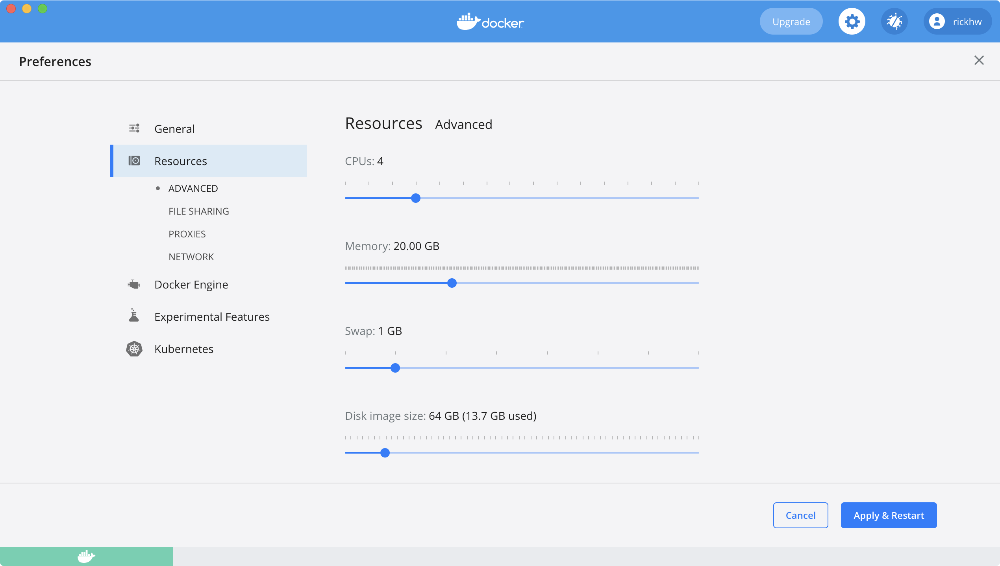
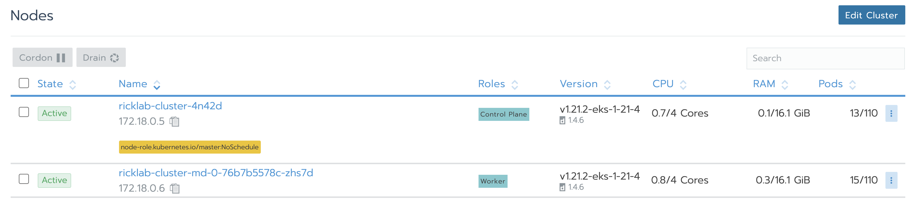
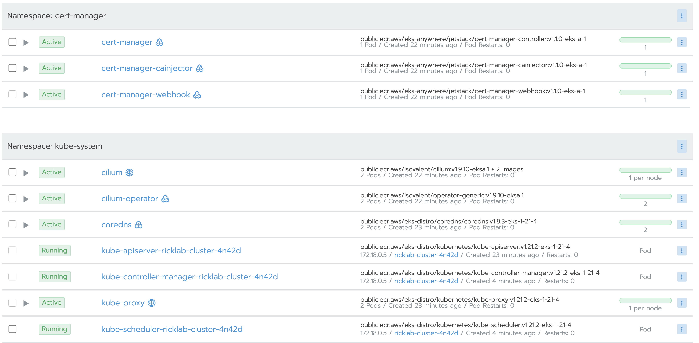

https://rickhw.github.io/2021/09/23/AWS/Experience-EKS-Anywhere/

AWS 把 EKS 本身開源了，稱為 `EKS Anywhere`，除了在 AWS 自己之外，也可以安裝在私有 (on-premises) 的環境。

本文整理體驗的筆記，我在 macOS、ubuntu20.04 都有做過，本文記錄則以 ubuntu 20.04 為主，內容以參考 [EKS Anywhere](https://anywhere.eks.amazonaws.com/docs/getting-started/install/) 官方文件為主。


# 1 準備

## 1.1 前置作業

我用 VMWare 準備了一台 Ubuntu 20.04，資源有:
- CPU: 4core
- Memory: 16GiB
- Disk: 100GiB
- Network: Bridge Mode

軟體準備：
- Docker CE v20.x 以上，相關安裝可以參考 [K8s 學習筆記 - kubeadm 手動安裝](https://rickhw.github.io/2019/03/17/Container/Install-K8s-with-Kubeadm/)

如果是直接在 macOS 上用 Docker CE 跑，建議先修改 docker Resources 資源，我把記憶體拉到很高，同時關掉其他的 containers，如圖：




## 1.2 準備 K8s & EKS CLI

EKS Anywhere 主要使用 兩個 AWS 的 CLI:

1. `eksctl`
2. `eksctl-anywhere`

下載這兩個工具，這個筆記統一都放在 `$HOME/bin` 底下。

```
## 1. 下載 eksctl  
~# curl "https://github.com/weaveworks/eksctl/releases/latest/download/eksctl_$(uname -s)_amd64.tar.gz" \  
    --silent --location \  
    | tar xz -C /usr/local/bin  
  
  
## 2. 下載 eksctl-anywhere, 並指定 EKSA 的版本  
~# export EKSA_RELEASE="0.5.0" OS="$(uname -s | tr A-Z a-z)"  
~# curl "https://anywhere-assets.eks.amazonaws.com/releases/eks-a/1/artifacts/eks-a/v${EKSA_RELEASE}/${OS}/eksctl-anywhere-v${EKSA_RELEASE}-${OS}-amd64.tar.gz" \  
    --silent --location \  
    | tar xz /usr/local/eksctl-anywhere  
  
~# eksctl anywhere version  
v0.5.0
```


新的 VM 也要準備 kubectl。

## 1.3 下載 docker images

EKS anywhere 安裝過程，需要使用一些 EKS 官方的 Images，如果網路速度不快，安裝過程需要時間等待，所以建議先把這些 images 下載。

我安裝的時候，下載了以下 images:
```
root@ubuntu-server:~# docker images
REPOSITORY                                                                                        TAG                            IMAGE ID       CREATED        SIZE
public.ecr.aws/eks-anywhere/mrajashree/etcdadm-bootstrap-provider                                 v0.1.0-beta-4.1-eks-a-1        fdf90a12059b   13 days ago    39.5MB
public.ecr.aws/eks-anywhere/mrajashree/etcdadm-controller                                         v0.1.0-beta-4.1-eks-a-1        1df9b1e09c08   13 days ago    44.2MB
public.ecr.aws/eks-anywhere/cli-tools                                                             v0.1.0-eks-a-1                 ab7c32596071   13 days ago    390MB
public.ecr.aws/eks-anywhere/kubernetes-sigs/kind/node                                             v1.21.2-eks-d-1-21-4-eks-a-1   e786b2049245   13 days ago    1.64GB
public.ecr.aws/eks-anywhere/kubernetes-sigs/cluster-api-provider-aws/cluster-api-aws-controller   v0.6.4-eks-a-1                 f19480314c0c   13 days ago    65.2MB
public.ecr.aws/eks-anywhere/kubernetes-sigs/cluster-api/capd-manager                              v0.3.23-eks-a-1                9551d1a8c5e4   13 days ago    228MB
public.ecr.aws/eks-anywhere/kubernetes-sigs/cluster-api/kubeadm-control-plane-controller          v0.3.23-eks-a-1                9e78bc6ef020   13 days ago    62.1MB
public.ecr.aws/eks-anywhere/kubernetes-sigs/cluster-api/kubeadm-bootstrap-controller              v0.3.23-eks-a-1                c74f411ef1c2   13 days ago    56.4MB
public.ecr.aws/eks-anywhere/kubernetes-sigs/cluster-api/cluster-api-controller                    v0.3.23-eks-a-1                8cc018325da7   13 days ago    57.4MB
public.ecr.aws/eks-anywhere/jetstack/cert-manager-webhook                                         v1.1.0-eks-a-1                 ff993602e2ca   13 days ago    42.4MB
public.ecr.aws/eks-anywhere/jetstack/cert-manager-controller                                      v1.1.0-eks-a-1                 07ed0e004245   13 days ago    52.8MB
public.ecr.aws/eks-anywhere/jetstack/cert-manager-cainjector                                      v1.1.0-eks-a-1                 3e6a2a6e0bd3   13 days ago    40.8MB
public.ecr.aws/eks-anywhere/kubernetes-sigs/cluster-api-provider-vsphere/release/manager          v0.7.10-eks-a-1                a11c8cf5aa7f   13 days ago    55.4MB
public.ecr.aws/eks-anywhere/brancz/kube-rbac-proxy                                                v0.8.0-eks-a-1                 f35c58b91b9c   13 days ago    41.7MB
kindest/haproxy                                                                                   v20210715-a6da3463             083ad526a17e   2 months ago   31.8MB
hello-world    
```


底下是用 docker 下載的 scripts，這些資訊是在 `~/${CLUSTER_NAME}/generated/clusterctl_tmp.yaml` 裡面找到的，並且整理出來的，這些資訊應該會隨著版本的演進而有所改變，所以以下的資訊與版本僅供參考：

```
docker pull public.ecr.aws/eks-anywhere/cli-tools:v0.1.0-eks-a-1  
docker pull public.ecr.aws/eks-anywhere/kubernetes-sigs/kind/node:v1.21.2-eks-d-1-21-4-eks-a-1  
docker pull kindest/haproxy:v20210715-a6da3463  
  
docker pull public.ecr.aws/eks-anywhere/jetstack/cert-manager-cainjector:v1.1.0-eks-a-1  
docker pull public.ecr.aws/eks-anywhere/jetstack/cert-manager-controller:v1.1.0-eks-a-1  
docker pull public.ecr.aws/eks-anywhere/jetstack/cert-manager-webhook:v1.1.0-eks-a-1  
  
docker pull public.ecr.aws/eks-anywhere/kubernetes-sigs/cluster-api/cluster-api-controller:v0.3.23-eks-a-1  
docker pull public.ecr.aws/eks-anywhere/brancz/kube-rbac-proxy:v0.8.0-eks-a-1  
docker pull public.ecr.aws/eks-anywhere/kubernetes-sigs/cluster-api/kubeadm-bootstrap-controller:v0.3.23-eks-a-1  
  
docker pull public.ecr.aws/eks-anywhere/kubernetes-sigs/cluster-api/kubeadm-control-plane-controller:v0.3.23-eks-a-1  
docker pull public.ecr.aws/eks-anywhere/brancz/kube-rbac-proxy:v0.8.0-eks-a-1  
docker pull public.ecr.aws/eks-anywhere/kubernetes-sigs/cluster-api-provider-aws/cluster-api-aws-controller:v0.6.4-eks-a-1  
  
docker pull public.ecr.aws/eks-anywhere/brancz/kube-rbac-proxy:v0.8.0-eks-a-1 #org one is v0.4.1  
docker pull public.ecr.aws/eks-anywhere/kubernetes-sigs/cluster-api-provider-vsphere/release/manager:v0.7.10-eks-a-1  
  
  
docker pull public.ecr.aws/eks-anywhere/brancz/kube-rbac-proxy:v0.8.0-eks-a-1 #org one is v0.8.0  
docker pull public.ecr.aws/eks-anywhere/kubernetes-sigs/cluster-api/capd-manager:v0.3.23-eks-a-1  
  
docker pull public.ecr.aws/eks-anywhere/brancz/kube-rbac-proxy:v0.8.0-eks-a-1 #org one is v0.4.0  
docker pull public.ecr.aws/eks-anywhere/mrajashree/etcdadm-bootstrap-provider:v0.1.0-beta-4.1-eks-a-1  
  
docker pull public.ecr.aws/eks-anywhere/brancz/kube-rbac-proxy:v0.8.0-eks-a-1 #org one is v0.4.0  
docker pull public.ecr.aws/eks-anywhere/mrajashree/etcdadm-controller:v0.1.0-beta-4.1-eks-a-1  
docker pull public.ecr.aws/eks-anywhere/brancz/kube-rbac-proxy:v0.8.0-eks-a-1 #org one is v0.4.0
```

上述資訊是我自己手動整理的，應該會變化很快。之所以整理這份，是我在 lab 的過程，剛好遇到網路狀況不好，所以花很多時間下載 images ，如果預先下載好，整個安裝速度就快很多。


# 2 建立 Local Cluster

準備好前述工作，接下來就可以開始建立 EKS Cluster 了。


## 2.1 產生配置

透過 `eksctl` 產生一個 clusterconfig:
```
export CLUSTER_NAME="ricklab-cluster"
eksctl anywhere generate clusterconfig $CLUSTER_NAME \
   --provider docker > $CLUSTER_NAME.yaml
```


看一下這個檔案內容有什麼：
```
apiVersion: anywhere.eks.amazonaws.com/v1alpha1  
kind: Cluster  
metadata:  
  name: ricklab-cluster  
spec:  
  clusterNetwork:  
    cni: cilium  
    pods:  
      cidrBlocks:  
      - 172.16.0.0/16  
    services:  
      cidrBlocks:  
      - 10.96.0.0/12  
  controlPlaneConfiguration:  
    count: 1  
  datacenterRef:  
    kind: DockerDatacenterConfig  
    name: ricklab-cluster  
  externalEtcdConfiguration:  
    count: 1  
  kubernetesVersion: "1.21"  
  workerNodeGroupConfigurations:  
    - count: 1  
  
---  
apiVersion: anywhere.eks.amazonaws.com/v1alpha1  
kind: DockerDatacenterConfig  
metadata:  
  name: ricklab-cluster  
spec: {}  
  
---
```


這份 config 裡有幾個重要的資訊：

1. K8s 版本是 `1.21`
    1. Control Plane 有一個 node
    2. Worker Node 有一個 node
    3. etcd 有一個 node
2. CNI 使用 [cilium](https://cilium.io/) : eBPF-based Networking, Observability, and Security
    1. 指定了 pod 的 CIDR Blocks, 注意預設的範圍 `192.168.0.0/16`，可能會跟網路環境衝突或者重疊，所以我改成了 `172.16.0.0/16`
    2. 指定了 Services 的 CIDR Blocks，跟我的環境沒有衝突，所以沒有改。
3. Data Center 的 Kind 是 Docker

## 2.2 建立 Local Cluster

建立一個 Local Cluster，這會花一點時間

```
❯ ~ ··· at 14:51:27
❯ eksctl anywhere create cluster -f $CLUSTER_NAME.yaml -v 5
Performing setup and validations
Warning: The docker infrastructure provider is meant for local development and testing only
✅ Docker Provider setup is valid
Creating new bootstrap cluster
Installing cluster-api providers on bootstrap cluster
Provider specific setup
Creating new workload cluster
Installing networking on workload cluster
Installing storage class on workload cluster
Installing cluster-api providers on workload cluster
Moving cluster management from bootstrap to workload cluster
Installing EKS-A custom components (CRD and controller) on workload cluster
Creating EKS-A CRDs instances on workload cluster
Installing AddonManager and GitOps Toolkit on workload cluster
GitOps field not specified, bootstrap flux skipped
Writing cluster config file
Deleting bootstrap cluster
🎉 Cluster created!

❯  ~ ··· took 10m 11s at 15:02:00
❯

```

上述資訊是完全沒有調整 docker CE 的資源 (預設記憶體是 8GiB) 、跑在 MacOS 上，過程跑了將近 10 分鐘，調整到 20GiB 之後，跑完約 7 分鐘。

如果畫面很久沒反應，可以增加參數 `-v 5` 了解狀況，底下是在 Ubuntu 上執行時的紀錄：
```
root@ubuntu-server:~# export CLUSTER_NAME="dev-cluster"  
root@ubuntu-server:~# eksctl anywhere generate clusterconfig $CLUSTER_NAME \  
>    --provider docker > $CLUSTER_NAME.yaml  
  
root@ubuntu-server:~# eksctl anywhere create cluster -f $CLUSTER_NAME.yaml -v 5  
2021-09-23T13:12:57.401Z	V4	Logger init completed	{"vlevel": 5}  
2021-09-23T13:13:00.159Z	V1	Setting up cli docker dependencies  
2021-09-23T13:13:00.159Z	V2	Pulling docker image	{"image": "public.ecr.aws/eks-anywhere/cli-tools:v0.1.0-eks-a-1"}  
2021-09-23T13:13:02.407Z	V4	Task start	{"task_name": "setup-validate"}  
2021-09-23T13:13:02.407Z	V0	Performing setup and validations  
2021-09-23T13:13:02.407Z	V0	Warning: The docker infrastructure provider is meant for local development and testing only  
2021-09-23T13:13:02.407Z	V0	✅ Docker Provider setup is valid  
2021-09-23T13:13:02.407Z	V4	Task finished	{"task_name": "setup-validate", "duration": "47.271µs"}  
2021-09-23T13:13:02.407Z	V4	----------------------------------  
2021-09-23T13:13:02.407Z	V4	Task start	{"task_name": "bootstrap-cluster-init"}  
2021-09-23T13:13:02.407Z	V0	Creating new bootstrap cluster  
2021-09-23T13:13:02.407Z	V4	Creating kind cluster	{"name": "ricklab-cluster-eks-a-cluster", "kubeconfig": "ricklab-cluster/generated/ricklab-cluster.kind.kubeconfig"}  
2021-09-23T13:13:47.919Z	V4	Applying extra objects	{"cluster": "ricklab-cluster", "resources": ["core-dns-clusterrole"]}  
2021-09-23T13:13:48.319Z	V0	Installing cluster-api providers on bootstrap cluster  
2021-09-23T13:16:06.334Z	V0	Provider specific setup  
2021-09-23T13:16:06.334Z	V4	Task finished	{"task_name": "bootstrap-cluster-init", "duration": "3m3.927762619s"}  
2021-09-23T13:16:06.334Z	V4	----------------------------------  
2021-09-23T13:16:06.334Z	V4	Task start	{"task_name": "workload-cluster-init"}  
2021-09-23T13:16:06.335Z	V0	Creating new workload cluster  
2021-09-23T13:16:07.096Z	V5	Retry execution successful	{"retries": 1, "duration": "760.594964ms"}  
2021-09-23T13:16:07.096Z	V3	Waiting for external etcd to be ready  
2021-09-23T13:16:22.806Z	V3	External etcd is ready  
2021-09-23T13:16:22.806Z	V3	Waiting for control plane to be ready  
2021-09-23T13:17:16.617Z	V5	Retry execution successful	{"retries": 1, "duration": "278.043187ms"}  
2021-09-23T13:17:16.617Z	V3	Waiting for controlplane and worker machines to be ready  
2021-09-23T13:17:16.850Z	V4	Nodes are not ready yet	{"total": 2, "ready": 1}  
2021-09-23T13:17:17.090Z	V4	Nodes are not ready yet	{"total": 2, "ready": 1}  
2021-09-23T13:17:17.090Z	V5	Error happened during retry	{"error": "nodes are not ready yet", "retries": 1}  
2021-09-23T13:17:17.090Z	V5	Sleeping before next retry	{"time": "1s"}  
2021-09-23T13:17:18.331Z	V4	Nodes are not ready yet	{"total": 2, "ready": 1}  
2021-09-23T13:17:18.331Z	V5	Error happened during retry	{"error": "nodes are not ready yet", "retries": 2}  
2021-09-23T13:17:18.331Z	V5	Sleeping before next retry	{"time": "1s"}  
  
... 略 ...  
  
2021-09-23T13:18:10.382Z	V0	Installing storage class on workload cluster  
2021-09-23T13:18:10.382Z	V0	Installing cluster-api providers on workload cluster  
2021-09-23T13:20:40.502Z	V4	Installing machine health checks on bootstrap cluster  
2021-09-23T13:20:40.502Z	V4	Skipping machine health checks  
2021-09-23T13:20:40.502Z	V4	Task finished	{"task_name": "workload-cluster-init", "duration": "4m34.167905829s"}  
2021-09-23T13:20:40.502Z	V4	----------------------------------  
2021-09-23T13:20:40.502Z	V4	Task start	{"task_name": "capi-management-move"}  
2021-09-23T13:20:40.502Z	V0	Moving cluster management from bootstrap to workload cluster  
2021-09-23T13:20:40.502Z	V3	Waiting for management machines to be ready before move  
2021-09-23T13:20:40.774Z	V4	Nodes ready	{"total": 2}  
2021-09-23T13:20:43.420Z	V3	Waiting for control planes to be ready after move  
2021-09-23T13:20:44.938Z	V3	Waiting for machines to be ready after move  
2021-09-23T13:20:45.239Z	V4	Nodes ready	{"total": 2}  
2021-09-23T13:20:45.239Z	V4	Task finished	{"task_name": "capi-management-move", "duration": "4.736253314s"}  
2021-09-23T13:20:45.239Z	V4	----------------------------------  
2021-09-23T13:20:45.239Z	V4	Task start	{"task_name": "eksa-components-install"}  
2021-09-23T13:20:45.239Z	V0	Installing EKS-A custom components (CRD and controller) on workload cluster  
2021-09-23T13:20:46.961Z	V5	Retry execution successful	{"retries": 1, "duration": "962.076365ms"}  
2021-09-23T13:21:06.898Z	V0	Creating EKS-A CRDs instances on workload cluster  
2021-09-23T13:21:06.898Z	V4	Applying eksa yaml resources to cluster  
2021-09-23T13:21:07.608Z	V5	Retry execution successful	{"retries": 1, "duration": "710.107178ms"}  
2021-09-23T13:21:08.015Z	V5	Retry execution successful	{"retries": 1, "duration": "403.533216ms"}  
2021-09-23T13:21:08.340Z	V5	Retry execution successful	{"retries": 1, "duration": "324.587963ms"}  
2021-09-23T13:21:08.686Z	V5	Retry execution successful	{"retries": 1, "duration": "346.697543ms"}  
2021-09-23T13:21:08.686Z	V4	Task finished	{"task_name": "eksa-components-install", "duration": "23.447764425s"}  
2021-09-23T13:21:08.686Z	V4	----------------------------------  
2021-09-23T13:21:08.687Z	V4	Task start	{"task_name": "addon-manager-install"}  
2021-09-23T13:21:08.687Z	V0	Installing AddonManager and GitOps Toolkit on workload cluster  
2021-09-23T13:21:08.687Z	V0	GitOps field not specified, bootstrap flux skipped  
2021-09-23T13:21:08.687Z	V4	Task finished	{"task_name": "addon-manager-install", "duration": "16.609µs"}  
2021-09-23T13:21:08.687Z	V4	----------------------------------  
2021-09-23T13:21:08.687Z	V4	Task start	{"task_name": "write-cluster-config"}  
2021-09-23T13:21:08.687Z	V0	Writing cluster config file  
2021-09-23T13:21:08.687Z	V4	Task finished	{"task_name": "write-cluster-config", "duration": "381.756µs"}  
2021-09-23T13:21:08.687Z	V4	----------------------------------  
2021-09-23T13:21:08.687Z	V4	Task start	{"task_name": "delete-kind-cluster"}  
2021-09-23T13:21:08.687Z	V0	Deleting bootstrap cluster  
2021-09-23T13:21:08.944Z	V5	Executed kind get clusters	{"response": "dev-cluster\ndev-cluster-eks-a-cluster\nricklab-cluster\nricklab-cluster-eks-a-cluster\n"}  
2021-09-23T13:21:09.549Z	V4	Deleting kind cluster	{"name": "ricklab-cluster-eks-a-cluster"}  
2021-09-23T13:21:10.918Z	V0	🎉 Cluster created!  
2021-09-23T13:21:10.918Z	V4	Task finished	{"task_name": "delete-kind-cluster", "duration": "2.230882453s"}  
2021-09-23T13:21:10.918Z	V4	----------------------------------  
2021-09-23T13:21:10.918Z	V4	Tasks completed	{"duration": "8m8.511328006s"}  
root@ubuntu-server:~#
```

這段 log 可以看到過程詳細的執行資訊，整個過程跑了大約 8 分鐘，這是我已經預先下載 docker images 的狀況，所以建議先下載過 docekr images.

> 同樣的背景，有一次裝跑了 25m ，同樣是 docker images 預先下載好的狀況。

## 2.3 觀察

從前述的 detail log 可以發現有以下 tasks:
1. setup-validate
2. bootstrap-cluster-init
3. workload-cluster-init
4. capi-management-move
5. eksa-components-install
6. addon-manager-install
7. write-cluster-config
8. delete-kind-cluster


每個步驟背後都是透過 container `public.ecr.aws/eks-anywhere/cli-tools:v0.1.0-eks-a-1` 在控制與操作，底下是 `bootstrap-cluster-init` 的過程：
```
root@ubuntu-server:~# docker logs inspiring_chebyshev
Creating cluster "ricklab-cluster-eks-a-cluster" ...
 • Ensuring node image (public.ecr.aws/eks-anywhere/kubernetes-sigs/kind/node:v1.21.2-eks-d-1-21-4-eks-a-1) 🖼  ...
 ✓ Ensuring node image (public.ecr.aws/eks-anywhere/kubernetes-sigs/kind/node:v1.21.2-eks-d-1-21-4-eks-a-1) 🖼
 • Preparing nodes 📦   ...
 ✓ Preparing nodes 📦
 • Writing configuration 📜  ...
 ✓ Writing configuration 📜
 • Starting control-plane 🕹️  ...
 ✓ Starting control-plane 🕹️
 • Installing CNI 🔌  ...
 ✓ Installing CNI 🔌
 • Installing StorageClass 💾  ...
 ✓ Installing StorageClass 💾
Set kubectl context to "kind-ricklab-cluster-eks-a-cluster"
You can now use your cluster with:

kubectl cluster-info --context kind-ricklab-cluster-eks-a-cluster --kubeconfig ricklab-cluster/generated/ricklab-cluster.kind.kubeconfig

Have a question, bug, or feature request? Let us know! https://kind.sigs.k8s.io/#community 🙂
root@ubuntu-server:~#
```


過程中比較花時間的是這個 Waiting for cert-manager to be available 的 task，過程在等待啥東西，我沒找到原因，Github 上的 Issue 目前 (2021/09/23) 還是 Open 的狀態。。。他的 Log 如下：
```
root@ubuntu-server:~# docker ps  
CONTAINER ID   IMAGE                                                                                COMMAND                  CREATED              STATUS              PORTS                       NAMES  
66edc1f9a3d9   public.ecr.aws/eks-anywhere/cli-tools:v0.1.0-eks-a-1                                 "clusterctl init --c…"   38 seconds ago       Up 37 seconds                                   serene_hopper  
57932fdcc915   public..../node:v1.21.2-eks-d-1-21-4-eks-a-1   "/usr/local/bin/entr…"   About a minute ago   Up About a minute   127.0.0.1:42309->6443/tcp   dev-cluster-eks-a-cluster-control-plane  
  
root@ubuntu-server:~# docker logs -f serene_hopper  
Fetching providers  
Using Override="core-components.yaml" Provider="cluster-api" Version="v0.3.23"  
Using Override="bootstrap-components.yaml" Provider="bootstrap-kubeadm" Version="v0.3.23"  
Using Override="bootstrap-components.yaml" Provider="bootstrap-etcdadm-bootstrap" Version="v0.1.0-beta-4.1"  
Using Override="bootstrap-components.yaml" Provider="bootstrap-etcdadm-controller" Version="v0.1.0-beta-4.1"  
Using Override="control-plane-components.yaml" Provider="control-plane-kubeadm" Version="v0.3.23"  
Using Override="infrastructure-components-development.yaml" Provider="infrastructure-docker" Version="v0.3.23"  
Installing cert-manager Version="v1.1.0"  
Waiting for cert-manager to be available...  
Installing Provider="cluster-api" Version="v0.3.23" TargetNamespace="capi-system"  
Installing Provider="bootstrap-kubeadm" Version="v0.3.23" TargetNamespace="capi-kubeadm-bootstrap-system"  
Installing Provider="bootstrap-etcdadm-bootstrap" Version="v0.1.0-beta-4.1" TargetNamespace="etcdadm-bootstrap-provider-system"  
Installing Provider="bootstrap-etcdadm-controller" Version="v0.1.0-beta-4.1" TargetNamespace="etcdadm-controller-system"  
Installing Provider="control-plane-kubeadm" Version="v0.3.23" TargetNamespace="capi-kubeadm-control-plane-system"  
Installing Provider="infrastructure-docker" Version="v0.3.23" TargetNamespace="capd-system"  
  
Your management cluster has been initialized successfully!  
  
You can now create your first workload cluster by running the following:  
  
  clusterctl config cluster [name] --kubernetes-version [version] | kubectl apply -f -  
  
root@ubuntu-server:~#
```


底下是其他 task 的 logs 觀察，因為 container name 沒有用 task name ，所以看不出來是哪個 task：
```
root@ubuntu-server:~# docker logs -f cool_mcclintock  
deployment.apps/capi-kubeadm-bootstrap-controller-manager condition met  
  
root@ubuntu-server:~# docker logs -f zealous_mclaren  
deployment.apps/capd-controller-manager condition met  
  
root@ubuntu-server:~# docker logs -f cranky_bouman  
cluster.cluster.x-k8s.io/dev-cluster condition met  
  
root@ubuntu-server:~# docker logs -f cranky_hofstadter  
cluster.cluster.x-k8s.io/dev-cluster condition met
```


最後查看 etcd 的 Logs：
```
root@ubuntu-server:~# docker logs ricklab-cluster-etcd-cjvzj  
INFO: ensuring we can execute mount/umount even with userns-remap  
INFO: remounting /sys read-only  
INFO: making mounts shared  
INFO: detected cgroup v1  
INFO: fix cgroup mounts for all subsystems  
INFO: clearing and regenerating /etc/machine-id  
Initializing machine ID from random generator.  
INFO: faking /sys/class/dmi/id/product_name to be "kind"  
INFO: faking /sys/class/dmi/id/product_uuid to be random  
INFO: faking /sys/devices/virtual/dmi/id/product_uuid as well  
INFO: setting iptables to detected mode: legacy  
INFO: Detected IPv4 address: 172.18.0.4  
INFO: Detected IPv6 address: fc00:f853:ccd:e793::4  
  
Welcome to Amazon Linux 2!  
  
[  OK  ] Set up automount Arbitrary Executab...ats File System Automount Point.  
[  OK  ] Reached target Local File Systems.  
[  OK  ] Reached target Swap.  
[  OK  ] Started Dispatch Password Requests to Console Directory Watch.  
[  OK  ] Reached target Paths.  
[  OK  ] Created slice Root Slice.  
  
... 略 ...  
  
         Starting Create Static Device Nodes in /dev...  
         Starting Flush Journal to Persistent Storage...  
[  OK  ] Started Create Static Device Nodes in /dev.  
[  OK  ] Started Update UTMP about System Boot/Shutdown.  
[  OK  ] Started Flush Journal to Persistent Storage.  
[  OK  ] Started Rebuild Hardware Database.  
         Starting Update is Completed...  
[  OK  ] Started Update is Completed.  
[  OK  ] Reached target System Initialization.  
[  OK  ] Started Daily Cleanup of Temporary Directories.  
[  OK  ] Reached target Timers.  
[  OK  ] Listening on D-Bus System Message Bus Socket.  
[  OK  ] Reached target Sockets.  
[  OK  ] Reached target Basic System.  
         Starting containerd container runtime...  
         Starting Cleanup of Temporary Directories...  
[  OK  ] Started Cleanup of Temporary Directories.  
[  OK  ] Started containerd container runtime.  
[  OK  ] Reached target Multi-User System.  
[  OK  ] Reached target Graphical Interface.  
         Starting Update UTMP about System Runlevel Changes...  
[  OK  ] Started Update UTMP about System Runlevel Changes.
```


最後觀察 docker ps 建立那一些 container:
```
root@ubuntu-server:~# docker ps
CONTAINER ID   IMAGE                                                                                COMMAND                  CREATED          STATUS          PORTS                                  NAMES
2e432b89f3f8   public.ecr.aws/eks-anywhere/kubernetes-sigs/kind/node:v1.21.2-eks-d-1-21-4-eks-a-1   "/usr/local/bin/entr…"   13 minutes ago   Up 13 minutes                                          ricklab-cluster-md-0-76b7b5578c-zhs7d
d0e7ac20a689   public.ecr.aws/eks-anywhere/kubernetes-sigs/kind/node:v1.21.2-eks-d-1-21-4-eks-a-1   "/usr/local/bin/entr…"   14 minutes ago   Up 14 minutes   34917/tcp, 127.0.0.1:34917->6443/tcp   ricklab-cluster-4n42d
a18287b7d33d   public.ecr.aws/eks-anywhere/kubernetes-sigs/kind/node:v1.21.2-eks-d-1-21-4-eks-a-1   "/usr/local/bin/entr…"   14 minutes ago   Up 14 minutes                                          ricklab-cluster-etcd-cjvzj
7c95c9a2a15a   kindest/haproxy:v20210715-a6da3463                                                   "haproxy -sf 7 -W -d…"   14 minutes ago   Up 14 minutes   45713/tcp, 0.0.0.0:45713->6443/tcp     ricklab-cluster-lb
root@ubuntu-server:~#
```

裡面包含了:
- `control plane`: ricklab-cluster-4n42d
- `worker node`: ricklab-cluster-md-0-76b7b5578c-zhs7d
- `etced`: ricklab-cluster-etcd-cjvzj
- `load balance`: haproxy -> 實際上並不是 ingress controller.


## 2.4 驗證 Cluster

確認 cluster 是否正常運作

- CRI: containerd
- OS-Image: Amazon Linux 2
- CNI: cilium

```
export CLUSTER_NAME="ricklab-cluster"  
export KUBECONFIG=${HOME}/${CLUSTER_NAME}/${CLUSTER_NAME}-eks-a-cluster.kubeconfig  
  
# 取得 componentstatus (cs)  
root@ubuntu-server:~# kubectl get cs  
Warning: v1 ComponentStatus is deprecated in v1.19+  
NAME                 STATUS      MESSAGE                                                                                       ERROR  
scheduler            Unhealthy   Get "http://127.0.0.1:10251/healthz": dial tcp 127.0.0.1:10251: connect: connection refused  
controller-manager   Unhealthy   Get "http://127.0.0.1:10252/healthz": dial tcp 127.0.0.1:10252: connect: connection refused  
etcd-0               Healthy     {"health":"true"}  
  
## 如果狀態跟上面一樣有問題，請參閱這份文件調整:  https://my.oschina.net/u/1431757/blog/4550843  
## 正常如下：  
root@ubuntu-server:~# kubectl get cs  
Warning: v1 ComponentStatus is deprecated in v1.19+  
NAME                 STATUS    MESSAGE             ERROR  
controller-manager   Healthy   ok  
etcd-0               Healthy   {"health":"true"}  
scheduler            Healthy   ok  
  
  
# 取的 api-resources  
root@ubuntu-server:~# kubectl api-resources  
NAME                              SHORTNAMES     APIVERSION                                     NAMESPACED   KIND  
bindings                                         v1                                             true         Binding  
componentstatuses                 cs             v1                                             false        ComponentStatus  
configmaps                        cm             v1                                             true         ConfigMap  
endpoints                         ep             v1                                             true         Endpoints  
  
... 略 ...  
  
namespaces                        ns             v1                                             false        Namespace  
nodes                             no             v1                                             false        Node  
persistentvolumeclaims            pvc            v1                                             true         PersistentVolumeClaim  
  
... 略 ...  
  
# 取得目前的 namespaces  
root@ubuntu-server:~# kubectl get ns  
NAME                                STATUS   AGE  
capd-system                         Active   17m  
capi-kubeadm-bootstrap-system       Active   17m  
capi-kubeadm-control-plane-system   Active   17m  
capi-system                         Active   17m  
capi-webhook-system                 Active   17m  
cert-manager                        Active   18m  
default                             Active   19m  
eksa-system                         Active   16m  
etcdadm-bootstrap-provider-system   Active   17m  
etcdadm-controller-system           Active   17m  
kube-node-lease                     Active   19m  
kube-public                         Active   19m  
kube-system                         Active   19m  
root@ubuntu-server:~#  
  
# 取得目前的 nodes 狀態  
root@ubuntu-server:~# kubectl get node -o wide  
NAME                                    STATUS   ROLES                  AGE   VERSION              INTERNAL-IP   EXTERNAL-IP   OS-IMAGE         KERNEL-VERSION     CONTAINER-RUNTIME  
ricklab-cluster-4n42d                   Ready    control-plane,master   17m   v1.21.2-eks-1-21-4   172.18.0.5    <none>        Amazon Linux 2   5.4.0-84-generic   containerd://1.4.6  
ricklab-cluster-md-0-76b7b5578c-zhs7d   Ready    <none>                 16m   v1.21.2-eks-1-21-4   172.18.0.6    <none>        Amazon Linux 2   5.4.0-84-generic   containerd://1.4.6  
root@ubuntu-server:~#  
  
  
# 取的 pod  
root@ubuntu-server:~# kubectl get pod --all-namespaces  
NAMESPACE                           NAME                                                             READY   STATUS    RESTARTS   AGE  
capd-system                         capd-controller-manager-659dd5f8bc-bnp5m                         2/2     Running   0          15m  
capi-kubeadm-bootstrap-system       capi-kubeadm-bootstrap-controller-manager-69889cb844-ndxsp       2/2     Running   0          15m  
capi-kubeadm-control-plane-system   capi-kubeadm-control-plane-controller-manager-6ddc66fb75-mhmn7   2/2     Running   0          15m  
capi-system                         capi-controller-manager-db59f5789-w9dvp                          2/2     Running   0          15m  
capi-webhook-system                 capi-controller-manager-64b8c548db-wv6mz                         2/2     Running   0          15m  
capi-webhook-system                 capi-kubeadm-bootstrap-controller-manager-68b8cc9759-75l4p       2/2     Running   0          15m  
capi-webhook-system                 capi-kubeadm-control-plane-controller-manager-7dc88f767d-7cx4l   2/2     Running   0          15m  
cert-manager                        cert-manager-5f6b885b4-gcf95                                     1/1     Running   0          16m  
cert-manager                        cert-manager-cainjector-bb6d9bcb5-rrp7b                          1/1     Running   0          16m  
cert-manager                        cert-manager-webhook-56cbc8f5b8-2767z                            1/1     Running   0          16m  
eksa-system                         eksa-controller-manager-6769764b45-jv5q9                         2/2     Running   0          14m  
etcdadm-bootstrap-provider-system   etcdadm-bootstrap-provider-controller-manager-54476b7bf9-qgblp   2/2     Running   0          15m  
etcdadm-controller-system           etcdadm-controller-controller-manager-d5795556-bxsb2             2/2     Running   0          15m  
kube-system                         cilium-7gkp5                                                     1/1     Running   0          16m  
kube-system                         cilium-bq8pk                                                     1/1     Running   0          16m  
kube-system                         cilium-operator-6bf46cc6c6-56wn2                                 1/1     Running   0          16m  
kube-system                         cilium-operator-6bf46cc6c6-lkxrn                                 1/1     Running   0          16m  
kube-system                         coredns-7c68f85774-2pnxk                                         1/1     Running   0          17m  
kube-system                         coredns-7c68f85774-m7f99                                         1/1     Running   0          17m  
kube-system                         kube-apiserver-ricklab-cluster-4n42d                             1/1     Running   0          17m  
kube-system                         kube-controller-manager-ricklab-cluster-4n42d                    1/1     Running   0          17m  
kube-system                         kube-proxy-mnrtv                                                 1/1     Running   0          17m  
kube-system                         kube-proxy-sl6sq                                                 1/1     Running   0          16m  
kube-system                         kube-scheduler-ricklab-cluster-4n42d                             1/1     Running   0          17m  
root@ubuntu-server:~#
```


# 3 用 Rancher 觀察

把 cluster 匯入 Rancher 查看，底下是 Node 和 Pod 的狀況






# 4 Deploy an application

部署官方提供的應用範例：

```
kubectl apply -f "https://anywhere.eks.amazonaws.com/manifests/hello-eks-a.yaml"  
  
kubectl get pods -l app=hello-eks-a  
  
root@ubuntu-server:~# kubectl logs -l app=hello-eks-a  
2021/09/21 15:07:07 [notice] 1#1: using the "epoll" event method  
2021/09/21 15:07:07 [notice] 1#1: nginx/1.21.1  
2021/09/21 15:07:07 [notice] 1#1: built by gcc 10.3.1 20210424 (Alpine 10.3.1_git20210424)  
2021/09/21 15:07:07 [notice] 1#1: OS: Linux 5.4.0-84-generic  
2021/09/21 15:07:07 [notice] 1#1: getrlimit(RLIMIT_NOFILE): 1048576:1048576  
2021/09/21 15:07:07 [notice] 1#1: start worker processes  
2021/09/21 15:07:07 [notice] 1#1: start worker process 39  
2021/09/21 15:07:07 [notice] 1#1: start worker process 40  
2021/09/21 15:07:07 [notice] 1#1: start worker process 41  
2021/09/21 15:07:07 [notice] 1#1: start worker process 42  
  
  
root@ubuntu-server:~# kubectl port-forward deploy/hello-eks-a 8000:80  
Forwarding from 127.0.0.1:8000 -> 80  
Forwarding from [::1]:8000 -> 80  
Handling connection for 8000  
  
  
## 測試  
root@ubuntu-server:~# curl http://localhost:8000  
⬡⬢⬡⬢⬡⬢⬡⬢⬡⬢⬡⬢⬡⬢⬡⬢⬡⬢⬡⬢⬡⬢⬡⬢⬡⬢⬡⬢⬡⬢⬡⬢⬡⬢⬡⬢⬡⬢⬡⬢⬡⬢⬡⬢⬡⬢⬡⬢⬡⬢⬡⬢⬡⬢⬡⬢⬡⬢⬡⬢⬡⬢⬡⬢⬡⬢⬡⬢  
  
Thank you for using  
  
███████╗██╗  ██╗███████╗  
██╔════╝██║ ██╔╝██╔════╝  
█████╗  █████╔╝ ███████╗  
██╔══╝  ██╔═██╗ ╚════██║  
███████╗██║  ██╗███████║  
╚══════╝╚═╝  ╚═╝╚══════╝  
  
 █████╗ ███╗   ██╗██╗   ██╗██╗    ██╗██╗  ██╗███████╗██████╗ ███████╗  
██╔══██╗████╗  ██║╚██╗ ██╔╝██║    ██║██║  ██║██╔════╝██╔══██╗██╔════╝  
███████║██╔██╗ ██║ ╚████╔╝ ██║ █╗ ██║███████║█████╗  ██████╔╝█████╗  
██╔══██║██║╚██╗██║  ╚██╔╝  ██║███╗██║██╔══██║██╔══╝  ██╔══██╗██╔══╝  
██║  ██║██║ ╚████║   ██║   ╚███╔███╔╝██║  ██║███████╗██║  ██║███████╗  
╚═╝  ╚═╝╚═╝  ╚═══╝   ╚═╝    ╚══╝╚══╝ ╚═╝  ╚═╝╚══════╝╚═╝  ╚═╝╚══════╝  
  
You have successfully deployed the hello-eks-a pod hello-eks-a-9644dd8dc-fn4vk  
  
For more information check out  
https://anywhere.eks.amazonaws.com  
  
⬡⬢⬡⬢⬡⬢⬡⬢⬡⬢⬡⬢⬡⬢⬡⬢⬡⬢⬡⬢⬡⬢⬡⬢⬡⬢⬡⬢⬡⬢⬡⬢⬡⬢⬡⬢⬡⬢⬡⬢⬡⬢⬡⬢⬡⬢⬡⬢⬡⬢⬡⬢⬡⬢⬡⬢⬡⬢⬡⬢⬡⬢⬡⬢⬡⬢⬡⬢  
root@ubuntu-server:~#****
```


# 5 刪除 Cluster

有頭有尾，官方文件說用以下刪除 clsuter

```
export CLUSTER_NAME="ricklab-cluster"  
export KUBECONFIG=${HOME}/${CLUSTER_NAME}/${CLUSTER_NAME}-eks-a-cluster.kubeconfig  
  
eksctl anywhere delete cluster ${CLUSTER_NAME}  
  
Performing provider setup and validations  
Creating management cluster  
Installing cluster-api providers on management cluster  
Moving cluster management from workload cluster  
Deleting workload cluster  
Clean up Git Repo  
GitOps field not specified, clean up git repo skipped  
🎉 Cluster deleted!
```

我實際上都直接砍了 docker container 比較快 XD


# 6 and A


- Q: Local Cluster 建議的硬體資源是多少？

> 底下是官方給的資訊：
> 
> - Docker 20.x.x
> - Mac OS (10.15) / Ubuntu (20.04.2 LTS)
> - 4 CPU cores
> - 16GB memory
> - 30GB free disk space
> 
> 實際上則看使用需求而言。

- Q: 為什麼會需要用 EKS Anywhere？

> 針對如果要使用像是 `IRSA` 做 AuthN、AuthZ ，或者 `OIDC` 管理帳號，
> 
> 我個人之所以想試看看 EKS Anywhere 主要是因為公司的環境都以 EKS 為主，而我在部門內部有一台 PC 當 Lab 環境，我裝了 Proxmox，上面我手動用 [kubeadm](https://rickhw.github.io/2019/03/17/Container/Install-K8s-with-Kubeadm/) 裝了整個環境讓團隊練習使用。雖然我算是很熟練整個安裝過程，但如果要交給其他成員維護的話，還是有些難度。另外我們使用 EKS 的 IRSA 做管理，所以我也希望能夠讓 Lab 環境跟線上環境更一致。

- Q: 如何讓外面存取 cluster?

> 範例中的 `${HOME}/${CLUSTER_NAME}/${CLUSTER_NAME}-eks-a-cluster.kubeconfig` 裡面的 `server: https://127.0.0.1:43835` 是本機位置，修改成機器 (host machine) 的 IP 就可以從外面操作了。

- Q: 誰適合使用 EKS Anywhere？

> K8s 的使用者有兩個面向：`1) 使用容器`、`2) 管理容器平台`，這是兩個不同使用者導向的設計，更多參閱 [雲原生人才尋找的難處及常見誤區探討, P12-13](https://speakerdeck.com/pichuang/20210824-yun-yuan-sheng-ren-cai-xun-zhao-de-nan-chu-ji-chang-jian-wu-qu-tan-tao?slide=12) 。而 EKS Anywhere 我覺得是後者，也就是設計給 `管理容器平台` 的人。設計給使用容器的 K8s 平台，大概就是 minikube、microK8s、K3d 之類的。


