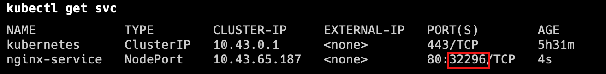

# 1 理论


通过上节课的学习，已经能够利用Deployment来创建一组Pod来提供具有高可用性的服务。

虽然每个Pod都会分配一个单独的Pod IP，然而却存在如下两问题：
    Pod IP 会随着Pod的重建产生变化
    Pod IP 仅仅是集群内可见的虚拟IP，外部无法访问

这样对于访问这个服务带来了难度。因此，kubernetes设计了Service来解决这个问题。
Service可以看作是一组同类Pod对外的访问接口。借助Service，应用可以方便地实现服务发现和负载均衡。


Service将运行在一组 [Pods](https://kubernetes.io/zh-cn/docs/concepts/workloads/pods/) 上的应用程序公开为网络服务的抽象方法。
Service为一组 Pod 提供相同的 DNS 名，并且在它们之间进行负载均衡。
Kubernetes 为 Pod 提供分配了IP 地址，但IP地址可能会发生变化。
创建完service 后, 集群内的容器可以通过service名称访问服务，而不需要担心Pod的IP发生变化。

Kubernetes Service 定义了这样一种抽象：
service 的后端, 运行了一组可以替换的 Pod
逻辑上的一组可以互相替换的 Pod，通常称为微服务。 
Service 对应的 Pod 集合通常是通过选择算符来确定的。 
举个例子，在一个Service中运行了3个nginx的副本。这些副本是可互换的，我们不需要关心它们调用了哪个nginx，也不需要关注 Pod的运行状态，只需要调用这个服务就可以了。


## 1.1 例子


在一个Service中运行了3个nginx的副本


一个Deployment 中 对应一个 ReplicaSet, 一个 ReplicaSet 中包有三个 Pod 

用 kubectl get all 可以看到 
- 有个 depolyment  : depolyment.apps/nginx-deploy 
- 对应个副本集 replicaset.apps/nginx-depoly-xxx
- 这个副本集有三个 pod, pod/xxxxx
- 还有一个service,名字为 service/kubernetes 
- 还有一个 kubernetes 自带的 对象: 


# 2 访问Service


某个 service  可能涉及到的 中有 三个  Port 
- nodePort
    - 集群中 每个 节点/node 的公开服务的端口 
    - 集群外的主机 去访问这个 Service:  可以通过 `节点的ip: nodePort`
- Port 是 Service 公开的端口 
    - 集群内的其他Cluster 去访问这个 Service: 通过 `ClusterIP: port`,  ClusterIP 是 集群内的ip 
    - 集群内的Pod 去访问这个 Service: 通过 `service 的名称: port` 
- targetPort 
    - 是 Pod 中运行程序 用来监听的端口 
    - 是这个  Pod 的 Port


```sh

# 集群外部外部主机去访问 集群内某个Pod：
curl 192.168.56.109:32296。
1.NodePort端口是随机的，范围为:30000-32767。
2.集群中每一个主机节点的NodePort端口都可以访问。
3.如果需要指定端口，不想随机产生，需要使用配置文件来声明。


#集群内主机 去访问 集群内某个 pod
curl 10.43.65.187:80

#集群内容器 去访问 集群内某个 Pod
kubectl run nginx-test --image=nginx:1.22 -it --rm -- sh
curl nginx-service:80
```

# 3 kubectl expose 的使用 

`[root@master ~]# kubectl expose deployment/nginx-deployment --name=svc-nginx1 --type=ClusterIP --port=80 --target-port=80 -n dev`


 使用 kubectl expose 命令 , 将之前已经生成好的 某个 depolyment (with name deployment/nginx-deployment) 公开为服务 

 port是service访问端口,target-port是Pod端口 二者通常是一样的
 - --port 80 , 指定service 的端口, 公开的服务端口 为 8080 
 - --target-port 指定的 Pod 的端口 
 --name=xxx, 指定生成 service 的名称 为nginx-service 
 -n dev,  namespace 为 dev 


## 3.1 --type: Service 的 Type的 取值

- ClusterIP：
    - 默认情况下, 如果没有指定 serciveType, 自动分配到的 就是 这个 service type 
    - 这个Type 下只能在集群内部的主机, 访问到这个service 
    - 将服务公开在集群内部。kubernetes会给服务分配一个集群内部的 IP，集群内的所有主机都可以通过这个Cluster-IP访问服务。集群内部的Pod可以通过service名称访问服务。
- [NodePort](https://kubernetes.io/zh-cn/docs/concepts/services-networking/service/#type-nodeport)：
    - 想要使得集群外部的主机 也能访问到 这个 service , 需要 , 使用 NodePort  这个 ServiceType 
    - 通过每个节点的主机IP 和静态端口（NodePort）暴露服务。 集群的外部主机可以使用节点IP和NodePort访问服务。
- [ExternalName](https://kubernetes.io/zh-cn/docs/concepts/services-networking/service/#externalname)：将集群外部的网络引入集群内部。
- [LoadBalancer](https://kubernetes.io/zh-cn/docs/concepts/services-networking/service/#loadbalancer)：使用云提供商的负载均衡器向外部暴露服务。
- 
# 4 创建Service对象


## 4.1 创建集群内部可访问的Service: --type=ClusterIP

用 --type=ClusterIP
或者根本不加 --type, 因为默认就是 ClusterIP 


### 4.1.1 例子1

kubectl get svc 是固定的, svc 代表要去 get 某个 service ,  这个 service 的名字 就是 svc-nginx1

```sh
# 暴露Service
[root@master ~]# kubectl expose deploy nginx --name=svc-nginx1 --type=ClusterIP --port=80 --target-port=80 -n dev
service/svc-nginx1 exposed

# 查看service
[root@master ~]# kubectl get svc svc-nginx1 -n dev -o wide
NAME         TYPE        CLUSTER-IP       EXTERNAL-IP   PORT(S)   AGE     SELECTOR
svc-nginx1   ClusterIP   10.109.179.231   <none>        80/TCP    3m51s   run=nginx
# 这里产生了一个CLUSTER-IP，这就是service的IP，在Service的生命周期中，这个地址是不会变动的
# 可以通过这个IP访问当前service对应的POD


[root@master ~]# curl 10.109.179.231:80
<!DOCTYPE html>
<html>
<head>
<title>Welcome to nginx!</title>
</head>
<body>
<h1>Welcome to nginx!</h1>
.......
</body>
</html>

```


### 4.1.2 例子2


```sh
# port是service访问端口,target-port是Pod端口
# 二者通常是一样的
# 使用 kubectl expose 命令 , 将之前的部署 (depolyment) 公开为服务 
# --port 80 , 指定service 的端口, 公开的服务端口 为 8080 
#  --target-port 指定的  容器端口 
# --name=xxx, 指定生成 service 的名称 为nginx-service  
kubectl expose deployment/nginx-deployment \
--name=nginx-service --type=ClusterIP --port=80 --target-port=80
```


```sh
# port是service访问端口.target-port是Pod端口, 容器端口 二者通常是一样的
# 使用 kubectl expose 命令 , 将之前的部署 (depolyment) 公开为服务 
# --port 8080 , 指定service 的端口, 公开的服务端口 为 8080 
#  --target-port 指定的  容器端口 
# --name=xxx, 指定生成 service 的名称 为nginx-service  
kubectl expose deployment/nginx-deployment \
--name=nginx-service - --port=80 --target-port=80
```


ClusterIP 代表为集群内部的IP,  集群内部, 都可以通过 10.43.228.137 这个IP, 来访问 nginx-service 这个 service 


---

进入 某个 nginx 的pod, 将首页显示的信息, 改为 显示 hello


然后再来访问这个服务, 多访问几次 
可以看到 一会访问到的 另一个 pod 的 nignx, 一会访问到了 一个 pod 的 hallo , 这说明 实现了 service 在后端 Pod 中 实现了 负载均衡 


## 4.2 创建集群外部也可访问的Service: --type=NodePort 

```sh
# 上面创建的Service的type类型为ClusterIP，这个ip地址只用集群内部可访问
# 如果需要创建外部也可以访问的Service，需要修改type为NodePort
[root@master ~]# kubectl expose deploy nginx --name=svc-nginx2 --type=NodePort --port=80 --target-port=80 -n dev
service/svc-nginx2 exposed

# 此时查看，会发现出现了NodePort类型的Service，而且有一对Port（80:31928/TC）
[root@master ~]# kubectl get svc  svc-nginx2  -n dev -o wide
NAME          TYPE        CLUSTER-IP       EXTERNAL-IP   PORT(S)        AGE    SELECTOR
svc-nginx2    NodePort    10.100.94.0      <none>        80:31928/TCP   9s     run=nginx

# 接下来就可以通过集群外的主机访问 节点IP:31928访问服务了
# 例如在的电脑主机上通过浏览器访问下面的地址
http://192.168.90.100:31928/
```


```sh
# 随机产生主机端口
kubectl expose deployment/nginx-deployment \
--name=nginx-service2 --type=NodePort --port=8080 --target-port=80
```





除了 内部访问的端口, 8081. kubenetes 会随机产生一个 内部访问的端口 31208 . 集群外部的主机可以通过 node节点的 ip + 外部访问端口 , 来访问这个服务

下面是尝试从外部访问一下, 可以看到 访问成功 


# 5 删除  service 

```sh
[root@master ~]# kubectl delete svc svc-nginx-1 -n dev 
service "svc-nginx-1" deleted
```


# 6 配置方式

创建一个svc-nginx.yaml，内容如下：

```yml 
apiVersion: v1
kind: Service
metadata:
  name: svc-nginx
  namespace: dev
spec:
  clusterIP: 10.109.179.231 #固定svc的内网ip
  ports:
  - port: 80
    protocol: TCP
    targetPort: 80
  selector:
    run: nginx
  type: ClusterIP
```

然后就可以执行对应的创建和删除命令了：

创建：kubectl create -f svc-nginx.yaml
删除：kubectl delete -f svc-nginx.yaml
