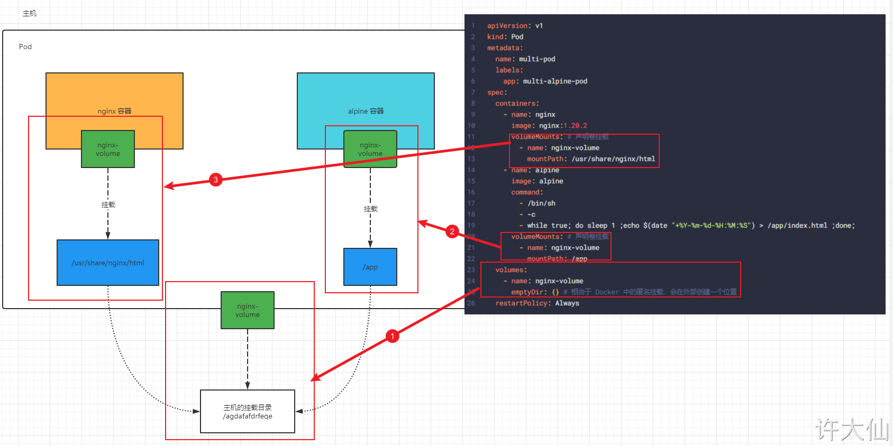
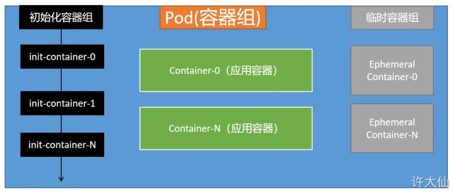

# 1 Pod介绍

## 1.1 Pod结构


一个 Pod 由一个 Pause 容器设置整个 Pod 里面的所有容器的网络、名称空间等信息。
每个Pod中都可以包含一个或者多个容器，这些容器可以分为两类：

- 用户程序所在的容器，数量可多可少
- Pause容器，这是每个Pod都会有的一个**根容器**，它的作用有两个：
    - 可以以它为依据，评估整个Pod的健康状态
    - 可以在根容器上设置Ip地址，其它容器都此Ip（Pod IP），以实现Pod内部的网路通信

这里是Pod内部的通讯，Pod的之间的通讯采用虚拟二层网络技术来实现，我们当前环境用的是Flannel

## 1.2 Pod 的特点
  ○ ① Pod 对容器有自愈能力（自我恢复能力），Pod 可以自动重启失败的容器。
  ○ ② Pod 自己不能恢复自己，Pod 被删除了就没有了，但是有时我们希望如果 Node 节点宕机了，这些 Pod 还可以在其他节点重新启动。
  ○ ③ Pod 中可以有一个容器，也可以有多个容器。
  ○ ④ 如果 Pod 中有多个容器协同工作（通常而言，都是有关系了），我们将提供服务的称为主容器，另外的容器称为 SideCar 。
  ○ ⑤ Pod 天生为其成员容器提供了两种共享资源：网络 和 存储。

## 1.3 Pod定义

下面是Pod的资源清单：


```yml 
apiVersion: v1     #必选，版本号，例如v1
kind: Pod       　 #必选，资源类型，例如 Pod
metadata:       　 #必选，元数据
  name: string     #必选，Pod名称
  namespace: string  #Pod所属的命名空间,默认为"default"
  labels:       　　  #自定义标签列表
    - name: string      　          
spec:  #必选，Pod中容器的详细定义
  containers:  #必选，Pod中容器列表
  - name: string   #必选，容器名称
    image: string  #必选，容器的镜像名称
    imagePullPolicy: [ Always|Never|IfNotPresent ]  #获取镜像的策略 
    command: [string]   #容器的启动命令列表，如不指定，使用打包时使用的启动命令
    args: [string]      #容器的启动命令参数列表
    workingDir: string  #容器的工作目录
    volumeMounts:       #挂载到容器内部的存储卷配置
    - name: string      #引用pod定义的共享存储卷的名称，需用volumes[]部分定义的的卷名
      mountPath: string #存储卷在容器内mount的绝对路径，应少于512字符
      readOnly: boolean #是否为只读模式
    ports: #需要暴露的端口库号列表
    - name: string        #端口的名称
      containerPort: int  #容器需要监听的端口号
      hostPort: int       #容器所在主机需要监听的端口号，默认与Container相同
      protocol: string    #端口协议，支持TCP和UDP，默认TCP
    env:   #容器运行前需设置的环境变量列表
    - name: string  #环境变量名称
      value: string #环境变量的值
    resources: #资源限制和请求的设置
      limits:  #资源限制的设置
        cpu: string     #Cpu的限制，单位为core数，将用于docker run --cpu-shares参数
        memory: string  #内存限制，单位可以为Mib/Gib，将用于docker run --memory参数
      requests: #资源请求的设置
        cpu: string    #Cpu请求，容器启动的初始可用数量
        memory: string #内存请求,容器启动的初始可用数量
    lifecycle: #生命周期钩子
        postStart: #容器启动后立即执行此钩子,如果执行失败,会根据重启策略进行重启
        preStop: #容器终止前执行此钩子,无论结果如何,容器都会终止
    livenessProbe:  #对Pod内各容器健康检查的设置，当探测无响应几次后将自动重启该容器
      exec:       　 #对Pod容器内检查方式设置为exec方式
        command: [string]  #exec方式需要制定的命令或脚本
      httpGet:       #对Pod内个容器健康检查方法设置为HttpGet，需要制定Path、port
        path: string
        port: number
        host: string
        scheme: string
        HttpHeaders:
        - name: string
          value: string
      tcpSocket:     #对Pod内个容器健康检查方式设置为tcpSocket方式
         port: number
       initialDelaySeconds: 0       #容器启动完成后首次探测的时间，单位为秒
       timeoutSeconds: 0    　　    #对容器健康检查探测等待响应的超时时间，单位秒，默认1秒
       periodSeconds: 0     　　    #对容器监控检查的定期探测时间设置，单位秒，默认10秒一次
       successThreshold: 0
       failureThreshold: 0
       securityContext:
         privileged: false
  restartPolicy: [Always | Never | OnFailure]  #Pod的重启策略
  nodeName: <string> #设置NodeName表示将该Pod调度到指定到名称的node节点上
  nodeSelector: obeject #设置NodeSelector表示将该Pod调度到包含这个label的node上
  imagePullSecrets: #Pull镜像时使用的secret名称，以key：secretkey格式指定
  - name: string
  hostNetwork: false   #是否使用主机网络模式，默认为false，如果设置为true，表示使用宿主机网络
  volumes:   #在该pod上定义共享存储卷列表
  - name: string    #共享存储卷名称 （volumes类型有很多种）
    emptyDir: {}       #类型为emtyDir的存储卷，与Pod同生命周期的一个临时目录。为空值
    hostPath: string   #类型为hostPath的存储卷，表示挂载Pod所在宿主机的目录
      path: string      　　        #Pod所在宿主机的目录，将被用于同期中mount的目录
    secret:       　　　#类型为secret的存储卷，挂载集群与定义的secret对象到容器内部
      scretname: string  
      items:     
      - key: string
        path: string
    configMap:         #类型为configMap的存储卷，挂载预定义的configMap对象到容器内部
      name: string
      items:
      - key: string
        path: string
```


在kubernetes中基本所有资源的一级属性都是一样的，主要包含5部分：
- apiVersion 版本，由kubernetes内部定义，版本号必须可以用 kubectl api-versions 查询到
- kind 类型，由kubernetes内部定义，版本号必须可以用 kubectl api-resources 查询到
- metadata 元数据，主要是资源标识和说明，常用的有name、namespace、labels等
- spec 描述，这是配置中最重要的一部分，里面是对各种资源配置的详细描述
- status 状态信息，里面的内容不需要定义，由kubernetes自动生成

在上面的属性中，spec是接下来研究的重点，继续看下它的常见子属性:
- containers <[]Object> 容器列表，用于定义容器的详细信息
- nodeName 根据nodeName的值将pod调度到指定的Node节点上
- nodeSelector <map[]> 根据NodeSelector中定义的信息选择将该Pod调度到包含这些label的Node 上
- hostNetwork 是否使用主机网络模式，默认为false，如果设置为true，表示使用宿主机网络
- volumes <[]Object> 存储卷，用于定义Pod上面挂在的存储信息
- restartPolicy 重启策略，表示Pod在遇到故障的时候的处理策略


## 1.4 kubectl explain

kubectl explain 资源类型         查看某种资源可以配置的一级属性
kubectl explain 资源类型.属性     查看属性的子属性

```
#小提示：
#   在这里，可通过一个命令来查看每种资源的可配置项
#   kubectl explain 资源类型         查看某种资源可以配置的一级属性
#   kubectl explain 资源类型.属性     查看属性的子属性
[root@k8s-master01 ~]# kubectl explain pod
KIND:     Pod
VERSION:  v1
FIELDS:
   apiVersion   <string>
   kind <string>
   metadata     <Object>
   spec <Object>
   status       <Object>

[root@k8s-master01 ~]# kubectl explain pod.metadata
KIND:     Pod
VERSION:  v1
RESOURCE: metadata <Object>
FIELDS:
   annotations  <map[string]string>
   clusterName  <string>
   creationTimestamp    <string>
   deletionGracePeriodSeconds   <integer>
   deletionTimestamp    <string>
   finalizers   <[]string>
   generateName <string>
   generation   <integer>
   labels       <map[string]string>
   managedFields        <[]Object>
   name <string>
   namespace    <string>
   ownerReferences      <[]Object>
   resourceVersion      <string>
   selfLink     <string>
   uid  <string>
```


## 1.5 例子

1 
```
apiVersion: v1
kind: Pod
metadata:
  name: "nginx-pod" # pod 的名称
  namespace: default
  labels:
    app: "nginx" # 标签
spec:
  containers:
  - name: nginx # 容器的名称
    image: "nginx:1.20.2" # 镜像的名称
    resources: # 资源限制
      limits:
        cpu: 200m
        memory: 500Mi
      requests:
        cpu: 100m
        memory: 200Mi
    env: # 环境变量
    - name: hello
      value: world
    ports: # 端口
    - containerPort: 80 # 容器的端口
      name:  nginx # 容器端口的名称
    volumeMounts: # 卷挂载
    - name: localtime
      mountPath: /etc/localtime
  volumes: # 卷声明，下面的这种方式相当于 Docker 的具名卷
    - name: localtime
      hostPath:
        path: /usr/share/zoneinfo/Asia/Shanghai
  restartPolicy: Always
```


2 
温馨提示：如果想进多容器协同的 Pod 中查看指定容器，使用这样的命令：kubectl exec -it Pod的名称 -c Pod中的容器名 -- COMMAND。

示例：多容器协同
```
apiVersion: v1
kind: Pod
metadata:
  name: multi-pod
  labels:
    app: multi-alpine-pod
spec:
  containers:
    - name: nginx
      image: nginx:1.20.2
      volumeMounts: # 声明卷挂载
        - name: nginx-volume
          mountPath: /usr/share/nginx/html
    - name: alpine
      image: alpine
      command:
        - /bin/sh
        - -c
        - while true; do sleep 1 ;echo $(date "+%Y-%m-%d-%H:%M:%S") > /app/index.html ;done;
      volumeMounts: # 声明卷挂载
        - name: nginx-volume
          mountPath: /app
  volumes:
    - name: nginx-volume
      emptyDir: {} # 相当于 Docker 中的匿名挂载，会在外部创建一个位置
  restartPolicy: Always
```




# 2 容器初始化 

- 初始化容器是在 Pod 的主容器启动之前要运行的容器，主要是做一些主容器的前置工作，它具有两大特征：
    - ① 初始化容器 `必须运行完成直至结束` ，如果某个初始化容器运行失败，那么 Kubernetes 需要重启它直至成功完成。
    - ② 初始化容器必须按照定义的顺序执行，当且仅当前一个成功之后，后面的一个才能运行。

- 初始化容器有很多的应用场景，下面列出的是最常见的几个：
    - 提供主容器镜像中不具备的工具程序或自定义代码。
    - 初始化容器要先于应用容器串行启动并运行完成，因此可用于延后应用容器的启动直至其依赖的条件得到满足。




kubectl apply -f k8s-pod-lifecycle.yaml

```
apiVersion: v1
kind: Pod
metadata:
  name: pod-lifecycle
  labels:
    app: pod-lifecycle
spec:
  volumes:
    - name: context-vol
      emptyDir: {}
  initContainers: # Pod 在启动 containers 之前，先要运行 initContainers 中的所有容器
    - name: nginx-init
      image: alpine # 必须有终结的那个时刻，一般不要用一直启动的镜像
      command: ["/bin/sh","-c","echo 2222 > /app/index.html;sleep 15;"]
      volumeMounts:
        - mountPath: /app
          name: context-vol
      securityContext:
        privileged: true # 使用特权模式运行容器，需要慎用！！！
  containers:
    - name: nginx
      image: nginx:1.20.2
      imagePullPolicy: IfNotPresent
      volumeMounts:
        - mountPath: /usr/share/nginx/html
          name: context-vol
  restartPolicy: Always
```


# 3 Pod 的临时容器

## 3.1 概述

- 临时容器是一种特殊的容器，该容器可以在现有的 Pod 中临时运行，以便完成我们发起的操作，比如故障排查。我们应该使用临时容器来检查服务，而不是用临时容器来构建应用程序。
- Pod 是 Kubernetes 集群进行管理的最小单元，由于 Pod 是一次性且可以替换的，因此 Pod 一旦被创建，就无法将容器加入到Pod 中。而且，我们通常使用 Deployment 来删除并替换Pod。但是，有的时候我们需要检查现有 Pod 的状态，比如对难以复现的故障进行排查。在这些场景中，可以在现有 Pod 中运行临时容器来检查其状态并运行任意命令。

临时容器在目前的 Kubernetes 版本是 beta 。


## 3.2 什么是临时容器？


- 临时容器和其他容器的不同之处在于，它们缺少对资源或执行的保证，并且永远不会自动重启，因此不适合用来构建应用程序。临时容器使用和常规容器相同的 `ContainerSpec` 来描述，但是许多字段是不兼容或者不允许的。
- 临时容器没有端口配置，因此像 `ports` 、`livenessProbe`、`readinessProbe`这样的字段是没有的。
- Pod 的资源分配是不可变的，因此 `resources` 这样的配置临时容器也是没有的。
- ……

- 临时容器是使用 `ephemeralcontainers` 来进行创建的，而不是直接添加到 `pod.spec` 中，所以是无法使用 `kubectl edit` 来添加一个临时容器。
- 和常规容器一样，将临时容器添加到Pod后，不能更改或删除临时容器。

## 3.3 临时容器的用途

- 当由于容器奔溃或容器镜像不包含调试工具而导致 `kubectl exec` 无用的时候，临时容器对于交互式故障排查非常有用。
- 比如，像 `distroless 镜像` 允许用户部署最小的容器镜像，从而减少攻击面并减少故障和漏洞的暴露。由于 `distroless 镜像` 不包含 Shell 或任何的调试工具，因此很难单独使用 `kubectl exec` 命令进行故障排查。
- 使用临时容器的时候，启用 [进程名字空间共享](https://kubernetes.io/zh/docs/tasks/configure-pod-container/share-process-namespace/) 很有帮助，可以查看其他容器中的进程。


## 3.4 开启临时容器

```
查询临时容器是否开启：
kubelet -h | grep EphemeralContainers

在 Master 节点（192.168.65.100）和 Node 节点（192.168.65.101、192.168.65.102）修改 kubectl 的参数：
vi /etc/sysconfig/kubelet

# 4 修改增加--feature-gates EphemeralContainers=true
KUBELET_EXTRA_ARGS="--cgroup-driver=systemd --feature-gates EphemeralContainers=true"
KUBE_PROXY_MODE="ipvs"


```

```
vi /var/lib/kubelet/config.yaml

apiVersion: kubelet.config.k8s.io/v1beta1
authentication:
apiVersion: kubelet.config.k8s.io/v1beta1
authentication:
  anonymous:
    enabled: false
  webhook:
    cacheTTL: 0s
    enabled: true
  x509:
    clientCAFile: /etc/kubernetes/pki/ca.crt
authorization:
  mode: Webhook
  webhook:
    cacheAuthorizedTTL: 0s
    cacheUnauthorizedTTL: 0s
cgroupDriver: systemd
clusterDNS:
- 10.96.0.10
clusterDomain: cluster.local
cpuManagerReconcilePeriod: 0s
evictionPressureTransitionPeriod: 0s
fileCheckFrequency: 0s
healthzBindAddress: 127.0.0.1
healthzPort: 10248
httpCheckFrequency: 0s
imageMinimumGCAge: 0s
kind: KubeletConfiguration
logging: {}
nodeStatusReportFrequency: 0s
nodeStatusUpdateFrequency: 0s
rotateCertificates: true
runtimeRequestTimeout: 0s
shutdownGracePeriod: 0s
shutdownGracePeriodCriticalPods: 0s
staticPodPath: /etc/kubernetes/manifests
streamingConnectionIdleTimeout: 0s
# 修改部分
featureGates:
  EphemeralContainers: true
```

加载配置文件以便重启 kubelet ：
```
systemctl daemon-reload
systemctl stop kubelet
systemctl start kubelet

```


在 Master 节点（192.168.65.100）修改 kube-apiserver.yaml 和 kube-scheduler.yaml ：
```
vi /etc/kubernetes/manifests/kube-apiserver.yaml
```

```
apiVersion: v1
kind: Pod
metadata:
  annotations:
    kubeadm.kubernetes.io/kube-apiserver.advertise-address.endpoint: 192.168.65.100:6443
  creationTimestamp: null
  labels:
    component: kube-apiserver
    tier: control-plane
  name: kube-apiserver
  namespace: kube-system
spec:
  containers:
  - command:
    - kube-apiserver
    - --advertise-address=192.168.65.100
    - --allow-privileged=true
    - --authorization-mode=Node,RBAC
    - --client-ca-file=/etc/kubernetes/pki/ca.crt
    - --enable-admission-plugins=NodeRestriction
    - --enable-bootstrap-token-auth=true
    - --etcd-cafile=/etc/kubernetes/pki/etcd/ca.crt
    - --etcd-certfile=/etc/kubernetes/pki/apiserver-etcd-client.crt
    - --etcd-keyfile=/etc/kubernetes/pki/apiserver-etcd-client.key
    - --etcd-servers=https://127.0.0.1:2379
    - --insecure-port=0
    - --kubelet-client-certificate=/etc/kubernetes/pki/apiserver-kubelet-client.crt
    - --kubelet-client-key=/etc/kubernetes/pki/apiserver-kubelet-client.key
    - --kubelet-preferred-address-types=InternalIP,ExternalIP,Hostname
    - --proxy-client-cert-file=/etc/kubernetes/pki/front-proxy-client.crt
    - --proxy-client-key-file=/etc/kubernetes/pki/front-proxy-client.key
    - --requestheader-allowed-names=front-proxy-client
    - --requestheader-client-ca-file=/etc/kubernetes/pki/front-proxy-ca.crt
    - --requestheader-extra-headers-prefix=X-Remote-Extra-
    - --requestheader-group-headers=X-Remote-Group
    - --requestheader-username-headers=X-Remote-User
    - --secure-port=6443
    - --service-account-issuer=https://kubernetes.default.svc.cluster.local
    - --service-account-key-file=/etc/kubernetes/pki/sa.pub
    - --service-account-signing-key-file=/etc/kubernetes/pki/sa.key
    - --service-cluster-ip-range=10.96.0.0/16
    - --tls-cert-file=/etc/kubernetes/pki/apiserver.crt
    - --tls-private-key-file=/etc/kubernetes/pki/apiserver.key
    # 修改部分
    - --feature-gates=EphemeralContainers=true
```


vi /etc/kubernetes/manifests/kube-scheduler.yaml
```
apiVersion: v1
kind: Pod
metadata:
  creationTimestamp: null
  labels:
    component: kube-scheduler
    tier: control-plane
  name: kube-scheduler
  namespace: kube-system
spec:
  containers:
  - command:
    - kube-scheduler
    - --authentication-kubeconfig=/etc/kubernetes/scheduler.conf
    - --authorization-kubeconfig=/etc/kubernetes/scheduler.conf
    - --bind-address=127.0.0.1
    - --kubeconfig=/etc/kubernetes/scheduler.conf
    - --leader-elect=true
    - --port=0
    # 修改部分
    - --feature-gates=EphemeralContainers=true
```


## 3.5 使用临时容器在线 debug

创建一个 Pod ：
vim k8s-pod.yaml

```yaml
apiVersion: v1
kind: Pod
metadata:
  name: nginx
spec:
  shareProcessNamespace: true # 这个配置非常重要，一定要配置
  containers:
  - name: nginx
    image: nginx:1.17.1
```


kubectl apply -f k8s-pod.yaml
创建 ec.json 文件，内容如下

```json
{
    "apiVersion": "v1",
    "kind": "EphemeralContainers",
    "metadata": {
            "name": "nginx" // 指定 Pod 的名称
    },
    "ephemeralContainers": [{
        "command": [
            "sh"
        ],
        "image": "busybox", // 如果是 JRE ，当然使用 JDK 作为临时容器了
        "imagePullPolicy": "IfNotPresent",
        "name": "debugger",
        "stdin": true,
        "tty": true,
        "terminationMessagePolicy": "File"
    }]
}
```


应用临时容器
```
# /api/v1/namespaces/default/pods/[pod的名称]/ephemeralcontainers
kubectl replace --raw /api/v1/namespaces/default/pods/nginx/ephemeralcontainers  -f ec.json
```


# 4 Pod配置: pod.spec.containers


本小节主要来研究`pod.spec.containers`属性，这也是pod配置中最为关键的一项配置。


```sh
[root@k8s-master01 ~]# kubectl explain pod.spec.containers
KIND:     Pod
VERSION:  v1
RESOURCE: containers <[]Object>   # 数组，代表可以有多个容器
FIELDS:
   name  <string>     # 容器名称
   image <string>     # 容器需要的镜像地址
   imagePullPolicy  <string> # 镜像拉取策略 
   command  <[]string> # 容器的启动命令列表，如不指定，使用打包时使用的启动命令
   args     <[]string> # 容器的启动命令需要的参数列表
   env      <[]Object> # 容器环境变量的配置
   ports    <[]Object>     # 容器需要暴露的端口号列表
   resources <Object>      # 资源限制和资源请求的设置

```


## 4.1 基本配置

创建pod-base.yaml文件，内容如下：

```yml
apiVersion: v1
kind: Pod
metadata:
  name: pod-base
  namespace: dev
  labels:
    user: heima
spec:
  containers:
  - name: nginx
    image: nginx:1.17.1
  - name: busybox
    image: busybox:1.30
```


上面定义了一个比较简单Pod的配置，里面有两个容器：
- nginx：用1.17.1版本的nginx镜像创建，（nginx是一个轻量级web容器）
- busybox：用1.30版本的busybox镜像创建，（busybox是一个小巧的linux命令集合）


```sh
# 创建Pod
[root@k8s-master01 pod]# kubectl apply -f pod-base.yaml
pod/pod-base created
# 查看Pod状况
# READY 1/2 : 表示当前Pod中有2个容器，其中1个准备就绪，1个未就绪
# RESTARTS  : 重启次数，因为有1个容器故障了，Pod一直在重启试图恢复它
[root@k8s-master01 pod]# kubectl get pod -n dev
NAME       READY   STATUS    RESTARTS   AGE
pod-base   1/2     Running   4          95s
# 可以通过describe查看内部的详情
# 此时已经运行起来了一个基本的Pod，虽然它暂时有问题
[root@k8s-master01 pod]# kubectl describe pod pod-base -n dev
```

## 4.2 镜像拉取 imagePullPolicy

创建pod-imagepullpolicy.yaml文件，内容如下：

```
apiVersion: v1
kind: Pod
metadata:
  name: pod-imagepullpolicy
  namespace: dev
spec:
  containers:
  - name: nginx
    image: nginx:1.17.1
    imagePullPolicy: Never # 用于设置镜像拉取策略
  - name: busybox
    image: busybox:1.30
```


imagePullPolicy，用于设置镜像拉取策略，kubernetes支持配置三种拉取策略：

- Always：总是从远程仓库拉取镜像（一直远程下载）
- IfNotPresent：本地有则使用本地镜像，本地没有则从远程仓库拉取镜像（本地有就本地 本地没远程下载）
- Never：只使用本地镜像，从不去远程仓库拉取，本地没有就报错 （一直使用本地）

> 默认值说明：
> 如果镜像tag为具体版本号， 默认策略是：IfNotPresent
> 如果镜像tag为：latest（最终版本） ，默认策略是always

```
# 创建Pod
[root@k8s-master01 pod]# kubectl create -f pod-imagepullpolicy.yaml
pod/pod-imagepullpolicy created
# 查看Pod详情
# 此时明显可以看到nginx镜像有一步Pulling image "nginx:1.17.1"的过程
[root@k8s-master01 pod]# kubectl describe pod pod-imagepullpolicy -n dev
......
Events:
  Type     Reason     Age               From               Message
  ----     ------     ----              ----               -------
  Normal   Scheduled  <unknown>         default-scheduler  Successfully assigned dev/pod-imagePullPolicy to node1
  Normal   Pulling    32s               kubelet, node1     Pulling image "nginx:1.17.1"
  Normal   Pulled     26s               kubelet, node1     Successfully pulled image "nginx:1.17.1"
  Normal   Created    26s               kubelet, node1     Created container nginx
  Normal   Started    25s               kubelet, node1     Started container nginx
  Normal   Pulled     7s (x3 over 25s)  kubelet, node1     Container image "busybox:1.30" already present on machine
  Normal   Created    7s (x3 over 25s)  kubelet, node1     Created container busybox
  Normal   Started    7s (x3 over 25s)  kubelet, node1     Started container busybox
```


## 4.3 启动命令 command


在前面的案例中，一直有一个问题没有解决，就是的busybox容器一直没有成功运行，那么到底是什么原因导致这个容器的故障呢？

原来busybox并不是一个程序，而是类似于一个工具类的集合，kubernetes集群启动管理后，它会自动关闭。解决方法就是让其一直在运行，这就用到了command配置。

创建pod-command.yaml文件，内容如下：

```
apiVersion: v1
kind: Pod
metadata:
  name: pod-command
  namespace: dev
spec:
  containers:
  - name: nginx
    image: nginx:1.17.1
  - name: busybox
    image: busybox:1.30
    command: ["/bin/sh","-c","touch /tmp/hello.txt;while true;do /bin/echo $(date +%T) >> /tmp/hello.txt; sleep 3; done;"]
```


command，用于在pod中的容器初始化完毕之后运行一个命令。

> 稍微解释下上面命令的意思：
> 
> "/bin/sh","-c", 使用sh执行命令
> 
> touch /tmp/hello.txt; 创建一个/tmp/hello.txt 文件
> 
> while true;do /bin/echo $(date +%T) >> /tmp/hello.txt; sleep 3; done; 每隔3秒向文件中写入当前时间

```

# 创建Pod
[root@k8s-master01 pod]# kubectl create  -f pod-command.yaml
pod/pod-command created
# 查看Pod状态
# 此时发现两个pod都正常运行了

[root@k8s-master01 pod]# kubectl get pods pod-command -n dev
NAME          READY   STATUS   RESTARTS   AGE
pod-command   2/2     Runing   0          2s
# 进入pod中的busybox容器，查看文件内容
# 补充一个命令: kubectl exec  pod名称 -n 命名空间 -it -c 容器名称 /bin/sh  在容器内部执行命令
# 使用这个命令就可以进入某个容器的内部，然后进行相关操作了
# 比如，可以查看txt文件的内容

[root@k8s-master01 pod]# kubectl exec pod-command -n dev -it -c busybox /bin/sh
/ # tail -f /tmp/hello.txt
14:44:19
14:44:22
14:44:25
```


```
特别说明：
    通过上面发现command已经可以完成启动命令和传递参数的功能，为什么这里还要提供一个args选项，用于传递参数呢?这其实跟docker有点关系，kubernetes中的command、args两项其实是实现覆盖Dockerfile中ENTRYPOINT的功能。
 1 如果command和args均没有写，那么用Dockerfile的配置。
 2 如果command写了，但args没有写，那么Dockerfile默认的配置会被忽略，执行输入的command
 3 如果command没写，但args写了，那么Dockerfile中配置的ENTRYPOINT的命令会被执行，使用当前args的参数
 4 如果command和args都写了，那么Dockerfile的配置被忽略，执行command并追加上args参数
```

## 4.4 环境变量 env

创建pod-env.yaml文件，内容如下：

```
apiVersion: v1
kind: Pod
metadata:
  name: pod-env
  namespace: dev
spec:
  containers:
  - name: busybox
    image: busybox:1.30
    command: ["/bin/sh","-c","while true;do /bin/echo $(date +%T);sleep 60; done;"]
    env: # 设置环境变量列表
    - name: "username"
      value: "admin"
    - name: "password"
      value: "123456"
```


env，环境变量，用于在pod中的容器设置环境变量。
```
# 创建Pod
[root@k8s-master01 ~]# kubectl create -f pod-env.yaml
pod/pod-env created

# 进入容器，输出环境变量
[root@k8s-master01 ~]# kubectl exec pod-env -n dev -c busybox -it /bin/sh
/ # echo $username
admin
/ # echo $password
123456
```

这种方式不是很推荐，推荐将这些配置单独存储在配置文件中，这种方式将在后面介绍。

## 4.5 端口设置

本小节来介绍容器的端口设置，也就是containers的ports选项。

首先看下ports支持的子选项：

```

[root@k8s-master01 ~]# kubectl explain pod.spec.containers.ports
KIND:     Pod
VERSION:  v1
RESOURCE: ports <[]Object>
FIELDS:
   name         <string>  # 端口名称，如果指定，必须保证name在pod中是唯一的		
   containerPort<integer> # 容器要监听的端口(0<x<65536)
   hostPort     <integer> # 容器要在主机上公开的端口，如果设置，主机上只能运行容器的一个副本(一般省略) 
   hostIP       <string>  # 要将外部端口绑定到的主机IP(一般省略)
   protocol     <string>  # 端口协议。必须是UDP、TCP或SCTP。默认为“TCP”。

```

接下来，编写一个测试案例，创建pod-ports.yaml

```
apiVersion: v1
kind: Pod
metadata:
  name: pod-ports
  namespace: dev
spec:
  containers:
  - name: nginx
    image: nginx:1.17.1
    ports: # 设置容器暴露的端口列表
    - name: nginx-port
      containerPort: 80
      protocol: TCP
  
```


```
# 创建Pod
[root@k8s-master01 ~]# kubectl create -f pod-ports.yaml
pod/pod-ports created
# 查看pod
# 在下面可以明显看到配置信息

[root@k8s-master01 ~]# kubectl get pod pod-ports -n dev -o yaml
......
spec:
  containers:
  - image: nginx:1.17.1
    imagePullPolicy: IfNotPresent
    name: nginx
    ports:
    - containerPort: 80
      name: nginx-port
      protocol: TCP
......
```


访问容器中的程序需要使用的是`Podip:containerPort`


## 4.6 资源配额 resources
\
容器中的程序要运行，肯定是要占用一定资源的，比如cpu和内存等，如果不对某个容器的资源做限制，那么它就可能吃掉大量资源，导致其它容器无法运行。针对这种情况，kubernetes提供了对内存和cpu的资源进行配额的机制，这种机制主要通过resources选项实现，他有两个子选项：

- limits：用于限制运行时容器的最大占用资源，当容器占用资源超过limits时会被终止，并进行重启
- requests ：用于设置容器需要的最小资源，如果环境资源不够，容器将无法启动

可以通过上面两个选项设置资源的上下限。

接下来，编写一个测试案例，创建pod-resources.yaml


```
apiVersion: v1
kind: Pod
metadata:
  name: pod-resources
  namespace: dev
spec:
  containers:
  - name: nginx
    image: nginx:1.17.1
    resources: # 资源配额
      limits:  # 限制资源（上限）
        cpu: "2" # CPU限制，单位是core数
        memory: "10Gi" # 内存限制
      requests: # 请求资源（下限）
        cpu: "1"  # CPU限制，单位是core数
        memory: "10Mi"  # 内存限制
```


在这对cpu和memory的单位做一个说明：
- cpu：core数，可以为整数或小数
- memory： 内存大小，可以使用Gi、Mi、G、M等形式

```
# 运行Pod
[root@k8s-master01 ~]# kubectl create  -f pod-resources.yaml
pod/pod-resources created
# 查看发现pod运行正常
[root@k8s-master01 ~]# kubectl get pod pod-resources -n dev
NAME            READY   STATUS    RESTARTS   AGE  
pod-resources   1/1     Running   0          39s   
# 接下来，停止Pod
[root@k8s-master01 ~]# kubectl delete  -f pod-resources.yaml
pod "pod-resources" deleted
# 编辑pod，修改resources.requests.memory的值为10Gi
[root@k8s-master01 ~]# vim pod-resources.yaml
# 再次启动pod
[root@k8s-master01 ~]# kubectl create  -f pod-resources.yaml
pod/pod-resources created
# 查看Pod状态，发现Pod启动失败
[root@k8s-master01 ~]# kubectl get pod pod-resources -n dev -o wide
NAME            READY   STATUS    RESTARTS   AGE          
pod-resources   0/1     Pending   0          20s    
# 查看pod详情会发现，如下提示
[root@k8s-master01 ~]# kubectl describe pod pod-resources -n dev
......
Warning  FailedScheduling  35s   default-scheduler  0/3 nodes are available: 1 node(s) had taint {node-role.kubernetes.io/master: }, that the pod didn't tolerate, 2 Insufficient memory.(内存不足)

```


# 5 Pod配置: spec.lifecycle

我们一般将pod对象从创建至终的这段时间范围称为pod的生命周期，它主要包含下面的过程：

- pod创建过程
- 运行初始化容器（init container）过程
- 运行主容器（main container）
    - 容器启动后钩子（post start）、容器终止前钩子（pre stop）
    - 容器的存活性探测（liveness probe）、就绪性探测（readiness probe）
- pod终止过程


在整个生命周期中，Pod会出现5种**状态**（**相位**），分别如下：

- 挂起（Pending）：apiserver已经创建了pod资源对象，但它尚未被调度完成或者仍处于下载镜像的过程中
- 运行中（Running）：pod已经被调度至某节点，并且所有容器都已经被kubelet创建完成
- 成功（Succeeded）：pod中的所有容器都已经成功终止并且不会被重启
- 失败（Failed）：所有容器都已经终止，但至少有一个容器终止失败，即容器返回了非0值的退出状态
- 未知（Unknown）：apiserver无法正常获取到pod对象的状态信息，通常由网络通信失败所导致

## 5.1 创建和终止

**pod的创建过程**
1. 用户通过kubectl或其他api客户端提交需要创建的pod信息给apiServer
2. apiServer开始生成pod对象的信息，并将信息存入etcd，然后返回确认信息至客户端
3. apiServer开始反映etcd中的pod对象的变化，其它组件使用watch机制来跟踪检查apiServer上的变动
4. scheduler发现有新的pod对象要创建，开始为Pod分配主机并将结果信息更新至apiServer
5. node节点上的kubelet发现有pod调度过来，尝试调用docker启动容器，并将结果回送至apiServer
6. apiServer将接收到的pod状态信息存入etcd中


**pod的终止过程**

1. 用户向apiServer发送删除pod对象的命令
2. apiServcer中的pod对象信息会随着时间的推移而更新，在宽限期内（默认30s），pod被视为dead
3. 将pod标记为terminating状态
4. kubelet在监控到pod对象转为terminating状态的同时启动pod关闭过程
5. 端点控制器监控到pod对象的关闭行为时将其从所有匹配到此端点的service资源的端点列表中移除
6. 如果当前pod对象定义了preStop钩子处理器，则在其标记为terminating后即会以同步的方式启动执行
7. pod对象中的容器进程收到停止信号
8. 宽限期结束后，若pod中还存在仍在运行的进程，那么pod对象会收到立即终止的信号
9. kubelet请求apiServer将此pod资源的宽限期设置为0从而完成删除操作，此时pod对于用户已不可见

## 5.2 初始化容器 spec.initContainers

初始化容器是在pod的主容器启动之前要运行的容器，主要是做一些主容器的前置工作，它具有两大特征：
1. 初始化容器必须运行完成直至结束，若某初始化容器运行失败，那么kubernetes需要重启它直到成功完成
2. 初始化容器必须按照定义的顺序执行，当且仅当前一个成功之后，后面的一个才能运行

初始化容器有很多的应用场景，下面列出的是最常见的几个：
- 提供主容器镜像中不具备的工具程序或自定义代码
- 初始化容器要先于应用容器串行启动并运行完成，因此可用于延后应用容器的启动直至其依赖的条件得到满足

接下来做一个案例，模拟下面这个需求：

假设要以主容器来运行nginx，但是要求在运行nginx之前先要能够连接上mysql和redis所在服务器
为了简化测试，事先规定好mysql`(192.168.90.14)`和redis`(192.168.90.15)`服务器的地址

创建pod-initcontainer.yaml，内容如下：

```
apiVersion: v1
kind: Pod
metadata:
  name: pod-initcontainer
  namespace: dev
spec:
  containers:
  - name: main-container
    image: nginx:1.17.1
    ports: 
    - name: nginx-port
      containerPort: 80
  initContainers:
  - name: test-mysql
    image: busybox:1.30
    command: ['sh', '-c', 'until ping 192.168.90.14 -c 1 ; do echo waiting for mysql...; sleep 2; done;']
  - name: test-redis
    image: busybox:1.30
    command: ['sh', '-c', 'until ping 192.168.90.15 -c 1 ; do echo waiting for reids...; sleep 2; done;']
```


```
# 创建pod
[root@k8s-master01 ~]# kubectl create -f pod-initcontainer.yaml
pod/pod-initcontainer created
# 查看pod状态
# 发现pod卡在启动第一个初始化容器过程中，后面的容器不会运行

root@k8s-master01 ~]# kubectl describe pod  pod-initcontainer -n dev
........
Events:
  Type    Reason     Age   From               Message
  ----    ------     ----  ----               -------
  Normal  Scheduled  49s   default-scheduler  Successfully assigned dev/pod-initcontainer to node1
  Normal  Pulled     48s   kubelet, node1     Container image "busybox:1.30" already present on machine
  Normal  Created    48s   kubelet, node1     Created container test-mysql
  Normal  Started    48s   kubelet, node1     Started container test-mysql


# 动态查看pod
[root@k8s-master01 ~]# kubectl get pods pod-initcontainer -n dev -w
NAME                             READY   STATUS     RESTARTS   AGE
pod-initcontainer                0/1     Init:0/2   0          15s
pod-initcontainer                0/1     Init:1/2   0          52s
pod-initcontainer                0/1     Init:1/2   0          53s
pod-initcontainer                0/1     PodInitializing   0          89s
pod-initcontainer                1/1     Running           0          90s


# 接下来新开一个shell，为当前服务器新增两个ip，观察pod的变化
[root@k8s-master01 ~]# ifconfig ens33:1 192.168.90.14 netmask 255.255.255.0 up
[root@k8s-master01 ~]# ifconfig ens33:2 192.168.90.15 netmask 255.255.255.0 up
```

## 5.3 spec.Container

被用作为 main Container, 再 mainifest中， 但不写作成 mainContainer
Main Container在initContainer后才执行

```
<%- if @foreground_dedicated_count > 0 -%>

---
apiVersion: apps/v1
kind: Deployment
metadata:
  name: <%=@instance_name%>-foreground
  labels: 
    name: ivuplan
    instance: <%=@instance_name%>
    component: foreground-server
  annotations:
    reloader.stakater.com/auto: 'true'
  namespace: <%=@namespace%>
spec:
  replicas: <%=@foreground_dedicated_count%>
  selector:
    matchLabels:
      name: ivuplan
      instance: <%=@instance_name%>
      component: foreground-server
  strategy:
    type: 'Recreate'
  template:
    metadata:
      labels:
        name: ivuplan
        instance: <%=@instance_name%>
        component: foreground-server
        endpoints: foreground
    spec:
      terminationGracePeriodSeconds: <%=@termination_grace_period%>
      containers:
        - name: ivuplan-appserver
          image: '<%=@jboss_eap_image%>'
          resources:
            limits:
              memory: '<%= @foreground_server_limits_mb > 0? "#{@foreground_server_limits_mb}Mi" : "" %>'
            requests:
              memory: '<%= @foreground_server_limits_mb > 0? "#{@foreground_server_limits_mb}Mi" : "" %>'
          lifecycle:
            preStop:
              exec:
                command: ['/bin/sh', '-c', '/opt/jboss/tools/analysis-script.sh &> <%=@analysis_log_path%>-debug.log']
          startupProbe:
            httpGet:
              path: /public/v1/server/health/ready
              port: 8080
            failureThreshold: 39
            initialDelaySeconds: 90
            periodSeconds: 10
            timeoutSeconds: 5
          livenessProbe:
            httpGet:
              path: /public/v1/server/health/ready
              port: 8080
            failureThreshold: 6
            periodSeconds: 10
            timeoutSeconds: 5
          ports:
            - containerPort: 9990
            - containerPort: 8080
            - containerPort: 8443
          volumeMounts:
            - mountPath: /opt/jboss/standalone/deployments/ivu.plan.ear
              name: eardir
              readOnly: true
              subPath: main/ivu.plan.ear
            - name: mgmt-users
              readOnly: true
              mountPath: /opt/jboss/standalone/configuration/mgmt-users.properties
              subPath: mgmt-users.properties
            - mountPath: /share/export
              name: smb
              subPath: export
            - mountPath: /share/import
              name: smb
              subPath: import
            - mountPath: /etc/pki/ca-trust/extracted
              name: ca-trust
            - mountPath: /opt/java/openjdk/lib/security/cacerts
              name: ca-trust
              subPath: java/cacerts
            - mountPath: /opt/jboss/tools
              name: analysis-script
          env:
            - name:   'IVU_PTP_CORE_ROUTING_SERVER_1_ENABLED'
              value:  '<%=@routers_count == 0? "false" : "true"%>'
            - name:   'IVU_PTP_CORE_ROUTING_SERVER_2_ENABLED'
              value:  '<%=@routers_count  < 2? "false" : "true"%>'
            - name:   'IVU_PTP_WEB_OIDC_JWT_SIGNATURE_CERTIFICATE'
              valueFrom:
                secretKeyRef:
                  name: <%=@instance_name%>-keycloak-signing
                  key: tls.crt
            - name: 'SUBSYSTEM_DATASOURCES_DATA_SOURCE_IVU_PLAN_DS__PASSWORD'
              valueFrom:
                secretKeyRef:
                  name: <%=@instance_name%>-schema-passwords
                  key: 'data_schema_password'
          envFrom:
            - configMapRef:
                name: <%=@instance_name%>-common
            - configMapRef:
                name: <%=@instance_name%>-foreground
```


## 5.4 钩子函数

钩子函数能够感知自身生命周期中的事件，并在相应的时刻到来时运行用户指定的程序代码。

kubernetes在主容器的启动之后和停止之前提供了两个钩子函数：
- post start：容器创建之后执行，如果失败了会重启容器
- pre stop ：容器终止之前执行，执行完成之后容器将成功终止，在其完成之前会阻塞删除容器的操作

钩子处理器支持使用下面三种方式定义动作：
Exec命令：在容器内执行一次命令

```
……
  lifecycle:
    postStart: 
      exec:
        command:
        - cat
        - /tmp/healthy
……
```

TCPSocket：在当前容器尝试访问指定的socket

```
……      
  lifecycle:
    postStart:
      tcpSocket:
        port: 8080
……
```


HTTPGet：在当前容器中向某url发起http请求
```
……
  lifecycle:
    postStart:
      httpGet:
        path: / #URI地址
        port: 80 #端口号
        host: 192.168.5.3 #主机地址
        scheme: HTTP #支持的协议，http或者https
……
```


### 5.4.1 例子

接下来，以exec方式为例，演示下钩子函数的使用，创建pod-hook-exec.yaml文件，内容如下：
```
apiVersion: v1
kind: Pod
metadata:
  name: pod-hook-exec
  namespace: dev
spec:
  containers:
  - name: main-container
    image: nginx:1.17.1
    ports:
    - name: nginx-port
      containerPort: 80
    lifecycle:
      postStart: 
        exec: # 在容器启动的时候执行一个命令，修改掉nginx的默认首页内容
          command: ["/bin/sh", "-c", "echo postStart... > /usr/share/nginx/html/index.html"]
      preStop:
        exec: # 在容器停止之前停止nginx服务
          command: ["/usr/sbin/nginx","-s","quit"]
```


```
# 创建pod
[root@k8s-master01 ~]# kubectl create -f pod-hook-exec.yaml
pod/pod-hook-exec created

# 查看pod
[root@k8s-master01 ~]# kubectl get pods  pod-hook-exec -n dev -o wide
NAME           READY   STATUS     RESTARTS   AGE    IP            NODE    
pod-hook-exec  1/1     Running    0          29s    10.244.2.48   node2   

# 访问pod
[root@k8s-master01 ~]# curl 10.244.2.48
postStart...
```


## 5.5 容器探测

容器探测用于检测容器中的应用实例是否正常工作，是保障业务可用性的一种传统机制。如果经过探测，实例的状态不符合预期，那么kubernetes就会把该问题实例" 摘除 "，不承担业务流量。kubernetes提供了两种探针来实现容器探测，分别是：

- probe 是由 [kubelet](https://kubernetes.io/zh/docs/reference/command-line-tools-reference/kubelet/) 对容器执行的定期诊断。 要执行诊断，kubelet 既可以在容器内执行代码，也可以发出一个网络请求。

- 针对运行中的容器，`kubelet` 可以选择是否执行以下三种探针，以及如何针对探测结果作出反应：
    - startupProbe（启动探针）：
        - kubelet 使用启动探针，来检测应用是否已经启动。如果启动就可以进行后续的探测检查。慢容器一定指定启动探针。一直在等待启动。
        - 启动探针一旦成功就不在执行（只会成功执行一次），存活探针和就绪探针将接着持续运行。
    - livenessProbe（存活探针）：
        - kubelet 使用存活探针，来检测容器是否正常存活。
        - 存活性探针，用于检测应用实例当前是否处于正常运行状态，如果不是，k8s会重启容器
        - （有些容器可能产生死锁【应用程序在运行，但是无法继续执行后面的步骤】），如果检测失败就会重新启动这个容器。
    - readinessProbe（就绪探针）：
        - kubelet 使用就绪探针，来检测容器是否准备好了可以接收流量。
        - 用于检测应用实例当前是否可以接收请求，如果不能，k8s不会转发流量
        - 当一个 Pod 内的所有容器都准备好了，才能把这个 Pod 看作就绪了。用途就是：Service后端负载均衡多个Pod，如果某个Pod还没就绪，就会从service负载均衡里面剔除。


> livenessProbe 决定是否重启容器，
> readinessProbe 决定是否将请求转发给容器。


 


### 5.5.1 Probe 的配置项：

- initialDelaySeconds：容器启动后要等待多少秒后存活和就绪探测器才被初始化，默认是 0 秒，最小值是 0。
- periodSeconds：执行探测的时间间隔（单位是秒），默认是 10 秒，最小值是 1。
- successThreshold：探测器在失败后，被视为成功的最小连续成功数，默认值是 1。存活和启动探针的这个值必须是 1。
- failureThreshold：当探测失败时，Kubernetes 的重试次数，存活探测情况下的放弃就意味着重新启动容器， 就绪探测情况下的放弃 Pod 会被打上未就绪的标签。默认值是 3。
- timeoutSeconds：探测的超时后等待多少秒，默认值是 1 秒，最小值是 1。


### 5.5.2 三种探测方式

exec 、httpGet（应用程序使用此种方式最多）、tcpSocket。

上面两种探针目前均支持三种探测方式：

- Exec命令：在容器内执行一次命令，如果命令执行的退出码为0，则认为程序正常，否则不正常
```
……
  livenessProbe:
    exec:
      command:
      - cat
      - /tmp/healthy
……
```


TCPSocket：将会尝试访问一个用户容器的端口，如果能够建立这条连接，则认为程序正常，否则不正常
```
……      
  livenessProbe:
    tcpSocket:
      port: 8080
……
```


HTTPGet：调用容器内Web应用的URL，如果返回的状态码在200和399之间，则认为程序正常，否则不正常
```
……
  livenessProbe:
    httpGet:
      path: / #URI地址
      port: 80 #端口号
      host: 127.0.0.1 #主机地址
      scheme: HTTP #支持的协议，http或者https
……
```


### 5.5.3 liveness probes为例

方式一：Exec

创建pod-liveness-exec.yaml
```
apiVersion: v1
kind: Pod
metadata:
  name: pod-liveness-exec
  namespace: dev
spec:
  containers:
  - name: nginx
    image: nginx:1.17.1
    ports: 
    - name: nginx-port
      containerPort: 80
    livenessProbe:
      exec:
        command: ["/bin/cat","/tmp/hello.txt"] # 执行一个查看文件的命令
```

创建pod，观察效果
```
# 创建Pod
[root@k8s-master01 ~]# kubectl create -f pod-liveness-exec.yaml
pod/pod-liveness-exec created

# 查看Pod详情
[root@k8s-master01 ~]# kubectl describe pods pod-liveness-exec -n dev
......
  Normal   Created    20s (x2 over 50s)  kubelet, node1     Created container nginx
  Normal   Started    20s (x2 over 50s)  kubelet, node1     Started container nginx
  Normal   Killing    20s                kubelet, node1     Container nginx failed liveness probe, will be restarted
  Warning  Unhealthy  0s (x5 over 40s)   kubelet, node1     Liveness probe failed: cat: can't open '/tmp/hello11.txt': No such file or directory
  
# 观察上面的信息就会发现nginx容器启动之后就进行了健康检查
# 检查失败之后，容器被kill掉，然后尝试进行重启（这是重启策略的作用，后面讲解）
# 稍等一会之后，再观察pod信息，就可以看到RESTARTS不再是0，而是一直增长

[root@k8s-master01 ~]# kubectl get pods pod-liveness-exec -n dev
NAME                READY   STATUS             RESTARTS   AGE
pod-liveness-exec   0/1     CrashLoopBackOff   2          3m19s

# 当然接下来，可以修改成一个存在的文件，比如/tmp/hello.txt，再试，结果就正常了......
```


方式二：TCPSocket
创建pod-liveness-tcpsocket.yaml
```
apiVersion: v1
kind: Pod
metadata:
  name: pod-liveness-tcpsocket
  namespace: dev
spec:
  containers:
  - name: nginx
    image: nginx:1.17.1
    ports: 
    - name: nginx-port
      containerPort: 80
    livenessProbe:
      tcpSocket:
        port: 8080 # 尝试访问8080端口
```

创建pod，观察效果
```
# 创建Pod
[root@k8s-master01 ~]# kubectl create -f pod-liveness-tcpsocket.yaml
pod/pod-liveness-tcpsocket created

# 查看Pod详情
[root@k8s-master01 ~]# kubectl describe pods pod-liveness-tcpsocket -n dev
......
  Normal   Scheduled  31s                            default-scheduler  Successfully assigned dev/pod-liveness-tcpsocket to node2
  Normal   Pulled     <invalid>                      kubelet, node2     Container image "nginx:1.17.1" already present on machine
  Normal   Created    <invalid>                      kubelet, node2     Created container nginx
  Normal   Started    <invalid>                      kubelet, node2     Started container nginx
  Warning  Unhealthy  <invalid> (x2 over <invalid>)  kubelet, node2     Liveness probe failed: dial tcp 10.244.2.44:8080: connect: connection refused
  
# 观察上面的信息，发现尝试访问8080端口,但是失败了
# 稍等一会之后，再观察pod信息，就可以看到RESTARTS不再是0，而是一直增长
[root@k8s-master01 ~]# kubectl get pods pod-liveness-tcpsocket  -n dev
NAME                     READY   STATUS             RESTARTS   AGE
pod-liveness-tcpsocket   0/1     CrashLoopBackOff   2          3m19s

# 当然接下来，可以修改成一个可以访问的端口，比如80，再试，结果就正常了......
```

方式三：HTTPGet
创建pod-liveness-httpget.yaml
```
apiVersion: v1
kind: Pod
metadata:
  name: pod-liveness-httpget
  namespace: dev
spec:
  containers:
  - name: nginx
    image: nginx:1.17.1
    ports:
    - name: nginx-port
      containerPort: 80
    livenessProbe:
      httpGet:  # 其实就是访问http://127.0.0.1:80/hello  
        scheme: HTTP #支持的协议，http或者https
        port: 80 #端口号
        path: /hello #URI地址
```

创建pod，观察效果
```
# 创建Pod
[root@k8s-master01 ~]# kubectl create -f pod-liveness-httpget.yaml
pod/pod-liveness-httpget created

# 查看Pod详情
[root@k8s-master01 ~]# kubectl describe pod pod-liveness-httpget -n dev
.......
  Normal   Pulled     6s (x3 over 64s)  kubelet, node1     Container image "nginx:1.17.1" already present on machine
  Normal   Created    6s (x3 over 64s)  kubelet, node1     Created container nginx
  Normal   Started    6s (x3 over 63s)  kubelet, node1     Started container nginx
  Warning  Unhealthy  6s (x6 over 56s)  kubelet, node1     Liveness probe failed: HTTP probe failed with statuscode: 404
  Normal   Killing    6s (x2 over 36s)  kubelet, node1     Container nginx failed liveness probe, will be restarted
  
# 观察上面信息，尝试访问路径，但是未找到,出现404错误
# 稍等一会之后，再观察pod信息，就可以看到RESTARTS不再是0，而是一直增长
[root@k8s-master01 ~]# kubectl get pod pod-liveness-httpget -n dev
NAME                   READY   STATUS    RESTARTS   AGE
pod-liveness-httpget   1/1     Running   5          3m17s

# 当然接下来，可以修改成一个可以访问的路径path，比如/，再试，结果就正常了......
```


至此，已经使用liveness Probe演示了三种探测方式，但是查看livenessProbe的子属性，会发现除了这三种方式，还有一些其他的配置，在这里一并解释下：
```
[root@k8s-master01 ~]# kubectl explain pod.spec.containers.livenessProbe
FIELDS:
   exec <Object>  
   tcpSocket    <Object>
   httpGet      <Object>
   initialDelaySeconds  <integer>  # 容器启动后等待多少秒执行第一次探测
   timeoutSeconds       <integer>  # 探测超时时间。默认1秒，最小1秒
   periodSeconds        <integer>  # 执行探测的频率。默认是10秒，最小1秒
   failureThreshold     <integer>  # 连续探测失败多少次才被认定为失败。默认是3。最小值是1
   successThreshold     <integer>  # 连续探测成功多少次才被认定为成功。默认是1
```

下面稍微配置两个，演示下效果即可：

```
[root@k8s-master01 ~]# more pod-liveness-httpget.yaml
apiVersion: v1
kind: Pod
metadata:
  name: pod-liveness-httpget
  namespace: dev
spec:
  containers:
  - name: nginx
    image: nginx:1.17.1
    ports:
    - name: nginx-port
      containerPort: 80
    livenessProbe:
      httpGet:
        scheme: HTTP
        port: 80 
        path: /
      initialDelaySeconds: 30 # 容器启动后30s开始探测
      timeoutSeconds: 5 # 探测超时时间为5s
```


### 5.5.4 例子

```
apiVersion: v1
kind: Pod
metadata:
  name: nginx-prode
  labels:
    app: nginx-prode
spec:
  containers:
    - name: nginx
      image: nginx:1.20.2
      imagePullPolicy: IfNotPresent
      startupProbe: # 启动探针
        exec:
          command: # 返回不是 0 ，就是探测失败
            - /bin/sh
            - -c
            - sleep 30;abc
        initialDelaySeconds: 1 # 探测延迟，RUNNING 后指定 20 秒后才执行探测，默认为 0 秒。
        periodSeconds: 5 # 执行探测的时间间隔（单位是秒），默认为 10 秒。
        successThreshold: 1 # 成功阈值：连续几次成功才算成功。探测器在失败后，被视为成功的最小连续成功数。默认值是 1 ，存活和启动探针的这个值必须是 1。最小值是 1。
        failureThreshold: 3 # 失败阈值：连续几次失败才算失败。当探测失败时，Kubernetes 的重试次数。 存活探测情况下的放弃就意味着重新启动容器。 就绪探测情况下的放弃 Pod 会被打上未就绪的标签。默认值是 3。最小值是 1。
        timeoutSeconds: 5 # 探测的超时后等待多少秒。默认值是 1 秒。最小值是 1。
```

----

微服务 
- SpringBoot（2.3+） 已经支持了 Kubernetes 的探针机制，只需要添加 `spring-boot-starter-actuator` 依赖，并在 application.yml 中配置如下内容：

```
server: # 服务器配置
  shutdown: graceful # 开启优雅停机
spring:
  lifecycle:
    timeout-per-shutdown-phase: 30s #设置缓冲时间 默认30s  
management:
  endpoint:
    health:
      probes:
        enabled: true
        show-details: always
  endpoints:
    web:
      exposure:
        include: '"*"'
  health:
    livenessState:
      enabled: true
    readinessState:
      enabled: true
```

●  存活探针的路径是：/actuator/health/liveness 。 
●  就绪探针的路径是：/actuator/health/readiness 。

```
apiVersion: v1
kind: Pod
metadata:
  name: nginx-prode
  labels:
    app: nginx-prode
spec:
  terminationGracePeriodSeconds: 30 # 优雅停机时间
  containers:
    - name: nginx
      image: nginx:1.20.2
      imagePullPolicy: IfNotPresent
      livenessProbe: # 就绪探针
        httpGet:
          path: /actuator/health/liveness
          port: 8080
          scheme: HTTP
      readinessProbe:
        httpGet:
          path: /actuator/health/readiness
          port: 8080
          scheme: HTTP
```

## 5.6 重启策略 restartPolicy

- 在容器探测中，一旦容器探测出现了问题，Kubernetes 就会对容器所在的 Pod 进行重启，其实这是由 Pod 的重启策略决定的，Pod 的重启策略有 3 种，分别如下：
    - Always：容器失效时，自动重启该容器（默认值）。
    - OnFailure：容器终止运行且退出码不为 0 时重启。
    - Never：不论状态如何，都不重启该容器。
- 重启策略适用于 Pod 对象中的所有容器，首次需要重启的容器，将在其需要的时候立即进行重启，随后再次重启的操作将由 kubelet 延迟一段时间后进行，且反复的重启操作的延迟时长以此为 10s 、20s 、40s 、80s 、160s 和 300s ，300s 是最大的延迟时长。


创建pod-restartpolicy.yaml：
```
apiVersion: v1
kind: Pod
metadata:
  name: pod-restartpolicy
  namespace: dev
spec:
  containers:
  - name: nginx
    image: nginx:1.17.1
    ports:
    - name: nginx-port
      containerPort: 80
    livenessProbe:
      httpGet:
        scheme: HTTP
        port: 80
        path: /hello
  restartPolicy: Never # 设置重启策略为Never
```


运行Pod测试
```
# 创建Pod
[root@k8s-master01 ~]# kubectl create -f pod-restartpolicy.yaml
pod/pod-restartpolicy created

# 查看Pod详情，发现nginx容器失败
[root@k8s-master01 ~]# kubectl  describe pods pod-restartpolicy  -n dev
......
  Warning  Unhealthy  15s (x3 over 35s)  kubelet, node1     Liveness probe failed: HTTP probe failed with statuscode: 404
  Normal   Killing    15s                kubelet, node1     Container nginx failed liveness probe
  
# 多等一会，再观察pod的重启次数，发现一直是0，并未重启   
[root@k8s-master01 ~]# kubectl  get pods pod-restartpolicy -n dev
NAME                   READY   STATUS    RESTARTS   AGE
pod-restartpolicy      0/1     Running   0          5min42s
```


# 6 Pod配置: Pod调度

在默认情况下，一个Pod在哪个Node节点上运行，是由Scheduler组件采用相应的算法计算出来的，这个过程是不受人工控制的。但是在实际使用中，这并不满足的需求，因为很多情况下，我们想控制某些Pod到达某些节点上，那么应该怎么做呢？这就要求了解kubernetes对Pod的调度规则，kubernetes提供了四大类调度方式：

- 自动调度：运行在哪个节点上完全由Scheduler经过一系列的算法计算得出
- 定向调度：NodeName、NodeSelector
- 亲和性调度：NodeAffinity、PodAffinity、PodAntiAffinity
- 污点（容忍）调度：Taints、Toleration

## 6.1 定向调度

定向调度，指的是利用在pod上声明nodeName或者nodeSelector，以此将Pod调度到期望的node节点上。注意，这里的调度是强制的，这就意味着即使要调度的目标Node不存在，也会向上面进行调度，只不过pod运行失败而已。

### 6.1.1 **NodeName**

NodeName用于强制约束将Pod调度到指定的Name的Node节点上。这种方式，其实是直接跳过Scheduler的调度逻辑，直接将Pod调度到指定名称的节点。

接下来，实验一下：创建一个pod-nodename.yaml文件

```
apiVersion: v1
kind: Pod
metadata:
  name: pod-nodename
  namespace: dev
spec:
  containers:
  - name: nginx
    image: nginx:1.17.1
  nodeName: node1 # 指定调度到node1节点上
```

```
#创建Pod
[root@k8s-master01 ~]# kubectl create -f pod-nodename.yaml
pod/pod-nodename created

#查看Pod调度到NODE属性，确实是调度到了node1节点上
[root@k8s-master01 ~]# kubectl get pods pod-nodename -n dev -o wide
NAME           READY   STATUS    RESTARTS   AGE   IP            NODE      ......
pod-nodename   1/1     Running   0          56s   10.244.1.87   node1     ......   

# 接下来，删除pod，修改nodeName的值为node3（并没有node3节点）
[root@k8s-master01 ~]# kubectl delete -f pod-nodename.yaml
pod "pod-nodename" deleted
[root@k8s-master01 ~]# vim pod-nodename.yaml
[root@k8s-master01 ~]# kubectl create -f pod-nodename.yaml
pod/pod-nodename created

#再次查看，发现已经向Node3节点调度，但是由于不存在node3节点，所以pod无法正常运行
[root@k8s-master01 ~]# kubectl get pods pod-nodename -n dev -o wide
NAME           READY   STATUS    RESTARTS   AGE   IP       NODE    ......
pod-nodename   0/1     Pending   0          6s    <none>   node3   ......
```

### 6.1.2 **NodeSelector**

NodeSelector用于将pod调度到添加了指定标签的node节点上。它是通过kubernetes的label-selector机制实现的，也就是说，在pod创建之前，会由scheduler使用MatchNodeSelector调度策略进行label匹配，找出目标node，然后将pod调度到目标节点，该匹配规则是强制约束。

接下来，实验一下：

1 首先分别为node节点添加标签
```
[root@k8s-master01 ~]# kubectl label nodes node1 nodeenv=pro
node/node2 labeled

[root@k8s-master01 ~]# kubectl label nodes node2 nodeenv=test
node/node2 labeled
```


2 创建一个pod-nodeselector.yaml文件，并使用它创建Pod

```
apiVersion: v1
kind: Pod
metadata:
  name: pod-nodeselector
  namespace: dev
spec:
  containers:
  - name: nginx
    image: nginx:1.17.1
  nodeSelector: 
    nodeenv: pro # 指定调度到具有nodeenv=pro标签的节点上
    
```

```
#创建Pod
[root@k8s-master01 ~]# kubectl create -f pod-nodeselector.yaml
pod/pod-nodeselector created

#查看Pod调度到NODE属性，确实是调度到了node1节点上
[root@k8s-master01 ~]# kubectl get pods pod-nodeselector -n dev -o wide
NAME               READY   STATUS    RESTARTS   AGE     IP          NODE    ......
pod-nodeselector   1/1     Running   0          47s   10.244.1.87   node1   ......

# 接下来，删除pod，修改nodeSelector的值为nodeenv: xxxx（不存在打有此标签的节点）
[root@k8s-master01 ~]# kubectl delete -f pod-nodeselector.yaml
pod "pod-nodeselector" deleted

[root@k8s-master01 ~]# vim pod-nodeselector.yaml

[root@k8s-master01 ~]# kubectl create -f pod-nodeselector.yaml
pod/pod-nodeselector created
#再次查看，发现pod无法正常运行,Node的值为none

[root@k8s-master01 ~]# kubectl get pods -n dev -o wide
NAME               READY   STATUS    RESTARTS   AGE     IP       NODE    
pod-nodeselector   0/1     Pending   0          2m20s   <none>   <none>

# 查看详情,发现node selector匹配失败的提示
[root@k8s-master01 ~]# kubectl describe pods pod-nodeselector -n dev
.......
Events:
  Type     Reason            Age        From               Message
  ----     ------            ----       ----               -------
  Warning  FailedScheduling  <unknown>  default-scheduler  0/3 nodes are available: 3 node(s) didn't match node selector.
```


## 6.2 亲和性调度

上一节，介绍了两种定向调度的方式，使用起来非常方便，但是也有一定的问题，那就是如果没有满足条件的Node，那么Pod将不会被运行，即使在集群中还有可用Node列表也不行，这就限制了它的使用场景。

基于上面的问题，kubernetes还提供了一种亲和性调度（Affinity）。它在NodeSelector的基础之上的进行了扩展，可以通过配置的形式，实现优先选择满足条件的Node进行调度，如果没有，也可以调度到不满足条件的节点上，使调度更加灵活。

Affinity主要分为三类：
- nodeAffinity (node亲和性）: 以node为目标，解决pod可以调度到哪些node的问题
- podAffinity (pod亲和性) : 以pod为目标，解决pod可以和哪些已存在的pod部署在同一个拓扑域中的问题
- podAntiAffinity (pod反亲和性) : 以pod为目标，解决pod不能和哪些已存在pod部署在同一个拓扑域中的问题

> 关于亲和性(反亲和性)使用场景的说明：
> **亲和性**：如果两个应用频繁交互，那就有必要利用亲和性让两个应用的尽可能的靠近，这样可以减少因网络通信而带来的性能损耗。
> **反亲和性**：当应用的采用多副本部署时，有必要采用反亲和性让各个应用实例打散分布在各个node上，这样可以提高服务的高可用性。


### 6.2.1 NodeAffinity

首先来看一下NodeAffinity的可配置项：

```
pod.spec.affinity.nodeAffinity
  requiredDuringSchedulingIgnoredDuringExecution  Node节点必须满足指定的所有规则才可以，相当于硬限制
    nodeSelectorTerms  节点选择列表
      matchFields   按节点字段列出的节点选择器要求列表
      matchExpressions   按节点标签列出的节点选择器要求列表(推荐)
        key    键
        values 值
        operat or 关系符 支持Exists, DoesNotExist, In, NotIn, Gt, Lt
        
  preferredDuringSchedulingIgnoredDuringExecution 优先调度到满足指定的规则的Node，相当于软限制 (倾向)
    preference   一个节点选择器项，与相应的权重相关联
      matchFields   按节点字段列出的节点选择器要求列表
      matchExpressions   按节点标签列出的节点选择器要求列表(推荐)
        key    键
        values 值
        operator 关系符 支持In, NotIn, Exists, DoesNotExist, Gt, Lt
	weight 倾向权重，在范围1-100。
```


关系符的使用说明:
```
- matchExpressions:
  - key: nodeenv              # 匹配存在标签的key为nodeenv的节点
    operator: Exists
  - key: nodeenv              # 匹配标签的key为nodeenv,且value是"xxx"或"yyy"的节点
    operator: In
    values: ["xxx","yyy"]
  - key: nodeenv              # 匹配标签的key为nodeenv,且value大于"xxx"的节点
    operator: Gt
    values: "xxx"
```


---


接下来首先演示一下`requiredDuringSchedulingIgnoredDuringExecution` ,

创建pod-nodeaffinity-required.yaml
```
apiVersion: v1
kind: Pod
metadata:
  name: pod-nodeaffinity-required
  namespace: dev
spec:
  containers:
  - name: nginx
    image: nginx:1.17.1
  affinity:  #亲和性设置
    nodeAffinity: #设置node亲和性
      requiredDuringSchedulingIgnoredDuringExecution: # 硬限制
        nodeSelectorTerms:
        - matchExpressions: # 匹配env的值在["xxx","yyy"]中的标签
          - key: nodeenv
            operator: In
            values: ["xxx","yyy"]
```

```
# 创建pod
[root@k8s-master01 ~]# kubectl create -f pod-nodeaffinity-required.yaml
pod/pod-nodeaffinity-required created

# 查看pod状态 （运行失败）
[root@k8s-master01 ~]# kubectl get pods pod-nodeaffinity-required -n dev -o wide
NAME                        READY   STATUS    RESTARTS   AGE   IP       NODE    ...... 
pod-nodeaffinity-required   0/1     Pending   0          16s   <none>   <none>  ......

# 查看Pod的详情
# 发现调度失败，提示node选择失败
[root@k8s-master01 ~]# kubectl describe pod pod-nodeaffinity-required -n dev
......
  Warning  FailedScheduling  <unknown>  default-scheduler  0/3 nodes are available: 3 node(s) didn't match node selector.
  Warning  FailedScheduling  <unknown>  default-scheduler  0/3 nodes are available: 3 node(s) didn't match node selector.
#接下来，停止pod
[root@k8s-master01 ~]# kubectl delete -f pod-nodeaffinity-required.yaml
pod "pod-nodeaffinity-required" deleted

# 修改文件，将values: ["xxx","yyy"]------> ["pro","yyy"]
[root@k8s-master01 ~]# vim pod-nodeaffinity-required.yaml

# 再次启动
[root@k8s-master01 ~]# kubectl create -f pod-nodeaffinity-required.yaml
pod/pod-nodeaffinity-required created

# 此时查看，发现调度成功，已经将pod调度到了node1上
[root@k8s-master01 ~]# kubectl get pods pod-nodeaffinity-required -n dev -o wide
NAME                        READY   STATUS    RESTARTS   AGE   IP            NODE  ...... 
pod-nodeaffinity-required   1/1     Running   0          11s   10.244.1.89   node1 ......


```


---

接下来再演示一下`preferredDuringSchedulingIgnoredDuringExecution` ,

创建pod-nodeaffinity-preferred.yaml

```

apiVersion: v1
kind: Pod
metadata:
  name: pod-nodeaffinity-preferred
  namespace: dev
spec:
  containers:
  - name: nginx
    image: nginx:1.17.1
  affinity:  #亲和性设置
    nodeAffinity: #设置node亲和性
      preferredDuringSchedulingIgnoredDuringExecution: # 软限制
      - weight: 1
        preference:
          matchExpressions: # 匹配env的值在["xxx","yyy"]中的标签(当前环境没有)
          - key: nodeenv
            operator: In
            values: ["xxx","yyy"]
            
```


```

# 创建pod
[root@k8s-master01 ~]# kubectl create -f pod-nodeaffinity-preferred.yaml
pod/pod-nodeaffinity-preferred created

# 查看pod状态 （运行成功）
[root@k8s-master01 ~]# kubectl get pod pod-nodeaffinity-preferred -n dev
NAME                         READY   STATUS    RESTARTS   AGE
pod-nodeaffinity-preferred   1/1     Running   0          40s

```


### 6.2.2 PodAffinity

PodAffinity主要实现以运行的Pod为参照，实现让新创建的Pod跟参照pod在一个区域的功能。

首先来看一下`PodAffinity`的可配置项

```
pod.spec.affinity.podAffinity
  requiredDuringSchedulingIgnoredDuringExecution  硬限制
    namespaces       指定参照pod的namespace
    topologyKey      指定调度作用域
    labelSelector    标签选择器
      matchExpressions  按节点标签列出的节点选择器要求列表(推荐)
        key    键
        values 值
        operator 关系符 支持In, NotIn, Exists, DoesNotExist.
      matchLabels    指多个matchExpressions映射的内容
  preferredDuringSchedulingIgnoredDuringExecution 软限制
    podAffinityTerm  选项
      namespaces      
      topologyKey
      labelSelector
        matchExpressions  
          key    键
          values 值
          operator
        matchLabels 
    weight 倾向权重，在范围1-100
```

```
topologyKey用于指定调度时作用域,例如:
    如果指定为kubernetes.io/hostname，那就是以Node节点为区分范围
	如果指定为beta.kubernetes.io/os,则以Node节点的操作系统类型来区分
```

----


接下来，演示下`requiredDuringSchedulingIgnoredDuringExecution`,

1）首先创建一个参照Pod，pod-podaffinity-target.yaml：
```
apiVersion: v1
kind: Pod
metadata:
  name: pod-podaffinity-target
  namespace: dev
  labels:
    podenv: pro #设置标签
spec:
  containers:
  - name: nginx
    image: nginx:1.17.1
  nodeName: node1 # 将目标pod名确指定到node1上
  
```


```
# 启动目标pod
[root@k8s-master01 ~]# kubectl create -f pod-podaffinity-target.yaml
pod/pod-podaffinity-target created

# 查看pod状况
[root@k8s-master01 ~]# kubectl get pods  pod-podaffinity-target -n dev
NAME                     READY   STATUS    RESTARTS   AGE
pod-podaffinity-target   1/1     Running   0          4s
```


2）创建pod-podaffinity-required.yaml，内容如下：

```
apiVersion: v1
kind: Pod
metadata:
  name: pod-podaffinity-required
  namespace: dev
spec:
  containers:
  - name: nginx
    image: nginx:1.17.1
  affinity:  #亲和性设置
    podAffinity: #设置pod亲和性
      requiredDuringSchedulingIgnoredDuringExecution: # 硬限制
      - labelSelector:
          matchExpressions: # 匹配env的值在["xxx","yyy"]中的标签
          - key: podenv
            operator: In
            values: ["xxx","yyy"]
        topologyKey: kubernetes.io/hostname
```

上面配置表达的意思是：新Pod必须要与拥有标签nodeenv=xxx或者nodeenv=yyy的pod在同一Node上，显然现在没有这样pod，接下来，运行测试一下。

```
# 启动pod
[root@k8s-master01 ~]# kubectl create -f pod-podaffinity-required.yaml
pod/pod-podaffinity-required created

# 查看pod状态，发现未运行
[root@k8s-master01 ~]# kubectl get pods pod-podaffinity-required -n dev
NAME                       READY   STATUS    RESTARTS   AGE
pod-podaffinity-required   0/1     Pending   0          9s

# 查看详细信息
[root@k8s-master01 ~]# kubectl describe pods pod-podaffinity-required  -n dev
......
Events:
  Type     Reason            Age        From               Message
  ----     ------            ----       ----               -------
  Warning  FailedScheduling  <unknown>  default-scheduler  0/3 nodes are available: 2 node(s) didn't match pod affinity rules, 1 node(s) had taints that the pod didn't tolerate.

# 接下来修改  values: ["xxx","yyy"]----->values:["pro","yyy"]
# 意思是：新Pod必须要与拥有标签nodeenv=xxx或者nodeenv=yyy的pod在同一Node上
[root@k8s-master01 ~]# vim pod-podaffinity-required.yaml

# 然后重新创建pod，查看效果
[root@k8s-master01 ~]# kubectl delete -f  pod-podaffinity-required.yaml
pod "pod-podaffinity-required" de leted
[root@k8s-master01 ~]# kubectl create -f pod-podaffinity-required.yaml
pod/pod-podaffinity-required created

# 发现此时Pod运行正常
[root@k8s-master01 ~]# kubectl get pods pod-podaffinity-required -n dev
NAME                       READY   STATUS    RESTARTS   AGE   LABELS
pod-podaffinity-required   1/1     Running   0          6s    <none>
```

关于PodAffinity的 preferredDuringSchedulingIgnoredDuringExecution，这里不再演示。


### 6.2.3 PodAntiAffinity

PodAntiAffinity主要实现以运行的Pod为参照，让新创建的Pod跟参照pod不在一个区域中的功能。
它的配置方式和选项跟PodAffinty是一样的，这里不再做详细解释，直接做一个测试案例。

1）继续使用上个案例中目标pod

```
[root@k8s-master01 ~]# kubectl get pods -n dev -o wide --show-labels
NAME                     READY   STATUS    RESTARTS   AGE     IP            NODE    LABELS
pod-podaffinity-required 1/1     Running   0          3m29s   10.244.1.38   node1   <none>     
pod-podaffinity-target   1/1     Running   0          9m25s   10.244.1.37   node1   podenv=pro
```


2）创建pod-podantiaffinity-required.yaml，内容如下：

```

apiVersion: v1
kind: Pod
metadata:
  name: pod-podantiaffinity-required
  namespace: dev
spec:
  containers:
  - name: nginx
    image: nginx:1.17.1
  affinity:  #亲和性设置
    podAntiAffinity: #设置pod亲和性
      requiredDuringSchedulingIgnoredDuringExecution: # 硬限制
      - labelSelector:
          matchExpressions: # 匹配podenv的值在["pro"]中的标签
          - key: podenv
            operator: In
            values: ["pro"]
        topologyKey: kubernetes.io/hostname
        
```


上面配置表达的意思是：新Pod必须要与拥有标签nodeenv=pro的pod不在同一Node上，运行测试一下。

```
# 创建pod
[root@k8s-master01 ~]# kubectl create -f pod-podantiaffinity-required.yaml
pod/pod-podantiaffinity-required created

# 查看pod
# 发现调度到了node2上
[root@k8s-master01 ~]# kubectl get pods pod-podantiaffinity-required -n dev -o wide
NAME                           READY   STATUS    RESTARTS   AGE   IP            NODE   .. 
pod-podantiaffinity-required   1/1     Running   0          30s   10.244.1.96   node2  ..
```


## 6.3 污点和容忍

### 6.3.1 **污点（Taints）**

前面的调度方式都是站在Pod的角度上，通过在Pod上添加属性，来确定Pod是否要调度到指定的Node上，其实我们也可以站在Node的角度上，通过在Node上添加**污点**属性，来决定是否允许Pod调度过来。

Node被设置上污点之后就和Pod之间存在了一种相斥的关系，进而拒绝Pod调度进来，甚至可以将已经存在的Pod驱逐出去。

污点的格式为：`key=value:effect`, key和value是污点的标签，effect描述污点的作用，支持如下三个选项：

- PreferNoSchedule：kubernetes将尽量避免把Pod调度到具有该污点的Node上，除非没有其他节点可调度
- NoSchedule：kubernetes将不会把Pod调度到具有该污点的Node上，但不会影响当前Node上已存在的Pod
- NoExecute：kubernetes将不会把Pod调度到具有该污点的Node上，同时也会将Node上已存在的Pod驱离


使用kubectl设置和去除污点的命令示例如下：

```
# 设置污点
kubectl taint nodes node1 key=value:effect

# 去除污点
kubectl taint nodes node1 key:effect-

# 去除所有污点
kubectl taint nodes node1 key-
```


接下来，演示下污点的效果：

1. 准备节点node1（为了演示效果更加明显，暂时停止node2节点）
2. 为node1节点设置一个污点: `tag=heima:PreferNoSchedule`；然后创建pod1( pod1 可以 )
3. 修改为node1节点设置一个污点: `tag=heima:NoSchedule`；然后创建pod2( pod1 正常 pod2 失败 )
4. 修改为node1节点设置一个污点: `tag=heima:NoExecute`；然后创建pod3 ( 3个pod都失败 )


```
# 为node1设置污点(PreferNoSchedule)
[root@k8s-master01 ~]# kubectl taint nodes node1 tag=heima:PreferNoSchedule
# 创建pod1
[root@k8s-master01 ~]# kubectl run taint1 --image=nginx:1.17.1 -n dev
[root@k8s-master01 ~]# kubectl get pods -n dev -o wide
NAME                      READY   STATUS    RESTARTS   AGE     IP           NODE   
taint1-7665f7fd85-574h4   1/1     Running   0          2m24s   10.244.1.59   node1    
# 为node1设置污点(取消PreferNoSchedule，设置NoSchedule)
[root@k8s-master01 ~]# kubectl taint nodes node1 tag:PreferNoSchedule-
[root@k8s-master01 ~]# kubectl taint nodes node1 tag=heima:NoSchedule
# 创建pod2
[root@k8s-master01 ~]# kubectl run taint2 --image=nginx:1.17.1 -n dev
[root@k8s-master01 ~]# kubectl get pods taint2 -n dev -o wide
NAME                      READY   STATUS    RESTARTS   AGE     IP            NODE
taint1-7665f7fd85-574h4   1/1     Running   0          2m24s   10.244.1.59   node1 
taint2-544694789-6zmlf    0/1     Pending   0          21s     <none>        <none>   
# 为node1设置污点(取消NoSchedule，设置NoExecute)
[root@k8s-master01 ~]# kubectl taint nodes node1 tag:NoSchedule-
[root@k8s-master01 ~]# kubectl taint nodes node1 tag=heima:NoExecute
# 创建pod3
[root@k8s-master01 ~]# kubectl run taint3 --image=nginx:1.17.1 -n dev
[root@k8s-master01 ~]# kubectl get pods -n dev -o wide
NAME                      READY   STATUS    RESTARTS   AGE   IP       NODE     NOMINATED 
taint1-7665f7fd85-htkmp   0/1     Pending   0          35s   <none>   <none>   <none>    
taint2-544694789-bn7wb    0/1     Pending   0          35s   <none>   <none>   <none>     
taint3-6d78dbd749-tktkq   0/1     Pending   0          6s    <none>   <none>   <none>
```


```
小提示：
    使用kubeadm搭建的集群，默认就会给master节点添加一个污点标记,所以pod就不会调度到master节点上.
```
\

### 6.3.2 **容忍（Toleration）**

上面介绍了污点的作用，我们可以在node上添加污点用于拒绝pod调度上来，但是如果就是想将一个pod调度到一个有污点的node上去，这时候应该怎么做呢？这就要使用到**容忍**。


> 污点就是拒绝，容忍就是忽略，Node通过污点拒绝pod调度上去，Pod通过容忍忽略拒绝

下面先通过一个案例看下效果：

1. 上一小节，已经在node1节点上打上了`NoExecute`的污点，此时pod是调度不上去的
2. 本小节，可以通过给pod添加容忍，然后将其调度上去

创建pod-toleration.yaml,内容如下

```
apiVersion: v1
kind: Pod
metadata:
  name: pod-toleration
  namespace: dev
spec:
  containers:
  - name: nginx
    image: nginx:1.17.1
  tolerations:      # 添加容忍
  - key: "tag"        # 要容忍的污点的key
    operator: "Equal" # 操作符
    value: "heima"    # 容忍的污点的value
    effect: "NoExecute"   # 添加容忍的规则，这里必须和标记的污点规则相同
```


```
# 添加容忍之前的pod
[root@k8s-master01 ~]# kubectl get pods -n dev -o wide
NAME             READY   STATUS    RESTARTS   AGE   IP       NODE     NOMINATED 
pod-toleration   0/1     Pending   0          3s    <none>   <none>   <none>           

# 添加容忍之后的pod
[root@k8s-master01 ~]# kubectl get pods -n dev -o wide
NAME             READY   STATUS    RESTARTS   AGE   IP            NODE    NOMINATED
pod-toleration   1/1     Running   0          3s    10.244.1.62   node1   <none>        
```

下面看一下容忍的详细配置:

```
[root@k8s-master01 ~]# kubectl explain pod.spec.tolerations
......
FIELDS:
   key       # 对应着要容忍的污点的键，空意味着匹配所有的键
   value     # 对应着要容忍的污点的值
   operator  # key-value的运算符，支持Equal和Exists（默认）
   effect    # 对应污点的effect，空意味着匹配所有影响
   tolerationSeconds   # 容忍时间, 当effect为NoExecute时生效，表示pod在Node上的停留时间
   
```

