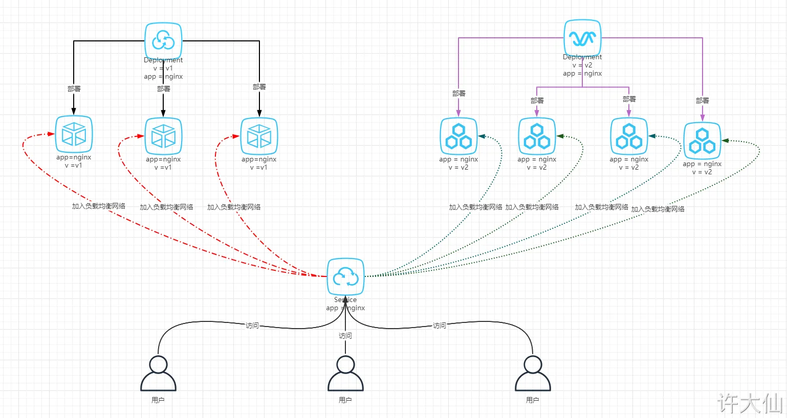

# 1 ReplicaSet(RS)

ReplicaSet的主要作用是**保证一定数量的pod正常运行**，它会持续监听这些Pod的运行状态，一旦Pod发生故障，就会重启或重建。同时它还支持对pod数量的扩缩容和镜像版本的升降级。


ReplicaSet的资源清单文件：

```
apiVersion: apps/v1 # 版本号
kind: ReplicaSet # 类型       
metadata: # 元数据
  name: # rs名称 
  namespace: # 所属命名空间 
  labels: #标签
    controller: rs
spec: # 详情描述
  replicas: 3 # 副本数量
  selector: # 选择器，通过它指定该控制器管理哪些pod
    matchLabels:      # Labels匹配规则
      app: nginx-pod
    matchExpressions: # Expressions匹配规则
      - {key: app, operator: In, values: [nginx-pod]}
  template: # 模板，当副本数量不足时，会根据下面的模板创建pod副本
    metadata:
      labels:
        app: nginx-pod
    spec:
      containers:
      - name: nginx
        image: nginx:1.17.1
        ports:
        - containerPort: 80
```

在这里面，需要新了解的配置项就是`spec`下面几个选项：

- replicas：指定副本数量，其实就是当前rs创建出来的pod的数量，默认为1
    
- selector：选择器，它的作用是建立pod控制器和pod之间的关联关系，采用的Label Selector机制
    
    在pod模板上定义label，在控制器上定义选择器，就可以表明当前控制器能管理哪些pod了
    
- template：模板，就是当前控制器创建pod所使用的模板板，里面其实就是前一章学过的pod的定义

## 1.1 **创建ReplicaSet**

创建pc-replicaset.yaml文件，内容如下：

```
apiVersion: apps/v1
kind: ReplicaSet   
metadata:
  name: pc-replicaset
  namespace: dev
spec:
  replicas: 3
  selector: 
    matchLabels:
      app: nginx-pod
  template:
    metadata:
      labels:
        app: nginx-pod
    spec:
      containers:
      - name: nginx
        image: nginx:1.17.1
```

```
# 创建rs
[root@k8s-master01 ~]# kubectl create -f pc-replicaset.yaml
replicaset.apps/pc-replicaset created

# 查看rs
# DESIRED:期望副本数量  
# CURRENT:当前副本数量  
# READY:已经准备好提供服务的副本数量
[root@k8s-master01 ~]# kubectl get rs pc-replicaset -n dev -o wide
NAME          DESIRED   CURRENT READY AGE   CONTAINERS   IMAGES             SELECTOR
pc-replicaset 3         3       3     22s   nginx        nginx:1.17.1       app=nginx-pod

# 查看当前控制器创建出来的pod
# 这里发现控制器创建出来的pod的名称是在控制器名称后面拼接了-xxxxx随机码
[root@k8s-master01 ~]# kubectl get pod -n dev
NAME                          READY   STATUS    RESTARTS   AGE
pc-replicaset-6vmvt   1/1     Running   0          54s
pc-replicaset-fmb8f   1/1     Running   0          54s
pc-replicaset-snrk2   1/1     Running   0          54s
```

## 1.2 扩缩容

```
# 编辑rs的副本数量，修改spec:replicas: 6即可
[root@k8s-master01 ~]# kubectl edit rs pc-replicaset -n dev
replicaset.apps/pc-replicaset edited

# 查看pod
[root@k8s-master01 ~]# kubectl get pods -n dev
NAME                          READY   STATUS    RESTARTS   AGE
pc-replicaset-6vmvt   1/1     Running   0          114m
pc-replicaset-cftnp   1/1     Running   0          10s
pc-replicaset-fjlm6   1/1     Running   0          10s
pc-replicaset-fmb8f   1/1     Running   0          114m
pc-replicaset-s2whj   1/1     Running   0          10s
pc-replicaset-snrk2   1/1     Running   0          114m

# 当然也可以直接使用命令实现
# 使用scale命令实现扩缩容， 后面--replicas=n直接指定目标数量即可
[root@k8s-master01 ~]# kubectl scale rs pc-replicaset --replicas=2 -n dev
replicaset.apps/pc-replicaset scaled

# 命令运行完毕，立即查看，发现已经有4个开始准备退出了
[root@k8s-master01 ~]# kubectl get pods -n dev
NAME                       READY   STATUS        RESTARTS   AGE
pc-replicaset-6vmvt   0/1     Terminating   0          118m
pc-replicaset-cftnp   0/1     Terminating   0          4m17s
pc-replicaset-fjlm6   0/1     Terminating   0          4m17s
pc-replicaset-fmb8f   1/1     Running       0          118m
pc-replicaset-s2whj   0/1     Terminating   0          4m17s
pc-replicaset-snrk2   1/1     Running       0          118m

#稍等片刻，就只剩下2个了
[root@k8s-master01 ~]# kubectl get pods -n dev
NAME                       READY   STATUS    RESTARTS   AGE
pc-replicaset-fmb8f   1/1     Running   0          119m
pc-replicaset-snrk2   1/1     Running   0          119m
```


## 1.3 镜像升级

```
# 编辑rs的容器镜像 - image: nginx:1.17.2
[root@k8s-master01 ~]# kubectl edit rs pc-replicaset -n dev
replicaset.apps/pc-replicaset edited
# 再次查看，发现镜像版本已经变更了
[root@k8s-master01 ~]# kubectl get rs -n dev -o wide
NAME                DESIRED  CURRENT   READY   AGE    CONTAINERS   IMAGES        ...
pc-replicaset       2        2         2       140m   nginx         nginx:1.17.2  ...
# 同样的道理，也可以使用命令完成这个工作
# kubectl set image rs rs名称 容器=镜像版本 -n namespace
[root@k8s-master01 ~]# kubectl set image rs pc-replicaset nginx=nginx:1.17.1  -n dev
replicaset.apps/pc-replicaset image updated
# 再次查看，发现镜像版本已经变更了
[root@k8s-master01 ~]# kubectl get rs -n dev -o wideNAME                 DESIRED  CURRENT   READY   AGE    CONTAINERS   IMAGES            ...
pc-replicaset        2        2         2       145m   nginx        nginx:1.17.1 ...
```


## 1.4 **删除ReplicaSet**

```
# 使用kubectl delete命令会删除此RS以及它管理的Pod
# 在kubernetes删除RS前，会将RS的replicasclear调整为0，等待所有的Pod被删除后，在执行RS对象的删除
[root@k8s-master01 ~]# kubectl delete rs pc-replicaset -n dev
replicaset.apps "pc-replicaset" deleted
[root@k8s-master01 ~]# kubectl get pod -n dev -o wide
No resources found in dev namespace.

# 如果希望仅仅删除RS对象（保留Pod），可以使用kubectl delete命令时添加--cascade=false选项（不推荐）。
[root@k8s-master01 ~]# kubectl delete rs pc-replicaset -n dev --cascade=false
replicaset.apps "pc-replicaset" deleted
[root@k8s-master01 ~]# kubectl get pods -n dev
NAME                  READY   STATUS    RESTARTS   AGE
pc-replicaset-cl82j   1/1     Running   0          75s
pc-replicaset-dslhb   1/1     Running   0          75s

# 也可以使用yaml直接删除(推荐)
[root@k8s-master01 ~]# kubectl delete -f pc-replicaset.yaml
replicaset.apps "pc-replicaset" deleted

```


# 2 Deployment

- With a Deployment, you can manage Pods in a declarative and upgradable manner.
- Replicas: Kubernetes will make sure that the number of Pods created from the template always are available.
- When the Deployment is updated, Kubernetes will perform a rolling update of the Pods running in the cluster (i.e., creating one new Pod, and remove an old one, until all Pods are new; other deployment strategies are possible)

为了更好的解决服务编排的问题，kubernetes在V1.2版本开始，引入了Deployment控制器。值得一提的是，这种控制器并不直接管理pod，而是通过管理ReplicaSet来简介管理Pod，即：Deployment管理ReplicaSet，ReplicaSet管理Pod。所以Deployment比ReplicaSet功能更加强大。

在kubernetes中，Pod是最小的控制单元，但是kubernetes很少直接控制Pod，一般都是通过Pod控制器来完成的。Pod控制器用于pod的管理，确保pod资源符合预期的状态，当pod的资源出现故障时，会尝试进行重启或重建pod。
sda

在kubernetes中Pod控制器的种类有很多，本章节只介绍一种：Deployment。

> Deployment能够确保Prometheus的Pod能够按照预期的状态在集群中运行，而Pod实例可能随机运行在任意节点上


Deployment主要功能有下面几个：

- 支持ReplicaSet的所有功能
- 支持发布的停止、继续
- 支持滚动升级和回滚版本


Deployment的资源清单文件：

```
apiVersion: apps/v1 # 版本号
kind: Deployment # 类型       
metadata: # 元数据
  name: # rs名称 
  namespace: # 所属命名空间 
  labels: #标签
    controller: deploy
spec: # 详情描述
  replicas: 3 # 副本数量
  revisionHistoryLimit: 3 # 保留历史版本
  paused: false # 暂停部署，默认是false
  progressDeadlineSeconds: 600 # 部署超时时间（s），默认是600
  strategy: # 策略
    type: RollingUpdate # 滚动更新策略
    rollingUpdate: # 滚动更新
      违规词汇: 30% # 最大额外可以存在的副本数，可以为百分比，也可以为整数
      maxUnavailable: 30% # 最大不可用状态的 Pod 的最大值，可以为百分比，也可以为整数
  selector: # 选择器，通过它指定该控制器管理哪些pod
    matchLabels:      # Labels匹配规则
      app: nginx-pod
    matchExpressions: # Expressions匹配规则
      - {key: app, operator: In, values: [nginx-pod]}
  template: # 模板，当副本数量不足时，会根据下面的模板创建pod副本
    metadata:
      labels:
        app: nginx-pod
    spec:
      containers:
      - name: nginx
        image: nginx:1.17.1
        ports:
        - containerPort: 80
```


## 2.1 创建deployment

创建pc-deployment.yaml，内容如下：

```
apiVersion: apps/v1
kind: Deployment      
metadata:
  name: pc-deployment
  namespace: dev
spec: 
  replicas: 3
  selector:
    matchLabels:
      app: nginx-pod
  template:
    metadata:
      labels:
        app: nginx-pod
    spec:
      containers:
      - name: nginx
        image: nginx:1.17.1
```


### 2.1.1 命令式操作


```yaml
# 1 命令格式: kubectl create deployment 名称  [参数] 
# 2 --image  指定pod的镜像
# 3 --port   指定端口
# 4 --replicas  指定创建pod数量
# 5 --namespace  指定namespace
[root@master ~]# kubectl run nginx --image=nginx:latest --port=80 --replicas=3 -n dev
deployment.apps/nginx created


# 6 查看创建的Pod
[root@master ~]# kubectl get pods -n dev
NAME                     READY   STATUS    RESTARTS   AGE
nginx-5ff7956ff6-6k8cb   1/1     Running   0          19s
nginx-5ff7956ff6-jxfjt   1/1     Running   0          19s
nginx-5ff7956ff6-v6jqw   1/1     Running   0          19s

# 7 查看deployment的信息
[root@master ~]# kubectl get deploy -n dev
NAME    READY   UP-TO-DATE   AVAILABLE   AGE
nginx   3/3     3            3           2m42s

# 8 UP-TO-DATE：成功升级的副本数量
# 9 AVAILABLE：可用副本的数量
[root@master ~]# kubectl get deploy -n dev -o wide
NAME    READY UP-TO-DATE  AVAILABLE   AGE     CONTAINERS   IMAGES              SELECTOR
nginx   3/3     3         3           2m51s   nginx        nginx:latest        run=nginx

# 10 查看deployment的详细信息
[root@master ~]# kubectl describe deploy nginx -n dev
Name:                   nginx
Namespace:              dev
CreationTimestamp:      Wed, 08 May 2021 11:14:14 +0800
Labels:                 run=nginx
Annotations:            deployment.kubernetes.io/revision: 1
Selector:               run=nginx
Replicas:               3 desired | 3 updated | 3 total | 3 available | 0 unavailable
StrategyType:           RollingUpdate
MinReadySeconds:        0
RollingUpdateStrategy:  25% max unavailable, 25% max 违规词汇
Pod Template:
  Labels:  run=nginx
  Containers:
   nginx:
    Image:        nginx:latest
    Port:         80/TCP
    Host Port:    0/TCP
    Environment:  <none>
    Mounts:       <none>
  Volumes:        <none>
Conditions:
  Type           Status  Reason
  ----           ------  ------
  Available      True    MinimumReplicasAvailable
  Progressing    True    NewReplicaSetAvailable
OldReplicaSets:  <none>
NewReplicaSet:   nginx-5ff7956ff6 (3/3 replicas created)
Events:
  Type    Reason             Age    From                   Message
  ----    ------             ----   ----                   -------
  Normal  ScalingReplicaSet  5m43s  deployment-controller  Scaled up replicaset nginx-5ff7956ff6 to 3
  
# 11 删除 
[root@master ~]# kubectl delete deploy nginx -n dev
deployment.apps "nginx" deleted
```


### 2.1.2 配置式操作

创建一个deploy-nginx.yaml，内容如下: 

```
apiVersion: apps/v1
kind: Deployment
metadata:
  name: nginx
  namespace: dev
spec:
  replicas: 3
  selector:
    matchLabels:
      run: nginx
  template:
    metadata:
      labels:
        run: nginx
    spec:
      containers:
      - image: nginx:latest
        name: nginx
        ports:
        - containerPort: 80
          protocol: TCP
```


然后就可以执行对应的创建和删除命令了

创建：kubectl create -f deploy-nginx.yaml
删除：kubectl delete -f deploy-nginx.yaml

1 selector
specify that this Deployment should manage Pods with the label app: my-app.
The selector field in a Kubernetes Deployment specifies how to identify the Pods that the Deployment is responsible for managing. The selector ensures that the Deployment only manages Pods with specific labels.

2  template
 The template under the spec section is used to define the Pod configuration. The labels in the template should match the selector to ensure that the Deployment can manage the Pods it creates.


## 2.2 扩缩容


Deployment是对ReplicaSet和Pod更高级的抽象。
它使Pod拥有多副本，自愈，扩缩容、滚动升级等能力。

ReplicaSet(副本集)是一个Pod的集合。
它可以设置运行Pod的数量，确保任何时间都有指定数量的 Pod 副本在运行。 当某个 pod  被删除了,  Kubernetive 会自动生成 pod, 以达到 ReplucaSet 所设置的 pod 数量 


通常我们不直接使用ReplicaSet，而是在Deployment中声明。

```shell
#创建deployment,部署3个运行nginx的Pod
kubectl create deployment nginx-deployment --image=nginx:1.22 --replicas=3

#查看deployment
kubectl get deploy

#查看replicaSet
kubectl get rs 

#删除deployment
kubectl delete deploy nginx-deployment

```


- 方式一：使用 K`ubectl edit` 命令,修改 `spec:replicas:n` 即可：
    - kubectl edit deployment nginx-deployment
- 方式二：使用 scale 命令实现扩缩容：
    - kubectl scale deploy nginx-deployment --replicas=3
- - 方式三：修改 yaml 文件中 spec.replicas 字段，随后使用 `kubectl apply -f xxx.yaml` 命令即可：
    - vim k8s-deploy.yaml 
    - ...
        spec: # 规格，期望状态，必须字段
        replicas: 2 # 副本数
        ..
    - kubectl apply -f k8s-deploy.yaml


```

# 4 变更副本数量为5个
[root@k8s-master01 ~]# kubectl scale deploy pc-deployment --replicas=5  -n dev
deployment.apps/pc-deployment scaled

# 5 查看deployment
[root@k8s-master01 ~]# kubectl get deploy pc-deployment -n dev
NAME            READY   UP-TO-DATE   AVAILABLE   AGE
pc-deployment   5/5     5            5           2m

# 6 查看pod
[root@k8s-master01 ~]#  kubectl get pods -n dev
NAME                             READY   STATUS    RESTARTS   AGE
pc-deployment-6696798b78-d2c8n   1/1     Running   0          4m19s
pc-deployment-6696798b78-jxmdq   1/1     Running   0          94s
pc-deployment-6696798b78-mktqv   1/1     Running   0          93s
pc-deployment-6696798b78-smpvp   1/1     Running   0          4m19s
pc-deployment-6696798b78-wvjd8   1/1     Running   0          4m19s

# 7 编辑deployment的副本数量，修改spec:replicas: 4即可
[root@k8s-master01 ~]# kubectl edit deploy pc-deployment -n dev
deployment.apps/pc-deployment edited

# 8 查看pod
[root@k8s-master01 ~]# kubectl get pods -n dev
NAME                             READY   STATUS    RESTARTS   AGE
pc-deployment-6696798b78-d2c8n   1/1     Running   0          5m23s
pc-deployment-6696798b78-jxmdq   1/1     Running   0          2m38s
pc-deployment-6696798b78-smpvp   1/1     Running   0          5m23s
pc-deployment-6696798b78-wvjd8   1/1     Running   0          5m23s
```


- 手动缩放

```sh
#将副本数量调整为5
kubectl scale deployment/nginx-deployment --replicas=5
kubectl get deploy
```

- 自动缩放

自动缩放通过增加和减少副本的数量，以保持所有 Pod 的平均 CPU 利用率不超过 75%。
自动伸缩需要声明Pod的资源限制，同时使用 [Metrics Server](https://github.com/kubernetes-sigs/metrics-server#readme) 服务（K3s默认已安装）。
本例仅用来说明`kubectl autoscale`命令的使用，完整示例参考：[HPA演示](https://kubernetes.io/zh-cn/docs/tasks/run-application/horizontal-pod-autoscale-walkthrough/)

```sh
#自动缩放
kubectl autoscale deployment/nginx-auto --min=3 --max=10 --cpu-percent=75  // 自动缩放通过增加和减少副本的数量，以保持所有 Pod 的平均 CPU 利用率不超过 75%。

#查看自动缩放
kubectl get hpa

#删除自动缩放
kubectl delete hpa nginx-deployment
```

## 2.3 滚动更新 rollout


deployment支持版本升级过程中的暂停、继续功能以及版本回退等诸多功能，下面具体来看.

kubectl rollout： 版本升级相关功能，支持下面的选项：

- status 显示当前升级状态
- history 显示 升级历史记录
- pause 暂停版本升级过程
- resume 继续已经暂停的版本升级过程
- restart 重启版本升级过程
- undo 回滚到上一级版本（可以使用--to-revision回滚到指定版本）

```sh
# 17 查看当前升级版本的状态
[root@k8s-master01 ~]# kubectl rollout status deploy pc-deployment -n dev
deployment "pc-deployment" successfully rolled out

# 18 查看升级历史记录
[root@k8s-master01 ~]# kubectl rollout history deploy pc-deployment -n dev
deployment.apps/pc-deployment
REVISION  CHANGE-CAUSE
1         kubectl create --filename=pc-deployment.yaml --record=true
2         kubectl create --filename=pc-deployment.yaml --record=true
3         kubectl create --filename=pc-deployment.yaml --record=true
# 19 可以发现有三次版本记录，说明完成过两次升级


# 20 版本回滚
# 21 这里直接使用--to-revision=1回滚到了1版本， 如果省略这个选项，就是回退到上个版本，就是2版本
[root@k8s-master01 ~]# kubectl rollout undo deployment pc-deployment --to-revision=1 -n dev
deployment.apps/pc-deployment rolled back
# Deployment 之所以能够实现版本的回退，就是通过记录下历史的 ReplicaSet 来实现的，一旦想回滚到那个版本，只需要将当前版本的 Pod 数量降为 0 ，然后将回退版本的 Pod 提升为目标数量即可。


# 22 查看发现，通过nginx镜像版本可以发现到了第一版
[root@k8s-master01 ~]# kubectl get deploy -n dev -o wide
NAME            READY   UP-TO-DATE   AVAILABLE   AGE   CONTAINERS   IMAGES         
pc-deployment   4/4     4            4           74m   nginx        nginx:1.17.1   

# 23 查看rs，发现第一个rs中有4个pod运行，后面两个版本的rs中pod为运行
# 24 其实deployment之所以可是实现版本的回滚，就是通过记录下历史rs来实现的，
# 25 一旦想回滚到哪个版本，只需要将当前版本pod数量降为0，然后将回滚版本的pod提升为目标数量就可以了
[root@k8s-master01 ~]# kubectl get rs -n dev
NAME                       DESIRED   CURRENT   READY   AGE
pc-deployment-6696798b78   4         4         4       78m
pc-deployment-966bf7f44    0         0         0       37m
pc-deployment-c848d767     0         0         0       71m


镜像升级
kubectl set image deployment nginx-deployment nginx=nginx:1.17.2 --record
kubectl set image deployment nginx-deployment nginx=nginx:1.20.2 --record

```


```sh
#查看版本和Pod
kubectl get deployment/nginx-deployment -owide
kubectl get pods

#更新容器镜像
# 更新某个 depliymen 中 容器 的版本. 
# 比如 更新 deoplyment name 为 nginx-depoly 的 depolyment  . 内涵三个 容器 , 容器名为 nginx, 用的是 nignx 版本名为 1.22 的 image. 我们想要把他 update 成 1.23 
kubectl set image deployment/nginx-deployment nginx=nginx:1.23

#滚动更新
kubectl rollout status deployment/nginx-deployment

#查看过程, 同步官产副本集的状态 
kubectl get rs --watch  // rs 就是 repulicaSet 
```

其实本质上就是新生成一个 副本集,  <mark> 但是旧的副本集并没有被自动删除  </mark>
新的副本集 中container的版本  为1.23


上面命令下 kubectl set image deployment/nginx-deployment nginx=nginx:1.23, 用 kubectl get rs --watch   时时观察 副本集的状态变换
根据 name 可以观察 右新旧两个副本集, 就副本集中的 容器数量 在不断变化, 新副本集 中 也不断莲花. 就副本集 中 容器数量最后变为 0 0 0 . 最后新的副本集 完全代替的就得副本集 


----


nginx-deployment 为 某个 deployment 的name, 前面要加上 deployment/ 才能表明 这个nginx-deployment 为某个 deployment 

```sh
#查看历史版本
kubectl rollout history deployment/nginx-deployment

#查看指定版本的信息
kubectl rollout history deployment/nginx-deployment --revision=2

#回滚到历史版本
kubectl rollout undo deployment/nginx-deployment --to-revision=2
```

下面例子中 由 1.23 回滚到了 1.22 版本, 因为之前就是 1.22 版本


看到 revision=1 , 就是 第一次部署的时候, 是用的 1.22 版本 


可以看到 有两个副本集, 
第一个副本集 为 版本2 的. 
第二个副本集为 版本1 的, 第二个副本集, 以为已经被第一个副本集取代了 , 所以 内含有的 container 数量变为0 了. 


回滚, --to-revision=1 就是版本号 


之后 可以看到  旧的副本集又被启用了,  他的内含有的container 数量变为了 3 . 


### 2.3.1 更新策略

deployment支持两种更新策略: 重建更新Recreate 和滚动更新RollingUpdate, 可以通过strategy指定策略类型, 
Deployment 的默认的镜像更新策略是 RollingUpdate（滚动更新），实际开发的时候，使用默认镜像更新策略即可。


支持两个属性:

```
strategy：指定新的Pod替换旧的Pod的策略， 支持两个属性：
  type：指定策略类型，支持两种策略
    Recreate：在创建出新的Pod之前会先杀掉所有已存在的Pod
    RollingUpdate：滚动更新，就是杀死一部分，就启动一部分，在更新过程中，存在两个版本Pod
  rollingUpdate：当type为RollingUpdate时生效，用于为RollingUpdate设置参数，支持两个属性：
    maxUnavailable：用来指定在升级过程中不可用Pod的最大数量，默认为25%。
    违规词汇： 用来指定在升级过程中可以超过期望的Pod的最大数量，默认为25%。
    maxSurge： # 用来指定在升级过程中可以超过期望的Pod的最大数量，默认为25%。
```

-----------

#### 2.3.1.1 重建更新Recreate
1. 编辑pc-deployment.yaml,在spec节点下添加更新策略

```
spec:
  strategy: # 策略
    type: Recreate # 重建更新
```

vi k8s-deploy.yaml

```
apiVersion: apps/v1
kind: Deployment
metadata:
  name: nginx-deployment
  namespace: default
  labels:
    app: nginx-deployment
spec:
  replicas: 3
  selector:
    matchLabels:
      app: nginx
  revisionHistoryLimit: 15 # 旧副本集保留的数量，即可回滚的数量。默认为 10 。
  progressDeadlineSeconds: 600 # 处理的最终期限，如果超过了这个指定的时间就会给集群汇报错误。默认为 600s 。
  paused: false # 暂停更新，默认为 false 。
  strategy: # 更新策略
    type: Recreate # Recreate：在创建出新的Pod之前会先杀掉所有已经存在的Pod
  template:
    metadata:
      name: nginx
      labels:
        app: nginx
    spec:
      containers:
        - name: nginx
          image: nginx:1.17.1
          imagePullPolicy: IfNotPresent
      restartPolicy: Always
```

kubectl apply -f k8s-deploy.yaml

2. 创建deploy进行验证
方式一：使用 kubectl set image 命令：
kubectl set image deployment nginx-deployment nginx=nginx:1.20.2

```

# 9 变更镜像
[root@k8s-master01 ~]# kubectl set image deployment pc-deployment nginx=nginx:1.17.2 -n dev
deployment.apps/pc-deployment image updated

# 10 观察升级过程
[root@k8s-master01 ~]#  kubectl get pods -n dev -w
NAME                             READY   STATUS    RESTARTS   AGE
pc-deployment-5d89bdfbf9-65qcw   1/1     Running   0          31s
pc-deployment-5d89bdfbf9-w5nzv   1/1     Running   0          31s
pc-deployment-5d89bdfbf9-xpt7w   1/1     Running   0          31s
pc-deployment-5d89bdfbf9-xpt7w   1/1     Terminating   0          41s
pc-deployment-5d89bdfbf9-65qcw   1/1     Terminating   0          41s
pc-deployment-5d89bdfbf9-w5nzv   1/1     Terminating   0          41s
pc-deployment-675d469f8b-grn8z   0/1     Pending       0          0s
pc-deployment-675d469f8b-hbl4v   0/1     Pending       0          0s
pc-deployment-675d469f8b-67nz2   0/1     Pending       0          0s
pc-deployment-675d469f8b-grn8z   0/1     ContainerCreating   0          0s
pc-deployment-675d469f8b-hbl4v   0/1     ContainerCreating   0          0s
pc-deployment-675d469f8b-67nz2   0/1     ContainerCreating   0          0s
pc-deployment-675d469f8b-grn8z   1/1     Running             0          1s
pc-deployment-675d469f8b-67nz2   1/1     Running             0          1s
pc-deployment-675d469f8b-hbl4v   1/1     Running             0          2s
```


方式二：修改 yaml 文件，使用 kubectl apply -f xxx.yaml 命令即可：
vi k8s-deploy.yaml

```
...
spec:
  replicas: 3
  selector:
    matchLabels:
      app: nginx
  revisionHistoryLimit: 15 # 旧副本集保留的数量，即可回滚的数量。默认为 10 。
  progressDeadlineSeconds: 600 # 处理的最终期限，如果超过了这个指定的时间就会给集群汇报错误。默认为 600s 。
  paused: false # 暂停更新，默认为 false 。
  strategy: # 更新策略
    type: Recreate # Recreate：在创建出新的Pod之前会先杀掉所有已经存在的Pod
  template:
    metadata:
      name: nginx
      labels:
        app: nginx
    spec:
      containers:
        - name: nginx
          image: nginx:1.20.2 # 镜像更新
          imagePullPolicy: IfNotPresent
      restartPolicy: Always
...
```


kubectl apply -f k8s-deploy.yaml


#### 2.3.1.2 滚动更新RollingUpdate,

1. 编辑pc-deployment.yaml,在spec节点下添加更新策略

```
spec:
  strategy: # 策略
    type: RollingUpdate # 滚动更新策略
    rollingUpdate:
      违规词汇: 25% 
      maxUnavailable: 25%


```

2. 创建deploy进行验证

```
# 11 变更镜像
[root@k8s-master01 ~]# kubectl set image deployment pc-deployment nginx=nginx:1.17.3 -n dev 
deployment.apps/pc-deployment image updated

# 12 观察升级过程
[root@k8s-master01 ~]# kubectl get pods -n dev -w
NAME                           READY   STATUS    RESTARTS   AGE
pc-deployment-c848d767-8rbzt   1/1     Running   0          31m
pc-deployment-c848d767-h4p68   1/1     Running   0          31m
pc-deployment-c848d767-hlmz4   1/1     Running   0          31m
pc-deployment-c848d767-rrqcn   1/1     Running   0          31m
pc-deployment-966bf7f44-226rx   0/1     Pending             0          0s
pc-deployment-966bf7f44-226rx   0/1     ContainerCreating   0          0s
pc-deployment-966bf7f44-226rx   1/1     Running             0          1s
pc-deployment-c848d767-h4p68    0/1     Terminating         0          34m
pc-deployment-966bf7f44-cnd44   0/1     Pending             0          0s
pc-deployment-966bf7f44-cnd44   0/1     ContainerCreating   0          0s
pc-deployment-966bf7f44-cnd44   1/1     Running             0          2s
pc-deployment-c848d767-hlmz4    0/1     Terminating         0          34m
pc-deployment-966bf7f44-px48p   0/1     Pending             0          0s
pc-deployment-966bf7f44-px48p   0/1     ContainerCreating   0          0s
pc-deployment-966bf7f44-px48p   1/1     Running             0          0s
pc-deployment-c848d767-8rbzt    0/1     Terminating         0          34m
pc-deployment-966bf7f44-dkmqp   0/1     Pending             0          0s
pc-deployment-966bf7f44-dkmqp   0/1     ContainerCreating   0          0s
pc-deployment-966bf7f44-dkmqp   1/1     Running             0          2s
pc-deployment-c848d767-rrqcn    0/1     Terminating         0          34m

# 13 至此，新版本的pod创建完毕，就版本的pod销毁完毕
# 14 中间过程是滚动进行的，也就是边销毁边创建
```


滚动更新的过程：


镜像更新中rs的变化

```

# 15 查看rs,发现原来的rs的依旧存在，只是pod数量变为了0，而后又新产生了一个rs，pod数量为4
# 16 其实这就是deployment能够进行版本回退的奥妙所在，后面会详细解释

[root@k8s-master01 ~]# kubectl get rs -n dev
NAME                       DESIRED   CURRENT   READY   AGE
pc-deployment-6696798b78   0         0         0       7m37s
pc-deployment-6696798b11   0         0         0       5m37s
pc-deployment-c848d76789   4         4         4       72s
```


---
例子


● 设置镜像更新策略为滚动更新

vi k8s-deploy.yaml

```

apiVersion: apps/v1
kind: Deployment
metadata:
  name: nginx-deployment
  namespace: default
  labels:
    app: nginx-deployment
spec:
  replicas: 6
  selector:
    matchLabels:
      app: nginx
  revisionHistoryLimit: 15 # 旧副本集保留的数量，即可回滚的数量。默认为 10 。
  progressDeadlineSeconds: 600 # 处理的最终期限，如果超过了这个指定的时间就会给集群汇报错误。默认为 600s 。
  paused: false # 暂停更新，默认为 false 。
  strategy: # 更新策略
    type: RollingUpdate # 滚动更新
    rollingUpdate:
      maxSurge: 25% # 最大增量：一次最多新建几个 Pod，可以写数字或百分比，maxUnavailable 为 0 的时候，maxSurge 不能为 0 。
      maxUnavailable: 25% # 最大不可用量：最大不可用的 Pod，可以写数字或百分比
  template:
    metadata:
      name: nginx
      labels:
        app: nginx
    spec:
      containers:
        - name: nginx
          image: nginx:1.17.1
          imagePullPolicy: IfNotPresent
      restartPolicy: Always


```

kubectl apply -f k8s-deploy.yaml


方式一：使用 kubectl set image 命令：
kubectl set image deployment nginx-deployment nginx=nginx:1.20.2


方式二：修改 yaml 文件，使用 kubectl apply -f xxx.yaml 命令即可：
vim k8s-deploy.yaml

```
apiVersion: apps/v1
kind: Deployment
metadata:
  name: nginx-deployment
  namespace: default
  labels:
    app: nginx-deployment
spec:
  replicas: 6
  selector:
    matchLabels:
      app: nginx
  revisionHistoryLimit: 15 # 旧副本集保留的数量，即可回滚的数量。默认为 10 。
  progressDeadlineSeconds: 600 # 处理的最终期限，如果超过了这个指定的时间就会给集群汇报错误。默认为 600s 。
  paused: false # 暂停更新，默认为 false 。
  strategy: # 更新策略
    type: RollingUpdate # 滚动更新
    rollingUpdate:
      maxSurge: 25% # 最大增量：一次最多新建几个 Pod，可以写数字或百分比，maxUnavailable 为 0 的时候，maxSurge 不能为 0 。
      maxUnavailable: 25% # 最大不可用量：最大不可用的 Pod，可以写数字或百分比
  template:
    metadata:
      name: nginx
      labels:
        app: nginx
    spec:
      containers:
        - name: nginx
          image: nginx:1.20.2 # 镜像升级
          imagePullPolicy: IfNotPresent
      restartPolicy: Always

```

kubectl apply -f k8s-deploy.yaml


## 2.4 金丝雀发布

Deployment控制器支持控制更新过程中的控制，如“暂停(pause)”或“继续(resume)”更新操作。

比如有一批新的Pod资源创建完成后立即暂停更新过程，此时，仅存在一部分新版本的应用，主体部分还是旧的版本。然后，再筛选一小部分的用户请求路由到新版本的Pod应用，继续观察能否稳定地按期望的方式运行。确定没问题之后再继续完成余下的Pod资源滚动更新，否则立即回滚更新操作。这就是所谓的金丝雀发布。

滚动更新也是有缺点的：滚动更新短时间就直接结束了，不能直接控制新老版本的存活时间；而金丝雀发布却可以实现这样的功能。


```
# 26 更新deployment的版本，并配置暂停deployment
[root@k8s-master01 ~]#  kubectl set image deploy pc-deployment nginx=nginx:1.17.4 -n dev && kubectl rollout pause deployment pc-deployment  -n dev
deployment.apps/pc-deployment image updated
deployment.apps/pc-deployment paused

#观察更新状态
[root@k8s-master01 ~]# kubectl rollout status deploy pc-deployment -n dev　
Waiting for deployment "pc-deployment" rollout to finish: 2 out of 4 new replicas have been updated...

# 27 监控更新的过程，可以看到已经新增了一个资源，但是并未按照预期的状态去删除一个旧的资源，就是因为使用了pause暂停命令
[root@k8s-master01 ~]# kubectl get rs -n dev -o wide
NAME                       DESIRED   CURRENT   READY   AGE     CONTAINERS   IMAGES         
pc-deployment-5d89bdfbf9   3         3         3       19m     nginx        nginx:1.17.1   
pc-deployment-675d469f8b   0         0         0       14m     nginx        nginx:1.17.2   
pc-deployment-6c9f56fcfb   2         2         2       3m16s   nginx        nginx:1.17.4   

[root@k8s-master01 ~]# kubectl get pods -n dev
NAME                             READY   STATUS    RESTARTS   AGE
pc-deployment-5d89bdfbf9-rj8sq   1/1     Running   0          7m33s
pc-deployment-5d89bdfbf9-ttwgg   1/1     Running   0          7m35s
pc-deployment-5d89bdfbf9-v4wvc   1/1     Running   0          7m34s
pc-deployment-6c9f56fcfb-996rt   1/1     Running   0          3m31s
pc-deployment-6c9f56fcfb-j2gtj   1/1     Running   0          3m31s

# 28 确保更新的pod没问题了，继续更新
[root@k8s-master01 ~]# kubectl rollout resume deploy pc-deployment -n dev
deployment.apps/pc-deployment resumed

# 29 查看最后的更新情况
[root@k8s-master01 ~]# kubectl get rs -n dev -o wide
NAME                       DESIRED   CURRENT   READY   AGE     CONTAINERS   IMAGES         
pc-deployment-5d89bdfbf9   0         0         0       21m     nginx        nginx:1.17.1   
pc-deployment-675d469f8b   0         0         0       16m     nginx        nginx:1.17.2   
pc-deployment-6c9f56fcfb   4         4         4       5m11s   nginx        nginx:1.17.4   
[root@k8s-master01 ~]# kubectl get pods -n dev
NAME                             READY   STATUS    RESTARTS   AGE
pc-deployment-6c9f56fcfb-7bfwh   1/1     Running   0          37s
pc-deployment-6c9f56fcfb-996rt   1/1     Running   0          5m27s
pc-deployment-6c9f56fcfb-j2gtj   1/1     Running   0          5m27s
pc-deployment-6c9f56fcfb-rf84v   1/1     Running   0          37s


```


### 2.4.1 例子




- 金丝雀的发布流程如下：
- ① 将 service 的标签设置为 app=nginx ，这就意味着集群中的所有标签是 app=nginx 的 Pod 都会加入负载均衡网络。
- ② 使用 Deployment v=v1 app=nginx 去筛选标签是 app=nginx 以及 v=v1 的 所有 Pod。
- ③ 同理，使用 Deployment v=v2 app=nginx 去筛选标签是 app=nginx 以及 v=v2 的所有 Pod 。
- ④ 逐渐加大 Deployment v=v2 app=nginx 控制的 Pod 的数量，根据轮询负载均衡网络的特点，必定会使得此 Deployment 控制的 Pod 的流量增大。
- ⑤ 当测试完成后，删除 Deployment v=v1 app=nginx 即可。


1 
准备 v1 版本的 Deployment：

```
apiVersion: apps/v1
kind: Deployment
metadata:
  name: nginx-deploy-v1
  labels:
    app: nginx-deploy-v1
spec:
  replicas: 3
  selector:
    matchLabels:
      app: nginx
      v: v1
  template:
    metadata:
      name: nginx
      labels:
        app: nginx
        v: v1
    spec:
      containers:
        - name: nginx
          image: nginx:1.17.2
          imagePullPolicy: IfNotPresent
          ports:
            - containerPort: 80
      restartPolicy: Always
```

kubectl apply -f k8s-v1-deploy.yaml

2 
创建 v2 版本的 Deployment 
```
vi k8s-v2-deploy.yaml
```

```
apiVersion: apps/v1
kind: Deployment
metadata:
  name: nginx-deploy-v2
  labels:
    app: nginx-deploy-v2
spec:
  replicas: 4
  selector:
    matchLabels:
      app: nginx
      v: v2
  template:
    metadata:
      name: nginx
      labels:
        app: nginx
        v: v2
    spec:
      initContainers:
        - name: alpine
          image: alpine
          imagePullPolicy: IfNotPresent
          command: ["/bin/sh","-c","echo 2222 > /app/index.html;"]
          volumeMounts:
            - mountPath: /app
              name: app
      containers:
        - name: nginx
          image: nginx:1.17.2
          imagePullPolicy: IfNotPresent
          ports:
            - containerPort: 80
          volumeMounts:
            - name: app
              mountPath: /usr/share/nginx/html
      volumes:
        - name: app
          emptyDir: {}
      restartPolicy: Always
```

kubectl apply -f k8s-v2-deploy.yaml

3 
创建 Service ：
vi k8s-svc.yaml

```
apiVersion: v1
kind: Service
metadata:
  name: canary-svc
spec:
  selector:
    app: nginx
  type: NodePort
  ports:
    - port: 80 # svc 的访问端口
      name: canary-nginx
      targetPort: 80 # Pod 的访问端口
      protocol: TCP
      nodePort: 31009 # 在机器上开端口，浏览器访问
```

kubectl apply -f k8s-svc.yaml


4 测试 
curl 192.168.65.100:31009

当然，这仅仅是金丝雀发布的简单演示罢了，实际开发中，还需要结合 Jenkins 的 Pipeline 才行！


## 2.5 **删除Deployment**


方式一：通过 kubectl delete 命令：

```
# 30 删除deployment，其下的rs和pod也将被删除
[root@k8s-master01 ~]# kubectl delete -f pc-deployment.yaml
deployment.apps "pc-deployment" deleted

# --cascade=false 删除 deploy 的同时保留 Pod
kubectl delete deployment deploy的名称 [-n 命名空间] [--cascade=false]

kubectl delete deployment nginx-deployment

```


方式二：通过 yaml 文件：
kubectl delete -f k8s-deploy.yaml
