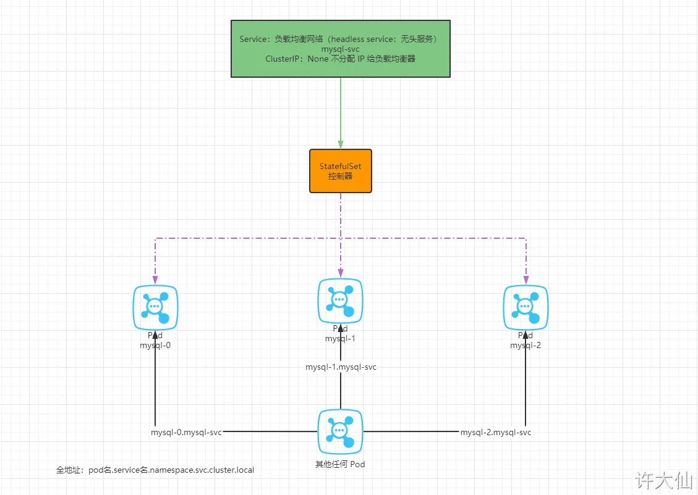

# 1 DaemonSet(DS)

DaemonSet类型的控制器可以保证在集群中的每一台（或指定）节点 Node 上都运行一个副本。一般适用于日志收集、节点监控等场景。也就是说，如果一个Pod提供的功能是节点级别的（每个节点都需要且只需要一个），那么这类Pod就适合使用DaemonSet类型的控制器创建。


●  DaemonSet 的典型应用场景： 
  ○ ① 在每个节点上运行集群的存储守护进程，如：glusterd、ceph。
  ○ ② 在每个节点上运行日志收集守护进程，如：fluentd、logstash。
  ○ ③ 在每个节点上运行监控守护进程，如：Prometheus Node Exporter、Sysdig Agent、collectd、Dynatrace OneAgent、APPDynamics Agent、Datadog agent、New Relic agent、Ganglia gmond、Instana Agent 等


DaemonSet控制器的特点：
- 每当向集群中添加一个节点时，指定的 Pod 副本也将添加到该节点上
- 当节点从集群中移除时，Pod 也就被垃圾回收了

下面先来看下DaemonSet的资源清单文件
> kind: DaemonSet # 类型       

```
apiVersion: apps/v1 # 版本号
kind: DaemonSet # 类型       
metadata: # 元数据
  name: # rs名称 
  namespace: # 所属命名空间 
  labels: #标签
    controller: daemonset
spec: # 详情描述
  revisionHistoryLimit: 3 # 保留历史版本
  updateStrategy: # 更新策略
    type: RollingUpdate # 滚动更新策略
    rollingUpdate: # 滚动更新
      maxUnavailable: 1 # 最大不可用状态的 Pod 的最大值，可以为百分比，也可以为整数
  selector: # 选择器，通过它指定该控制器管理哪些pod
    matchLabels:      # Labels匹配规则
      app: nginx-pod
    matchExpressions: # Expressions匹配规则
      - {key: app, operator: In, values: [nginx-pod]}
  template: # 模板，当副本数量不足时，会根据下面的模板创建pod副本
    metadata:
      labels:
        app: nginx-pod
    spec:
      containers:
      - name: nginx
        image: nginx:1.17.1
        ports:
        - containerPort: 80
```


## 1.1 部署

创建pc-daemonset.yaml，内容如下：
```
apiVersion: apps/v1
kind: DaemonSet      
metadata:
  name: pc-daemonset
  namespace: dev
spec: 
  selector:
    matchLabels:
      app: nginx-pod
  template:
    metadata:
      labels:
        app: nginx-pod
    spec:
      containers:
      - name: nginx
        image: nginx:1.17.1
```


```
# 43 创建daemonset
[root@k8s-master01 ~]# kubectl create -f  pc-daemonset.yaml
daemonset.apps/pc-daemonset created

# 44 查看daemonset
[root@k8s-master01 ~]#  kubectl get ds -n dev -o wide
NAME        DESIRED  CURRENT  READY  UP-TO-DATE  AVAILABLE   AGE   CONTAINERS   IMAGES         
pc-daemonset   2        2        2      2           2        24s   nginx        nginx:1.17.1   

# 45 查看pod,发现在每个Node上都运行一个pod
[root@k8s-master01 ~]#  kubectl get pods -n dev -o wide
NAME                 READY   STATUS    RESTARTS   AGE   IP            NODE    
pc-daemonset-9bck8   1/1     Running   0          37s   10.244.1.43   node1     
pc-daemonset-k224w   1/1     Running   0          37s   10.244.2.74   node2    

# 46 删除daemonset
[root@k8s-master01 ~]# kubectl delete -f pc-daemonset.yaml
daemonset.apps "pc-daemonset" deleted
```


# 2 StatefulSet (sts)

https://confluence.ivu.de/jira/browse/DEVOPS-3121
https://blog.purestorage.com/purely-educational/deployment-vs-statefulset/

> In contrast, StatefulSets provide unique and stable identities for each pod. This predictable identity is crucial for stateful applications like databases that rely on consistent network addresses and specific pod instances to manage data.

## 2.1 基础知识 

● Stateful 翻译为 有状态的 。
● Deployment 部署的应用称为无状态应用，StatefulSet 部署的应用称为有状态应用。
● 无状态应用：网络可能会变（IP 地址）、存储可能会变（卷）、顺序可能会变（启动的顺序）。应用场景：业务代码，如：使用 SpringBoot 开发的商城应用的业务代码。
● 有状态应用：网络不变、存储不变、顺序不变。应用场景：中间件，如：MySQL 集群、Zookeeper 集群、Redis 集群、MQ 集群

StatefulSet 是用来管理有状态应用的工作负载API对象 
StatefulSet 用来管理某Pod集合的部署和扩缩, 并未这些Pod提供持久存储和持久标识符 
==StatefulSet 表示一组具有唯一持久身份和稳定主机名的Pod, 任何指定StatefulSet Pod的状态信息和其他的弹性数据都放在与该StatefulSet关联的永久性 磁盘储存空间里面==


## 2.2 StatefulSet可以解决什么情况 


### 2.2.1 pod有固定的名字可以更好的去做logAnalysis和Tracing 


Having made some practical experiences with the Helm Chart in QS and other contexts, it became evident that traditional log analysis may still be required from time to time. After all, it's just a JBoss in a container.

1 Pod 在 rollout和restart 前后变化 pod name 是有坏处的 
Within these analysis tasks, the Pod naming scheme of Kubernetes Deployments was found to be a burden. ==Pods are given random name suffixes that change with each Pod rollout/restart== (e.g. d3006-ivuplan-foreground-_666f5b4d9-d9sgm_). When analysing logs and dumps, interpreting the current role or activity of different Pods based on these IDs is cumbersome.

2 A fixed name can help Tracing/Analysing the behaviour of individual instances 
Furthermore, interaction of Appserver instances happens on levels which is not controlled by Kubernetes, e.g. core.routing etc. Tracing/Analysing the behaviour of individual instances within these contexts is greatly simplified with names that make sense to a human reader.

3 如果 pod的名字总是变化， 我们就需要在 in larger timeranges 中去检测 a long list of pods 了， 这个是不明智的
A similar effect comes into play in monitoring/observability. Given the expectation to monitor singular Pods, timelines exist only for the lifecycle of the Pod and viewing larger timeranges may present very long lists of Pods whose lifecycle is not actually interesting. (Lifecycles ended due to crashes which are still very relevant)

解决上面的问题的方式是去 用 StatefulSets
StatefulSets may be a viable solution to this problem. Within StatefulSets, Pods are given sequential suffix IDs (-0, -1, ...). This is meant to ensure easier handling of Pods (with variable lifecycles) that need to continuously operate on persistent storage. Although the IVU.plan Appserver Pods are strictly stateless, their identity is still relevant.

我们仍然需要去refer to "the second background server"， 知道我们找到 一种方法 去使得 the number and lifecycle of Pods completely irrelevant
In other words: it is still quite common to want to refer to "the second background server"  until we find the number and lifecycle of Pods completely irrelevant (with sufficiently high stability), we should try to maintain permanent deterministic Pod names.

## 2.3 StatefulSets 的优点 

StatefulSet is a [Kubernetes resource](https://blog.purestorage.com/perspectives/data-on-kubernetes-at-scale-why-your-csi-driver-cant-keep-up/) used to manage stateful applications. While Deployments excel at managing stateless applications, Kubernetes offers StatefulSets for stateful applications with specific requirements. StatefulSets guarantee ordering and uniqueness of pod lifecycles, making them ideal for applications that rely on:

- **Stable network identities:** Each pod managed by a StatefulSet is assigned a unique and persistent network identifier. This identifier remains constant even if the pod is rescheduled to a different node in the cluster. This is crucial for applications, like databases, that rely on specific network addresses for communication.
- **Ordered, controlled updates:** StatefulSets pods are created, scaled, and deleted in a predetermined order, allowing for proper initialization and graceful shutdown of applications during deployments. This minimizes disruption and data loss.
- **Persistent storage integration:** StatefulSets seamlessly integrate with Persistent Volume Claims (PVCs). PVCs act as requests for storage resources, allowing pods to access persistent storage that survives pod restarts or rescheduling. This ensures stateful applications maintain their data across the lifecycle of the pod.

### 2.3.1 Stable network identities 

persistent pod identifier.
persistent podname

These pods are created from the same spec, but are not interchangeable: **each has a persistent identifier that it maintains across any rescheduling**

在 statefulSet 中定义 replicas number 

The _Pods_' _names_ take the form `<_statefulset name_>-<ordinal index> `. Since the web _StatefulSet_ has two replicas, it creates two _Pods_, web-0 and web-0 

-- 自定义 pod name in statefulSet 
https://stackoverflow.com/questions/58668190/how-to-set-hostname-for-kubernetes-pod-in-statefulset
When the StatefulSet controller creates a Pod, it adds a label, _statefulset.kubernetes.io/pod-name_ , that is set to the name of the Pod.

-- rollout 后的 pod name
After restarting , reschueling a pod, 这 name of ne pod keep persistent, same as before 


### 2.3.2 guarantee data persistence across pod rescheduling
StatefulSets do not require persistent storage

**Storage:** Deployments utilize ephemeral storage, meaning any data stored on the pod is lost when the pod is restarted or rescheduled. This is acceptable for stateless applications that don’t require persistent data storage. StatefulSets leverage PVCs to guarantee data persistence across pod rescheduling. PVCs act as requests for storage resources, allowing pods to access persistent storage that survives pod restarts or moves between nodes. This ensures stateful applications maintain their data across the pod lifecycle.

### 2.3.3 perform deployments and scaling operations in a controlled and ordered manne
Pods are scaled up und down sequentially, not instantly

**Scaling and updates:** Deployments offer a flexible approach to scaling. New pods can be added or removed on the fly without a guaranteed order. StatefulSets perform deployments and scaling operations in a controlled and ordered manner. Pods are created, updated, and deleted in a predetermined sequence, allowing for proper initialization and graceful shutdown of applications during deployments.


## 2.4 


## 2.5 StatefulSet Components

A Headless Service 
A StatefulSet
A Persistent Volume


## 2.6 StatefulSet 使用场景和限制



- 对于有如何要求的应用程序，StatefulSet  非常适合。
    - 稳定、唯一的网络标识（dnsname），必须配置 HeadlessService（无头服务）：StatefulSet  通过和其相关的无头服务为每个 Pod 提供 DNS 解析条目。假设无头服务的 DNS 条目为 `$(service name).$(namespace).svc.cluster.local`，那么 Pod 的解析条目就是 `$(pod name).$(service name).$(namespace).svc.cluster.local`，并且每个 Pod 都是唯一的
    - 稳定、持久的存储：每个 Pod 始终对应各自的存储路径（PersistantVolumeClaimTemplate）。
    - 有序的、优雅的部署和缩放：按顺序地增加副本、减少副本，并在减少副本时执行清理。
    - 有序的、自动的滚动更新：按顺序自动地执行滚动更新。

## 2.7 部署 StatefulSet

1
创建 StatefulSet
vi k8s-sts.yaml

```
apiVersion: apps/v1
kind: StatefulSet
metadata:
  name: stateful-nginx
  namespace: default
spec:
  selector:
    matchLabels:
      app: ss-nginx
  serviceName: nginx-svc # 服务名称，这个字段需要和 service 的 metadata.name 相同
  replicas: 3 # 副本数
  template:
    metadata:
      labels:
        app: ss-nginx
    spec:
      containers:
        - name: nginx
          image: nginx:1.20.2
---
# 将 StatefulSet 加入网络
apiVersion: v1
kind: Service
metadata:
  name: nginx-svc
  namespace: default
spec:
  selector:
    app: ss-nginx
  type: ClusterIP
  clusterIP: None # 不分配 ClusterIP ，形成无头服务，整个集群的 Pod 能直接访问，但是浏览器不可以访问。
  ports:
    - name: nginx
      protocol: TCP
      port: 80
      targetPort: 80
```

kubectl apply -f k8s-sts.yaml


1 
新建一个 Pod ，在 Pod 中访问 sts 

创建的 Pod 以及无头服务
kubectl run -it test --image=nginx /bin/sh
curl stateful-nginx-0.nginx-svc
curl stateful-nginx-1.nginx-svc
curl stateful-nginx-2.nginx-svc
curl nginx-svc

2
删除 StatefulSet

kubectl delete -f k8s-sts.yaml

## 2.8 Pod 的管理策略

StatefulSet 的 Pod 的管理策略（podManagementPolicy）分为：OrderedReady（有序启动，默认值） 和 Parallel（并发一起启动）。

```
...
spec:
  podManagementPolicy: OrderedReady # 控制 Pod 创建、升级以及扩缩容逻辑。Parallel（并发一起启动） 和 
...
```

```
apiVersion: apps/v1
kind: StatefulSet
metadata:
  name: stateful-nginx
  namespace: default
spec:
  podManagementPolicy: OrderedReady # 控制 Pod 创建、升级以及扩缩容逻辑。Parallel（并发一起启动） 和 OrderedReady（有序启动）， 默认是 OrderedReady
  selector:
    matchLabels:
      app: ss-nginx
  serviceName: nginx-svc 
  replicas: 3 
  template:
    metadata:
      labels:
        app: ss-nginx
    spec:
      containers:
        - name: nginx
          image: nginx:1.20.2
---
# 将 StatefulSet 加入网络
apiVersion: v1
kind: Service
metadata:
  name: nginx-svc
  namespace: default
spec:
  selector:
    app: ss-nginx
  type: ClusterIP
  clusterIP: None 
  ports:
    - name: nginx
      protocol: TCP
      port: 80
      targetPort: 80
```


## 2.9 分区更新

- StatefulSet 的更新策略：
    - OnDelete：删除之后才更新。
    - RollingUpdate：滚动更新，如果是此更新策略，可以设置更新的索引（默认值）。


```
...
spec:
  updateStrategy: # 更新策略
    type: RollingUpdate # OnDelete 删除之后才更新；RollingUpdate 滚动更新
    rollingUpdate:
      partition: 0 # 更新索引 >= partition 的 Pod ，默认为 0
...
```


```
apiVersion: apps/v1
kind: StatefulSet
metadata:
  name: stateful-nginx
  namespace: default
spec:
  updateStrategy: # 更新策略
    type: RollingUpdate # OnDelete 删除之后才更新；RollingUpdate 滚动更新
    rollingUpdate:
      partition: 0 # 更新索引 >= partition 的 Pod ，默认为 0
  selector:
    matchLabels:
      app: ss-nginx
  serviceName: nginx-svc 
  replicas: 3 
  template:
    metadata:
      labels:
        app: ss-nginx
    spec:
      containers:
        - name: nginx
          image: nginx:1.20.2
---
# 将 StatefulSet 加入网络
apiVersion: v1
kind: Service
metadata:
  name: nginx-svc
  namespace: default
spec:
  selector:
    app: ss-nginx
  type: ClusterIP
  clusterIP: None 
  ports:
    - name: nginx
      protocol: TCP
      port: 80
      targetPort: 80
```


