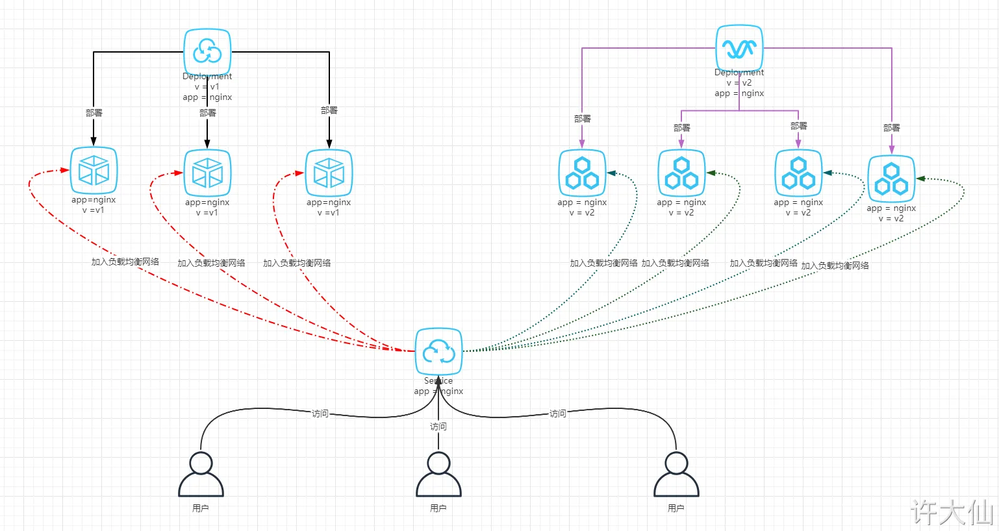
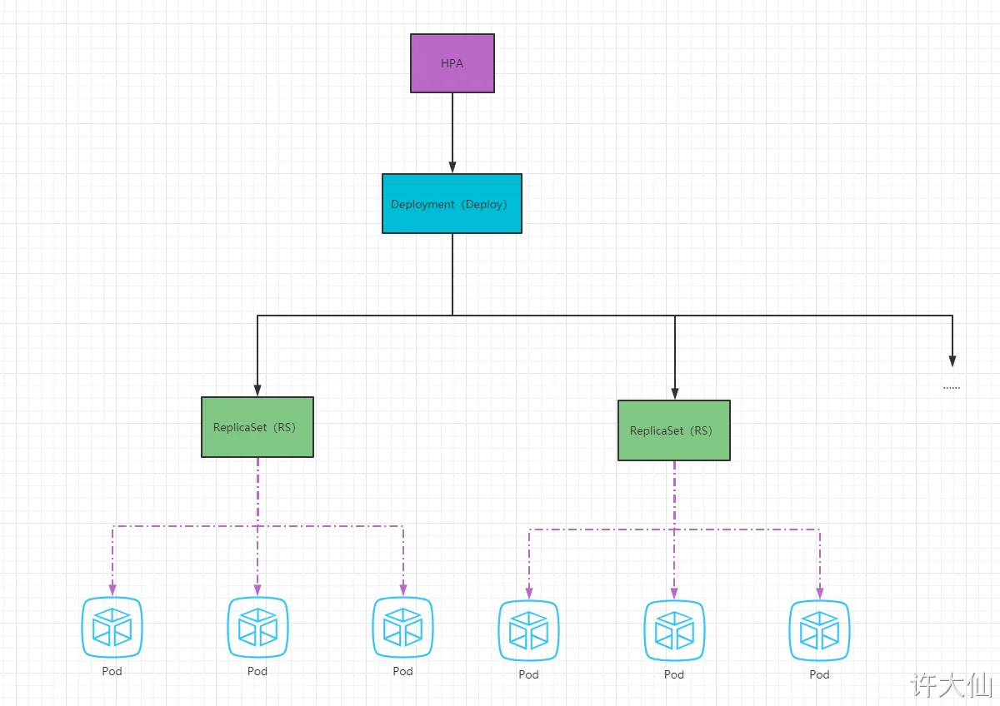
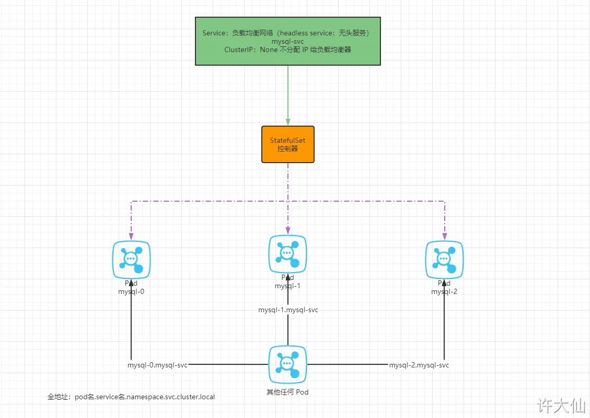

# 1 Pod控制器介绍

Pod是kubernetes的最小管理单元，在kubernetes中，按照pod的创建方式可以将其分为两类：

- 自主式pod：kubernetes直接创建出来的Pod，这种pod删除后就没有了，也不会重建
- 控制器创建的pod：kubernetes通过控制器创建的pod，这种pod删除了之后还会自动重建

> **`什么是Pod控制器`**
> 
> Pod控制器是管理pod的中间层，使用Pod控制器之后，只需要告诉Pod控制器，想要多少个什么样的Pod就可以了，它会创建出满足条件的Pod并确保每一个Pod资源处于用户期望的目标状态。如果Pod资源在运行中出现故障，它会基于指定策略重新编排Pod。

在kubernetes中，有很多类型的pod控制器，每种都有自己的适合的场景，常见的有下面这些：

- ReplicationController：比较原始的pod控制器，已经被废弃，由ReplicaSet替代
- ReplicaSet：保证副本数量一直维持在期望值，并支持pod数量扩缩容，镜像版本升级
- Deployment：通过控制ReplicaSet来控制Pod，并支持滚动升级、回退版本
- Horizontal Pod Autoscaler：可以根据集群负载自动水平调整Pod的数量，实现削峰填谷
- DaemonSet：在集群中的指定Node上运行且仅运行一个副本，一般用于守护进程类的任务
- Job：它创建出来的pod只要完成任务就立即退出，不需要重启或重建，用于执行一次性任务
- Cronjob：它创建的Pod负责周期性任务控制，不需要持续后台运行
- StatefulSet：管理有状态应用

# 2 ReplicaSet(RS)

ReplicaSet的主要作用是**保证一定数量的pod正常运行**，它会持续监听这些Pod的运行状态，一旦Pod发生故障，就会重启或重建。同时它还支持对pod数量的扩缩容和镜像版本的升降级。


ReplicaSet的资源清单文件：

```
apiVersion: apps/v1 # 版本号
kind: ReplicaSet # 类型       
metadata: # 元数据
  name: # rs名称 
  namespace: # 所属命名空间 
  labels: #标签
    controller: rs
spec: # 详情描述
  replicas: 3 # 副本数量
  selector: # 选择器，通过它指定该控制器管理哪些pod
    matchLabels:      # Labels匹配规则
      app: nginx-pod
    matchExpressions: # Expressions匹配规则
      - {key: app, operator: In, values: [nginx-pod]}
  template: # 模板，当副本数量不足时，会根据下面的模板创建pod副本
    metadata:
      labels:
        app: nginx-pod
    spec:
      containers:
      - name: nginx
        image: nginx:1.17.1
        ports:
        - containerPort: 80
```

在这里面，需要新了解的配置项就是`spec`下面几个选项：

- replicas：指定副本数量，其实就是当前rs创建出来的pod的数量，默认为1
    
- selector：选择器，它的作用是建立pod控制器和pod之间的关联关系，采用的Label Selector机制
    
    在pod模板上定义label，在控制器上定义选择器，就可以表明当前控制器能管理哪些pod了
    
- template：模板，就是当前控制器创建pod所使用的模板板，里面其实就是前一章学过的pod的定义

## 2.1 **创建ReplicaSet**

创建pc-replicaset.yaml文件，内容如下：

```
apiVersion: apps/v1
kind: ReplicaSet   
metadata:
  name: pc-replicaset
  namespace: dev
spec:
  replicas: 3
  selector: 
    matchLabels:
      app: nginx-pod
  template:
    metadata:
      labels:
        app: nginx-pod
    spec:
      containers:
      - name: nginx
        image: nginx:1.17.1
```

```
# 创建rs
[root@k8s-master01 ~]# kubectl create -f pc-replicaset.yaml
replicaset.apps/pc-replicaset created

# 查看rs
# DESIRED:期望副本数量  
# CURRENT:当前副本数量  
# READY:已经准备好提供服务的副本数量
[root@k8s-master01 ~]# kubectl get rs pc-replicaset -n dev -o wide
NAME          DESIRED   CURRENT READY AGE   CONTAINERS   IMAGES             SELECTOR
pc-replicaset 3         3       3     22s   nginx        nginx:1.17.1       app=nginx-pod

# 查看当前控制器创建出来的pod
# 这里发现控制器创建出来的pod的名称是在控制器名称后面拼接了-xxxxx随机码
[root@k8s-master01 ~]# kubectl get pod -n dev
NAME                          READY   STATUS    RESTARTS   AGE
pc-replicaset-6vmvt   1/1     Running   0          54s
pc-replicaset-fmb8f   1/1     Running   0          54s
pc-replicaset-snrk2   1/1     Running   0          54s
```

## 2.2 扩缩容

```
# 编辑rs的副本数量，修改spec:replicas: 6即可
[root@k8s-master01 ~]# kubectl edit rs pc-replicaset -n dev
replicaset.apps/pc-replicaset edited

# 查看pod
[root@k8s-master01 ~]# kubectl get pods -n dev
NAME                          READY   STATUS    RESTARTS   AGE
pc-replicaset-6vmvt   1/1     Running   0          114m
pc-replicaset-cftnp   1/1     Running   0          10s
pc-replicaset-fjlm6   1/1     Running   0          10s
pc-replicaset-fmb8f   1/1     Running   0          114m
pc-replicaset-s2whj   1/1     Running   0          10s
pc-replicaset-snrk2   1/1     Running   0          114m

# 当然也可以直接使用命令实现
# 使用scale命令实现扩缩容， 后面--replicas=n直接指定目标数量即可
[root@k8s-master01 ~]# kubectl scale rs pc-replicaset --replicas=2 -n dev
replicaset.apps/pc-replicaset scaled

# 命令运行完毕，立即查看，发现已经有4个开始准备退出了
[root@k8s-master01 ~]# kubectl get pods -n dev
NAME                       READY   STATUS        RESTARTS   AGE
pc-replicaset-6vmvt   0/1     Terminating   0          118m
pc-replicaset-cftnp   0/1     Terminating   0          4m17s
pc-replicaset-fjlm6   0/1     Terminating   0          4m17s
pc-replicaset-fmb8f   1/1     Running       0          118m
pc-replicaset-s2whj   0/1     Terminating   0          4m17s
pc-replicaset-snrk2   1/1     Running       0          118m

#稍等片刻，就只剩下2个了
[root@k8s-master01 ~]# kubectl get pods -n dev
NAME                       READY   STATUS    RESTARTS   AGE
pc-replicaset-fmb8f   1/1     Running   0          119m
pc-replicaset-snrk2   1/1     Running   0          119m
```


## 2.3 镜像升级

```
# 编辑rs的容器镜像 - image: nginx:1.17.2
[root@k8s-master01 ~]# kubectl edit rs pc-replicaset -n dev
replicaset.apps/pc-replicaset edited
# 再次查看，发现镜像版本已经变更了
[root@k8s-master01 ~]# kubectl get rs -n dev -o wide
NAME                DESIRED  CURRENT   READY   AGE    CONTAINERS   IMAGES        ...
pc-replicaset       2        2         2       140m   nginx         nginx:1.17.2  ...
# 同样的道理，也可以使用命令完成这个工作
# kubectl set image rs rs名称 容器=镜像版本 -n namespace
[root@k8s-master01 ~]# kubectl set image rs pc-replicaset nginx=nginx:1.17.1  -n dev
replicaset.apps/pc-replicaset image updated
# 再次查看，发现镜像版本已经变更了
[root@k8s-master01 ~]# kubectl get rs -n dev -o wide
NAME                 DESIRED  CURRENT   READY   AGE    CONTAINERS   IMAGES            ...
pc-replicaset        2        2         2       145m   nginx        nginx:1.17.1 ...
```


## 2.4 **删除ReplicaSet**

```
# 使用kubectl delete命令会删除此RS以及它管理的Pod
# 在kubernetes删除RS前，会将RS的replicasclear调整为0，等待所有的Pod被删除后，在执行RS对象的删除
[root@k8s-master01 ~]# kubectl delete rs pc-replicaset -n dev
replicaset.apps "pc-replicaset" deleted
[root@k8s-master01 ~]# kubectl get pod -n dev -o wide
No resources found in dev namespace.

# 如果希望仅仅删除RS对象（保留Pod），可以使用kubectl delete命令时添加--cascade=false选项（不推荐）。
[root@k8s-master01 ~]# kubectl delete rs pc-replicaset -n dev --cascade=false
replicaset.apps "pc-replicaset" deleted
[root@k8s-master01 ~]# kubectl get pods -n dev
NAME                  READY   STATUS    RESTARTS   AGE
pc-replicaset-cl82j   1/1     Running   0          75s
pc-replicaset-dslhb   1/1     Running   0          75s

# 也可以使用yaml直接删除(推荐)
[root@k8s-master01 ~]# kubectl delete -f pc-replicaset.yaml
replicaset.apps "pc-replicaset" deleted

```


# 3 Deployment(Deploy)

为了更好的解决服务编排的问题，kubernetes在V1.2版本开始，引入了Deployment控制器。值得一提的是，这种控制器并不直接管理pod，而是通过管理ReplicaSet来简介管理Pod，即：Deployment管理ReplicaSet，ReplicaSet管理Pod。所以Deployment比ReplicaSet功能更加强大。


Deployment主要功能有下面几个：

- 支持ReplicaSet的所有功能
- 支持发布的停止、继续
- 支持滚动升级和回滚版本


Deployment的资源清单文件：

```
apiVersion: apps/v1 # 版本号
kind: Deployment # 类型       
metadata: # 元数据
  name: # rs名称 
  namespace: # 所属命名空间 
  labels: #标签
    controller: deploy
spec: # 详情描述
  replicas: 3 # 副本数量
  revisionHistoryLimit: 3 # 保留历史版本
  paused: false # 暂停部署，默认是false
  progressDeadlineSeconds: 600 # 部署超时时间（s），默认是600
  strategy: # 策略
    type: RollingUpdate # 滚动更新策略
    rollingUpdate: # 滚动更新
      违规词汇: 30% # 最大额外可以存在的副本数，可以为百分比，也可以为整数
      maxUnavailable: 30% # 最大不可用状态的 Pod 的最大值，可以为百分比，也可以为整数
  selector: # 选择器，通过它指定该控制器管理哪些pod
    matchLabels:      # Labels匹配规则
      app: nginx-pod
    matchExpressions: # Expressions匹配规则
      - {key: app, operator: In, values: [nginx-pod]}
  template: # 模板，当副本数量不足时，会根据下面的模板创建pod副本
    metadata:
      labels:
        app: nginx-pod
    spec:
      containers:
      - name: nginx
        image: nginx:1.17.1
        ports:
        - containerPort: 80
```


## 3.1 创建deployment

创建pc-deployment.yaml，内容如下：

```
apiVersion: apps/v1
kind: Deployment      
metadata:
  name: pc-deployment
  namespace: dev
spec: 
  replicas: 3
  selector:
    matchLabels:
      app: nginx-pod
  template:
    metadata:
      labels:
        app: nginx-pod
    spec:
      containers:
      - name: nginx
        image: nginx:1.17.1
```


## 3.2 扩缩容

- 方式一：使用 K`ubectl edit` 命令,修改 `spec:replicas:n` 即可：
    - kubectl edit deployment nginx-deployment
- 方式二：使用 scale 命令实现扩缩容：
    - kubectl scale deploy nginx-deployment --replicas=3
- - 方式三：修改 yaml 文件中 spec.replicas 字段，随后使用 `kubectl apply -f xxx.yaml` 命令即可：
    - vim k8s-deploy.yaml 
    - ...
        spec: # 规格，期望状态，必须字段
        replicas: 2 # 副本数
        ..
    - kubectl apply -f k8s-deploy.yaml


```

# 4 变更副本数量为5个
[root@k8s-master01 ~]# kubectl scale deploy pc-deployment --replicas=5  -n dev
deployment.apps/pc-deployment scaled

# 5 查看deployment
[root@k8s-master01 ~]# kubectl get deploy pc-deployment -n dev
NAME            READY   UP-TO-DATE   AVAILABLE   AGE
pc-deployment   5/5     5            5           2m

# 6 查看pod
[root@k8s-master01 ~]#  kubectl get pods -n dev
NAME                             READY   STATUS    RESTARTS   AGE
pc-deployment-6696798b78-d2c8n   1/1     Running   0          4m19s
pc-deployment-6696798b78-jxmdq   1/1     Running   0          94s
pc-deployment-6696798b78-mktqv   1/1     Running   0          93s
pc-deployment-6696798b78-smpvp   1/1     Running   0          4m19s
pc-deployment-6696798b78-wvjd8   1/1     Running   0          4m19s

# 7 编辑deployment的副本数量，修改spec:replicas: 4即可
[root@k8s-master01 ~]# kubectl edit deploy pc-deployment -n dev
deployment.apps/pc-deployment edited

# 8 查看pod
[root@k8s-master01 ~]# kubectl get pods -n dev
NAME                             READY   STATUS    RESTARTS   AGE
pc-deployment-6696798b78-d2c8n   1/1     Running   0          5m23s
pc-deployment-6696798b78-jxmdq   1/1     Running   0          2m38s
pc-deployment-6696798b78-smpvp   1/1     Running   0          5m23s
pc-deployment-6696798b78-wvjd8   1/1     Running   0          5m23s
```


## 3.3 镜像更新 

deployment支持两种更新策略: 重建更新Recreate 和滚动更新RollingUpdate, 可以通过strategy指定策略类型, 
Deployment 的默认的镜像更新策略是 RollingUpdate（滚动更新），实际开发的时候，使用默认镜像更新策略即可。


支持两个属性:

```
strategy：指定新的Pod替换旧的Pod的策略， 支持两个属性：
  type：指定策略类型，支持两种策略
    Recreate：在创建出新的Pod之前会先杀掉所有已存在的Pod
    RollingUpdate：滚动更新，就是杀死一部分，就启动一部分，在更新过程中，存在两个版本Pod
  rollingUpdate：当type为RollingUpdate时生效，用于为RollingUpdate设置参数，支持两个属性：
    maxUnavailable：用来指定在升级过程中不可用Pod的最大数量，默认为25%。
    违规词汇： 用来指定在升级过程中可以超过期望的Pod的最大数量，默认为25%。
    maxSurge： # 用来指定在升级过程中可以超过期望的Pod的最大数量，默认为25%。
```

-----------

### 3.3.1 重建更新Recreate
1. 编辑pc-deployment.yaml,在spec节点下添加更新策略

```
spec:
  strategy: # 策略
    type: Recreate # 重建更新
```

vi k8s-deploy.yaml

```
apiVersion: apps/v1
kind: Deployment
metadata:
  name: nginx-deployment
  namespace: default
  labels:
    app: nginx-deployment
spec:
  replicas: 3
  selector:
    matchLabels:
      app: nginx
  revisionHistoryLimit: 15 # 旧副本集保留的数量，即可回滚的数量。默认为 10 。
  progressDeadlineSeconds: 600 # 处理的最终期限，如果超过了这个指定的时间就会给集群汇报错误。默认为 600s 。
  paused: false # 暂停更新，默认为 false 。
  strategy: # 更新策略
    type: Recreate # Recreate：在创建出新的Pod之前会先杀掉所有已经存在的Pod
  template:
    metadata:
      name: nginx
      labels:
        app: nginx
    spec:
      containers:
        - name: nginx
          image: nginx:1.17.1
          imagePullPolicy: IfNotPresent
      restartPolicy: Always
```

kubectl apply -f k8s-deploy.yaml

2. 创建deploy进行验证
方式一：使用 kubectl set image 命令：
kubectl set image deployment nginx-deployment nginx=nginx:1.20.2

```

# 9 变更镜像
[root@k8s-master01 ~]# kubectl set image deployment pc-deployment nginx=nginx:1.17.2 -n dev
deployment.apps/pc-deployment image updated

# 10 观察升级过程
[root@k8s-master01 ~]#  kubectl get pods -n dev -w
NAME                             READY   STATUS    RESTARTS   AGE
pc-deployment-5d89bdfbf9-65qcw   1/1     Running   0          31s
pc-deployment-5d89bdfbf9-w5nzv   1/1     Running   0          31s
pc-deployment-5d89bdfbf9-xpt7w   1/1     Running   0          31s
pc-deployment-5d89bdfbf9-xpt7w   1/1     Terminating   0          41s
pc-deployment-5d89bdfbf9-65qcw   1/1     Terminating   0          41s
pc-deployment-5d89bdfbf9-w5nzv   1/1     Terminating   0          41s
pc-deployment-675d469f8b-grn8z   0/1     Pending       0          0s
pc-deployment-675d469f8b-hbl4v   0/1     Pending       0          0s
pc-deployment-675d469f8b-67nz2   0/1     Pending       0          0s
pc-deployment-675d469f8b-grn8z   0/1     ContainerCreating   0          0s
pc-deployment-675d469f8b-hbl4v   0/1     ContainerCreating   0          0s
pc-deployment-675d469f8b-67nz2   0/1     ContainerCreating   0          0s
pc-deployment-675d469f8b-grn8z   1/1     Running             0          1s
pc-deployment-675d469f8b-67nz2   1/1     Running             0          1s
pc-deployment-675d469f8b-hbl4v   1/1     Running             0          2s
```


方式二：修改 yaml 文件，使用 kubectl apply -f xxx.yaml 命令即可：
vi k8s-deploy.yaml

```
...
spec:
  replicas: 3
  selector:
    matchLabels:
      app: nginx
  revisionHistoryLimit: 15 # 旧副本集保留的数量，即可回滚的数量。默认为 10 。
  progressDeadlineSeconds: 600 # 处理的最终期限，如果超过了这个指定的时间就会给集群汇报错误。默认为 600s 。
  paused: false # 暂停更新，默认为 false 。
  strategy: # 更新策略
    type: Recreate # Recreate：在创建出新的Pod之前会先杀掉所有已经存在的Pod
  template:
    metadata:
      name: nginx
      labels:
        app: nginx
    spec:
      containers:
        - name: nginx
          image: nginx:1.20.2 # 镜像更新
          imagePullPolicy: IfNotPresent
      restartPolicy: Always
...
```


kubectl apply -f k8s-deploy.yaml


### 3.3.2 滚动更新RollingUpdate,

1. 编辑pc-deployment.yaml,在spec节点下添加更新策略

```
spec:
  strategy: # 策略
    type: RollingUpdate # 滚动更新策略
    rollingUpdate:
      违规词汇: 25% 
      maxUnavailable: 25%


```

2. 创建deploy进行验证

```
# 11 变更镜像
[root@k8s-master01 ~]# kubectl set image deployment pc-deployment nginx=nginx:1.17.3 -n dev 
deployment.apps/pc-deployment image updated

# 12 观察升级过程
[root@k8s-master01 ~]# kubectl get pods -n dev -w
NAME                           READY   STATUS    RESTARTS   AGE
pc-deployment-c848d767-8rbzt   1/1     Running   0          31m
pc-deployment-c848d767-h4p68   1/1     Running   0          31m
pc-deployment-c848d767-hlmz4   1/1     Running   0          31m
pc-deployment-c848d767-rrqcn   1/1     Running   0          31m
pc-deployment-966bf7f44-226rx   0/1     Pending             0          0s
pc-deployment-966bf7f44-226rx   0/1     ContainerCreating   0          0s
pc-deployment-966bf7f44-226rx   1/1     Running             0          1s
pc-deployment-c848d767-h4p68    0/1     Terminating         0          34m
pc-deployment-966bf7f44-cnd44   0/1     Pending             0          0s
pc-deployment-966bf7f44-cnd44   0/1     ContainerCreating   0          0s
pc-deployment-966bf7f44-cnd44   1/1     Running             0          2s
pc-deployment-c848d767-hlmz4    0/1     Terminating         0          34m
pc-deployment-966bf7f44-px48p   0/1     Pending             0          0s
pc-deployment-966bf7f44-px48p   0/1     ContainerCreating   0          0s
pc-deployment-966bf7f44-px48p   1/1     Running             0          0s
pc-deployment-c848d767-8rbzt    0/1     Terminating         0          34m
pc-deployment-966bf7f44-dkmqp   0/1     Pending             0          0s
pc-deployment-966bf7f44-dkmqp   0/1     ContainerCreating   0          0s
pc-deployment-966bf7f44-dkmqp   1/1     Running             0          2s
pc-deployment-c848d767-rrqcn    0/1     Terminating         0          34m

# 13 至此，新版本的pod创建完毕，就版本的pod销毁完毕
# 14 中间过程是滚动进行的，也就是边销毁边创建
```


滚动更新的过程：


镜像更新中rs的变化

```

# 15 查看rs,发现原来的rs的依旧存在，只是pod数量变为了0，而后又新产生了一个rs，pod数量为4
# 16 其实这就是deployment能够进行版本回退的奥妙所在，后面会详细解释

[root@k8s-master01 ~]# kubectl get rs -n dev
NAME                       DESIRED   CURRENT   READY   AGE
pc-deployment-6696798b78   0         0         0       7m37s
pc-deployment-6696798b11   0         0         0       5m37s
pc-deployment-c848d76789   4         4         4       72s
```


---
例子


● 设置镜像更新策略为滚动更新

vi k8s-deploy.yaml

```

apiVersion: apps/v1
kind: Deployment
metadata:
  name: nginx-deployment
  namespace: default
  labels:
    app: nginx-deployment
spec:
  replicas: 6
  selector:
    matchLabels:
      app: nginx
  revisionHistoryLimit: 15 # 旧副本集保留的数量，即可回滚的数量。默认为 10 。
  progressDeadlineSeconds: 600 # 处理的最终期限，如果超过了这个指定的时间就会给集群汇报错误。默认为 600s 。
  paused: false # 暂停更新，默认为 false 。
  strategy: # 更新策略
    type: RollingUpdate # 滚动更新
    rollingUpdate:
      maxSurge: 25% # 最大增量：一次最多新建几个 Pod，可以写数字或百分比，maxUnavailable 为 0 的时候，maxSurge 不能为 0 。
      maxUnavailable: 25% # 最大不可用量：最大不可用的 Pod，可以写数字或百分比
  template:
    metadata:
      name: nginx
      labels:
        app: nginx
    spec:
      containers:
        - name: nginx
          image: nginx:1.17.1
          imagePullPolicy: IfNotPresent
      restartPolicy: Always


```

kubectl apply -f k8s-deploy.yaml


方式一：使用 kubectl set image 命令：
kubectl set image deployment nginx-deployment nginx=nginx:1.20.2


方式二：修改 yaml 文件，使用 kubectl apply -f xxx.yaml 命令即可：
vim k8s-deploy.yaml

```
apiVersion: apps/v1
kind: Deployment
metadata:
  name: nginx-deployment
  namespace: default
  labels:
    app: nginx-deployment
spec:
  replicas: 6
  selector:
    matchLabels:
      app: nginx
  revisionHistoryLimit: 15 # 旧副本集保留的数量，即可回滚的数量。默认为 10 。
  progressDeadlineSeconds: 600 # 处理的最终期限，如果超过了这个指定的时间就会给集群汇报错误。默认为 600s 。
  paused: false # 暂停更新，默认为 false 。
  strategy: # 更新策略
    type: RollingUpdate # 滚动更新
    rollingUpdate:
      maxSurge: 25% # 最大增量：一次最多新建几个 Pod，可以写数字或百分比，maxUnavailable 为 0 的时候，maxSurge 不能为 0 。
      maxUnavailable: 25% # 最大不可用量：最大不可用的 Pod，可以写数字或百分比
  template:
    metadata:
      name: nginx
      labels:
        app: nginx
    spec:
      containers:
        - name: nginx
          image: nginx:1.20.2 # 镜像升级
          imagePullPolicy: IfNotPresent
      restartPolicy: Always

```

kubectl apply -f k8s-deploy.yaml
## 3.4 版本回退

deployment支持版本升级过程中的暂停、继续功能以及版本回退等诸多功能，下面具体来看.

kubectl rollout： 版本升级相关功能，支持下面的选项：

- status 显示当前升级状态
- history 显示 升级历史记录
- pause 暂停版本升级过程
- resume 继续已经暂停的版本升级过程
- restart 重启版本升级过程
- undo 回滚到上一级版本（可以使用--to-revision回滚到指定版本）

```
# 17 查看当前升级版本的状态
[root@k8s-master01 ~]# kubectl rollout status deploy pc-deployment -n dev
deployment "pc-deployment" successfully rolled out

# 18 查看升级历史记录
[root@k8s-master01 ~]# kubectl rollout history deploy pc-deployment -n dev
deployment.apps/pc-deployment
REVISION  CHANGE-CAUSE
1         kubectl create --filename=pc-deployment.yaml --record=true
2         kubectl create --filename=pc-deployment.yaml --record=true
3         kubectl create --filename=pc-deployment.yaml --record=true
# 19 可以发现有三次版本记录，说明完成过两次升级


# 20 版本回滚
# 21 这里直接使用--to-revision=1回滚到了1版本， 如果省略这个选项，就是回退到上个版本，就是2版本
[root@k8s-master01 ~]# kubectl rollout undo deployment pc-deployment --to-revision=1 -n dev
deployment.apps/pc-deployment rolled back
# Deployment 之所以能够实现版本的回退，就是通过记录下历史的 ReplicaSet 来实现的，一旦想回滚到那个版本，只需要将当前版本的 Pod 数量降为 0 ，然后将回退版本的 Pod 提升为目标数量即可。


# 22 查看发现，通过nginx镜像版本可以发现到了第一版
[root@k8s-master01 ~]# kubectl get deploy -n dev -o wide
NAME            READY   UP-TO-DATE   AVAILABLE   AGE   CONTAINERS   IMAGES         
pc-deployment   4/4     4            4           74m   nginx        nginx:1.17.1   

# 23 查看rs，发现第一个rs中有4个pod运行，后面两个版本的rs中pod为运行
# 24 其实deployment之所以可是实现版本的回滚，就是通过记录下历史rs来实现的，
# 25 一旦想回滚到哪个版本，只需要将当前版本pod数量降为0，然后将回滚版本的pod提升为目标数量就可以了
[root@k8s-master01 ~]# kubectl get rs -n dev
NAME                       DESIRED   CURRENT   READY   AGE
pc-deployment-6696798b78   4         4         4       78m
pc-deployment-966bf7f44    0         0         0       37m
pc-deployment-c848d767     0         0         0       71m


镜像升级
kubectl set image deployment nginx-deployment nginx=nginx:1.17.2 --record
kubectl set image deployment nginx-deployment nginx=nginx:1.20.2 --record

```


## 3.5 金丝雀发布

Deployment控制器支持控制更新过程中的控制，如“暂停(pause)”或“继续(resume)”更新操作。

比如有一批新的Pod资源创建完成后立即暂停更新过程，此时，仅存在一部分新版本的应用，主体部分还是旧的版本。然后，再筛选一小部分的用户请求路由到新版本的Pod应用，继续观察能否稳定地按期望的方式运行。确定没问题之后再继续完成余下的Pod资源滚动更新，否则立即回滚更新操作。这就是所谓的金丝雀发布。

滚动更新也是有缺点的：滚动更新短时间就直接结束了，不能直接控制新老版本的存活时间；而金丝雀发布却可以实现这样的功能。


```
# 26 更新deployment的版本，并配置暂停deployment
[root@k8s-master01 ~]#  kubectl set image deploy pc-deployment nginx=nginx:1.17.4 -n dev && kubectl rollout pause deployment pc-deployment  -n dev
deployment.apps/pc-deployment image updated
deployment.apps/pc-deployment paused

#观察更新状态
[root@k8s-master01 ~]# kubectl rollout status deploy pc-deployment -n dev　
Waiting for deployment "pc-deployment" rollout to finish: 2 out of 4 new replicas have been updated...

# 27 监控更新的过程，可以看到已经新增了一个资源，但是并未按照预期的状态去删除一个旧的资源，就是因为使用了pause暂停命令
[root@k8s-master01 ~]# kubectl get rs -n dev -o wide
NAME                       DESIRED   CURRENT   READY   AGE     CONTAINERS   IMAGES         
pc-deployment-5d89bdfbf9   3         3         3       19m     nginx        nginx:1.17.1   
pc-deployment-675d469f8b   0         0         0       14m     nginx        nginx:1.17.2   
pc-deployment-6c9f56fcfb   2         2         2       3m16s   nginx        nginx:1.17.4   

[root@k8s-master01 ~]# kubectl get pods -n dev
NAME                             READY   STATUS    RESTARTS   AGE
pc-deployment-5d89bdfbf9-rj8sq   1/1     Running   0          7m33s
pc-deployment-5d89bdfbf9-ttwgg   1/1     Running   0          7m35s
pc-deployment-5d89bdfbf9-v4wvc   1/1     Running   0          7m34s
pc-deployment-6c9f56fcfb-996rt   1/1     Running   0          3m31s
pc-deployment-6c9f56fcfb-j2gtj   1/1     Running   0          3m31s

# 28 确保更新的pod没问题了，继续更新
[root@k8s-master01 ~]# kubectl rollout resume deploy pc-deployment -n dev
deployment.apps/pc-deployment resumed

# 29 查看最后的更新情况
[root@k8s-master01 ~]# kubectl get rs -n dev -o wide
NAME                       DESIRED   CURRENT   READY   AGE     CONTAINERS   IMAGES         
pc-deployment-5d89bdfbf9   0         0         0       21m     nginx        nginx:1.17.1   
pc-deployment-675d469f8b   0         0         0       16m     nginx        nginx:1.17.2   
pc-deployment-6c9f56fcfb   4         4         4       5m11s   nginx        nginx:1.17.4   
[root@k8s-master01 ~]# kubectl get pods -n dev
NAME                             READY   STATUS    RESTARTS   AGE
pc-deployment-6c9f56fcfb-7bfwh   1/1     Running   0          37s
pc-deployment-6c9f56fcfb-996rt   1/1     Running   0          5m27s
pc-deployment-6c9f56fcfb-j2gtj   1/1     Running   0          5m27s
pc-deployment-6c9f56fcfb-rf84v   1/1     Running   0          37s


```


### 3.5.1 例子




- 金丝雀的发布流程如下：
- ① 将 service 的标签设置为 app=nginx ，这就意味着集群中的所有标签是 app=nginx 的 Pod 都会加入负载均衡网络。
- ② 使用 Deployment v=v1 app=nginx 去筛选标签是 app=nginx 以及 v=v1 的 所有 Pod。
- ③ 同理，使用 Deployment v=v2 app=nginx 去筛选标签是 app=nginx 以及 v=v2 的所有 Pod 。
- ④ 逐渐加大 Deployment v=v2 app=nginx 控制的 Pod 的数量，根据轮询负载均衡网络的特点，必定会使得此 Deployment 控制的 Pod 的流量增大。
- ⑤ 当测试完成后，删除 Deployment v=v1 app=nginx 即可。


1 
准备 v1 版本的 Deployment：

```
apiVersion: apps/v1
kind: Deployment
metadata:
  name: nginx-deploy-v1
  labels:
    app: nginx-deploy-v1
spec:
  replicas: 3
  selector:
    matchLabels:
      app: nginx
      v: v1
  template:
    metadata:
      name: nginx
      labels:
        app: nginx
        v: v1
    spec:
      containers:
        - name: nginx
          image: nginx:1.17.2
          imagePullPolicy: IfNotPresent
          ports:
            - containerPort: 80
      restartPolicy: Always
```

kubectl apply -f k8s-v1-deploy.yaml

2 
创建 v2 版本的 Deployment 
```
vi k8s-v2-deploy.yaml
```

```
apiVersion: apps/v1
kind: Deployment
metadata:
  name: nginx-deploy-v2
  labels:
    app: nginx-deploy-v2
spec:
  replicas: 4
  selector:
    matchLabels:
      app: nginx
      v: v2
  template:
    metadata:
      name: nginx
      labels:
        app: nginx
        v: v2
    spec:
      initContainers:
        - name: alpine
          image: alpine
          imagePullPolicy: IfNotPresent
          command: ["/bin/sh","-c","echo 2222 > /app/index.html;"]
          volumeMounts:
            - mountPath: /app
              name: app
      containers:
        - name: nginx
          image: nginx:1.17.2
          imagePullPolicy: IfNotPresent
          ports:
            - containerPort: 80
          volumeMounts:
            - name: app
              mountPath: /usr/share/nginx/html
      volumes:
        - name: app
          emptyDir: {}
      restartPolicy: Always
```

kubectl apply -f k8s-v2-deploy.yaml

3 
创建 Service ：
vi k8s-svc.yaml

```
apiVersion: v1
kind: Service
metadata:
  name: canary-svc
spec:
  selector:
    app: nginx
  type: NodePort
  ports:
    - port: 80 # svc 的访问端口
      name: canary-nginx
      targetPort: 80 # Pod 的访问端口
      protocol: TCP
      nodePort: 31009 # 在机器上开端口，浏览器访问
```

kubectl apply -f k8s-svc.yaml


4 测试 
curl 192.168.65.100:31009

当然，这仅仅是金丝雀发布的简单演示罢了，实际开发中，还需要结合 Jenkins 的 Pipeline 才行！


## 3.6 **删除Deployment**


方式一：通过 kubectl delete 命令：

```
# 30 删除deployment，其下的rs和pod也将被删除
[root@k8s-master01 ~]# kubectl delete -f pc-deployment.yaml
deployment.apps "pc-deployment" deleted

# --cascade=false 删除 deploy 的同时保留 Pod
kubectl delete deployment deploy的名称 [-n 命名空间] [--cascade=false]

kubectl delete deployment nginx-deployment

```


方式二：通过 yaml 文件：
kubectl delete -f k8s-deploy.yaml

# 4 Horizontal Pod Autoscaler(HPA)


在前面的课程中，我们已经可以实现通过手工执行`kubectl scale`命令实现Pod扩容或缩容，但是这显然不符合Kubernetes的定位目标--自动化、智能化。 Kubernetes期望可以实现通过监测Pod的使用情况，实现pod数量的自动调整，于是就产生了Horizontal Pod Autoscaler（HPA）这种控制器。

HPA可以获取每个Pod利用率，然后和HPA中定义的指标进行对比，同时计算出需要伸缩的具体值，最后实现Pod的数量的调整。其实HPA与之前的Deployment一样，也属于一种Kubernetes资源对象， 它通过追踪分析RC控制的所有目标Pod的负载变化情况，来确定是否需要针对性地调整目标Pod的副本数，这是HPA的实现原理。

HPA 的 definition yaml  file  中 她的 Kind的 类型 为 HorizontalPodAutoscaler
一个 HPA 下辖 一个 之前已经创建好的Depolyment ,  这个 Depolyment 也有 下辖的 若干个 Pod  




接下来，我们来做一个实验

## 4.1 安装metrics-server

metrics-server可以用来收集集群中的资源使用情况


```
# 31 安装git
[root@k8s-master01 ~]# yum install git -y

# 32 获取metrics-server, 注意使用的版本
[root@k8s-master01 ~]# git clone -b v0.3.6 https://github.com/kubernetes-incubator/metrics-server

# 33 修改deployment, 注意修改的是镜像和初始化参数
[root@k8s-master01 ~]# cd /root/metrics-server/deploy/1.8+/
[root@k8s-master01 1.8+]# vim metrics-server-deployment.yaml

按图中添加下面选项
hostNetwork: true
image: registry.cn-hangzhou.aliyuncs.com/google_containers/metrics-server-amd64:v0.3.6
args:
- --kubelet-insecure-tls
- --kubelet-preferred-address-types=InternalIP,Hostname,InternalDNS,ExternalDNS,ExternalIP
```


vim components.yaml

```
apiVersion: apps/v1
kind: Deployment
metadata:
  labels:
    k8s-app: metrics-server
  name: metrics-server
  namespace: kube-system
spec:
  selector:
    matchLabels:
      k8s-app: metrics-server
  strategy:
    rollingUpdate:
      maxUnavailable: 0
  template:
    metadata:
      labels:
        k8s-app: metrics-server
    spec:
      containers:
      - args:
        - --cert-dir=/tmp
        - --secure-port=4443
        - --kubelet-preferred-address-types=InternalIP,ExternalIP,Hostname
        - --kubelet-use-node-status-port
        - --metric-resolution=15s
        # 修改部分
        - --kubelet-insecure-tls # 使用非安全的协议
        image: bitnami/metrics-server:0.6.1 # k8s.gcr.io/metrics-server/metrics-server:v0.6.1
```

kubectl apply -f components.yaml

```
# 34 安装metrics-server
[root@k8s-master01 1.8+]# kubectl apply -f ./

# 35 查看pod运行情况
[root@k8s-master01 1.8+]# kubectl get pod -n kube-system
metrics-server-6b976979db-2xwbj   1/1     Running   0          90s

# 36 使用kubectl top node 查看资源使用情况
[root@k8s-master01 1.8+]# kubectl top node
NAME           CPU(cores)   CPU%   MEMORY(bytes)   MEMORY%
k8s-master01   289m         14%    1582Mi          54%       
k8s-node01     81m          4%     1195Mi          40%       
k8s-node02     72m          3%     1211Mi          41%  

[root@k8s-master01 1.8+]# kubectl top pod -n kube-system
NAME                              CPU(cores)   MEMORY(bytes)
coredns-6955765f44-7ptsb          3m           9Mi
coredns-6955765f44-vcwr5          3m           8Mi
etcd-master                       14m          145Mi
...

# 37 至此,metrics-server安装完成

```

查看是否安装成功
kubectl top nodes --use-protocol-buffers
kubectl top pods --use-protocol-buffers

## 4.2 准备deployment和service


创建pc-hpa-pod.yaml文件，内容如下：

```
apiVersion: apps/v1
kind: Deployment
metadata:
  name: nginx
  namespace: dev
spec:
  strategy: # 策略
    type: RollingUpdate # 滚动更新策略
  replicas: 1
  selector:
    matchLabels:
      app: nginx-pod
  template:
    metadata:
      labels:
        app: nginx-pod
    spec:
      containers:
      - name: nginx
        image: nginx:1.17.1
        resources: # 资源配额
          limits:  # 限制资源（上限）
            cpu: "1" # CPU限制，单位是core数
          requests: # 请求资源（下限）
            cpu: "100m"  # CPU限制，单位是core数

---
apiVersion: v1
kind: Service
metadata:
  name: nginx-svc
spec:
  selector:
    app: nginx
  type: NodePort
  ports:
    - port: 80 # svc 的访问端口
      name: nginx
      targetPort: 80 # Pod 的访问端口
      protocol: TCP
      nodePort: 30010 # 在机器上开端口，浏览器访问
```


kubectl apply -f k8s-hpa-deploy-svc.yaml

```
# 38 创建deployment
[root@k8s-master01 1.8+]# kubectl run nginx --image=nginx:1.17.1 --requests=cpu=100m -n dev

# 39 创建service
[root@k8s-master01 1.8+]# kubectl expose deployment nginx --type=NodePort --port=80 -n dev
```


```
# 40 查看
[root@k8s-master01 1.8+]# kubectl get deployment,pod,svc -n dev
NAME                    READY   UP-TO-DATE   AVAILABLE   AGE
deployment.apps/nginx   1/1     1            1           47s

NAME                         READY   STATUS    RESTARTS   AGE
pod/nginx-7df9756ccc-bh8dr   1/1     Running   0          47s

NAME            TYPE       CLUSTER-IP      EXTERNAL-IP   PORT(S)        AGE
service/nginx   NodePort   10.101.18.29   <none>        80:31830/TCP   35s
```


## 4.3 部署HPA

创建pc-hpa.yaml文件，内容如下：\

Kind的 类型 为 HorizontalPodAutoscaler

```
apiVersion: autoscaling/v1
kind: HorizontalPodAutoscaler
metadata:
  name: pc-hpa
  namespace: dev
spec:
  minReplicas: 1  #最小pod数量
  maxReplicas: 10 #最大pod数量
  targetCPUUtilizationPercentage: 3 # # CPU 使用率指标，即 CPU 超过 3%（Pod 的 limit 的 cpu ） 就进行扩容
  scaleTargetRef:   # 指定要控制的nginx信息
    apiVersion:  apps/v1
    kind: Deployment
    name: nginx
```


```
# 41 创建hpa
[root@k8s-master01 1.8+]# kubectl create -f pc-hpa.yaml
horizontalpodautoscaler.autoscaling/pc-hpa created

# 42 查看hpa
[root@k8s-master01 1.8+]# kubectl get hpa -n dev
NAME     REFERENCE          TARGETS   MINPODS   MAXPODS   REPLICAS   AGE
pc-hpa   Deployment/nginx   0%/3%     1         10        1          62s
```


## 4.4 测试

使用压测工具对service地址`192.168.5.4:31830`进行压测，然后通过控制台查看hpa和pod的变化

hpa变化
```
[root@k8s-master01 ~]# kubectl get hpa -n dev -w
NAME   REFERENCE      TARGETS  MINPODS  MAXPODS  REPLICAS  AGE
pc-hpa  Deployment/nginx  0%/3%   1     10     1      4m11s
pc-hpa  Deployment/nginx  0%/3%   1     10     1      5m19s
pc-hpa  Deployment/nginx  22%/3%   1     10     1      6m50s
pc-hpa  Deployment/nginx  22%/3%   1     10     4      7m5s
pc-hpa  Deployment/nginx  22%/3%   1     10     8      7m21s
pc-hpa  Deployment/nginx  6%/3%   1     10     8      7m51s
pc-hpa  Deployment/nginx  0%/3%   1     10     8      9m6s
pc-hpa  Deployment/nginx  0%/3%   1     10     8      13m
pc-hpa  Deployment/nginx  0%/3%   1     10     1      14m
```

deployment变化
```
[root@k8s-master01 ~]# kubectl get deployment -n dev -w
NAME    READY   UP-TO-DATE   AVAILABLE   AGE
nginx   1/1     1            1           11m
nginx   1/4     1            1           13m
nginx   1/4     1            1           13m
nginx   1/4     1            1           13m
nginx   1/4     4            1           13m
nginx   1/8     4            1           14m
nginx   1/8     4            1           14m
nginx   1/8     4            1           14m
nginx   1/8     8            1           14m
nginx   2/8     8            2           14m
nginx   3/8     8            3           14m
nginx   4/8     8            4           14m
nginx   5/8     8            5           14m
nginx   6/8     8            6           14m
nginx   7/8     8            7           14m
nginx   8/8     8            8           15m
nginx   8/1     8            8           20m
nginx   8/1     8            8           20m
nginx   1/1     1            1           20m
```


pod变化
```

[root@k8s-master01 ~]# kubectl get pods -n dev -w
NAME                     READY   STATUS    RESTARTS   AGE
nginx-7df9756ccc-bh8dr   1/1     Running   0          11m
nginx-7df9756ccc-cpgrv   0/1     Pending   0          0s
nginx-7df9756ccc-8zhwk   0/1     Pending   0          0s
nginx-7df9756ccc-rr9bn   0/1     Pending   0          0s
nginx-7df9756ccc-cpgrv   0/1     ContainerCreating   0          0s
nginx-7df9756ccc-8zhwk   0/1     ContainerCreating   0          0s
nginx-7df9756ccc-rr9bn   0/1     ContainerCreating   0          0s
nginx-7df9756ccc-m9gsj   0/1     Pending             0          0s
nginx-7df9756ccc-g56qb   0/1     Pending             0          0s
nginx-7df9756ccc-sl9c6   0/1     Pending             0          0s
nginx-7df9756ccc-fgst7   0/1     Pending             0          0s
nginx-7df9756ccc-g56qb   0/1     ContainerCreating   0          0s
nginx-7df9756ccc-m9gsj   0/1     ContainerCreating   0          0s
nginx-7df9756ccc-sl9c6   0/1     ContainerCreating   0          0s
nginx-7df9756ccc-fgst7   0/1     ContainerCreating   0          0s
nginx-7df9756ccc-8zhwk   1/1     Running             0          19s
nginx-7df9756ccc-rr9bn   1/1     Running             0          30s
nginx-7df9756ccc-m9gsj   1/1     Running             0          21s
nginx-7df9756ccc-cpgrv   1/1     Running             0          47s
nginx-7df9756ccc-sl9c6   1/1     Running             0          33s
nginx-7df9756ccc-g56qb   1/1     Running             0          48s
nginx-7df9756ccc-fgst7   1/1     Running             0          66s
nginx-7df9756ccc-fgst7   1/1     Terminating         0          6m50s
nginx-7df9756ccc-8zhwk   1/1     Terminating         0          7m5s
nginx-7df9756ccc-cpgrv   1/1     Terminating         0          7m5s
nginx-7df9756ccc-g56qb   1/1     Terminating         0          6m50s
nginx-7df9756ccc-rr9bn   1/1     Terminating         0          7m5s
nginx-7df9756ccc-m9gsj   1/1     Terminating         0          6m50s
nginx-7df9756ccc-sl9c6   1/1     Terminating         0          6m50s

```


当然，HPA 目前也可以监控内存等指标，但是，目前是 beta 版。

```
apiVersion: autoscaling/v2beta2
kind: HorizontalPodAutoscaler
metadata:
  name: pc-hpa
  namespace: dev
spec:
  minReplicas: 1
  maxReplicas: 10
  metrics:
    - type: Resource
      resource:
        name: memory
        target:
          type: Utilization
          averageUtilization: 90
    - type: Resource
      resource:
        name: cpu
        target:
          type: Utilization
          averageUtilization: 90
  scaleTargetRef:
    apiVersion: apps/v1
    kind: Deployment
    name: nginx-deploy
```


# 5 DaemonSet(DS)

DaemonSet类型的控制器可以保证在集群中的每一台（或指定）节点 Node 上都运行一个副本。一般适用于日志收集、节点监控等场景。也就是说，如果一个Pod提供的功能是节点级别的（每个节点都需要且只需要一个），那么这类Pod就适合使用DaemonSet类型的控制器创建。


●  DaemonSet 的典型应用场景： 
  ○ ① 在每个节点上运行集群的存储守护进程，如：glusterd、ceph。
  ○ ② 在每个节点上运行日志收集守护进程，如：fluentd、logstash。
  ○ ③ 在每个节点上运行监控守护进程，如：Prometheus Node Exporter、Sysdig Agent、collectd、Dynatrace OneAgent、APPDynamics Agent、Datadog agent、New Relic agent、Ganglia gmond、Instana Agent 等


DaemonSet控制器的特点：
- 每当向集群中添加一个节点时，指定的 Pod 副本也将添加到该节点上
- 当节点从集群中移除时，Pod 也就被垃圾回收了

下面先来看下DaemonSet的资源清单文件
> kind: DaemonSet # 类型       

```
apiVersion: apps/v1 # 版本号
kind: DaemonSet # 类型       
metadata: # 元数据
  name: # rs名称 
  namespace: # 所属命名空间 
  labels: #标签
    controller: daemonset
spec: # 详情描述
  revisionHistoryLimit: 3 # 保留历史版本
  updateStrategy: # 更新策略
    type: RollingUpdate # 滚动更新策略
    rollingUpdate: # 滚动更新
      maxUnavailable: 1 # 最大不可用状态的 Pod 的最大值，可以为百分比，也可以为整数
  selector: # 选择器，通过它指定该控制器管理哪些pod
    matchLabels:      # Labels匹配规则
      app: nginx-pod
    matchExpressions: # Expressions匹配规则
      - {key: app, operator: In, values: [nginx-pod]}
  template: # 模板，当副本数量不足时，会根据下面的模板创建pod副本
    metadata:
      labels:
        app: nginx-pod
    spec:
      containers:
      - name: nginx
        image: nginx:1.17.1
        ports:
        - containerPort: 80
```


## 5.1 部署

创建pc-daemonset.yaml，内容如下：
```
apiVersion: apps/v1
kind: DaemonSet      
metadata:
  name: pc-daemonset
  namespace: dev
spec: 
  selector:
    matchLabels:
      app: nginx-pod
  template:
    metadata:
      labels:
        app: nginx-pod
    spec:
      containers:
      - name: nginx
        image: nginx:1.17.1
```


```
# 43 创建daemonset
[root@k8s-master01 ~]# kubectl create -f  pc-daemonset.yaml
daemonset.apps/pc-daemonset created

# 44 查看daemonset
[root@k8s-master01 ~]#  kubectl get ds -n dev -o wide
NAME        DESIRED  CURRENT  READY  UP-TO-DATE  AVAILABLE   AGE   CONTAINERS   IMAGES         
pc-daemonset   2        2        2      2           2        24s   nginx        nginx:1.17.1   

# 45 查看pod,发现在每个Node上都运行一个pod
[root@k8s-master01 ~]#  kubectl get pods -n dev -o wide
NAME                 READY   STATUS    RESTARTS   AGE   IP            NODE    
pc-daemonset-9bck8   1/1     Running   0          37s   10.244.1.43   node1     
pc-daemonset-k224w   1/1     Running   0          37s   10.244.2.74   node2    

# 46 删除daemonset
[root@k8s-master01 ~]# kubectl delete -f pc-daemonset.yaml
daemonset.apps "pc-daemonset" deleted
```


# 6 StatefulSet (sts)

概述

● Stateful 翻译为 有状态的 。
● Deployment 部署的应用称为无状态应用，StatefulSet 部署的应用称为有状态应用。
● 无状态应用：网络可能会变（IP 地址）、存储可能会变（卷）、顺序可能会变（启动的顺序）。应用场景：业务代码，如：使用 SpringBoot 开发的商城应用的业务代码。
● 有状态应用：网络不变、存储不变、顺序不变。应用场景：中间件，如：MySQL 集群、Zookeeper 集群、Redis 集群、MQ 集群

## 6.1 StatefulSet 使用场景和限制



- 对于有如何要求的应用程序，StatefulSet  非常适合。
    - 稳定、唯一的网络标识（dnsname），必须配置 HeadlessService（无头服务）：StatefulSet  通过和其相关的无头服务为每个 Pod 提供 DNS 解析条目。假设无头服务的 DNS 条目为 `$(service name).$(namespace).svc.cluster.local`，那么 Pod 的解析条目就是 `$(pod name).$(service name).$(namespace).svc.cluster.local`，并且每个 Pod 都是唯一的
    - 稳定、持久的存储：每个 Pod 始终对应各自的存储路径（PersistantVolumeClaimTemplate）。
    - 有序的、优雅的部署和缩放：按顺序地增加副本、减少副本，并在减少副本时执行清理。
    - 有序的、自动的滚动更新：按顺序自动地执行滚动更新。

## 6.2 部署 StatefulSet

1
创建 StatefulSet
vi k8s-sts.yaml

```
apiVersion: apps/v1
kind: StatefulSet
metadata:
  name: stateful-nginx
  namespace: default
spec:
  selector:
    matchLabels:
      app: ss-nginx
  serviceName: nginx-svc # 服务名称，这个字段需要和 service 的 metadata.name 相同
  replicas: 3 # 副本数
  template:
    metadata:
      labels:
        app: ss-nginx
    spec:
      containers:
        - name: nginx
          image: nginx:1.20.2
---
# 将 StatefulSet 加入网络
apiVersion: v1
kind: Service
metadata:
  name: nginx-svc
  namespace: default
spec:
  selector:
    app: ss-nginx
  type: ClusterIP
  clusterIP: None # 不分配 ClusterIP ，形成无头服务，整个集群的 Pod 能直接访问，但是浏览器不可以访问。
  ports:
    - name: nginx
      protocol: TCP
      port: 80
      targetPort: 80
```

kubectl apply -f k8s-sts.yaml


1 
新建一个 Pod ，在 Pod 中访问 sts 

创建的 Pod 以及无头服务
kubectl run -it test --image=nginx /bin/sh
curl stateful-nginx-0.nginx-svc
curl stateful-nginx-1.nginx-svc
curl stateful-nginx-2.nginx-svc
curl nginx-svc

2
删除 StatefulSet

kubectl delete -f k8s-sts.yaml

## 6.3 Pod 的管理策略

StatefulSet 的 Pod 的管理策略（podManagementPolicy）分为：OrderedReady（有序启动，默认值） 和 Parallel（并发一起启动）。

```
...
spec:
  podManagementPolicy: OrderedReady # 控制 Pod 创建、升级以及扩缩容逻辑。Parallel（并发一起启动） 和 
...
```

```
apiVersion: apps/v1
kind: StatefulSet
metadata:
  name: stateful-nginx
  namespace: default
spec:
  podManagementPolicy: OrderedReady # 控制 Pod 创建、升级以及扩缩容逻辑。Parallel（并发一起启动） 和 OrderedReady（有序启动）， 默认是 OrderedReady
  selector:
    matchLabels:
      app: ss-nginx
  serviceName: nginx-svc 
  replicas: 3 
  template:
    metadata:
      labels:
        app: ss-nginx
    spec:
      containers:
        - name: nginx
          image: nginx:1.20.2
---
# 将 StatefulSet 加入网络
apiVersion: v1
kind: Service
metadata:
  name: nginx-svc
  namespace: default
spec:
  selector:
    app: ss-nginx
  type: ClusterIP
  clusterIP: None 
  ports:
    - name: nginx
      protocol: TCP
      port: 80
      targetPort: 80
```


## 6.4 分区更新

- StatefulSet 的更新策略：
    - OnDelete：删除之后才更新。
    - RollingUpdate：滚动更新，如果是此更新策略，可以设置更新的索引（默认值）。


```
...
spec:
  updateStrategy: # 更新策略
    type: RollingUpdate # OnDelete 删除之后才更新；RollingUpdate 滚动更新
    rollingUpdate:
      partition: 0 # 更新索引 >= partition 的 Pod ，默认为 0
...
```


```
apiVersion: apps/v1
kind: StatefulSet
metadata:
  name: stateful-nginx
  namespace: default
spec:
  updateStrategy: # 更新策略
    type: RollingUpdate # OnDelete 删除之后才更新；RollingUpdate 滚动更新
    rollingUpdate:
      partition: 0 # 更新索引 >= partition 的 Pod ，默认为 0
  selector:
    matchLabels:
      app: ss-nginx
  serviceName: nginx-svc 
  replicas: 3 
  template:
    metadata:
      labels:
        app: ss-nginx
    spec:
      containers:
        - name: nginx
          image: nginx:1.20.2
---
# 将 StatefulSet 加入网络
apiVersion: v1
kind: Service
metadata:
  name: nginx-svc
  namespace: default
spec:
  selector:
    app: ss-nginx
  type: ClusterIP
  clusterIP: None 
  ports:
    - name: nginx
      protocol: TCP
      port: 80
      targetPort: 80
```


# 7 Job

Job，主要用于负责**批量处理(一次要处理指定数量任务)**短暂的**一次性(每个任务仅运行一次就结束)**任务。Job特点如下：

- 当Job创建的pod执行成功结束时，Job将记录成功结束的pod数量
- 当成功结束的pod达到指定的数量时，Job将完成执行
- - 删除 Job 对象时，将清理掉由 Job 创建的 Pod 。
- Job 可以保证指定数量的 Pod 执行完成。


Job的资源清单文件：
```
apiVersion: batch/v1 # 版本号
kind: Job # 类型       
metadata: # 元数据
  name: # rs名称 
  namespace: # 所属命名空间 
  labels: #标签
    controller: job
spec: # 详情描述
  completions: 1 # 指定job需要成功运行Pods的次数。默认值: 1
  parallelism: 1 # 指定job在任一时刻应该并发运行Pods的数量。默认值: 1
  activeDeadlineSeconds: 30 # 指定job可运行的时间期限，超过时间还未结束，系统将会尝试进行终止。
  backoffLimit: 6 # 指定job失败后进行重试的次数。默认是6
  manualSelector: true # 是否可以使用selector选择器选择pod，默认是false
  selector: # 选择器，通过它指定该控制器管理哪些pod
    matchLabels:      # Labels匹配规则
      app: counter-pod
    matchExpressions: # Expressions匹配规则
      - {key: app, operator: In, values: [counter-pod]}
  template: # 模板，当副本数量不足时，会根据下面的模板创建pod副本
    metadata:
      labels:
        app: counter-pod
    spec:
      restartPolicy: Never # 重启策略只能设置为Never或者OnFailure
      containers:
      - name: counter
        image: busybox:1.30
        command: ["bin/sh","-c","for i in 9 8 7 6 5 4 3 2 1; do echo $i;sleep 2;done"]
```

- 关于模板中的重启策略的说明：
    - 如果设置为OnFailure，则Job会在Pod出现故障的时候重启容器，而不是创建Pod，failed次数不变。
    - 如果设置为Never，则Job会在Pod出现故障的时候创建新的Pod，并且故障Pod不会消失，也不会重启，failed次数+1。
    - 如果指定为Always的话，就意味着一直重启，意味着Pod任务会重复执行，这和Job的定义冲突，所以不能设置为Always。


## 7.1 部署 Job

vi k8s-job.yaml

创建pc-job.yaml，内容如下：

```
apiVersion: batch/v1
kind: Job      
metadata:
  name: pc-job
  namespace: dev
spec:
  manualSelector: true
  selector:
    matchLabels:
      app: counter-pod
  template:
    metadata:
      labels:
        app: counter-pod
    spec:
      restartPolicy: Never
      containers:
      - name: counter
        image: busybox:1.30
        command: ["bin/sh","-c","for i in 9 8 7 6 5 4 3 2 1; do echo $i;sleep 3;done"]
```


```
# 47 创建job
[root@k8s-master01 ~]# kubectl create -f pc-job.yaml
job.batch/pc-job created

# 48 查看job
[root@k8s-master01 ~]# kubectl get job -n dev -o wide  -w
NAME     COMPLETIONS   DURATION   AGE   CONTAINERS   IMAGES         SELECTOR
pc-job   0/1           21s        21s   counter      busybox:1.30   app=counter-pod
pc-job   1/1           31s        79s   counter      busybox:1.30   app=counter-pod

# 49 通过观察pod状态可以看到，pod在运行完毕任务后，就会变成Completed状态
[root@k8s-master01 ~]# kubectl get pods -n dev -w
NAME           READY   STATUS     RESTARTS      AGE
pc-job-rxg96   1/1     Running     0            29s
pc-job-rxg96   0/1     Completed   0            33s

# 50 接下来，调整下pod运行的总数量和并行数量 即：在spec下设置下面两个选项
# 51 completions: 6 # 指定job需要成功运行Pods的次数为6
# 52 parallelism: 3 # 指定job并发运行Pods的数量为3
# 53 然后重新运行job，观察效果，此时会发现，job会每次运行3个pod，总共执行了6个pod
[root@k8s-master01 ~]# kubectl get pods -n dev -w
NAME           READY   STATUS    RESTARTS   AGE
pc-job-684ft   1/1     Running   0          5s
pc-job-jhj49   1/1     Running   0          5s
pc-job-pfcvh   1/1     Running   0          5s
pc-job-684ft   0/1     Completed   0          11s
pc-job-v7rhr   0/1     Pending     0          0s
pc-job-v7rhr   0/1     Pending     0          0s
pc-job-v7rhr   0/1     ContainerCreating   0          0s
pc-job-jhj49   0/1     Completed           0          11s
pc-job-fhwf7   0/1     Pending             0          0s
pc-job-fhwf7   0/1     Pending             0          0s
pc-job-pfcvh   0/1     Completed           0          11s
pc-job-5vg2j   0/1     Pending             0          0s
pc-job-fhwf7   0/1     ContainerCreating   0          0s
pc-job-5vg2j   0/1     Pending             0          0s
pc-job-5vg2j   0/1     ContainerCreating   0          0s
pc-job-fhwf7   1/1     Running             0          2s
pc-job-v7rhr   1/1     Running             0          2s
pc-job-5vg2j   1/1     Running             0          3s
pc-job-fhwf7   0/1     Completed           0          12s
pc-job-v7rhr   0/1     Completed           0          12s
pc-job-5vg2j   0/1     Completed           0          12s

# 54 删除job
[root@k8s-master01 ~]# kubectl delete -f pc-job.yaml
job.batch "pc-job" deleted
```


# 8 CronJob(CJ)

CronJob控制器以 Job控制器资源为其管控对象，并借助它管理pod资源对象，Job控制器定义的作业任务在其控制器资源创建之后便会立即执行，但CronJob可以以类似于Linux操作系统的周期性任务作业计划的方式控制其运行**时间点**及**重复运行**的方式。也就是说，**CronJob可以在特定的时间点(反复的)去运行job任务**。


CronJob的资源清单文件：

```
apiVersion: batch/v1beta1 # 版本号
kind: CronJob # 类型       
metadata: # 元数据
  name: # rs名称 
  namespace: # 所属命名空间 
  labels: #标签
    controller: cronjob
spec: # 详情描述
  schedule: # cron格式的作业调度运行时间点,用于控制任务在什么时间执行
  concurrencyPolicy: # 并发执行策略，用于定义前一次作业运行尚未完成时是否以及如何运行后一次的作业
  failedJobHistoryLimit: # 为失败的任务执行保留的历史记录数，默认为1
  successfulJobHistoryLimit: # 为成功的任务执行保留的历史记录数，默认为3
  startingDeadlineSeconds: # 启动作业错误的超时时长
  jobTemplate: # job控制器模板，用于为cronjob控制器生成job对象;下面其实就是job的定义
    metadata:
    spec:
      completions: 1
      parallelism: 1
      activeDeadlineSeconds: 30
      backoffLimit: 6
      manualSelector: true
      selector:
        matchLabels:
          app: counter-pod
        matchExpressions: 规则
          - {key: app, operator: In, values: [counter-pod]}
      template:
        metadata:
          labels:
            app: counter-pod
        spec:
          restartPolicy: Never 
          containers:
          - name: counter
            image: busybox:1.30
            command: ["bin/sh","-c","for i in 9 8 7 6 5 4 3 2 1; do echo $i;sleep 20;done"]
            
```


需要重点解释的几个选项：
schedule: cron表达式，用于指定任务的执行时间
    */1    *      *    *     *
    <分钟> <小时> <日> <月份> <星期>
    分钟 值从 0 到 59.
    小时 值从 0 到 23.
    日 值从 1 到 31.
    月 值从 1 到 12.
    星期 值从 0 到 6, 0 代表星期日
    多个时间可以用逗号隔开； 范围可以用连字符给出；*可以作为通配符； /表示每...
concurrencyPolicy:
    Allow:   允许Jobs并发运行(默认)
    Forbid:  禁止并发运行，如果上一次运行尚未完成，则跳过下一次运行
    Replace: 替换，取消当前正在运行的作业并用新作业替换它


## 8.1 部署 Cronjob

创建pc-cronjob.yaml，内容如下：

```
apiVersion: batch/v1beta1
kind: CronJob
metadata:
  name: pc-cronjob
  namespace: dev
  labels:
    controller: cronjob
spec:
  schedule: "*/1 * * * *"
  jobTemplate:
    metadata:
    spec:
      template:
        spec:
          restartPolicy: Never
          containers:
          - name: counter
            image: busybox:1.30
            command: ["bin/sh","-c","for i in 9 8 7 6 5 4 3 2 1; do echo $i;sleep 3;done"]
            
```


```
# 55 创建cronjob
[root@k8s-master01 ~]# kubectl create -f pc-cronjob.yaml
cronjob.batch/pc-cronjob created

# 56 查看cronjob
[root@k8s-master01 ~]# kubectl get cronjobs -n dev
NAME         SCHEDULE      SUSPEND   ACTIVE   LAST SCHEDULE   AGE
pc-cronjob   */1 * * * *   False     0        <none>          6s

# 57 查看job
[root@k8s-master01 ~]# kubectl get jobs -n dev
NAME                    COMPLETIONS   DURATION   AGE
pc-cronjob-1592587800   1/1           28s        3m26s
pc-cronjob-1592587860   1/1           28s        2m26s
pc-cronjob-1592587920   1/1           28s        86s

# 58 查看pod
[root@k8s-master01 ~]# kubectl get pods -n dev
pc-cronjob-1592587800-x4tsm   0/1     Completed   0          2m24s
pc-cronjob-1592587860-r5gv4   0/1     Completed   0          84s
pc-cronjob-1592587920-9dxxq   1/1     Running     0          24s

# 59 删除cronjob
[root@k8s-master01 ~]# kubectl  delete -f pc-cronjob.yaml
cronjob.batch "pc-cronjob" deleted
```