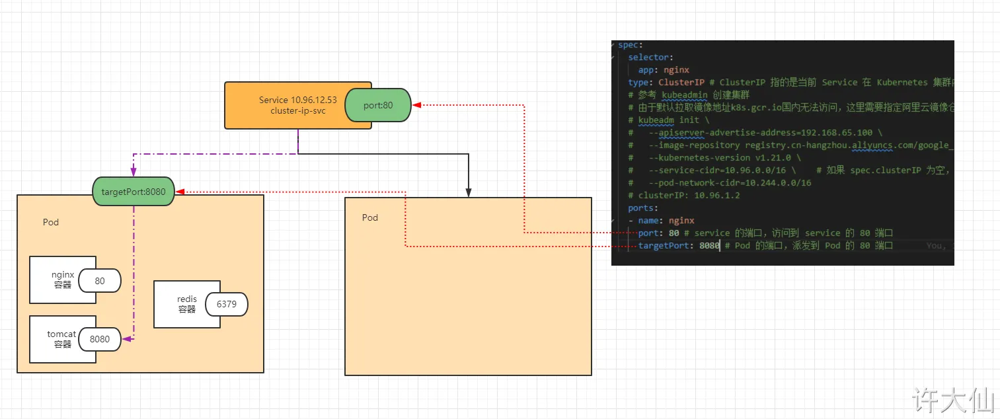

==A Kubernetes service is a resource you create to make a single, constant point of entry to a group of pods providing the same service.== Each service has an IP address and port that never change while the service exists. Clients can open connections to that IP and Port and those connections are then routed to ones on the pod backing the service. This way, clients of service don't need to know the location of individual pods providing the service, allowing those pods to be moved around the cluster at any time.

• A Service exposes one or many Pods via a stable, immortal, and internal IP address
• It’s also accessible via cluster-internal DNS, {service}.{namespace}.svc.cluster.local
Here: nginx.default.svc.cluster.local
• The Service selects Pods based on the label key value selectors (here app=nginx).
• A Service may expose multiple ports.
• The ClusterIP can be declaratively specified, or dynamically allocated.
# 1 Service介绍

在kubernetes中，pod是应用程序的载体，我们可以通过pod的ip来访问应用程序，但是pod的ip地址不是固定的，这也就意味着不方便直接采用pod的ip对服务进行访问。

为了解决这个问题，kubernetes提供了Service资源，Service会对提供同一个服务的多个pod进行聚合，并且提供一个统一的入口地址。通过访问Service的入口地址就能访问到后面的pod服务。

通过上节课的学习，已经能够利用Deployment来创建一组Pod来提供具有高可用性的服务。

虽然每个Pod都会分配一个单独的Pod IP，然而却存在如下两问题：
    Pod IP 会随着Pod的重建产生变化
    Pod IP 仅仅是集群内可见的虚拟IP，外部无法访问

这样对于访问这个服务带来了难度。因此，kubernetes设计了Service来解决这个问题。
Service可以看作是一组同类Pod对外的访问接口。借助Service，应用可以方便地实现服务发现和负载均衡。


Service将运行在一组 [Pods](https://kubernetes.io/zh-cn/docs/concepts/workloads/pods/) 上的应用程序公开为网络服务的抽象方法。
Service为一组 Pod 提供相同的 DNS 名，并且在它们之间进行负载均衡。
Kubernetes 为 Pod 提供分配了IP 地址，但IP地址可能会发生变化。
创建完service 后, 集群内的容器可以通过service名称访问服务，而不需要担心Pod的IP发生变化。


Kubernetes Service 定义了这样一种抽象：
service 的后端, 运行了一组可以替换的 Pod
逻辑上的一组可以互相替换的 Pod，通常称为微服务。 
Service 对应的 Pod 集合通常是通过选择算符来确定的。 
举个例子，在一个Service中运行了3个nginx的副本。这些副本是可互换的，我们不需要关心它们调用了哪个nginx，也不需要关注 Pod的运行状态，只需要调用这个服务就可以了。


---

Service在很多情况下只是一个概念，真正起作用的其实是kube-proxy服务进程，每个Node节点上都运行着一个kube-proxy服务进程。当创建Service的时候会通过api-server向etcd写入创建的service的信息，而kube-proxy会基于监听的机制发现这种Service的变动，然后**它会将最新的Service信息转换成对应的访问规则**。


```
# 10.97.97.97:80 是service提供的访问入口
# 当访问这个入口的时候，可以发现后面有三个pod的服务在等待调用，
# kube-proxy会基于rr（轮询）的策略，将请求分发到其中一个pod上去
# 这个规则会同时在集群内的所有节点上都生成，所以在任何一个节点，访问都可以。

[root@node1 ~]# ipvsadm -Ln
IP Virtual Server version 1.2.1 (size=4096)
Prot LocalAddress:Port Scheduler Flags
  -> RemoteAddress:Port           Forward Weight ActiveConn InActConn
TCP  10.97.97.97:80 rr
  -> 10.244.1.39:80               Masq    1      0          0
  -> 10.244.1.40:80               Masq    1      0          0
  -> 10.244.2.33:80               Masq    1      0          0
```


## 1.1 小例子

```
apiVersion: v1
kind: Service
metadata:
  name: my-nginx
  labels:
    run: my-nginx
spec:
  ports:
  - port: 80
    protocol: TCP
  selector:
    run: my-nginx
```


上述规约将创建一个 Service，该 Service 会将所有具有标签 run: my-nginx 的 Pod 的 TCP 80 端口暴露到一个抽象的 Service 端口上（targetPort：容器接收流量的端口；port： 可任意取值的抽象的 Service 端口，其他 Pod 通过该端口访问 Service）


 创建一个 Nginx Pod
```
 apiVersion: apps/v1
kind: Deployment
metadata:
  name: my-nginx
spec:
  selector:
    matchLabels:
      run: my-nginx
  replicas: 2
  template:
    metadata:
      labels:
        run: my-nginx
    spec:
      containers:
      - name: my-nginx
        image: nginx
        ports:
        - containerPort: 80
```


---

第二个例子

在一个Service中运行了3个nginx的副本


一个Deployment 中 对应一个 ReplicaSet, 一个 ReplicaSet 中包有三个 Pod 

用 kubectl get all 可以看到 
- 有个 depolyment  : depolyment.apps/nginx-deploy 
- 对应个副本集 replicaset.apps/nginx-depoly-xxx
- 这个副本集有三个 pod, pod/xxxxx
- 还有一个service,名字为 service/kubernetes 
- 还有一个 kubernetes 自带的 对象: 


# 2 访问Service


某个 service  可能涉及到的 中有 三个  Port 
- nodePort
    - 集群中 每个 节点/node 的公开服务的端口 
    - 集群外的主机 去访问这个 Service:  可以通过 `节点的ip: nodePort`
- Port 是 Service 公开的端口 
    - 集群内的其他Cluster 去访问这个 Service: 通过 `ClusterIP: port`,  ClusterIP 是 集群内的ip 
    - 集群内的Pod 去访问这个 Service: 通过 `service 的名称: port` 
- targetPort 
    - 是 Pod 中运行程序 用来监听的端口 
    - 是这个  Pod 的 Port


```sh

# 集群外部外部主机去访问 集群内某个Pod：
curl 192.168.56.109:32296。
1.NodePort端口是随机的，范围为:30000-32767。
2.集群中每一个主机节点的NodePort端口都可以访问。
3.如果需要指定端口，不想随机产生，需要使用配置文件来声明。


#集群内主机 去访问 集群内某个 pod
curl 10.43.65.187:80

#集群内容器 去访问 集群内某个 Pod
kubectl run nginx-test --image=nginx:1.22 -it --rm -- sh
curl nginx-service:80
```

# 3 kube-proxy目前支持三种工作模式

## 3.1 userspace 模式

userspace模式下，kube-proxy会为每一个Service创建一个监听端口，发向Cluster IP的请求被Iptables规则重定向到kube-proxy监听的端口上，kube-proxy根据LB算法选择一个提供服务的Pod并和其建立链接，以将请求转发到Pod上。 该模式下，kube-proxy充当了一个四层负责均衡器的角色。由于kube-proxy运行在userspace中，在进行转发处理时会增加内核和用户空间之间的数据拷贝，虽然比较稳定，但是效率比较低。


## 3.2 iptables 模式

iptables模式下，kube-proxy为service后端的每个Pod创建对应的iptables规则，直接将发向Cluster IP的请求重定向到一个Pod IP。 该模式下kube-proxy不承担四层负责均衡器的角色，只负责创建iptables规则。该模式的优点是较userspace模式效率更高，但不能提供灵活的LB策略，当后端Pod不可用时也无法进行重试。


## 3.3 ipvs 模式

ipvs模式和iptables类似，kube-proxy监控Pod的变化并创建相应的ipvs规则。ipvs相对iptables转发效率更高。除此以外，ipvs支持更多的LB算法。


```
# 此模式必须安装ipvs内核模块，否则会降级为iptables
# 开启ipvs
[root@k8s-master01 ~]# kubectl edit cm kube-proxy -n kube-system
# 修改mode: "ipvs"
[root@k8s-master01 ~]# kubectl delete pod -l k8s-app=kube-proxy -n kube-system
[root@node1 ~]# ipvsadm -Ln
IP Virtual Server version 1.2.1 (size=4096)
Prot LocalAddress:Port Scheduler Flags
  -> RemoteAddress:Port           Forward Weight ActiveConn InActConn
TCP  10.97.97.97:80 rr
  -> 10.244.1.39:80               Masq    1      0          0
  -> 10.244.1.40:80               Masq    1      0          0
  -> 10.244.2.33:80               Masq    1      0          0
```


# 4 Service类型


Service的资源清单文件：

```
kind: Service  # 资源类型
apiVersion: v1  # 资源版本
metadata: # 元数据
  name: service # 资源名称
  namespace: dev # 命名空间
spec: # 描述
  selector: # ！！！！！！！！！！！  标签选择器，用于确定当前service代理哪些pod
    app: nginx
  type: # Service类型，指定service的访问方式
  clusterIP:  # 虚拟服务的ip地址
  sessionAffinity: # session亲和性，支持ClientIP、None两个选项
  ports: # 端口信息
    - protocol: TCP 
      port: 3017  # service端口
      targetPort: 5003 # pod端口
      nodePort: 31122 # 主机端口 主机=node
```

- ClusterIP：
    - 默认值，它是Kubernetes系统自动分配的虚拟IP，只能在集群内部访问
- NodePort：
    - 将Service通过指定的Node上的端口暴露给外部，通过此方法，就可以在集群外部访问服务
    - 通过每个节点上的 IP 和静态端口（NodePort）暴露服务。 NodePort 服务会路由到自动创建的 ClusterIP 服务。 通过请求 `<节点 IP>:<节点端口>`，我们可以从集群的外部访问一个 NodePort 服务。
- LoadBalancer：
    - 使用外接负载均衡器完成到服务的负载分发，注意此模式需要外部云环境支持
    - 使用云提供商的负载均衡器向外部暴露服务。 外部负载均衡器可以将流量路由到自动创建的 NodePort 服务和 ClusterIP 服务上。
- ExternalName：
    - 把集群外部的服务引入集群内部，直接使用
    - 通过返回 CNAME 和对应值，可以将服务映射到 externalName 字段的内容（如：foo.bar.example.com）。 无需创建任何类型代理


ClusterlP(默认)
- Used for communication between applications inside k8s cluster (Example: Frontend application accessing backend application)
- 在集群的内部 IP 上公开 Service 。这种类型使得 Service 只能从集群内访问。不能从 Cluster外部进行访问

NodePort
- Used for accessing applications outside of of k8s cluster using Worker Node Ports (Example: Accessing Frontend application on browser) 
- 使用 NAT 在集群中每个选定 Node 的相同端口上公开 Service 。使用`<NodeIP>:<NodePort>` 从集群外部访问 Service。是 ClusterIP 的超集。
- 通过每个节点上的IP和静态端口NodePort暴露服务。 Nodeport服务会路由到自动创建的ClusterIP服务

LoadBalancer
- Primarily for Cloud Providers to integrate with their Load Balancer services (Example: AWS Elastic Load Balancer)
- 在当前云中创建一个外部负载均衡器(如果支持的话)，并为 Service 分配一个固定的外部 IP 。是 NodePort 的超集。
- 使用云提供商的负载均衡器向外部暴露服务。 外部负载均衡器可以将流量路由到自动创建的NodePort服务和ClusterIP服务商。 

Ingress 
- Ingress is an advanced load balancer which provides Context path based routing, SSL, SSL Redirect and many more (Example: AWS ALB)

externalName
- To access externally hosted apps in k8s cluster (Example: Access AWS RDS Database endpoint by application present inside k8s cluster)
- 通过返回带有该名称的 CNAME 记录，使用任意名称(由 spec 中的`externalName`指定)公开 Service 。不使用代理。这种类型需要 `kube-dns` 的 v1.7 或更高版本。
- 通过返回CName和对应值， 可以将服务映射到externalName字段的内容， 例如， foo.bar.example.com, 无需创建任何类型代理 

---


- OSI 网络模型和 TCP/IP 协议：


注意：
- Service  会基于 Pod 的探针机制（readinessProbe，就绪探针）完成 Pod 的自动剔除（没有就绪的 Pod）和上线工作。
- Service 即使是无头服务（Headless Service），其他的 Kubernetes 应用资源（如：Pod 等）不能通过 IP 访问，但是可以将 Service 名字当成域名来访问；非无头服务，更是如此了。
- Service 默认使用的协议是 TCP 协议，对应的是 OSI 网络模型中的第四层传输层，所以也有人称 Service 为四层网络负载均衡。
- selector 只有在 Service 的 spec.type 是 ClusterIP、NodePort、LoadBalancer 才有效。


## 4.1 ClusterIP 

Cluster IP doesn't actually exist on any host, or anywhere.
ClusterIP 是不存在的 虚拟的 ip地址 

Each node runs a 'kube-proxy' container.
每个节点中都用一个 kube-proxy 这个 container

kube-proxy creates iptables rules on each host to redirect ClusterlP to pod(s) IPs:
kube-proxy 会创造 iptables rules 在每个 host 中 （就是 node 中若干个hosts）, iptables rules 中储存的都是 ClusterIP . 然后这些hosts 就是知道了 其他pod 的 ClusterIP, 这样的话就可以导过去了


----

Iptables的弱点 


## 4.2 NodePort

NodePort Service
• To access our application outside of k8s cluster, we can use NodePort service.
• Exposes the Service on each Worker Node's IP at a static port (nothing but NodePort). A ClusterIP Service, to which the NodePort Service routes, is automatically created.
• Port Range: 30000-32767


访问流程 
- Kube proxy forwards traffic to the nodePort service
- nodePort service clusterlP service (automatically created when creating the nodePort service)
- ClusterIP load balances as usual


## 4.3 LoadBalancer 

$ kubectl run nginx --image=nginx --replicas 3 --port=80
$ kubectl expose deployment nginx --type=LoadBaIancer
$ kubectl get services -o=wide


可以看出 Service Type 是 LoadBalancer , 通过 annotations指明这个LoadBalancer的类型， 为 nlb


## 4.4 Ingress


# 5 访问Service


某个 service  可能涉及到的 中有 三个  Port 
- nodePort
    - 集群中 每个 节点/node 的公开服务的端口 
    - 集群外的主机 去访问这个 Service:  可以通过 `节点的ip: nodePort`
- Port 是 Service 公开的端口 
    - 集群内的其他Cluster 去访问这个 Service: 通过 `ClusterIP: port`,  ClusterIP 是 集群内的ip 
    - 集群内的Pod 去访问这个 Service: 通过 `service 的名称: port` 
- targetPort 
    - 是 Pod 中运行程序 用来监听的端口 
    - 是这个  Pod 的 Port

We can expose an application running on a set of PODs using different types of Services available in k8s.
• ClusterlP
• NodePort
• LoadBalancer

NodePort Service
• To access our application outside of k8s cluster, we can use NodePort service.
• Exposes the Service on each Worker Node's IP at a static port (nothing but NodePort).
A ClusterIP Service, to which the NodePort Service routes, is automatically created.
• Port Range: 30000-32767


```sh

# 集群外部外部主机去访问 集群内某个Pod：
curl 192.168.56.109:32296。
1.NodePort端口是随机的，范围为:30000-32767。
2.集群中每一个主机节点的NodePort端口都可以访问。
3.如果需要指定端口，不想随机产生，需要使用配置文件来声明。


#集群内主机 去访问 集群内某个 pod
curl 10.43.65.187:80

#集群内容器 去访问 集群内某个 Pod
kubectl run nginx-test --image=nginx:1.22 -it --rm -- sh
curl nginx-service:80
```

## 5.1 访问流程 

- Kube proxy forwards traffic to the nodePort service
- nodePort service clusterlP service (automatically created when creating the nodePort service)
- ClusterIP load balances as usual


# 6 kubectl expose 的使用 

`[root@master ~]# kubectl expose deployment/nginx-deployment --name=svc-nginx1 --type=ClusterIP --port=80 --target-port=80 -n dev`


 使用 kubectl expose 命令 , 将之前已经生成好的 某个 depolyment (with name deployment/nginx-deployment) 公开为服务 

 port是service访问端口,target-port是Pod端口 二者通常是一样的
 - --port 80 , 指定service 的端口, 公开的服务端口 为 8080 
 - --target-port 指定的 Pod 的端口 
 --name=xxx, 指定生成 service 的名称 为nginx-service 
 -n dev,  namespace 为 dev 


## 6.1 --type: Service 的 Type的 取值

- ClusterIP：
    - 默认情况下, 如果没有指定 serciveType, 自动分配到的 就是 这个 service type 
    - 这个Type 下只能在集群内部的主机, 访问到这个service 
    - 将服务公开在集群内部。kubernetes会给服务分配一个集群内部的 IP，集群内的所有主机都可以通过这个Cluster-IP访问服务。集群内部的Pod可以通过service名称访问服务。
- [NodePort](https://kubernetes.io/zh-cn/docs/concepts/services-networking/service/#type-nodeport)：
    - 想要使得集群外部的主机 也能访问到 这个 service , 需要 , 使用 NodePort  这个 ServiceType 
    - 通过每个节点的主机IP 和静态端口（NodePort）暴露服务。 集群的外部主机可以使用节点IP和NodePort访问服务。
- [ExternalName](https://kubernetes.io/zh-cn/docs/concepts/services-networking/service/#externalname)：将集群外部的网络引入集群内部。
- [LoadBalancer](https://kubernetes.io/zh-cn/docs/concepts/services-networking/service/#loadbalancer)：使用云提供商的负载均衡器向外部暴露服务。

# 7 Service使用


在使用service之前，首先利用Deployment创建出3个pod，注意要为pod设置`app=nginx-pod`的标签

创建deployment.yaml，内容如下：

```
apiVersion: apps/v1
kind: Deployment      
metadata:
  name: pc-deployment
  namespace: dev
spec: 
  replicas: 3
  selector:  # 注意看这里
    matchLabels:
      app: nginx-pod
  template:
    metadata:
      labels:
        app: nginx-pod
    spec:
      containers:
      - name: nginx
        image: nginx:1.17.1
        ports:
        - containerPort: 80
```

```
[root@k8s-master01 ~]# kubectl create -f deployment.yaml
deployment.apps/pc-deployment created

# 查看pod详情
[root@k8s-master01 ~]# kubectl get pods -n dev -o wide --show-labels
NAME                             READY   STATUS     IP            NODE     LABELS
pc-deployment-66cb59b984-8p84h   1/1     Running    10.244.1.39   node1    app=nginx-pod
pc-deployment-66cb59b984-vx8vx   1/1     Running    10.244.2.33   node2    app=nginx-pod
pc-deployment-66cb59b984-wnncx   1/1     Running    10.244.1.40   node1    app=nginx-pod

# 为了方便后面的测试，修改下三台nginx的index.html页面（三台修改的IP地址不一致）
# kubectl exec -it pc-deployment-66cb59b984-8p84h -n dev /bin/sh
# echo "10.244.1.39" > /usr/share/nginx/html/index.html

#修改完毕之后，访问测试
[root@k8s-master01 ~]# curl 10.244.1.39
10.244.1.39
[root@k8s-master01 ~]# curl 10.244.2.33
10.244.2.33
[root@k8s-master01 ~]# curl 10.244.1.40
10.244.1.40
```


# 8 Service创建


Service的资源清单文件：

```
kind: Service  # 资源类型
apiVersion: v1  # 资源版本
metadata: # 元数据
  name: service # 资源名称
  namespace: dev # 命名空间
spec: # 描述
  selector: # ！！！！！！！！！！！  标签选择器，用于确定当前service代理哪些pod
    app: nginx
  type: # Service类型，指定service的访问方式
  clusterIP:  # 虚拟服务的ip地址
  sessionAffinity: # session亲和性，支持ClientIP、None两个选项
  ports: # 端口信息
    - protocol: TCP 
      port: 3017  # service端口
      targetPort: 5003 # pod端口
      nodePort: 31122 # 主机端口 主机=node
```

## 8.1 创建集群内部可访问的Service: --type=ClusterIP


创建service-clusterip.yaml文件

```
apiVersion: v1
kind: Service
metadata:
  name: service-clusterip
  namespace: dev
spec:
  selector:      # 注意看这里 用来关联对应的Pod
    app: nginx-pod
  clusterIP: 10.97.97.97 # service的ip地址，如果不写，默认会生成一个
  type: ClusterIP
  ports:
  - name: nginx
  - port: 80  # Service端口       
    targetPort: 80 # pod端口
```


```
# 创建service
[root@k8s-master01 ~]# kubectl create -f service-clusterip.yaml
service/service-clusterip created

# 查看service
[root@k8s-master01 ~]# kubectl get svc -n dev -o wide
NAME                TYPE        CLUSTER-IP    EXTERNAL-IP   PORT(S)   AGE   SELECTOR
service-clusterip   ClusterIP   10.97.97.97   <none>        80/TCP    13s   app=nginx-pod

# 查看service的详细信息
# 在这里有一个Endpoints列表，里面就是当前service可以负载到的服务入口
[root@k8s-master01 ~]# kubectl describe svc service-clusterip -n dev
Name:              service-clusterip
Namespace:         dev
Labels:            <none>
Annotations:       <none>
Selector:          app=nginx-pod
Type:              ClusterIP
IP:                10.97.97.97
Port:              <unset>  80/TCP
TargetPort:        80/TCP
Endpoints:         10.244.1.39:80,10.244.1.40:80,10.244.2.33:80
Session Affinity:  None
Events:            <none>

# 查看ipvs的映射规则
[root@k8s-master01 ~]# ipvsadm -Ln
TCP  10.97.97.97:80 rr
  -> 10.244.1.39:80               Masq    1      0          0
  -> 10.244.1.40:80               Masq    1      0          0
  -> 10.244.2.33:80               Masq    1      0          0


# 访问10.97.97.97:80观察效果
[root@k8s-master01 ~]# curl 10.97.97.97:80
10.244.2.33
```





● 注意： 
  ○ ① curl 10.96.12.53:80 是可以访问到 Pod 中的容器。
  ○ ②  curl 10.96.12.53:6379 不可以访问到 Pod 中的容器。
  ○ ③ 将 Kubernetes 中能分配 IP 地址的都看做是一个小型的、轻巧的、虚拟的 Linux 主机，10.96.12.53:6379 是因为我们没有在 service 中开启端口。


### 8.1.1 查看 Service 的详细信息


kubectl describe svc xxx

kubectl describe svc cluster-ip-svc

### 8.1.2 Endpoint

- 为什么我们需要Service 关联endpoint 因为 我们需要 endpoint 这个 resource中定义的 ipadrrese
    - Service reosurce只定义了那些port 被暴露了出来， 却无法定义那些 ip addresse 中的 这个port 要被暴露出来 . 这时候就需要 endpoint 去 define a list of IP addresses and ports.

Endpoint是kubernetes中的一个资源对象，存储在etcd中，用来记录一个service对应的所有pod的访问地址，它是根据service配置文件中selector描述产生的。
一个Service由一组Pod组成，这些Pod通过Endpoints暴露出来，**Endpoints是实现实际服务的端点集合**。换句话说，service和pod之间的联系是通过endpoints实现的。


Service 和 endpoints 两者之间怎么匹配上 ： through name 
https://stackoverflow.com/questions/59412883/how-to-explicitely-define-an-endpoint-of-an-kubernetes-service
`(*) Notice that there should be a match between the service name and the name of the Endpoints object.`


示例：查询端点信息
```
# endpoint 的别名是 ep
kubectl get endpoint

```

示例：删除一个 Pod ，Deployment 会将 Pod 重建，Endpoints 的内容随着 Pod 发生变化。

```
kubectl delete pod xxx

```


示例: 创建自定义的 EndPoint
vi k8s-ep.yaml

```
apiVersion: v1
kind: Service
metadata:
  name: cluster-svc-no-selector
  namespace: default
spec:
  ports:
    - name: http
      port: 80
      targetPort: 80 # 此时的 targetPort 需要和 Endpoints 的 subsets.addresses.ports.port 相同  
---
apiVersion: v1
kind: Endpoints
metadata:
  name: cluster-svc-no-selector # 此处的 name 需要和 Service 的 metadata 的 name 相同
  namespace: default
subsets:
- addresses:
  - ip: 220.181.38.251 # 百度
  - ip: 221.122.82.30 # 搜狗 
  - ip: 61.129.7.47 # QQ
  ports:
  - name: http # 此处的 name 需要和 Service 的 spec.ports.name 相同
    port: 80
    protocol: TCP
```

- The `addresses` field lists the IP addresses of the pods that match the service selector.
- The `ports` field lists the ports on which the pods are listening.


kubectl apply -f k8s-ep.yaml

鉴于有些人认为像 MySQL 之类的不应该使用 Docker 、k8s 部署，而是应该直接部署在物理机上，那么就可以使用此种方式，将 MySQL 的地址配置在 EndPoint 中，对外暴露一个 Service ，这样 Kubernetes 中的资源（如：Pod）就可以直接使用暴露的 Service 名称来访问，这样可以实时剔除 EndPoint 的信息。换言之，反向代理集群外的服务。


### 8.1.3 域名解析

进入其中 Pod ，使用 nslookup 命令查询 DNS ：

```
kubectl exec -it xxx -- /bin/bash

# 安装 nslookup
apt-get update
apt-get -y install bind-utils


# 其中 cluster-ip-svc 是 Service 的服务名 
nslookup -type=a cluster-ip-svc

```


网络层次


### 8.1.4 **负载分发策略**

对Service的访问被分发到了后端的Pod上去，目前kubernetes提供了两种负载分发策略：
- 如果不定义，默认使用kube-proxy的策略，比如随机、轮询
- 基于客户端地址的会话保持模式，即来自同一个客户端发起的所有请求都会转发到固定的一个Pod上
    此模式可以使在spec中添加`sessionAffinity:ClientIP`选项

```
# 查看ipvs的映射规则【rr 轮询】
[root@k8s-master01 ~]# ipvsadm -Ln
TCP  10.97.97.97:80 rr
  -> 10.244.1.39:80               Masq    1      0          0
  -> 10.244.1.40:80               Masq    1      0          0
  -> 10.244.2.33:80               Masq    1      0          0
  
# 循环访问测试
[root@k8s-master01 ~]# while true;do curl 10.97.97.97:80; sleep 5; done;
10.244.1.40
10.244.1.39
10.244.2.33
10.244.1.40
10.244.1.39
10.244.2.33

# 修改分发策略----sessionAffinity:ClientIP
# 查看ipvs规则【persistent 代表持久】
[root@k8s-master01 ~]# ipvsadm -Ln
TCP  10.97.97.97:80 rr persistent 10800
  -> 10.244.1.39:80               Masq    1      0          0
  -> 10.244.1.40:80               Masq    1      0          0
  -> 10.244.2.33:80               Masq    1      0          0
  
# 循环访问测试
[root@k8s-master01 ~]# while true;do curl 10.97.97.97; sleep 5; done;
10.244.2.33
10.244.2.33
10.244.2.33
  
# 删除service
[root@k8s-master01 ~]# kubectl delete -f service-clusterip.yaml
service "service-clusterip" deleted
```


### 8.1.5 会话保持技术 sessionAffinity

基于客户端 IP 地址的会话保持模式，即来自同一个客户端发起的所有请求都尽最大可能转发到固定的一个 Pod 上，只需要在 spec 中添加 sessionAffinity: ClientIP 选项。 

vi k8s-sessionAffinity.yaml

```
apiVersion: v1
kind: Service
metadata:
  name: k8s-session-affinity-svc
  namespace: default
spec:
  selector:
    app: nginx
  type: ClusterIP 
  sessionAffinity: "ClientIP"
  sessionAffinityConfig:
    clientIP: 
       timeoutSeconds: 11800 # 30 分钟
  ports:
  - name: nginx
    protocol: TCP
    port: 80 
    targetPort: 80
    
```

kubectl apply -f k8s-sessionAffinity.yaml


## 8.2 使用命令去创建service 


用 --type=ClusterIP
或者根本不加 --type, 因为默认就是 ClusterIP 

### 8.2.1 例子1

kubectl get svc 是固定的, svc 代表要去 get 某个 service ,  这个 service 的名字 就是 svc-nginx1

```sh
# 暴露Service
[root@master ~]# kubectl expose deploy nginx --name=svc-nginx1 --type=ClusterIP --port=80 --target-port=80 -n dev
service/svc-nginx1 exposed

# 查看service
[root@master ~]# kubectl get svc svc-nginx1 -n dev -o wide
NAME         TYPE        CLUSTER-IP       EXTERNAL-IP   PORT(S)   AGE     SELECTOR
svc-nginx1   ClusterIP   10.109.179.231   <none>        80/TCP    3m51s   run=nginx
# 这里产生了一个CLUSTER-IP，这就是service的IP，在Service的生命周期中，这个地址是不会变动的
# 可以通过这个IP访问当前service对应的POD


[root@master ~]# curl 10.109.179.231:80
<!DOCTYPE html>
<html>
<head>
<title>Welcome to nginx!</title>
</head>
<body>
<h1>Welcome to nginx!</h1>
.......
</body>
</html>

```


### 8.2.2 例子2


```sh
# port是service访问端口,target-port是Pod端口
# 二者通常是一样的
# 使用 kubectl expose 命令 , 将之前的部署 (depolyment) 公开为服务 
# --port 80 , 指定service 的端口, 公开的服务端口 为 8080 
#  --target-port 指定的  容器端口 
# --name=xxx, 指定生成 service 的名称 为nginx-service  
kubectl expose deployment/nginx-deployment \
--name=nginx-service --type=ClusterIP --port=80 --target-port=80
```


```sh
# port是service访问端口.target-port是Pod端口, 容器端口 二者通常是一样的
# 使用 kubectl expose 命令 , 将之前的部署 (depolyment) 公开为服务 
# --port 8080 , 指定service 的端口, 公开的服务端口 为 8080 
#  --target-port 指定的  容器端口 
# --name=xxx, 指定生成 service 的名称 为nginx-service  
kubectl expose deployment/nginx-deployment \
--name=nginx-service - --port=80 --target-port=80
```


ClusterIP 代表为集群内部的IP,  集群内部, 都可以通过 10.43.228.137 这个IP, 来访问 nginx-service 这个 service 


---

进入 某个 nginx 的pod, 将首页显示的信息, 改为 显示 hello


然后再来访问这个服务, 多访问几次 
可以看到 一会访问到的 另一个 pod 的 nignx, 一会访问到了 一个 pod 的 hallo , 这说明 实现了 service 在后端 Pod 中 实现了 负载均衡 


## 8.3 创建 HeadLiness 类型的 Service

在某些场景中，开发人员可能不想使用Service提供的负载均衡功能，而希望自己来控制负载均衡策略，针对这种情况，kubernetes提供了HeadLiness Service，这类Service不会分配Cluster IP，如果想要访问service，只能通过service的域名进行查询。

所谓的 HeadLiness 类型的 Service ，即所谓的无头服务，即不希望 Kubernetes 集群分配 IP ，针对这种情况，Kubernetes 提供了 HeadLinesss Service，这类 Service 不会分配 Cluster IP，如果想要访问 Service ，只能通过 Service 的域名进行查询，一般配合 StatefulSet 使用。

```
...
spec:
  type: ClusterIP # ClusterIP 指的是当前 Service 在集群内可以被所有人发现，默认给这个 Service 分配一个集群内的网络。
  clusterIp: None # k8s 不要给这个 service 分配 IP，headless service 无头服务配合 StatefulSet
...
```

创建service-headliness.yaml
```
apiVersion: v1
kind: Service
metadata:
  name: service-headliness
  namespace: dev
spec:
  selector:
    app: nginx-pod
  clusterIP: None # 将clusterIP设置为None，即可创建headliness Service
  type: ClusterIP
  ports:
  - port: 80    
    targetPort: 80
```


```
# 创建service
[root@k8s-master01 ~]# kubectl create -f service-headliness.yaml
service/service-headliness created

# 获取service， 发现CLUSTER-IP未分配
[root@k8s-master01 ~]# kubectl get svc service-headliness -n dev -o wide
NAME                 TYPE        CLUSTER-IP   EXTERNAL-IP   PORT(S)   AGE   SELECTOR
service-headliness   ClusterIP   None         <none>        80/TCP    11s   app=nginx-pod

# 查看service详情
[root@k8s-master01 ~]# kubectl describe svc service-headliness  -n dev
Name:              service-headliness
Namespace:         dev
Labels:            <none>
Annotations:       <none>
Selector:          app=nginx-pod
Type:              ClusterIP
IP:                None
Port:              <unset>  80/TCP
TargetPort:        80/TCP
Endpoints:         10.244.1.39:80,10.244.1.40:80,10.244.2.33:80
Session Affinity:  None
Events:            <none>

# 查看域名的解析情况
[root@k8s-master01 ~]# kubectl exec -it pc-deployment-66cb59b984-8p84h -n dev /bin/sh
/ # cat /etc/resolv.conf
nameserver 10.96.0.10
search dev.svc.cluster.local svc.cluster.local cluster.local

[root@k8s-master01 ~]# dig @10.96.0.10 service-headliness.dev.svc.cluster.local
service-headliness.dev.svc.cluster.local. 30 IN A 10.244.1.40
service-headliness.dev.svc.cluster.local. 30 IN A 10.244.1.39
service-headliness.dev.svc.cluster.local. 30 IN A 10.244.2.33
```


## 8.4 创建集群外部也可访问的Service: --type=NodePort 

在之前的样例中，创建的Service的ip地址只有集群内部才可以访问，如果希望将Service暴露给集群外部使用，那么就要使用到另外一种类型的Service，称为NodePort类型。NodePort的工作原理其实就是**将service的端口映射到Node的一个端口上**，然后就可以通过`NodeIp:NodePort`来访问service了。


语法

```
...
spec:
  ...
  type: NodePort # 每台机器都会为这个 service 随机分配一个指定的端口
  ports:
  - name: nginx
    protocol: TCP
    port: 80 # service 的端口，访问到 service 的 80 端口
    targetPort: 80 # Pod 的端口，派发到 Pod 的 80 端口
    nodePort: 31111 # 不指定，默认会在 30000 ~ 32767 范围内随机分配，集群中的所有机器都会打开这个端口，访问 K8s 集群中的任意一条机器都可以访问 Service 代理的 Pod 。
```


### 8.4.1 例子


例子1

创建service-nodeport.yaml

```
apiVersion: v1
kind: Service
metadata:
  name: service-nodeport
  namespace: dev
spec:
  selector:
    app: nginx-pod
  type: NodePort # service类型
  ports:
  - port: 80
    nodePort: 30002 # 指定绑定的node的端口(默认的取值范围是：30000-32767), 如果不指定，会默认分配
    targetPort: 80
```


```
# 创建service
[root@k8s-master01 ~]# kubectl create -f service-nodeport.yaml
service/service-nodeport created

# 查看service
[root@k8s-master01 ~]# kubectl get svc -n dev -o wide
NAME               TYPE       CLUSTER-IP      EXTERNAL-IP   PORT(S)       SELECTOR
service-nodeport   NodePort   10.105.64.191   <none>        80:30002/TCP  app=nginx-pod

# 接下来可以通过电脑主机的浏览器去访问集群中任意一个nodeip的30002端口，即可访问到pod
```


---

例子2


```sh
# 上面创建的Service的type类型为ClusterIP，这个ip地址只用集群内部可访问
# 如果需要创建外部也可以访问的Service，需要修改type为NodePort
[root@master ~]# kubectl expose deploy nginx --name=svc-nginx2 --type=NodePort --port=80 --target-port=80 -n dev
service/svc-nginx2 exposed

# 此时查看，会发现出现了NodePort类型的Service，而且有一对Port（80:31928/TC）
[root@master ~]# kubectl get svc  svc-nginx2  -n dev -o wide
NAME          TYPE        CLUSTER-IP       EXTERNAL-IP   PORT(S)        AGE    SELECTOR
svc-nginx2    NodePort    10.100.94.0      <none>        80:31928/TCP   9s     run=nginx

# 接下来就可以通过集群外的主机访问 节点IP:31928访问服务了
# 例如在的电脑主机上通过浏览器访问下面的地址
http://192.168.90.100:31928/
```


```sh
# 随机产生主机端口
kubectl expose deployment/nginx-deployment \
--name=nginx-service2 --type=NodePort --port=8080 --target-port=80
```


除了 内部访问的端口, 8081. kubenetes 会随机产生一个 内部访问的端口 31208 . 集群外部的主机可以通过 node节点的 ip + 外部访问端口 , 来访问这个服务

下面是尝试从外部访问一下, 可以看到 访问成功 


## 8.5 创建 Service, service Type 是LoadBalancer

LoadBalancer和NodePort很相似，目的都是向外部暴露一个端口，区别在于LoadBalancer会在集群的外部再来做一个负载均衡设备，而这个设备需要外部环境支持的，外部服务发送到这个设备上的请求，会被设备负载之后转发到集群中。


LoadBalancer 和 NodePort 很相似，目的都是向外部暴露一个端口，区别在于 LoadBalancer 会在集群的外部再来做一个负载均衡设备，而这个设备需要外部环境的支持，外部服务发送到这个设备上的请求，会被设备负载之后转发到集群中。这个功能需要云平台厂商的支持；换言之，加钱吧。


```
apiVersion: v1
kind: Service
metadata:
  name: k8s-load-balancer-svc
  namespace: default
spec:
  selector:
    app: nginx   
  type: LoadBalancer # 负载均衡，开放给云平台实现的，阿里云、百度云等。
  ports:
  - name: nginx
    protocol: TCP
    port: 80 # service 的端口，访问到 service 的 80 端口
    targetPort: 80 # Pod 的端口，派发到 Pod 的 80 端口
    nodePort: 31111
```


## 8.6 创建 Serivce, Service Type是External Name


ExternalName类型的Service用于引入集群外部的服务，它通过`externalName`属性指定外部一个服务的地址，==然后在集群内部访问此service就可以访问到外部的服务了。==  但是需要注意目标服务的 `跨域` 问题。


```
apiVersion: v1
kind: Service
metadata:
  name: service-externalname
  namespace: dev
spec:
  type: ExternalName # service类型
  externalName: www.baidu.com  #改成ip地址也可以

---
apiVersion: v1
kind: Service
metadata:
  name: k8s-external-name-svc
  namespace: default
spec:
  type: ExternalName # ExternalName 类型的 Service 用于引入集群外部的服务，它通过 externalName 属性指定一个服务的地址，然后在集群内部访问此 Service 就可以访问到外部的服务了。
  externalName: www.baidu.com # 其他的Pod可以通过访问这个service而访问其他的域名服务，但是需要注意目标服务的跨域问题。

```


```
# 创建service
[root@k8s-master01 ~]# kubectl  create -f service-externalname.yaml
service/service-externalname created

# 域名解析
[root@k8s-master01 ~]# dig @10.96.0.10 service-externalname.dev.svc.cluster.local
service-externalname.dev.svc.cluster.local. 30 IN CNAME www.baidu.com.
www.baidu.com.          30      IN      CNAME   www.a.shifen.com.
www.a.shifen.com.       30      IN      A       39.156.66.18
www.a.shifen.com.       30      IN      A       39.156.66.14
```

# 9 删除  service 

```sh
[root@master ~]# kubectl delete svc svc-nginx-1 -n dev 
service "svc-nginx-1" deleted
```


kubectl delete -f k8s-svc.yaml

# 10 Pod 指定自己的主机名

Pod 中还可以设置 hostname 和 subdomain 字段，需要注意的是，一旦设置了 hostname ，那么该 Pod 的主机名就被设置为 hostname 的值，而 subdomain  需要和 svc 中的 name 相同。


```
apiVersion: v1
kind: Service
metadata:
  name: default-subdomain
  namespace: default
spec:
  selector:
    app: nginx
  type: ClusterIP
  clusterIP: None 
  ports:
  - name: foo
    protocol: TCP
    port: 1234
    targetPort: 1234

---
apiVersion: v1
kind: Pod
metadata:
  name: nginx1
  namespace: default
  labels:
    app: nginx
spec:
  hostname: nginx1
  subdomain: default-subdomain # 必须和 svc 的 name 相同，才可以使用 hostname.subdomain.名称空间.svc.cluster.local 访问，否则访问不到指定的 Pod 。
  containers:
  - name: nginx
    image: nginx:1.20.2
    resources:
      limits:
        cpu: 250m
        memory: 500Mi
      requests:
        cpu: 100m
        memory: 200Mi
    ports:
    - containerPort:  80
      name:  nginx
    volumeMounts:
    - name: localtime
      mountPath: /etc/localtime
  volumes:
    - name: localtime
      hostPath:
        path: /usr/share/zoneinfo/Asia/Shanghai
  restartPolicy: Always

---
apiVersion: v1
kind: Pod
metadata:
  name: nginx2
  namespace: default
  labels:
    app: nginx
spec:
  hostname: nginx2
  subdomain: default-subdomain # 必须和 svc 的 name 相同，才可以使用 hostname.subdomain.名称空间.svc.cluster.local 访问，否则访问不到指定的 Pod 。
  containers:
  - name: nginx
    image: nginx:1.20.2
    resources:
      limits:
        cpu: 250m
        memory: 500Mi
      requests:
        cpu: 100m
        memory: 200Mi
    ports:
    - containerPort:  80
      name:  nginx
    volumeMounts:
    - name: localtime
      mountPath: /etc/localtime
  volumes:
    - name: localtime
      hostPath:
        path: /usr/share/zoneinfo/Asia/Shanghai
  restartPolicy: Always
```

- 如果 Pod 和 Pod 之间的访问：`Pod 的 hostname.Pod 的 subdomain.名称空间.svc.cluster.local`；换言之，nginx1 访问 nginx2 只需要这样：`nginx2.default-subdomain.default.svc.cluster.local` 即可（默认的名称空间可以省略，也可以这样 `nginx2.default-subdomain`）。

- 那么 Pod 和 Service 的访问：`Pod 的 subdomain.名称空间.svc.cluster.local`。
