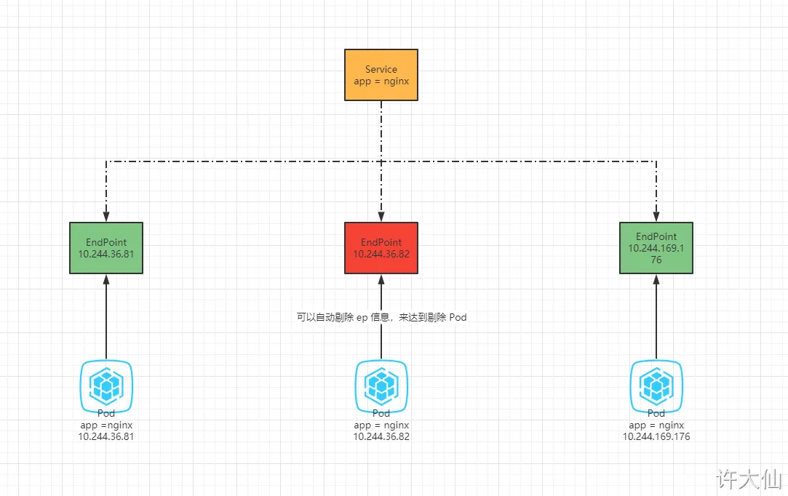

https://medium.com/@muppedaanvesh/a-hands-on-guide-to-kubernetes-endpoints-endpointslices-%EF%B8%8F-1375dfc9075c

# 1 Endpoint 


- 为什么我们需要Service 关联endpoint 因为 我们需要 endpoint 这个 resource中定义的 ipadrrese
    - Service reosurce只定义了那些port 被暴露了出来， 却无法定义那些 ip addresse 中的 这个port 要被暴露出来 . 这时候就需要 endpoint 去 define a list of IP addresses and ports.

Endpoint是kubernetes中的一个资源对象，存储在etcd中，用来记录一个service对应的所有pod的访问地址，它是根据service配置文件中selector描述产生的。
一个Service由一组Pod组成，这些Pod通过Endpoints暴露出来，**Endpoints是实现实际服务的端点集合**。换句话说，service和pod之间的联系是通过endpoints实现的。

The Role of Endpoints in Service Discovery: 
Service discovery in Kubernetes relies heavily on Endpoints. When a service receives a request, it uses the information in the associated Endpoint object to route the request to one of the available pods. This mechanism ensures that traffic is evenly distributed among healthy pods.


https://medium.com/@muppedaanvesh/a-hands-on-guide-to-kubernetes-endpoints-endpointslices-%EF%B8%8F-1375dfc9075c

Kubernetes Endpoints are API objects that define a list of IP addresses and ports. These addresses correspond to the pods that are dynamically assigned to a service. Essentially, an Endpoint in Kubernetes is a bridge connecting a service to the pods that fulfill the service’s requests.

When a service is created, Kubernetes automatically creates an associated Endpoint object. The Endpoint object maintains the IP addresses and port numbers of the pods that match the service’s selector criteria.

To understand how Kubernetes Endpoints work, let’s break down the process:
1. **Service Creation:** When you create a service in Kubernetes, you define a selector that matches a set of pods. This selector determines which pods the service will route traffic to.
2. **Endpoint Creation**: Kubernetes `automatically` creates an Endpoint object associated with the service. This object contains the IP addresses and ports of the pods that match the selector.
3. **Updating Endpoints**: As pods are added or removed, or their statuses change, Kubernetes `continuously updates` the Endpoint object to reflect the current set of matching pods. This ensures that the service always routes traffic to the appropriate pods.





## 1.1 例子

示例：查询端点信息
```
# endpoint 的别名是 ep
kubectl get endpoint

```

示例：删除一个 Pod ，Deployment 会将 Pod 重建，Endpoints 的内容随着 Pod 发生变化。

```
kubectl delete pod xxx

```


示例: 创建自定义的 EndPoint
vi k8s-ep.yaml

```
apiVersion: v1
kind: Service
metadata:
  name: cluster-svc-no-selector
  namespace: default
spec:
  ports:
    - name: http
      port: 80
      targetPort: 80 # 此时的 targetPort 需要和 Endpoints 的 subsets.addresses.ports.port 相同  
---
apiVersion: v1
kind: Endpoints
metadata:
  name: cluster-svc-no-selector # 此处的 name 需要和 Service 的 metadata 的 name 相同
  namespace: default
subsets:
- addresses:
  - ip: 220.181.38.251 # 百度
  - ip: 221.122.82.30 # 搜狗 
  - ip: 61.129.7.47 # QQ
  ports:
  - name: http # 此处的 name 需要和 Service 的 spec.ports.name 相同
    port: 80
    protocol: TCP
```

- The `addresses` field lists the IP addresses of the pods that match the service selector.
- The `ports` field lists the ports on which the pods are listening.


kubectl apply -f k8s-ep.yaml


## 1.2 service如何知道使用那些endpoint 
https://stackoverflow.com/questions/52857825/what-is-an-endpoint-in-kubernetes

### 1.2.1 如果有service label selector

如果在定义一个 service 的时候 有使用 label selector
那么 depoly 这个 service 的时候 ， 一个新的 endpoint ressource 就被自动生成了， 里面的内容 就是 被自动匹配的pod 的 ip addresse ，以及在 service resource 中定义的 port 的值 

To understand how Kubernetes Endpoints work, let’s break down the process:
1. **Service Creation:** When you create a service in Kubernetes, you define a selector that matches a set of pods. This selector determines which pods the service will route traffic to.
2. **Endpoint Creation**: Kubernetes `automatically` creates an Endpoint object associated with the service. This object contains the IP addresses and ports of the pods that match the selector.
3. **Updating Endpoints**: As pods are added or removed, or their statuses change, Kubernetes `continuously updates` the Endpoint object to reflect the current set of matching pods. This ensures that the service always routes traffic to the appropriate pods.

### 1.2.2 create a service without a label selector:


Regarding _external_ Enpoints:

You create a service without a label selector:

```yaml
apiVersion: v1
kind: Service
metadata:
  name: my-service #<------ Should match the name of Endpoints object
spec:
  ports:
    - protocol: TCP
      port: 8080
      targetPort: 9376
```

So the corresponding Endpoint object will not be created automatically and you manually add the `Endpoints` object and map the Service to the desired network address and port where the external resource is running:

```yaml
apiVersion: v1
kind: Endpoints
metadata:
  name: my-service #<------ Should match the name of Service
subsets:
  - addresses:
      - ip: 192.0.2.45
    ports:
      - port: 9376
```


## 1.3 DNS and Endpoints

Kubernetes services are accessible via DNS. For example, if you have a service named `my-service` in the `default` namespace, it can be resolved with the DNS name `my-service.default.svc.cluster.local`. When this DNS name is resolved, it points to the IP addresses listed in the corresponding Endpoint object.


# 2 Endpoint Silces 

就是一个 endpoint group 

Endpoint Slices are a more scalable and efficient way to manage endpoints in Kubernetes. Introduced in Kubernetes 1.16, Endpoint Slices provide a way to distribute the network endpoints across multiple resources, reducing the load on the Kubernetes API server and improving the performance of large clusters.

An Endpoint Slice represents a subset of the endpoints that make up a service. Instead of having a single large Endpoint object for a service, multiple smaller Endpoint Slice objects are created, each representing a portion of the endpoints.

By default, the control plane creates and manages EndpointSlices to have no more than 100 endpoints each. You can configure this with the `--max-endpoints-per-slice` [kube-controller-manager](https://kubernetes.io/docs/reference/command-line-tools-reference/kube-controller-manager/) flag, up to a maximum of **1000**.

EndpointSlices can act as the source of truth for [kube-proxy](https://kubernetes.io/docs/reference/command-line-tools-reference/kube-proxy/) when it comes to how to route internal traffic.

## 2.1 Address types

EndpointSlices support three address types:

- IPv4
- IPv6
- FQDN (Fully Qualified Domain Name)

Each `EndpointSlice` object represents a specific IP address type. If you have a Service that is available via IPv4 and IPv6, there will be at least two `EndpointSlice` objects (one for IPv4, and one for IPv6).

## 2.2 How Endpoint Slices Work

Endpoint Slices work similarly to Endpoints but with added benefits for scalability and performance:

1. **Service Creation:** When a service is created, Kubernetes creates Endpoint Slices instead of a single Endpoint object.
2. **Endpoint Slice Creation**: Each Endpoint Slice contains a subset of the total endpoints for the service. This distribution helps in managing large numbers of endpoints more efficiently.
3. **Updating Endpoint Slices**: Like Endpoints, Endpoint Slices are continuously updated as pods are added, removed, or their statuses change. Kubernetes ensures that the Endpoint Slices reflect the current set of matching pods.

## 2.3 Anatomy of an Endpoint Slice Object

Let’s take a look at a sample Endpoint Slice object:

```
apiVersion: discovery.k8s.io/v1  
kind: EndpointSlice  
metadata:  
  name: my-service-abc123  
addressType: IPv4  
endpoints:  
  - addresses:  
      - 10.0.0.1  
      - 10.0.0.2  
ports:  
  - port: 80
```

In this example:

-  ==The `endpoints` field lists the IP addresses of a subset of pods.==
- The `ports` field lists the ports on which these pods are listening.
- The `addressType` indicates the type of address, such as IPv4 or IPv6.

## 2.4 The Role of Endpoint Slices in Service Discovery

Endpoint Slices improve upon the traditional Endpoints by offering better scalability and performance. They distribute the network endpoints across multiple objects, reducing the load on the Kubernetes API server and improving service discovery in large clusters.

### 2.4.1 DNS and Endpoint Slices

Just like with Endpoints, Kubernetes services using Endpoint Slices are accessible via DNS. The DNS resolution process remains the same, but the underlying management of endpoints is more efficient.


## 2.5 例子 


Let’s go through a hands-on example to see how Endpoints and Endpoint Slices work in practice.

### 2.5.1 Step 1: Create a Deployment

First, create a simple Nginx deployment:

```
apiVersion: apps/v1  
kind: Deployment  
metadata:  
  name: ep-test  
  labels:  
    app: nginx  
spec:  
  replicas: 3  
  selector:  
    matchLabels:  
      app: nginx  
  template:  
    metadata:  
      labels:  
        app: nginx  
    spec:  
      containers:  
      - name: nginx-container  
        image: nginx:latest

```

Save this YAML as `nginx-deployment.yaml` and apply it:

kubectl apply -f nginx-deployment.yaml

### 2.5.2 Step 2: Create a Service

Next, create a service to expose the Nginx deployment:

```
apiVersion: v1  
kind: Service  
metadata:  
  name: nginx-svc  
spec:  
  type: NodePort  
  selector:  
    app: nginx  
  ports:  
    - protocol: TCP  
      port: 80  
      targetPort: 80
```

Save this YAML as `nginx-service.yaml` and apply it:

kubectl apply -f nginx-service.yaml

Output:
```

$ kubectl get po,svc  
NAME                           READY   STATUS    RESTARTS   AGE  
pod/ep-test-5bb85d69d8-8p2v5   1/1     Running   0          63s  
pod/ep-test-5bb85d69d8-cf7c4   1/1     Running   0          62s  
pod/ep-test-5bb85d69d8-vfkl5   1/1     Running   0          62s  

NAME                TYPE       CLUSTER-IP      EXTERNAL-IP   PORT(S)        AGE  
service/nginx-svc   NodePort   10.245.58.203   <none>        80:31907/TCP   63s
  
```

### 2.5.3 Step 3: Verify Endpoints and Endpoint Slices

After creating the service, Kubernetes automatically creates the associated Endpoints and Endpoint Slices.

Check the Endpoints:

kubectl get endpoints nginx-svc -o yaml

You should see output similar to this:

```

apiVersion: v1  
kind: Endpoints  
metadata:  
  annotations:  
    endpoints.kubernetes.io/last-change-trigger-time: "2024-06-09T18:48:32Z"  
  creationTimestamp: "2024-06-09T18:48:30Z"  
  name: nginx-svc  
  namespace: endpoints  
  resourceVersion: "15095762"  
  uid: 8ecd5c61-bf96-41a2-b961-681b13f70b0b  
subsets:  
- addresses:  
  - ip: 10.244.0.227  
    nodeName: pool-t5ss0fagn-rxkuu  
    targetRef:  
      kind: Pod  
      name: ep-test-5bb85d69d8-8p2v5  
      namespace: endpoints  
      uid: 4e8f2873-3abe-4f11-adfc-8a7b579db114  
  - ip: 10.244.0.250  
    nodeName: pool-t5ss0fagn-rxkuu  
    targetRef:  
      kind: Pod  
      name: ep-test-5bb85d69d8-vfkl5  
      namespace: endpoints  
      uid: 30fea27d-bc8f-4dd7-9daa-9e03bb3d82a2  
  - ip: 10.244.0.88  
    nodeName: pool-t5ss0fagn-jeb47  
    targetRef:  
      kind: Pod  
      name: ep-test-5bb85d69d8-cf7c4  
      namespace: endpoints  
      uid: 2ac548ea-4b44-4c51-9c79-f337441439b4  
  ports:  
  - port: 80  
    protocol: TCP
```

### 2.5.4 Step 4: Verify Endpoint Slices

Check the Endpoint Slices:

kubectl get endpointslices -l kubernetes.io/service-name=nginx-svc -o yaml

You should see output similar to this:
```

$ kubectl get endpointslices nginx-svc-t9zx4 -o yaml   
  
addressType: IPv4  
apiVersion: discovery.k8s.io/v1  
endpoints:  
- addresses:  
  - 10.244.0.88  
  conditions:  
    ready: true  
    serving: true  
    terminating: false  
  nodeName: pool-t5ss0fagn-jeb47  
  targetRef:  
    kind: Pod  
    name: ep-test-5bb85d69d8-cf7c4  
    namespace: endpoints  
    uid: 2ac548ea-4b44-4c51-9c79-f337441439b4  
- addresses:  
  - 10.244.0.227  
  conditions:  
    ready: true  
    serving: true  
    terminating: false  
  nodeName: pool-t5ss0fagn-rxkuu  
  targetRef:  
    kind: Pod  
    name: ep-test-5bb85d69d8-8p2v5  
    namespace: endpoints  
    uid: 4e8f2873-3abe-4f11-adfc-8a7b579db114  
- addresses:  
  - 10.244.0.250  
  conditions:  
    ready: true  
    serving: true  
    terminating: false  
  nodeName: pool-t5ss0fagn-rxkuu  
  targetRef:  
    kind: Pod  
    name: ep-test-5bb85d69d8-vfkl5  
    namespace: endpoints  
    uid: 30fea27d-bc8f-4dd7-9daa-9e03bb3d82a2  

kind: EndpointSlice  
metadata:  
  annotations:  
    endpoints.kubernetes.io/last-change-trigger-time: "2024-06-09T18:48:32Z"  
  creationTimestamp: "2024-06-09T18:48:30Z"  
  generateName: nginx-svc-  
  generation: 4  
  labels:  
    endpointslice.kubernetes.io/managed-by: endpointslice-controller.k8s.io  
    kubernetes.io/service-name: nginx-svc  
  name: nginx-svc-t9zx4  
  namespace: endpoints  
  ownerReferences:  
  - apiVersion: v1  
    blockOwnerDeletion: true  
    controller: true  
    kind: Service  
    name: nginx-svc  
    uid: b205cb1b-55bd-4d07-82b3-c60dff0b83f0  
  resourceVersion: "15095763"  
  uid: 12de64ee-6f80-4adc-aaac-bf2aa8156e1c  
ports:  
- name: ""  
  port: 80  
  protocol: TCP
```

In this output, you can see that the Endpoint addresses are distributed across multiple Endpoint Slices.


# 3 Common Use Cases for Endpoints and Endpoint Slices

1. **Load Balancing**: Both Endpoints and Endpoint Slices enable Kubernetes services to distribute traffic evenly across multiple pods, ensuring high availability and efficient resource utilization.
2. **Service Discovery**: By maintaining a dynamic list of IP addresses for matching pods, Endpoints and Endpoint Slices facilitate seamless service discovery within a cluster.
3. **Health Monitoring**: Continuous updates to Endpoints and Endpoint Slices ensure that only healthy pods receive traffic, improving the reliability of your applications.

# 4 Best Practices for Working with Endpoints and Endpoint Slices

1. **Use Readiness Probes**: Ensure that your pods are ready to receive traffic before they are added to an Endpoint or Endpoint Slice. Kubernetes provides readiness probes to help with this.
2. **Avoid Manual Management**: Let Kubernetes manage Endpoints and Endpoint Slices `automatically`. Manual management can lead to inconsistencies and increased operational overhead.
3. **Monitor Health**: Use monitoring tools to keep an eye on the health and status of Endpoints and Endpoint Slices. This can help you quickly identify and resolve issues.
