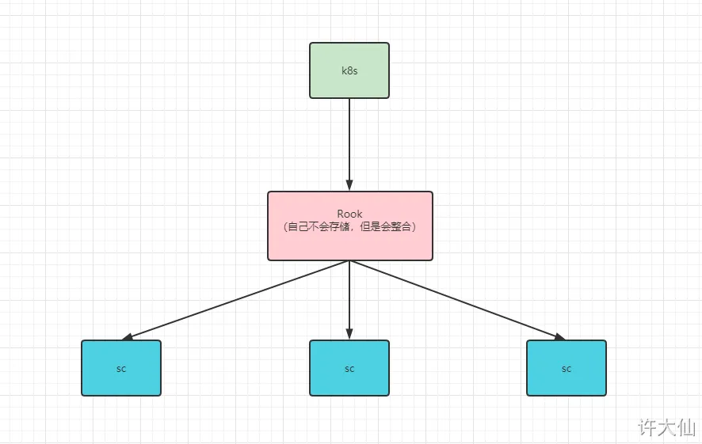

# 1 Volume

## 1.1 基础

- Kubernetes 支持很多类型的卷。 [Pod](https://kubernetes.io/docs/concepts/workloads/pods/pod-overview/) 可以同时使用任意数目的卷类型。
- 临时卷类型的生命周期与 Pod 相同，但持久卷可以比 Pod 的存活期长。
- 当 Pod 不再存在时，Kubernetes 也会销毁临时卷。
- Kubernetes 不会销毁 `持久卷` 。
- 对于给定 Pod 中 `任何类型的卷` ，在容器重启期间数据都不会丢失。
- 使用卷时, 在 `.spec.volumes` 字段中设置为 Pod 提供的卷，并在 `.spec.containers[*].volumeMounts` 字段中声明卷在容器中的挂载位置。

## 1.2 subPath

- 有时，在单个 Pod 中共享卷以供多方使用是很有用的。 `volumeMounts.subPath` 属性可用于指定所引用的卷内的子路径，而不是其根路径。

注意：ConfigMap 和 Secret 使用子路径挂载是无法热更新的。


# 2 安装 NFS

- NFS 的简介：网络文件系统，英文Network File System(NFS)，是由 [SUN](https://baike.baidu.com/item/SUN/69463) 公司研制的[UNIX](https://baike.baidu.com/item/UNIX/219943)[表示层](https://baike.baidu.com/item/%E8%A1%A8%E7%A4%BA%E5%B1%82/4329716)协议(presentation layer protocol)，能使使用者访问网络上别处的文件就像在使用自己的计算机一样。


注意：实际开发中，不建议使用 NFS 作为 Kubernetes 集群持久化的驱动。


原因：

Network File System (NFS) 在某些情况下可能是一个很好的选择，特别是在小规模和简单的生产环境中。然而，对于一些更复杂、要求高可用性和性能的环境，NFS 可能存在一些挑战，因此在选择存储解决方案时需要权衡一些因素：

1. 单点故障： NFS 通常是基于服务器-客户端模型的，如果 NFS 服务器出现故障，整个存储系统可能变得不可用。在高可用性环境中，要确保 NFS 服务器的冗余性可能需要一些额外的配置。
2. 性能： NFS 的性能可能受到网络和服务器性能的限制。在某些高性能和低延迟要求的场景中，可能需要考虑其他分布式存储系统，比如 Ceph 或者使用云提供商的块存储服务。
3. 复杂性： 尽管 NFS 是一种相对简单的共享文件系统，但在一些复杂的部署中，特别是在大规模集群中，可能需要更灵活和可扩展的解决方案。一些企业可能更愿意选择分布式存储系统，如 Ceph 或 GlusterFS。
4. 权限和安全性： NFS 的安全性依赖于正确的配置。确保适当的权限和身份验证对于防止未经授权的访问至关重要。在一些安全性要求较高的场景中，可能需要考虑其他存储解决方案，如加密存储或者云提供商的加密选项。
5. 云原生： 对于在云中运行的 Kubernetes 集群，云提供商通常提供了更集成、更适应云原生应用的存储解决方案，这可能更容易管理和扩展。  


总的来说，NFS 是一个成熟且易于使用的存储协议，但在考虑在生产环境中选择存储解决方案时，需要仔细评估具体需求和限制。对于大规模、高可用性和高性能要求的环境，可能需要考虑更先进的存储解决方案。


## 2.1 例子 

https://www.yuque.com/fairy-era/yg511q/pyll1k#07c7e76e

### 2.1.1 前期准备 

本次以 Master （192.168.65.100）节点作为 NFS 服务端：
yum install -y nfs-utils

在 Master（192.168.65.100）节点创建 /etc/exports 文件
```
# * 表示暴露权限给所有主机；* 也可以使用 192.168.0.0/16 代替，表示暴露给所有主机
echo "/nfs/data/ *(insecure,rw,sync,no_root_squash)" > /etc/exports
```


在 Master（192.168.65.100）节点创建 /nfs/data/ （共享目录）目录，并设置权限：
```
mkdir -pv /nfs/data/
chmod 777 -R /nfs/data/
```


在 Master（192.168.65.100）节点启动 NFS
```
systemctl enable rpcbind
systemctl enable nfs-server
systemctl start rpcbind
systemctl start nfs-server
```


在 Master（192.168.65.100）节点加载配置：
exportfs -r


在 Master（192.168.65.100）节点检查配置是否生效：
exportfs


在 Node（192.168.65.101、192.168.65.102）节点安装 nfs-utils
```
# 服务器端防火墙开放111、662、875、892、2049的 tcp / udp 允许，否则远端客户无法连接。
yum install -y nfs-utils
```


在 Node（192.168.65.101、192.168.65.102）节点，执行以下命令检查 nfs 服务器端是否有设置共享目录

```
# showmount -e $(nfs服务器的IP)
showmount -e 192.168.65.100
```


在 Node（192.168.65.101、192.168.65.102）节点，执行以下命令挂载 nfs 服务器上的共享目录到本机路径 /root/nd

```
mkdir /nd

# mount -t nfs $(nfs服务器的IP):/root/nfs_root /root/nfsmount
mount -t nfs 192.168.65.100:/nfs/data /nd

```


在 Node （192.168.65.101）节点写入一个测试文件
```
echo "hello nfs server" > /nd/test.txt
```


在 Master（192.168.65.100）节点验证文件是否写入成功
cat /nfs/data/test.txt


### 2.1.2 正式挂载

vi k8s-nginx-nfs.yaml

```
apiVersion: v1
kind: Pod
metadata:
  name: nginx
  namespace: default
  labels:
    app: nginx
spec:
  containers:
  - name: nginx
    image: nginx:1.20.2
    resources:
      limits:
        cpu: 200m
        memory: 500Mi
      requests:
        cpu: 100m
        memory: 200Mi
    ports:
    - containerPort: 80
      name:  http
    volumeMounts:
    - name: localtime
      mountPath: /etc/localtime
    - name: html  
      mountPath: /usr/share/nginx/html/ # / 一定是文件夹
  volumes:
    - name: localtime
      hostPath:
        path: /usr/share/zoneinfo/Asia/Shanghai
    - name: html 
      nfs: # 使用 nfs 存储驱动
        path: /nfs/data  # nfs 共享的目录
        server:  192.168.65.100  # nfs 服务端的 IP 地址或 hostname 
  restartPolicy: Always
```

kubectl apply -f k8s-nginx-nfs.yaml


# 3 静态供应: PV 和 PVC


## 3.1 概述

- 前面我们已经学习了使用 NFS 提供存储，此时就要求用户会搭建 NFS 系统，并且会在 yaml 配置 NFS，这就带来的一些问题：
    - ① 开发人员对 Pod 很熟悉，非常清楚 Pod 中的容器那些位置适合挂载出去。但是，由于 Kubernetes 支持的存储系统非常之多，开发人员并不清楚底层的存储系统，而且要求开发人员全部熟悉，不太可能（术业有专攻，运维人员比较熟悉存储系统）。
    - ② 在 yaml 中配置存储系统，就意味着将存储系统的配置信息暴露，非常不安全（容易造成泄露）。
- 为了能够屏蔽底层存储实现的细节，方便用户使用，Kubernetes 引入了 PV 和 PVC 两种资源对象。

  
- PV（Persistent Volume）是持久化卷的意思，是对底层的共享存储的一种抽象。一般情况下 PV 由 Kubernetes 管理员进行创建和配置，它和底层具体的共享存储技术有关，并通过插件完成和共享存储的对接。

- PVC（Persistent Volume Claim）是持久化卷声明的意思，是用户对于存储需求的一种声明。换言之，PVC 其实就是用户向Kubernetes 系统发出的一种资源需求申请。

Persistent Volume (PV)
• Survives pod restarts
• HostPath PV
• Local storage PV
• External storage systems
• PVs are attached via PV claims

PV Claims (PVC)
- Dynamic
- Abstraction to underlying storage
- ReadWriteOnce


----


PV 的缺点：
- ① 需要运维事先准备好 PV 池。
- ② 资源浪费：没有办法预估合适的 PV，假设运维向 k8s 申请了 20m 、50m、10G 的 PV，而开发人员申请 2G 的 PVC ，那么就会匹配到 10G 的PV ，这样会造成 8G 的空间浪费。

也有人称 PV 为静态供应。


PVC的注意点：
- Pod 的删除，并不会影响 PVC；换言之，PVC 可以独立于 Pod 存在，PVC 也是 K8s 的系统资源。不过，推荐将 PVC 和 Pod 也在一个 yaml 文件中。
- PVC 删除会不会影响到 PV，要根据 PV 的回收策略决定。

## 3.2 PV 和PVC如何联合使用的


  


## 3.3 PVC 和 PV 的基本演示


### 3.3.1 创建 PV 
（一般是运维人员操作）

```
mkdir -pv /nfs/data/10m
mkdir -pv /nfs/data/20m
mkdir -pv /nfs/data/500m
mkdir -pv /nfs/data/1Gi
```


vi k8s-pv.yaml

```
apiVersion: v1
kind: PersistentVolume
metadata:
  name: nfs-pv-10m
spec:
  storageClassName: nfs-storage # 用于分组
  capacity:
    storage: 10m
  accessModes:
    - ReadWriteOnce
  nfs: # 使用 nfs 存储驱动
    path: /nfs/data/10m # nfs 共享的目录，mkdir -pv /nfs/data/10m
    server: 192.168.65.100 # nfs 服务端的 IP 地址或 hostname
    
---
apiVersion: v1
kind: PersistentVolume
metadata:
  name: nfs-pv-20m
spec:
  storageClassName: nfs-storage # 用于分组
  capacity:
    storage: 20m
  accessModes:
    - ReadWriteOnce
  nfs: # 使用 nfs 存储驱动
    path: /nfs/data/20m # nfs 共享的目录，mkdir -pv /nfs/data/20m
    server: 192.168.65.100 # nfs 服务端的 IP 地址或 hostname
    
--- 
apiVersion: v1
kind: PersistentVolume
metadata:
  name: nfs-pv-500m
spec:
  storageClassName: nfs-storage # 用于分组
  capacity:
    storage: 500m
  accessModes:
    - ReadWriteOnce
  nfs: # 使用 nfs 存储驱动
    path: /nfs/data/500m # nfs 共享的目录，mkdir -pv /nfs/data/500m
    server: 192.168.65.100 # nfs 服务端的 IP 地址或 hostname
    
---
apiVersion: v1
kind: PersistentVolume
metadata:
  name: nfs-pv-1g
spec:
  storageClassName: nfs-storage # 用于分组
  capacity:
    storage: 1Gi
  accessModes:
    - ReadWriteOnce
  nfs: # 使用 nfs 存储驱动
    path: /nfs/data/1Gi # nfs 共享的目录，mkdir -pv /nfs/data/1Gi
    server: 192.168.65.100 # nfs 服务端的 IP 地址或 hostname
```

kubectl apply -f k8s-pv.yaml


---

### 3.3.2 创建 PVC
(一般是开发人员)

vi k8s-pvc.yaml

```

apiVersion: v1
kind: PersistentVolumeClaim
metadata:
  name: nginx-pvc-500m
  namespace: default
  labels:
    app: nginx-pvc-500m
spec:
  storageClassName: nfs-storage
  accessModes:
  - ReadWriteOnce
  resources:
    requests:
      storage: 500m
      
---
apiVersion: v1
kind: Pod
metadata:
  name: nginx
  namespace: default
  labels:
    app: nginx
spec:
  containers:
  - name: nginx
    image: nginx:1.20.2
    resources:
      limits:
        cpu: 200m
        memory: 500Mi
      requests:
        cpu: 100m
        memory: 200Mi
    ports:
    - containerPort:  80
      name:  http
    volumeMounts:
    - name: localtime
      mountPath: /etc/localtime
    - name: html
      mountPath: /usr/share/nginx/html/ 
  volumes:
    - name: localtime
      hostPath:
        path: /usr/share/zoneinfo/Asia/Shanghai
    - name: html    
      persistentVolumeClaim:
        claimName:  nginx-pvc-500m
        readOnly: false  
  restartPolicy: Always

```

kubectl apply -f k8s-pvc.yaml


注意：
- pv 和 pvc 的 accessModes 和 storageClassName 必须一致。
- pvc 申请的空间大小不大于 pv 的空间大小。


- storageClassName  就相当于分组的组名，通过 storageClassName 可以区分不同类型的存储驱动，主要是为了方便管理。


## 3.4 PV 的属性 


LocalPersistentVolumnes


选择PV的卷类型 


## 3.5 PV的回收策略 

- 目前的回收策略有：
    - Retain：手动回收（默认）。
    - Recycle：基本擦除 (`rm -rf /thevolume/*`)。
    - Delete：诸如 AWS EBS、GCE PD、Azure Disk 或 OpenStack Cinder 卷这类关联存储资产也被删除。
- 目前，仅 NFS 和 HostPath 支持回收（Recycle）。 AWS EBS、GCE PD、Azure Disk 和 Cinder 卷都支持删除（Delete）。


### 3.5.1 演示 Retain


1 创建 pv
```
mkdir -pv /nfs/data/10m
mkdir -pv /nfs/data/20m
mkdir -pv /nfs/data/500m
mkdir -pv /nfs/data/1Gi
```


vi k8s-pv.yaml

```
apiVersion: v1
kind: PersistentVolume
metadata:
  name: nfs-pv-10m
spec:
  storageClassName: nfs-storage # 用于分组
  capacity:
    storage: 10m
  accessModes:
    - ReadWriteOnce
  nfs: # 使用 nfs 存储驱动
    path: /nfs/data/10m # nfs 共享的目录，mkdir -pv /nfs/data/10m
    server: 192.168.65.100 # nfs 服务端的 IP 地址或 hostname
    
---
apiVersion: v1
kind: PersistentVolume
metadata:
  name: nfs-pv-20m
spec:
  storageClassName: nfs-storage # 用于分组
  capacity:
    storage: 20m
  accessModes:
    - ReadWriteOnce
  nfs: # 使用 nfs 存储驱动
    path: /nfs/data/20m # nfs 共享的目录，mkdir -pv /nfs/data/20m
    server: 192.168.65.100 # nfs 服务端的 IP 地址或 hostname
    
--- 
apiVersion: v1
kind: PersistentVolume
metadata:
  name: nfs-pv-500m
spec:
  storageClassName: nfs-storage # 用于分组
  capacity:
    storage: 500m
  accessModes:
    - ReadWriteOnce
  nfs: # 使用 nfs 存储驱动
    path: /nfs/data/500m # nfs 共享的目录，mkdir -pv /nfs/data/500m
    server: 192.168.65.100 # nfs 服务端的 IP 地址或 hostname
    
---
apiVersion: v1
kind: PersistentVolume
metadata:
  name: nfs-pv-1g
spec:
  storageClassName: nfs-storage # 用于分组
  capacity:
    storage: 1Gi
  accessModes:
    - ReadWriteOnce
  nfs: # 使用 nfs 存储驱动
    path: /nfs/data/1Gi # nfs 共享的目录，mkdir -pv /nfs/data/1Gi
    server: 192.168.65.100 # nfs 服务端的 IP 地址或 hostname


```

kubectl apply -f k8s-pv.yaml

echo 111 > /nfs/data/500m/index.html

----

2 创建 pvc

vi k8s-pvc.yaml

```

apiVersion: v1
kind: PersistentVolumeClaim
metadata:
  name: nginx-pvc-500m
  namespace: default
  labels:
    app: nginx-pvc-500m
spec:
  storageClassName: nfs-storage
  accessModes:
  - ReadWriteOnce
  resources:
    requests:
      storage: 500m
```


kubectl apply -f k8s-pvc.yaml
kubectl delete -f k8s-pvc.yaml


### 3.5.2 Recycle

1 创建pv

```
mkdir -pv /nfs/data/10m
mkdir -pv /nfs/data/20m
mkdir -pv /nfs/data/500m
mkdir -pv /nfs/data/1Gi
```

vi k8s-pv.yaml

```
apiVersion: v1
kind: PersistentVolume
metadata:
  name: nfs-pv-10m
spec:
  storageClassName: nfs-storage # 用于分组
  capacity:
    storage: 10m
  accessModes:
    - ReadWriteOnce
  nfs: # 使用 nfs 存储驱动
    path: /nfs/data/10m # nfs 共享的目录，mkdir -pv /nfs/data/10m
    server: 192.168.65.100 # nfs 服务端的 IP 地址或 hostname
  persistentVolumeReclaimPolicy: Recycle  # 回收策略
  
---
apiVersion: v1
kind: PersistentVolume
metadata:
  name: nfs-pv-20m
spec:
  storageClassName: nfs-storage # 用于分组
  capacity:
    storage: 20m
  accessModes:
    - ReadWriteOnce
  nfs: # 使用 nfs 存储驱动
    path: /nfs/data/20m # nfs 共享的目录，mkdir -pv /nfs/data/20m
    server: 192.168.65.100 # nfs 服务端的 IP 地址或 hostname
  persistentVolumeReclaimPolicy: Recycle  # 回收策略  
  
--- 
apiVersion: v1
kind: PersistentVolume
metadata:
  name: nfs-pv-500m
spec:
  storageClassName: nfs-storage # 用于分组
  capacity:
    storage: 500m
  accessModes:
    - ReadWriteOnce
  nfs: # 使用 nfs 存储驱动
    path: /nfs/data/500m # nfs 共享的目录，mkdir -pv /nfs/data/500m
    server: 192.168.65.100 # nfs 服务端的 IP 地址或 hostname
  persistentVolumeReclaimPolicy: Recycle  # 回收策略  
  
---
apiVersion: v1
kind: PersistentVolume
metadata:
  name: nfs-pv-1g
spec:
  storageClassName: nfs-storage # 用于分组
  capacity:
    storage: 20m
  accessModes:
    - ReadWriteOnce
  nfs: # 使用 nfs 存储驱动
    path: /nfs/data/1Gi # nfs 共享的目录，mkdir -pv /nfs/data/1Gi
    server: 192.168.65.100 # nfs 服务端的 IP 地址或 hostname
  persistentVolumeReclaimPolicy: Recycle  # 回收策略

```

kubectl apply -f k8s-pv.yaml

echo 111 > /nfs/data/500m/index.html


2 创建 pvc

vi k8s-pvc.yaml

```
apiVersion: v1
kind: PersistentVolumeClaim
metadata:
  name: nginx-pvc-500m
  namespace: default
  labels:
    app: nginx-pvc-500m
spec:
  storageClassName: nfs-storage
  accessModes:
  - ReadWriteOnce
  resources:
    requests:
      storage: 500m
```

kubectl apply -f k8s-pvc.yaml
kubectl delete -f k8s-pvc.yaml


## 3.6 PV 的访问模式

- 访问模式（accessModes）：用来描述用户应用对存储资源的访问权限，访问权限包括下面几种方式：
    - ReadWriteOnce（RWO）：读写权限，但是只能被单个节点挂载。
    - ReadOnlyMany（ROX）：只读权限，可以被多个节点挂载。
    - ReadWriteMany（RWX）：读写权限，可以被多个节点挂载。


## 3.7 pv 的生命周期 

- 一个 PV 的生命周期，可能会处于 4 种不同的阶段：
    - Available（可用）：表示可用状态，还未被任何 PVC 绑定。
    - Bound（已绑定）：表示 PV 已经被 PVC 绑定。
    - Released（已释放）：表示 PVC 被删除，但是资源还没有被集群重新释放。
    - Failed（失败）：表示该 PV 的自动回收失败。


- PVC 和 PV 是一一对应的，PV 和 PVC 之间的相互作用遵循如下的生命周期：
- ① 资源供应：管理员手动创建底层存储和 PV。
- ② 资源绑定：
    - 用户创建 PVC ，Kubernetes 负责根据 PVC 声明去寻找 PV ，并绑定在用户定义好 PVC 之后，系统将根据 PVC 对存储资源的请求在以存在的 PV 中选择一个满足条件的。
        - 一旦找到，就将该 PV 和用户定义的 PVC 进行绑定，用户的应用就可以使用这个 PVC 了。
        - 如果找不到，PVC 就会无限期的处于 Pending 状态，直到系统管理员创建一个符合其要求的 PV 。
    - ==PV 一旦绑定到某个 PVC 上，就会被这个 PVC 独占，不能再和其他的 PVC 进行绑定了。==

- ③ 资源使用：用户可以在 Pod 中像 Volume 一样使用 PVC ，Pod 使用 Volume 的定义，将 PVC 挂载到容器内的某个路径进行使用。

- ④ 资源释放：
    - 用户删除 PVC 来释放 PV 。
    - 当存储资源使用完毕后，用户可以删除 PVC，和该 PVC 绑定的 PV 将会标记为 `已释放` ，但是还不能立刻和其他的 PVC 进行绑定。通过之前 PVC 写入的数据可能还留在存储设备上，只有在清除之后该 PV 才能再次使用。

- ⑤ 资源回收：
    - Kubernetes 根据 PV 设置的回收策略进行资源的回收。
    - 对于 PV，管理员可以设定回收策略，用于设置与之绑定的 PVC 释放资源之后如何处理遗留数据的问题。只有 PV 的存储空间完成回收，才能供新的 PVC 绑定和使用。


# 4 动态供应 


## 4.1 概述

- 静态供应：集群管理员创建若干 PV 卷。这些卷对象带有真实存储的细节信息，并且对集群用户可用（可见）。PV 卷对象存在于 Kubernetes API 中，可供用户消费（使用）。
- 动态供应：集群自动根据 PVC 创建出对应 PV 进行使用。


## 4.2 动态供应的完整流程


● ① 集群管理员预先创建存储类（StorageClass）。
● ② 用户创建使用存储类的持久化存储声明(PVC：PersistentVolumeClaim)。
● ③ 存储持久化声明通知系统，它需要一个持久化存储(PV: PersistentVolume)。
● ④ 系统读取存储类的信息。
● ⑤ 系统基于存储类的信息，在后台自动创建 PVC 需要的 PV 。
● ⑥ 用户创建一个使用 PVC 的 Pod 。
● ⑦ Pod 中的应用通过 PVC 进行数据的持久化。
● ⑧ PVC 使用 PV 进行数据的最终持久化处理


## 4.3 设置 NFS 动态供应

注意：不一定需要设置 NFS 动态供应，可以直接使用云厂商提供的 StorageClass 。

- [官网地址](https://github.com/kubernetes-sigs/nfs-subdir-external-provisioner)。


### 4.3.1 部署 NFS 动态供应：

vi k8s-nfs-provisioner.yaml

```
apiVersion: storage.k8s.io/v1
kind: StorageClass
metadata:
  name: nfs-client
provisioner: k8s-sigs.io/nfs-subdir-external-provisioner # 指定一个供应商的名字 
# or choose another name, 必须匹配 deployment 的 env PROVISIONER_NAME'
parameters:
  archiveOnDelete: "false" # 删除 PV 的时候，PV 中的内容是否备份
  
---
apiVersion: apps/v1
kind: Deployment
metadata:
  name: nfs-client-provisioner
  labels:
    app: nfs-client-provisioner
  namespace: default
spec:
  replicas: 1
  strategy:
    type: Recreate
  selector:
    matchLabels:
      app: nfs-client-provisioner
  template:
    metadata:
      labels:
        app: nfs-client-provisioner
    spec:
      serviceAccountName: nfs-client-provisioner
      containers:
        - name: nfs-client-provisioner
          image: ccr.ccs.tencentyun.com/gcr-containers/nfs-subdir-external-provisioner:v4.0.2
          volumeMounts:
            - name: nfs-client-root
              mountPath: /persistentvolumes
          env:
            - name: PROVISIONER_NAME
              value: k8s-sigs.io/nfs-subdir-external-provisioner
            - name: NFS_SERVER
              value: 192.168.65.100 # NFS 服务器的地址
            - name: NFS_PATH
              value: /nfs/data # NFS 服务器的共享目录
      volumes:
        - name: nfs-client-root
          nfs:
            server: 192.168.65.100
            path: /nfs/data
            
---
apiVersion: v1
kind: ServiceAccount
metadata:
  name: nfs-client-provisioner
  namespace: default
  
---
kind: ClusterRole
apiVersion: rbac.authorization.k8s.io/v1
metadata:
  name: nfs-client-provisioner-runner
rules:
  - apiGroups: [""]
    resources: ["nodes"]
    verbs: ["get", "list", "watch"]
  - apiGroups: [""]
    resources: ["persistentvolumes"]
    verbs: ["get", "list", "watch", "create", "delete"]
  - apiGroups: [""]
    resources: ["persistentvolumeclaims"]
    verbs: ["get", "list", "watch", "update"]
  - apiGroups: ["storage.k8s.io"]
    resources: ["storageclasses"]
    verbs: ["get", "list", "watch"]
  - apiGroups: [""]
    resources: ["events"]
    verbs: ["create", "update", "patch"]
    
---
kind: ClusterRoleBinding
apiVersion: rbac.authorization.k8s.io/v1
metadata:
  name: run-nfs-client-provisioner
subjects:
  - kind: ServiceAccount
    name: nfs-client-provisioner
    namespace: default
roleRef:
  kind: ClusterRole
  name: nfs-client-provisioner-runner
  apiGroup: rbac.authorization.k8s.io
  
---
kind: Role
apiVersion: rbac.authorization.k8s.io/v1
metadata:
  name: leader-locking-nfs-client-provisioner
  namespace: default
rules:
  - apiGroups: [""]
    resources: ["endpoints"]
    verbs: ["get", "list", "watch", "create", "update", "patch"]
    
---
kind: RoleBinding
apiVersion: rbac.authorization.k8s.io/v1
metadata:
  name: leader-locking-nfs-client-provisioner
  namespace: default
subjects:
  - kind: ServiceAccount
    name: nfs-client-provisioner
    namespace: default
roleRef:
  kind: Role
  name: leader-locking-nfs-client-provisioner
  apiGroup: rbac.authorization.k8s.io
```


kubectl apply -f k8s-nfs-provisioner.yaml


### 4.3.2 测试动态供应

vi k8s-pvc.yaml


```
apiVersion: v1
kind: PersistentVolumeClaim
metadata:
  name: nginx-pvc
  namespace: default
  labels:
    app: nginx-pvc
spec:
  storageClassName: nfs-client # 注意此处
  accessModes:
  - ReadWriteOnce
  resources:
    requests:
      storage: 2Gi
  
---
apiVersion: v1
kind: Pod
metadata:
  name: nginx
  namespace: default
  labels:
    app: nginx
spec:
  containers:
  - name: nginx
    image: nginx:1.20.2
    resources:
      limits:
        cpu: 200m
        memory: 500Mi
      requests:
        cpu: 100m
        memory: 200Mi
    ports:
    - containerPort:  80
      name:  http
    volumeMounts:
    - name: localtime
      mountPath: /etc/localtime
    - name: html
      mountPath: /usr/share/nginx/html/ 
  volumes:
    - name: localtime
      hostPath:
        path: /usr/share/zoneinfo/Asia/Shanghai
    - name: html    
      persistentVolumeClaim:
        claimName:  nginx-pvc
        readOnly: false  
  restartPolicy: Always
```

kubectl apply -f k8s-pvc.yaml


## 4.4 设置 SC 为默认驱动


```
命令
kubectl patch storageclass <your-class-name> -p '{"metadata": {"annotations":{"storageclass.kubernetes.io/is-default-class":"true"}}}'

设置 SC 为默认驱动
kubectl patch storageclass nfs-client -p '{"metadata": {"annotations":{"storageclass.kubernetes.io/is-default-class":"true"}}}'

```

## 4.5 测试默认驱动

```
apiVersion: v1
kind: PersistentVolumeClaim
metadata:
  name: nginx-pvc
  namespace: default
  labels:
    app: nginx-pvc
spec:
  # storageClassName: nfs-client 不写，就使用默认的
  accessModes:
  - ReadWriteOnce
  resources:
    requests:
      storage: 2Gi
      
---
apiVersion: v1
kind: Pod
metadata:
  name: nginx
  namespace: default
  labels:
    app: nginx
spec:
  containers:
  - name: nginx
    image: nginx:1.20.2
    resources:
      limits:
        cpu: 200m
        memory: 500Mi
      requests:
        cpu: 100m
        memory: 200Mi
    ports:
    - containerPort:  80
      name:  http
    volumeMounts:
    - name: localtime
      mountPath: /etc/localtime
    - name: html
      mountPath: /usr/share/nginx/html/ 
  volumes:
    - name: localtime
      hostPath:
        path: /usr/share/zoneinfo/Asia/Shanghai
    - name: html    
      persistentVolumeClaim:
        claimName:  nginx-pvc
        readOnly: false  
  restartPolicy: Always
```


# 5 展望


- 目前，只需要运维人员部署好各种 storageclass，开发人员在使用的时候，创建 PVC 即可；但是，存储系统太多太多，运维人员也未必会一一掌握，此时就需要 Rook 来统一管理了。

