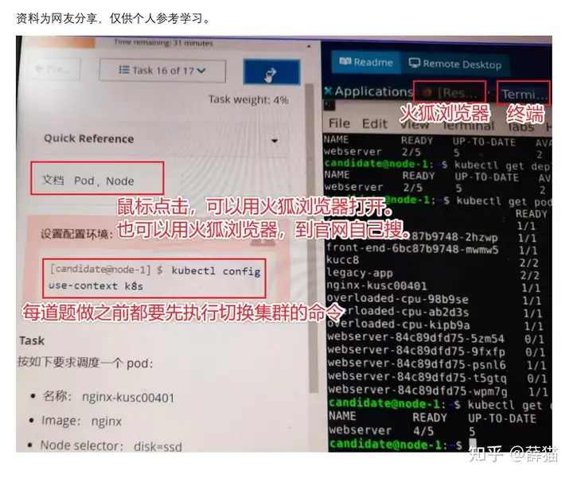

去 killercoda.com/sachin/cour… 刷题，玩 k8s 的一定要收藏这个网站，各种模拟环境让你不用在自己电脑或者服务器上安装 k8s 就能玩。

 - 可以打开一个mousepad记事本，yaml粘完修改后再复制到vim中。
 - 做每道题之前一定要记得切换集群，
 - 每道题编排文件进行相应命名，方面检查时进行区分
 - 不会做的及时跳过，并且做标记，每道题目下方可以进行标记，左边按钮是此题已完成，右边是此题未完成
 - 整个考试过程只能打开两个浏览器标签，一个是在线考试标签，另外一个是K8S在线文档标签，不能打开其他标签

- 黑色星期五（或Cyber Monday）时购买考试是全年价格最低的时候，推荐预算充足的同学购买CKA+CKS，性价比最高，相关课程不推荐买，video和课件都是纯英语，对英语一般的人不够友好，买后用处不大。
- 规定的是考试购买后1个月内需要兑换考试券（我超过1个月后兑换的虽然也成功了，但不建议卡时间）。
- 考试时间的选择，最好选择凌晨和清晨，比如早上7点左右，亲测网络不会卡顿。
- 浏览器和PSI插件按照指南说明准备，考前最好多测试多运行几次，确保系统环境一定没问题，比如我考时windows系统不能用win10企业版，所以需要重装系统或换个电脑。
- 关于网络，不建议在办公室等有公司防火墙的WiFi环境考试，很可能会看不到题目，可以选择在家或酒店，或者自己手机开热点这些方式。


常用命令行工具：kubectl jq tmux curl wget

购买 CKA 考试后会赠送两次 killer.sh 的模拟考试，模拟考试的难度稍大于实际考试。在练习一段时间上面的习题后，可以参加第一次模拟考试；然后根据模拟考试的结果再进行查漏补缺，对第一次考试中的错题进行分析和加强练习，然后再进行第二次模拟考试。做完两次模拟考试，并掌握了模拟考试中所有试题的知识点后，你心里基本上就对考试的内容有较大的底气，可以参加正式考试了。

考试时，打开考试环境 Ubuntu 20.04 桌面上的火狐浏览器，并输入 K8S 官网 [https://kubernetes.io/](https://link.zhihu.com/?target=https%3A//kubernetes.io/)  
**每道题做之前，要先切换环境，kubectl config use-context xxxxx**  


# 1 复制粘贴 


考试页面不能ctrl+c复制，ctrl+v粘贴，
 web终端中无法使用Ctrl+C、Ctrl+V（考试提供的记事本可以使用）

用 ctrl + insert复制，shift+insert粘贴
使用Ctrl + Insert，Shift + Insert代替
web终端中也可以使用右键复制粘贴
**Copy = Ctrl+SHIFT+C (inside the terminal)**  
**Paste = Ctrl+SHIFT+V (inside the terminal)**  

部分题目，备份yaml文件进行编辑，养成习惯省去很多麻烦




编辑yaml文件复制粘贴时，:set paste真的很方便  
http://xstarcd.github.io/wiki/vim/vim-copy-paste.html

paste 模式
运行如下命令，进入 paste 模式：
:set paste

进入 paste 模式后，按 i 键进入插入模式，然后再粘帖，文本格式不会错乱了。但粘帖后还需要按 `<ESC> `进入普通模式并执行如下命令结束 paste 模式：
:set nopaste

显然，这样非常麻烦。下面我们进行改进。


快捷键一

我们可以利用设置快捷键来简化上面的两个命令。在 ~/.vimrc 中加入如下两行：

```
map <F10>:set paste<CR>
map <F11>:set nopaste<CR>
```

这样，在普通模式下按 F10 （你也可以用自己喜欢的按键）就会进入 paste 模式，按 i 进入插入模式后粘帖，然后按 `<ESC> `回到普通模式，再按 F11 结束 paste 模式。
这样虽然方便了，但占用了两个按键。下面我们继续改进。


快捷键二

在 ~/.vimrc 中加入如下内容：
`set pastetoggle=<F11>`

这样就可以把上面的 F10 和 F11 合并为一个快捷键来切换 paste 模式了。


# 2 考前检查及考试环境

[](https://github.com/yuyicai/cka-ckad-exam-experience?tab=readme-ov-file#4-考前检查及考试环境)

- **考试形式:** 在线监考，需要共享桌面和摄像头
    
- **考试环境:** 在一个密闭空间，例如书房、卧室、会议室等，电脑屏幕不能对着窗户，房间里除了考生不能存在第二个人，考试的桌面不能放其它东西，水杯也不行
    
- **考试时间:** CKA、CKAD均为两小时
    
- **选择考试时间:** 报名成功之后可以在12个月之内进行考试，考试之前需要选择考试时间，选择考试时间的时候记得先选择北京时区，默认是0时区时间。
    
- **电脑要求:** 可以在这里[WebDelivery Compatibility Check](https://www.examslocal.com/ScheduleExam/Home/CompatibilityCheck)检测自己的电脑环境和网络速度等
    
    [](https://github.com/yuyicai/cka-ckad-exam-experience/blob/master/images/webDelivery-compatibility-check-1.png)
    
    检查测试前先点击“Install Extension”，安装chrome插件，这个插件是考试时用来共享屏幕和摄像头的，安装过程需要爬墙，考试过程不需要爬墙
    
    [](https://github.com/yuyicai/cka-ckad-exam-experience/blob/master/images/webDelivery-compatibility-check-2.png)
    
- **考试前考官检查:**
    
    - 考试可以提前15分钟进入考试界面
    - 考官会在网页中的聊天窗口发送消息的和你交流（没有语音交流，只有文字交流）
    - 看不懂考官发的英文怎么办：可以在chrome浏览器右键翻译
    - 考官会让你共享摄像头，共享桌面
    - 考官会让你出示能确认你身份ID的证件，我当时用的是罗技C310摄像头（建议大选用可用对焦的摄像头），无法对焦，护照看上去模糊到不行，后来考官叫我给护照打光还是不行。最后考官叫我打开手机，用手机相机当作放大镜用，这样才能看清楚。（我考CKAD的时候，我护照还没举稳，考官就说可以了，应该是考过CKA，他们系统里面已经有我的信息了，就随便瞄了一眼而已）
    - 考官会让你用摄像头环视房间一周，确认你的考试环境（当时我房间门开了一个小缝也要求我去把门关好，还是比较严格的）
    - 考官会让你用摄像头看你的整个桌面和桌子底下
    - 考官会让你再次点一下桌面共享，然后你叫你点击取消，然后就开始进入考试了
- **考试的界面:**
    
    - 左边是题目
    - 右边是终端
    - 终端上面是共享摄像头、共享屏幕、考试信息等按钮（可以唤出记事本）
- **考试过程:**
    
    - 考试计时：按照你实际开始时间开始计时（进入有题目的考试界面开始计算）。比如你约的是下午两点开始考试，但是考官检查花了比较长的时间，到两点半才说可以进入考试，那么你的考试是从两点半开始算起
    - 考试题目有好几种语言的翻译（包含了中文翻译），题目里的关键词都是标红的，比如pod name等等，建议看英文版的题目，中文翻译感觉是机翻的，读着有点别扭
    - 考试结束前15分钟考官会发消息提示你考试还剩下15分钟，不过这个看考官心情把，我考CKA的时候没提示了，考CKAD的时候提示了
    - 考试时间到，考官会发消息提醒你，叫你退出考试


# 3 考试环境

对考试环境有一个基本的了解：https://www.youtube.com/watch?v=9UqkWcdy140


# 4 #

## 4.1 为常用的 kubectl 命令定义 alias

```console
# 给kubectl起一个别名，方面在考试的时候快速输入
alias k=kubectl

# dry-run命令快速输入
export do="--dry-run=client -o yaml" # like short for dry output. use whatever you like
```

你可以根据自己的习惯来设置 alias，如下：

```bash
alias k=kubectl
alias kgp="k get pod"
alias kgd="k get deploy"
alias kgs="k get svc"
alias kgn="k get nodes"
alias kd="k describe"
alias kge="k get events --sort-by='.metadata.creationTimestamp' |tail -8"
```

## 4.2 使用 kubectl 的自动补全功能

```bash
source <(kubectl completion bash)

or 
echo "source <(kubectl completion bash)" >> ~/.bashrc
```


## 4.3 使用 K8s Resource 的缩写名而不是全称

熟练使用常见 K8s Resource 名称的缩写：

|Short name|Full name|
|---|---|
|cm|configmaps|
|ds|daemonsets|
|deploy|deployments|
|ep|endpoints|
|ev|events|
|hpa|horizontalpodautoscalers|
|ing|ingresses|
|limits|limitranges|
|ns|namespaces|
|no|nodes|
|pvc|persistentvolumeclaims|
|pv|persistentvolumes|
|po|pods|
|rs|replicasets|
|rc|replicationcontrollers|
|quota|resourcequotas|
|sa|serviceaccounts|
|svc|services|

## 4.4 采用 dry run 来生成 yaml

考生会被要求创建一些 K8s 资源，例如 pod，deployment，service 等等。从头编写这些资源的 yaml 文件不仅耗时，而且我们也很难记住某个资源的整个结构。可以使用 dry run 来生成一个基础的 yaml 文件，然后基于该文件进行修改，最后再采用修改后的文件来创建资源。

例如这道题：创建一个 nginx pod，将 request 的 memory 设置为 1M, CPU 设置为 500m

```bash
k run nginx --image=nginx --dry-run=client -oyaml > pod.yaml
vi pod.yaml //添加 resource limit 设置
k create -f pod.yaml
```

由于在考试中会频繁使用到 `--dry-run=client -oyaml` 选项来生成 k8s 对象的 yaml 文件，我们可以采用 export 来定义一个变量 do，以节省输入时间。

```bash
export do="--dry-run=client -o yaml"
```

定义 do 变量后，就可以像下面这样使用：

```bash
k run nginx --image=nginx $do > pod.yaml
```


## 4.5 创建临时 Pod 来进行测试

考试时经常会让考生创建临时 pod 来测试某些功能，例如创建一个临时的 busybox pod ，在该 pod 中通过 wget 命令来测试上一个步骤中 expose 的某个 k8s service。可以采用 `kubectl run` 加上 `--rm` 选项来创建该 pod，`--rm` 选项表示运行指定的命令后该 pod 将会被立即删除掉。该技巧可以让我们快速创建一个可以执行 wget， curl 等命令的临时 pod，命令执行后 pod 会被自动删除掉，无需手动清理。 该技巧在平时对 K8s 中运行的应用程序进行排错时也很有用。

```bash
➜  ~ kubectl -it  run busybox --rm --image=busybox -- sh
If you don't see a command prompt, try pressing enter.
/ # wget -O- 172.17.254.255
```


## 4.6 快速删除 pod

CKA 考试中有时候需要删除 pod，k8s 缺省采用优雅删除的方式，这意味着 kubectl 命令行会被挂起等待较长的时间，等相关资源被清理后再返回。这个时间可能会长达 10 多秒。CKA 考试时间相对比较紧张，为了尽可能减少删除时的等待时间，我们可以采用强制删除的方式快速删除 pod。

```bash
export now="--force --grace-period 0"
```

定义 now 变量后，可以像下面这样快速删除一个 pod：

```bash
k delete pod test $now
```

## 4.7 利用 kubectl command help 查看创建资源示例

`kubectl command --help` 命令的输出中提供了很多常用例子，将这些例子拷贝出来稍加修改就可以在考试中使用。采用该命令可以节约在 k8s 在线文档中查找搜寻相关示例的时间。

例如 `kubectl run --help` 的输出中有大量创建 pod 的示例：

```bash
kubectl run --help
Create and run a particular image in a pod.

Examples:
  # Start a nginx pod.
  kubectl run nginx --image=nginx

  # Start a hazelcast pod and let the container expose port 5701.
  kubectl run hazelcast --image=hazelcast/hazelcast --port=5701

  # Start a hazelcast pod and set environment variables "DNS_DOMAIN=cluster" and "POD_NAMESPACE=default" in the
container.
  kubectl run hazelcast --image=hazelcast/hazelcast --env="DNS_DOMAIN=cluster" --env="POD_NAMESPACE=default"

  # Start a hazelcast pod and set labels "app=hazelcast" and "env=prod" in the container.
  kubectl run hazelcast --image=hazelcast/hazelcast --labels="app=hazelcast,env=prod"

  # Dry run. Print the corresponding API objects without creating them.
  kubectl run nginx --image=nginx --dry-run=client

  # Start a nginx pod, but overload the spec with a partial set of values parsed from JSON.
  kubectl run nginx --image=nginx --overrides='{ "apiVersion": "v1", "spec": { ... } }'

  # Start a busybox pod and keep it in the foreground, don't restart it if it exits.
  kubectl run -i -t busybox --image=busybox --restart=Never

  # Start the nginx pod using the default command, but use custom arguments (arg1 .. argN) for that command.
  kubectl run nginx --image=nginx -- <arg1> <arg2> ... <argN>

  # Start the nginx pod using a different command and custom arguments.
  kubectl run nginx --image=nginx --command -- <cmd> <arg1> ... <argN>
```

## 4.8 采用 kubectl explain 来查看 resource 的定义

通过 `kubectl command --help` 命令可以查看创建资源的示例，但 help 命令中只显示了常用的选项，并不会提供完整的资源定义。如果在考试中我们需要查看某个 k8s 资源的定义，一个方法到在 k8s 在线文档中去搜索该资源的 API，但在 K8s 文档的搜索功能并不是很方便使用，你可能需要点击多次才能找到正确的链接。另一个更方便的方法是采用 kubectl explain 命令来查看资源定义。kubectl explain 的好处是可以层层递进查看，例如需要查看 pod 中容器的 limit 如何定义，但记不清楚 pod yaml 的结构层次，则可以这样查询：

```bash
k explain pod.spec //查看 pod 的 spec
k explain pod.spec.containers //进一步查看 pod spec 中 containers 部分的定义
k explain pod.spec.containers.resources //进一步查看 resources 部分的定义
k explain pod.spec.containers.resources.limits //进一步查看 limits 部分的定义
```


# 5 编辑器 vi

vi 是一个非常强大的编辑软件，命令也非常多，但我们不需要掌握所有的命令。了解如何在 vi 的编辑和命令模式之间切换，并熟悉在考试中会使用到的几个 vi 编辑器的常用命令即可，包括删除、剪切、拷贝、粘贴、上下翻页等。注意 vi 在粘贴 yaml 时的自动格式化处理可能会不正确。可以通过 `:set paste` 取消 vi 的自动格式化。常用的 vi 命令：

- 进入编辑模式 i
- 进入命令模式 Esc
- 储存后离开 vi :wq
- 光标移动最后一行 G
- 光标移动到第一行 gg
- 光标移动到指定 nG （n为行数）

vi 的使用方法和命令介绍参见这篇文章：https://www.runoob.com/linux/linux-vim.html

# 6 Josn/yaml 处理 jq

在对 K8s crd 和 kubectl 命令行输出进行操作时需要对 Json/Yaml 代码片段进行操作，例如截取或者修改输出中某个特定的字段。考试环境中预装了 Json/Yaml 的命令行工具 jq。在练习时要熟悉该命令的使用方法，例如下面的命令可以获取 pod 中的镜像名称：

```bash
$ k get pod busybox -ojson|jq '.spec.containers[0].image'
"busybox"
```

阅读这篇文章《My jq Cheatsheet》([https://medium.com/geekculture/my-jq-cheatsheet-34054df5b650](https://medium.com/geekculture/my-jq-cheatsheet-34054df5b650))，了解更多 jq 的使用方法。

# 7 终端复用器 tmux

考试时只能打开一个终端，但在考试时我们可能需要同时执行多个任务，或者在多个终端之间进行对比查看、复制粘贴。可以使用考试环境中预装的终端复用工具 tmux 来打开多个终端。在考试中会可能使用到的常用 tmux 命令：

- Ctrl+b %：划分左右两个窗格。
- Ctrl+b “：划分上下两个窗格。
- Ctrl+b ：光标切换到其他窗格。 是指向要切换到的窗格的方向键，比如切换到下方窗格，就按方向键↓。

关于 tmux 的更多使用方法，可以参考 阮一峰 老师的 [《Tmux 使用教程》](https://www.ruanyifeng.com/blog/2019/10/tmux.html)。


# 8 安装 k8s 集群的一些注意事项

安装前首先采用 `sudo -i` 命令切换到 root 用户。

我们只需要了解安装需要的相关工具和大致步骤，并不需要记住安装的相关命令。考试时打开 K8s 官网中的 [Bootstrapping clusters with kubeadm](https://kubernetes.io/docs/setup/production-environment/tools/kubeadm/) 文档，跟随文档中的步骤进行安装即可。

## 8.1 安装 Docker

Docker 官网的安装手册中有较多步骤，而在考试中不允许访问 Docker 官网。建议使用一键安装脚本来安装 Docker。Docker 一键安装脚本的地址 `get.docker.com` 很容易记住。

```bash
bash <(wget -O- get.docker.com)
```

注意需要设置 systemd 为 docker 的 cgroup driver，参见 [https://kubernetes.io/docs/setup/production-environment/container-runtimes/#docker](https://kubernetes.io/docs/setup/production-environment/container-runtimes/#docker)

## 8.2 初始化 master 节点

如果节点上有多个网卡，注意通过 `--apiserver-advertise-address` 参数设置 apiserver 的监听地址，该地址应为和 worker 节点同一个局域网上的地址。

如果使用了 flannel 插件，需要在 kubeadm 命令中加入 pod cidr 参数， `kubeadm init --pod-network-cidr=10.244.0.0/16`，cidr 和 [https://raw.githubusercontent.com/coreos/flannel/master/Documentation/kube-flannel.yml](https://raw.githubusercontent.com/coreos/flannel/master/Documentation/kube-flannel.yml) 中配置的 CIDR 一致。

## 8.3 安装 CNI 插件

采用 kubeadm 初始化集群后，需要通过 `kubectl apply -f <add-on.yaml>` 安装 CNI addon，否则加入集群的节点会一直处于 NotReady 状态。平时安装时我们会通过 k8s 在线文档导航到一个外部的 CNI 网站上，找到该 addon 的 yaml 文件。在考试时不允许访问 CNI 的网站，在下面的 K8s 文档中有安装 CNI 插件的例子，可以将网页地址加入浏览器收藏夹中。 [https://kubernetes.io/docs/setup/production-environment/tools/kubeadm/high-availability/#steps-for-the-first-control-plane-node](https://kubernetes.io/docs/setup/production-environment/tools/kubeadm/high-availability/#steps-for-the-first-control-plane-node)

