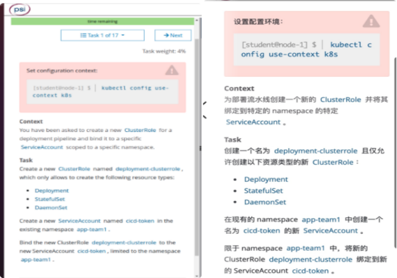
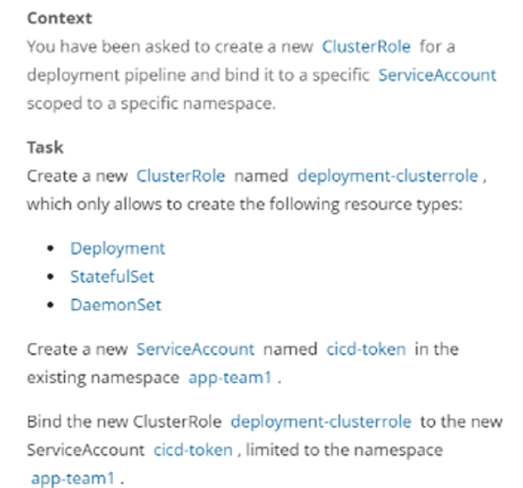

# 1 题目







设置配置环境kubectl config use-context k8s

Context
为部署流水线创建一个新的 ClusterRole 并将其绑定到范围为特定的 namespace 的特定 ServiceAccount。 

Task 
创建一个名为deployment-clusterrole的ClusterRole，其对Deployment、StatefulSet、DaemonSet资源只有Create权限；
在现有的命名空间app-team1中创建有个名为cicd-token的新ServiceAccount，并将新的ClusterRole deployment-clusterrole 绑定到新的ServiceAccount cicd-token。

https://kubernetes.io/zh-cn/docs/reference/access-authn-authz/rbac/ 


# 2 参考文档


没必要参考网址，使用-h 帮助更方便  
kubectl create clusterrole -h  
kubectl create rolebinding -h

# 3 解答


1、切换答题环境（考试环境有多个，每道题要在对应的环境中作答）
kubectl config use-context k8s


2、创建ClusterRole
kubectl create clusterrole deployment-clusterrole --verb=create --resource=deployments,statefulsets,daemonsets


或者
```yaml
[root@k8s-master01 ~]# cat dp-clusterrole.yaml 
apiVersion: rbac.authorization.k8s.io/v1
kind: ClusterRole
metadata:
  name: deployment-clusterrole
rules:
- apiGroups: ["extensions", "apps"]
  resources: ["deployments","statefulsets","daemonsets"]
  verbs: ["create"]
[root@k8s-master01 ~]# kubectl create -f dp-clusterrole.yaml 
clusterrole.rbac.authorization.k8s.io/deployment-clusterrole created
```

3、创建ServiceAccount
kubectl create serviceaccount cicd-token -n app-team1
kubectl  create sa cicd-token -n app-team1 

显示为: 
`serviceaccount/cicd-token created`

4、绑定ClusterRole与ServiceAccount
> 题目中写了“限于namespace app-team1 中”，则创建rolebinding。没有写的话，则创建clusterrolebinding
cicd-token-bind 为自己想的 rolebinding 这个资源的instance 的名字 

kubectl create rolebinding cicd-token-bind --clusterrole=deployment-clusterrole --serviceaccount=app-team1:cicd-token  -n=app-team1

kubectl create rolebinding cicd-token-bind --clusterrole=depolyment-clusterrole --serviceaccount=app-team1:cicd-token --namespace=app-team1

kubectl create clusterrolebinding cicd-token-bind --clusterrole=depolyment-clusterrole --serviceaccount=app-team1:cicd-token --namespace=app-team1

或者
```yaml
apiVersion: rbac.authorization.k8s.io/v1
kind: RoleBinding
metadata:
  name: deployment-rolebinding
  namespace: app-team1
roleRef:
  apiGroup: rbac.authorization.k8s.io
  kind: ClusterRole
  name: deployment-clusterrole
subjects:
- kind: ServiceAccount
  name: cicd-token
  namespace: app-team1
```


5、验证方法

查看绑定
kubectl describe rolebinding cicd-token-bind -n app-team1

验证服务账号在集群的权限 
kubectl auth can-i create deployment --as system:serviceaccount:app-team1:cicd-token -n app-team1

验证服务账号在集群app-team1命名空间下的权限 
kubectl auth can-i create deployment -n app-team1 --as system:serviceaccount:app-team1:cicd-token

