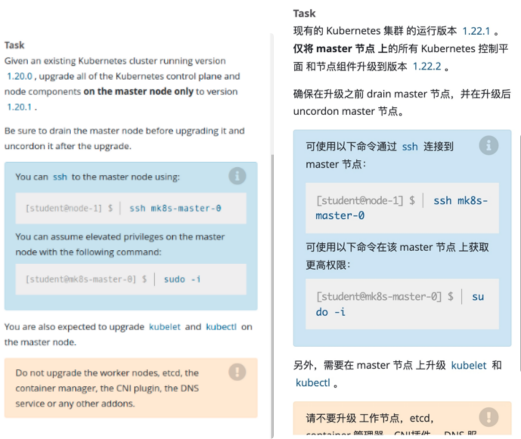
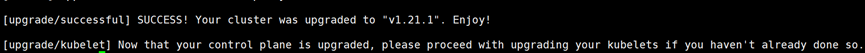

# 1 题设



设置配置环境kubectl config use-context mk8s

现有的kubernetes集群正在运行的版本是1.23.1,仅将master节点上的所有kubernetes控制平面 和节点组件升级到版本1.23.2；

并在主节点上升级kubelet 和kubectl。

---

确保在升级之前 drain master 节点，并在升级后 uncordon master 节点。
可以使用以下命令，通过 ssh 连接到 master 节点： ssh master01
可以使用以下命令，在该 master 节点上获取更高权限： sudo -i

另外，在主节点上升级 kubelet 和 kubectl。
请不要升级工作节点，etcd，container 管理器，CNI 插件， DNS 服务或任何其他插件。 


# 2 相关文档

> 依次点击 Tasks → Administer a Cluster → Administration with kubeadm → Upgrading kubeadm clusters （看不懂英文的，可右上角翻译成中文）  
> [https://kubernetes.io/zh-cn/docs/tasks/administer-cluster/kubeadm/kubeadm-upgrade/](https://link.zhihu.com/?target=https%3A//kubernetes.io/zh-cn/docs/tasks/administer-cluster/kubeadm/kubeadm-upgrade/)


# 3 解答

1、切换答题环境（考试环境有多个，每道题要在对应的环境中作答）
kubectl config use-context mk8s
kubectl get nodes

2、驱除master节点pod（考试环境只有一个master节点）

kubectl cordon k8s-master-1
kubectl drain k8s-master-1 --delete-emptydir-data --ignore-daemonsets --force

3、升级kubeadm版本到1.23.2

```
ssh master01
sudo -i

apt-get update

apt-cache show kubeadm|grep 1.23.2
apt-cache policy kubeadm | grep 1.21.1  

# 注意版本的差异，有可能并非1.20.1升级到1.21.1
apt-get install kubeadm=1.23.2-00
Do you want to continue? [y/n] y
```

4、验证升级计划

```
kubeadm version


# 验证升级计划，会显示很多可升级的版本，我们关注题目要求升级到的那个版本。
kubeadm upgrade plan
```


5、选择升级的版本 v1.23.2，忽略etcd升级
```

# 开始升级Master节点，注意看题需不需要升级etcd
kubeadm upgrade apply v1.23.2 --etcd-upgrade=false -f
[upgrade/confirm] Are you sure you want to proceed with the upgrade? [y/n]: y
```



```
# 注意：自己的环境升级，可能会报找不到coredns的镜像，可以使用如下方法解决：
所有节点docker pull coredns/coredns:1.8.0 ; docker tag coredns/coredns:1.8.0
registry.cn-hangzhou.aliyuncs.com/google_containers/coredns/coredns:v1.8.0 
然后继续就行。1.8.0改成你自己CoreDNS 报错的版本
```


6、升级kubelet、kubectl

```
# 升级
apt-get install kubelet=1.23.2-00 kubectl=1.23.2-00
Do you want to continue? [y/n] y
kubelet --version
kubectl version
 
# 重启kubelet
systemctl daemon-reload
systemctl restart kubelet
```


7、设置节点可调度
```
kubectl uncordon k8s-master-1

output 为 
node/k8s-master uncordoned
```


8、验证升级后的版本
kubectl get nodes

```
NAME           STATUS   ROLES                  AGE   VERSION
k8s-master01   Ready    control-plane,master   11d   v1.21.1
k8s-node01     Ready    <none>                 8d    v1.20.1
k8s-node02     Ready    <none>                 11d   v1.20.1
```


