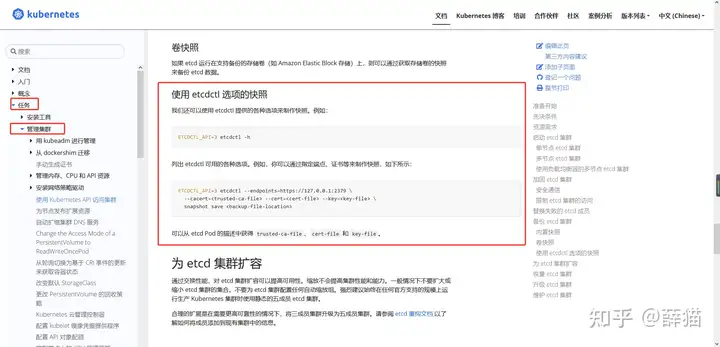

# 1 题设


此项目无需更改配置环境
`[candidate@master01] $ exit `
`#注意，这个之前是在 master01 上，所以要 exit 退到 node01，如果已经是 node01 了，就不要再 exit 了。`


首先为运行在https://127.0.0.1:2379 上的现有etcd实例创建快照并将快照保存到 /srv/data/etcd-snapshot.db。

注：为给定实例创建快照预计能在几秒钟内完成。如果该操作似乎挂起，则命令可能有问题。用 ctrl+c 来取消操作，然后重试。

然后还原位于/srv/data/etcd-snapshot-previous.db的现有先前快照。

提供了TLS 证书和密钥，以通过etcdctl 连接到服务器。
CA 证书：/opt/KUIN00601/ca.crt
客户端证书: /opt/KUIN00601/etcd-client.crt
客户端密钥:/opt/KUIN00601/etcd-client.key


---

可以使用 etcdctl -h 来帮助  


# 2 官方参考

https://kubernetes.io/zh/docs/tasks/administer-cluster/configure-upgrade-etcd/

```
依次点击 Tasks → Administer a Cluster → Operating etcd clusters for Kubernetes （看不懂英文的，可右上角翻译成中文）  

[https://kubernetes.io/zh-cn/docs/tasks/administer-cluster/configure-upgrade-etcd/](https://link.zhihu.com/?target=https%3A//kubernetes.io/zh-cn/docs/tasks/administer-cluster/configure-upgrade-etcd/)
```




# 3 解答

kubernetes的所有数据记录在etcd中，对etcd进行备份就是对集群进行备份。连接etcd需要证书，证书可以从apiserver获取，因为apiserver可以去连etcd。新版本的apiserver都是以static pod方式运行，证书通过volume挂载到pod中。
具体的证书路径和备份到的路径按题目要求设置。ssh到master节点很快，长时间没连上，可以中断重连。
恢复部分据说很容易卡住，不要花太多时间.

切换集群
kubectl config use-context k8s


## 3.1 备份ETCD数据
```
# 如果不使用 export ETCDCTL_API=3，而使用 ETCDCTL_API=3，则下面每条 etcdctl 命令前都要加 ETCDCTL_API=3。
# 如果执行时，提示 permission denied，则是权限不够，命令最前面加 sudo 即可。

export ETCDCTL_API=3

etcdctl --endpoints=https://127.0.0.1:2379 --cacert=/opt/KUIN00601/ca.crt --cert=/opt/KUIN00601/etcd-client.crt --key=/opt/KUIN00601/etcd-client.key snapshot save  /srv/data/etcd-snapshot.db


检查
etcdctl snapshot status /var/lib/backup/etcd-snapshot.db -wtable

```


## 3.2 还原数据

2、先检查一下考试环境，使用的 etcd 是服务还是容器。
kubectl get pod -A
sudo systemctl status etcd
如果是 systemd 服务，则继续往下操作。


如果是二进制安装的etcd，考试环境的etcd可能并非root用户启动的，所以可以先切换到root用户（sudo su -）
然后使用ps aux | grep etcd查看启动用户是谁和启动的配置文件是谁 由config-file字段指定
- 假设用户是etcd。所以如果是二进制安装的etcd，执行恢复时需要root权限，所以在恢复数据时，可以使用root用户恢复，
- 之后更改恢复目录的权限：sudo chown -R etcd.etcd /var/lib/etcd-restore

然后通过systemctl status etcd（或者ps aux | grep etcd）找到它的配置文件
（如果没有配置文件，就可以直接在etcd的service 通过systemctl status etcd即可看到文件中找到data-dir的配置），然后更改data-dir配置后，执行systemctl daemon-reload，最后使用etcd用户systemctl restart etcd即可。


3、确认 etcd 数据目录（--data-dir 值）
ps -ef | grep etcd
一般默认为/var/lib/etcd

4、停止 etcd 服务
还原前最好关掉etcd服务，还原后重新开启etcd服务，
还原后etcd的状态可能有问题，最好不要去赌，失分可能性很大。
sudo systemctl stop etcd

5、先移动备份 etcd 原目录

mkdir /opt/backup/ -p
cd /etc/kubernetes/manifests
mv kube-* /opt/backup

sudo mv /var/lib/etcd /var/lib/etcd.bak

6、开始还原（还原时，可以不加证书和秘钥）
export ETCDCTL_API=3
sudo etcdctl --data-dir=/var/lib/etcd snapshot restore /data/backup/etcd-snapshot-previous.db

给出证书
`etcdctl --endpoints="https://127.0.0.1:2379" --cacert=/opt/KUIN000601/ca.crt --cert=/opt/KUIN000601/etcd-client.crt --key=/opt/KUIN000601/etcd-client.key snapshot restore /var/lib/backup/etcd-snapshot-previous.db --data-dir=/var/lib/etcd-restore`

```
sudo: This command is run with superuser (root) privileges. This is necessary because managing etcd’s data directory typically requires administrative access.

etcdctl: This is the command-line client for etcd, a distributed key-value store used for configuration management, service discovery, and coordination of distributed systems.

--data-dir=/var/lib/etcd: This option specifies the data directory where the restored etcd data will be stored. /var/lib/etcd is the default data directory for etcd.

snapshot restore: This command is used to restore an etcd snapshot from a backup file.

/data/backup/etcd-snapshot-previous.db: This is the path to the etcd snapshot file that you want to restore. This file contains the backup of the etcd data.
```

7
vim /etc/kubernetes/manifests/etcd.yaml
将volume配置的path: /var/lib/etcd改成/var/lib/etcd-restore
  volumes:
  - hostPath:
      path: /etc/kubernetes/pki/etcd
      type: DirectoryOrCreate
    name: etcd-certs
  - hostPath:
      path: /var/lib/etcd-restore


8、更改文件属主
sudo chown -R etcd:etcd /var/lib/etcd

sudo chown -R etcd.etcd /var/lib/etcd-restore

9 还原k8s组件
mv /opt/backup/* /etc/kubernetes/manifests

10 启动 etcd 服务
sudo systemctl start etcd

## 3.3 其他答案

```bash

# 不需要进行集群的切换，etcdctl 工具主机上已存在，无需进行安装
export ETCDCTL_API=3 

etcdctl --endpoints=https://127.0.0.1:2379 --cacert=/opt/KUIN00601/ca.crt --cert=/opt/KUIN00601/etcd-client.crt --key=/opt/KUIN00601/etcd-client.key snapshot save /var/lib/backup/etcd-snapshot.db 

etcdctl --endpoints=https://127.0.0.1:2379 --cacert=/opt/KUIN00601/ca.crt  --cert=/opt/KUIN00601/etcd-client.crt --key=/opt/KUIN00601/etcd-client.key snapshot restore /var/lib/backup/etcd-snapshot-previous.db 
```


