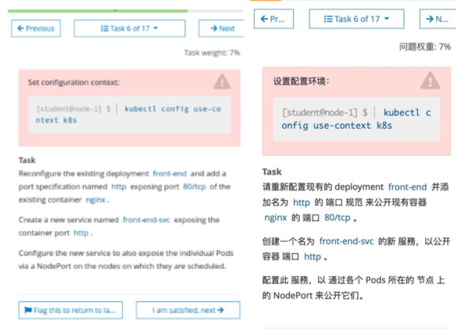
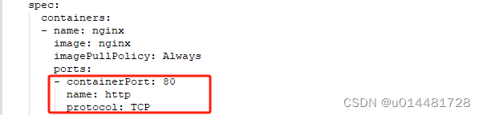

# 1 题设




设置配置环境kubectl config use-context k8s

请重新配置现有的名为front-end的deployment，添加名为http的端口规范来暴露现有容器nginx的端口80/tcp。

创建一个名为front-end-svc 的service，以暴露容器端口http， service的类型为NodePort。 (配置此 service，以通过各个 Pod 所在的节点上的 NodePort 来公开他们。)


 重新配置一个已经存在的deployment front-end，在名字为nginx的容器里面添加一个端口配置，名字为http，暴露端口号为80/TCP.
  然后创建一个service，名字为front-end-svc，暴露该deployment的http端口，并且service的类型为NodePort。

# 2 参考文档


官方参考地址：[Connecting Applications with Services | Kubernetes](https://kubernetes.io/docs/concepts/services-networking/connect-applications-service/ "Connecting Applications with Services | Kubernetes")

https://kubernetes.io/docs/tutorials/services/connect-applications-service/#exposing-pods-to-the-cluster

https://kubernetes.io/docs/tutorials/services/connect-applications-service/#creating-a-service

# 3 解题

1、切换答题环境（考试环境有多个，每道题要在对应的环境中作答）
kubectl config use-context k8s

2 
检查 deployment 信息，并记录 SELECTOR 的 Label 标签，这里是 app=front-end
kubectl get deployment front-end -o wide

3  给 deployment 中的某个容器 设置端口
参考官方文档，按照需要 edit deployment，添加端口信息
kubectl edit deployment front-end

配置如下图：


```
 spec:
 containers:
 - image: vicuu/nginx:hello
   imagePullPolicy: IfNotPresent
   name: nginx #找到此位置。下文会简单说明一下 yaml 文件的格式，不懂 yaml 格式的，往下看。
   #添加这 4 行
   ports: 
     - name: http
       containerPort: 80
       protocol: TCP
```


4  产生一个新的service 

--方法1
kubectl expose deployment 暴露对应端口   执行这个命令后有一个新的 service 被产生 
( 使用 kubectl expose deploy -h 去查询 其用法)

kubectl expose deployment front-end --type=NodePort --port=80 --target-port=80 --name=front-end-svc

注意考试中需要创建的是 NodePort，还是 ClusterIP。如果是 ClusterIP，则应为--type=ClusterIP
--port 是 service 的端口号，--target-port 是 deployment 里 pod 的容器的端口号。


---方法2: 编写service的yaml文件

```
vi front-end-svc.yml 
 
apiVersion: v1
kind: Service
metadata:
  name: front-end-svc
  labels:
    run: nginx   
spec:
  ports:
  - port: 80
    targetPort: http
  selector:
    run: nginx  # label需要匹配，否则访问不到。
  type: NodePort
```

执行service的yaml文件
kubectl apply -f front-end-svc.yml 


验证方法
kubectl describe svc front-end-svc


5 暴露服务后，检查一下 service 的 selector 标签是否正确，这个要与 deployment 的 selector 标签一致的。

kubectl get svc front-end-svc -o wide
kubectl get deployment front-end -o wide

如果你 kubectl expose 暴露服务后，发现 service 的 selector 标签是空的`<none>`，或者不是 deployment 的标签, 则需要编辑此 service，手动添加标签。（模拟环境里暴露服务后，selector 标签是正确的。但是考试时，有时 service 的 selector 标签是 none）

kubectl edit svc front-end-svc

在 ports 这一小段下面添加 selector 标签
 selector:
 app: front-end       注意 yaml 里是写冒号，而不是等号，不是 app=front-end。

6

kubectl get pod,svc -o wide 

curl NodeIP:port
    curl 10.7.30.108:80  
    curl 10.7.30.108:32600 是不行的 , 不通 

curl HostName:port
    curl node01:32600
curl SvcIP
    curl 10.7.30.108


