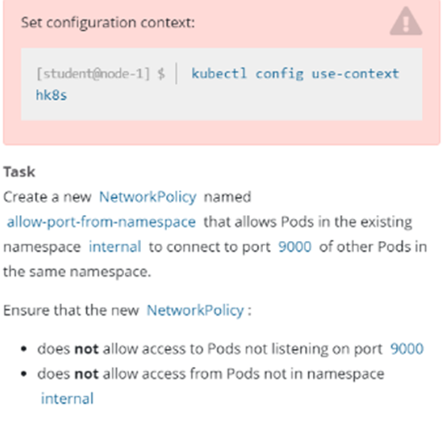
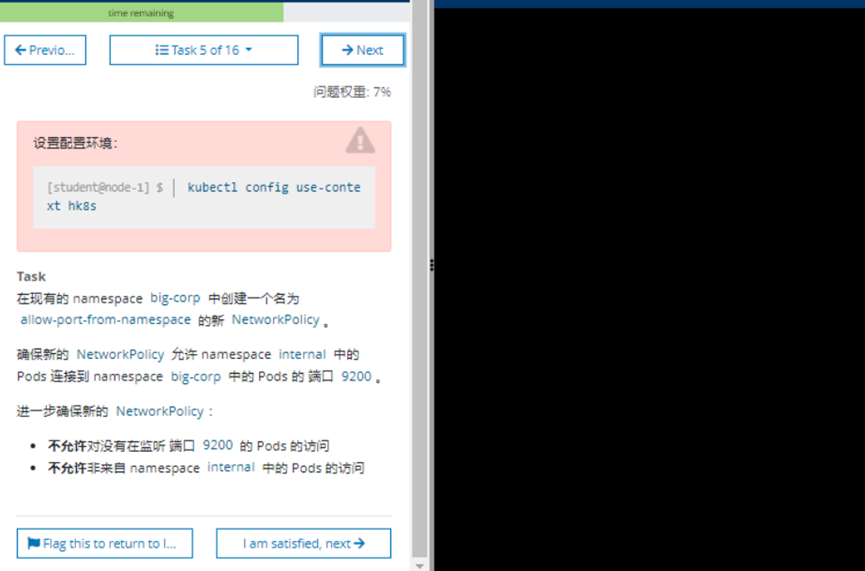

官方参考地址：[网络策略 | Kubernetes](https://kubernetes.io/zh/docs/concepts/services-networking/network-policies/ "网络策略 | Kubernetes")
https://kubernetes.io/zh/docs/concepts/services-networking/network-policies/

 Concepts → Services, Load Balancing, and Networking → Network Policies

# 1 同一个 namespace 之间的pods 访问


## 1.1 题目



设置配置环境kubectl config use-context k8s


创建一个名为allow-port-from-namespace的新NetworkPolicy，以允许现有namespace my-app 中的Pods连接到同一namespace中其他pods的端口9200。
在现有的 namespace my-app 中创建一个名为 allow-port-from-namespace 的新 NetworkPolicy。 

确保新的NetworkPolicy：
-不允许对没有在监听端口9200的pods访问
-不允许不来自namespace my-app的pods的访问


## 1.2 解题


1、切换答题环境（考试环境有多个，每道题要在对应的环境中作答）
kubectl config use-context k8s

2、给my-app命名空间打一个标签
查看所有 ns 的标签 label
kubectl get ns --show-labels

如果访问者的 namespace 没有标签 label，则需要手动打一个。如果有一个独特的标签 label，则也可以直接使用。
kubectl label ns echo project=echo
kubectl label ns my-app project=my-app


3、编写yaml文件

vim networkpolicy.yaml

```
#注意 :set paste，防止 yaml 文件空格错序。
apiVersion: networking.k8s.io/v1
kind: NetworkPolicy
metadata:
 name: allow-port-from-namespace #题目的名字
 namespace: my-app #被访问者的命名空间
spec:
 podSelector: #这两行必须要写，或者也可以写成一行为 podSelector: {}
     matchLabels: {} # 注意 matchLabels:与{}之间有一个空格
 policyTypes:
     - Ingress #策略影响入栈流量
     ingress:
         - from: #允许流量的来源
             - namespaceSelector:
                 matchLabels:
                     project: echo #访问者的命名空间的标签 label
         ports:  # namespace中所有pods的端口9200 都可以接受访问了 
             - protocol: TCP
                 port: 9000 #被访问者公开的端口
```


```

 
apiVersion: networking.k8s.io/v1
kind: NetworkPolicy
metadata:
  name: allow-ports
  namespace: my-app
spec:
  podSelector:
    matchLabels: {}
  policyTypes:
    - Ingress
  ingress:
    - from:
        - namespaceSelector:
            matchLabels:
              project: my-app
      ports:
        - protocol: TCP
          port: 9200
```

```
apiVersion: networking.k8s.io/v1
kind: NetworkPolicy
metadata:
  name: allow-port-from-namespace
  namespace: internal
spec:
  podSelector: {}
  policyTypes:
    - Ingress
  ingress:
    - from:
      - podSelector: {}
    ports:
      - port: 9000
        protocol: TCP

```


3、执行yaml文件

kubectl apply -f networkpolicy.yaml

kubectl describe networkpolicy -n my-app


# 2 不同 namespace之间的pods进行访问  (Namespace A上新建一个NetworkPolicy)

Namespace A 上的 Pod 去访问 Namespace b 上的 PodA 
Namespace A上新建一个NetworkPolicy



上述的题目是只限制在internal命名空间下的，该题可能存在更新。更新如下：  
在现有的namespace my-app中创建一个名为allow-port-from-namespace的NetworkPolicy  

确保这个NetworkPolicy允许namespace my-app中的pods可以连接到namespace big-corp中的8080。  

并且不允许不是my-app命令空间的下的Pod访问，不允许访问没有监听8080端口的Pod。  

所以可以拿着上述的答案，进行稍加修改（注意namespaceSelector的labels配置，首先需要查看big-corp命名空间有没有标签：`kubectl get ns big-corp --show-labels`
如果有，可以更改 `name: big-corp`为查看到的即可。如果没有需要添加一个label：`kubectl label ns big-corp name=big-corp`）：


```
apiVersion: networking.k8s.io/v1
kind: NetworkPolicy
metadata:
  name: allow-port-from-namespace
  namespace: my-app
spec:
  egress:
  - to:
    - namespaceSelector:
         matchLabels:
            name: big-corp  # 注意这里
    ports:
    - protocol: TCP
      port: 8080
  ingress:
  - from:
    - podSelector: {}
    ports:
    - port: 8080
      protocol: TCP
  podSelector: {}
  policyTypes:
  - Ingress
  - Egress
```


# 3 不同 namespace之间的pods进行访问  (Namespace B上新建一个NetworkPolicy)

Namespace A 上的 Pod 去访问 Namespace b 上的 PodA 
Namespace B上新建一个NetworkPolicy


```
# 切换到指定集群
kubectl config use-context [NAME]
# 查看 namespace corp-bar 的标签，如：kubernetes.io/metadata.name=corp-bar
kubectl get ns --show-labels

apiVersion: networking.k8s.io/v1
kind: NetworkPolicy
metadata:
  name: allow-port-from-namespace
  namespace: big-corp 
spec:
  ingress:
  - from:
    - namespaceSelector:
        matchLabels:
          kubernetes.io/metadata.name: internal
    ports:
    - port: 9200
      protocol: TCP
  podSelector: {}
  policyTypes:
  - Ingress
```


