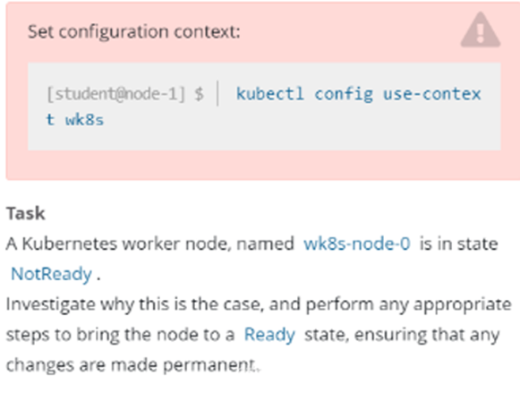

# 1 题设




设置配置环境kubectl config use-context ek8s

名为wk8s-node-0的kubernetes worker node处于Not Ready状态。检查发生这种情况的原因，并采取相应措施将node恢复为Ready状态，确保所做的任何更改永久生效。

可使用以下命令通过ssh 连接到故障node：
ssh wk8s-node-0

可使用一下命令在该node上获取更高权限：
sudo -i


# 2 参考文档 

https://kubernetes.io/zh-cn/docs/tasks/configure-pod-container/static-pod/

# 3 解答


## 3.1 解答1


**解答：**

> 1、切换答题环境（考试环境有多个，每道题要在对应的环境中作答）

```bash
kubectl config use-context ek8s
```

> 2、切换到故障节点

```bash
ssh wk8s-node-0
```

> 3、获取权限并重启节点

```bash
sudo -i
```

查看 kubelet 目前的运行装填 
systemctl status kubelet
```
root@node02:~# systemctl status kubelet
● kubelet.service - kubelet: The Kubernetes Node Agent
     Loaded: loaded (/lib/systemd/system/kubelet.service; disabled; ve>
    Drop-In: /usr/lib/systemd/system/kubelet.service.d
             └─10-kubeadm.conf
     Active: inactive (dead)   没有被启动 
       Docs: https://kubernetes.io/docs/
```


> 4、kubelet 加入开机自启动
```bash


#设置kubelet开机自启动
systemctl enable kubelet --now

#启动kubelet 
systemctl restart kubelet

# 检查 
systemctl status kubelet

root@node02:~# systemctl status kubelet
● kubelet.service - kubelet: The Kubernetes Node Agent
     Loaded: loaded (/lib/systemd/system/kubelet.service; enabled; ven>
    Drop-In: /usr/lib/systemd/system/kubelet.service.d
             └─10-kubeadm.conf
     Active: active (running) since Sat 2024-09-21 19:31:10 CST; 5s ago
       Docs: https://kubernetes.io/docs/
   Main PID: 403815 (kubelet)
      Tasks: 12 (limit: 2218)
     Memory: 25.9M
     CGroup: /system.slice/kubelet.service
             └─403815 /usr/bin/kubelet --bootstrap-kubeconfig=/etc/kub>

Sep 21 19:31:11 node02 kubelet[403815]: I0921 19:31:11.441422  403815 >
Sep 21 19:31:11 node02 kubelet[403815]: I0921 19:31:11.445096  403815 >
Sep 21 19:31:11 node02 kubelet[403815]: I0921 19:31:11.445329  403815 >
Sep 21 19:31:11 node02 kubelet[403815]: I0921 19:31:11.463156  403815 >
Sep 21 19:31:11 node02 kubelet[403815]: I0921 19:31:11.503045  403815 >
Sep 21 19:31:11 node02 kubelet[403815]: I0921 19:31:11.503098  403815 >
Sep 21 19:31:11 node02 kubelet[403815]: I0921 19:31:11.503333  403815 >
Sep 21 19:31:11 node02 kubelet[403815]: I0921 19:31:11.503367  403815 >
Sep 21 19:31:11 node02 kubelet[403815]: I0921 19:31:11.503399  403815 >
Sep 21 19:31:11 node02 kubelet[403815]: I0921 19:31:11.503441  403815 
```

> 5、退出故障节点node02 

```bash
退出node02，如下图所示是输入两次exit,第一次退出提权模式，第二次退出node02,确认已退回到node01，

exit
exit 
```


> 6  再次检查wk8s-node-0是否在ready
 
在 node02 
kubectl get nodes


> kubelet和container是节点主要的服务，确保这两个服务正常

---

其实这题没这么简单，一般启动kubelet后大概率是启动失败的
可能的原因：
1.kubelet二进制文件路径不对，which kubelet后和服务启动文件kubelet systemd service做个对比，看是否是这个原因
2.service文件路径和它启动的路径不一致，在启动目录下找不到service文件，可以全局搜下并做个软链接。
3.其他原因。