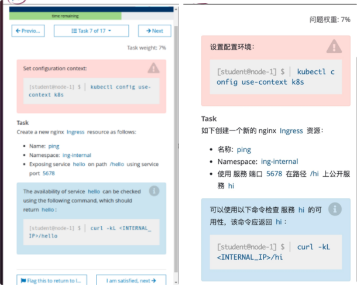

# 1 题目




设置[配置环境](https://so.csdn.net/so/search?q=%E9%85%8D%E7%BD%AE%E7%8E%AF%E5%A2%83&spm=1001.2101.3001.7020)kubectl config use-context k8s

如下创建一个新的nginx ingress 资源：  
名称：pong  
namespace：ing-internal  

使用服务端口5678 在路径/hello 上公开服务hello

可以使用以下命令检查服务 hello 的可用性，该命令应返回 hello：
curl -kL <INTERNAL_IP>/hello

# 2 文档


[Ingress | Kubernetes](https://kubernetes.io/zh/docs/concepts/services-networking/ingress/ "Ingress | Kubernetes")
https://kubernetes.io/docs/concepts/services-networking/ingress/

# 3 题设

1、切换答题环境（考试环境有多个，每道题要在对应的环境中作答）

kubectl config use-context k8s


2 

https://kubernetes.io/docs/concepts/services-networking/ingress/#ingress-class
ingressclassname如果不指定，则会使用集群默认的指定的ingress。
可以选择创建 或者不创建 ingressClass 

创建ingressClass的yaml文件


注意 :set paste，防止 yaml 文件空格错序。

```
apiVersion: networking.k8s.io/v1
kind: IngressClass
metadata:
 labels:
     app.kubernetes.io/component: controller
 name: nginx #考试时没有 ingressClassName，所以需要先手动建一个 ingressClassName，命名就为 nginx。官网页面里是 ingress-example，记得修改下。
 annotations:
     ingressclass.kubernetes.io/is-default-class: "true"
spec:
 controller: k8s.io/ingress-nginx
```

kubectl apply -f ingressclass.yaml


3 

https://kubernetes.io/docs/concepts/services-networking/ingress/#the-ingress-resource
创建ingress的yaml文件

vim ingress.yaml

```
apiVersion: networking.k8s.io/v1
kind: Ingress
metadata:
  name: pong
  namespace：ing-internal
spec:
  ingressClassName: nginx
  rules:
  - http:
      paths:
      - path: /hello
        pathType: Prefix
        backend:
          service:
            name: hello
            port:
              number: 5678
```

```
apiVersion: networking.k8s.io/v1
kind: Ingress
metadata:
 name: ping
 namespace: ing-internal
 annotations:
     kubernetes.io/ingress.class: "nginx" 
     nginx.ingress.kubernetes.io/rewrite-target: / # # 如果考试环境没出ip需要在annotations下加一行.   因为考试环境有多套，不清楚具体抽中的是哪套。在 1.28 的考试里，先写上这行，如果 apply 时报错需 要指定域名，则注释这行再 apply，就成功了。
spec:
 # ingressClassName: nginx #在 1.24 的考试里，这行不要写。
 rules:
 - http:
     paths:
     - path: /hello
       pathType: Prefix
       backend:
         service:
             name: hello
             port:
                 number: 5678
```


执行ingress的yaml文件
kubectl apply -f ingress.yaml 


4 检查 

```text
kubectl get ingress -n ing-internal  取ip后curl验证
curl ingress 的 ip 地址/hello
```


