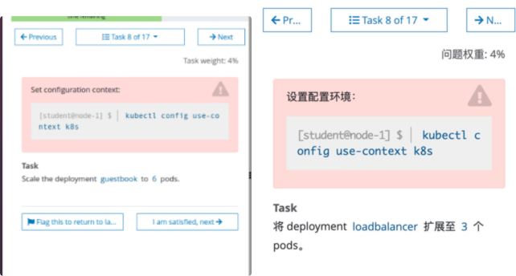

# 1 题设

设置配置环境kubectl config use-context k8s

将名为loadbalancer的deployment资源的Pod的副本数扩容为6个。

# 2 文档

没必要参考网址，使用-h 帮助更方便。
kubectl scale deployment -h

# 3 解题 

1、切换答题环境（考试环境有多个，每道题要在对应的环境中作答）
kubectl config use-context k8s

2、使用命令进行扩容
kubectl scale --replicas=6 deployment/loadbalancer

3、验证方法
kubectl get deploy loadbalancer
kubectl get deployments loadbalancer -o wide
检查pod的个数。

