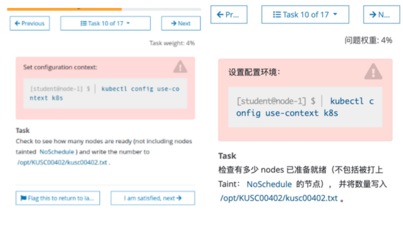
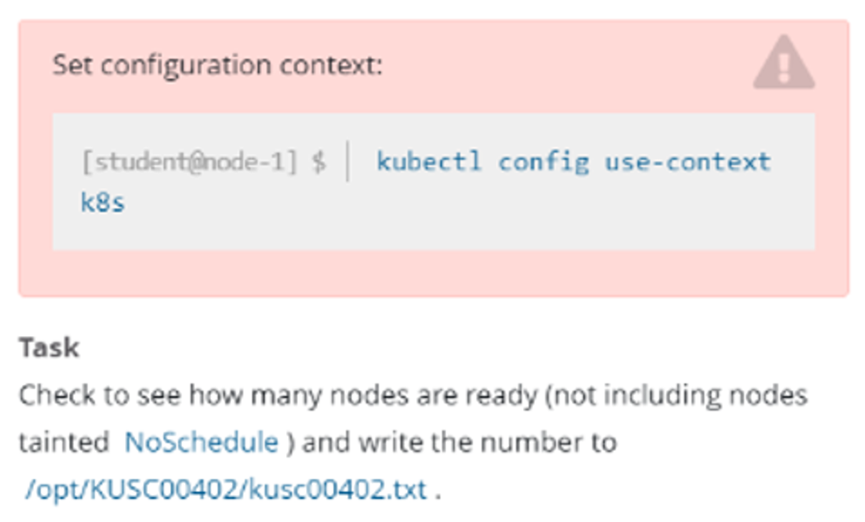

# 1 题设






设置配置环境kubectl config use-context k8s

检查有多少个 nodes 已准备就绪, 并且这些已经就绪的 nodes 中 不包括被打上Taint: NoSchedule ，一共有多少节点 
并将数量写入/opt/KUSC00402/kusc00402.txt


# 2 参考文献 

中文参考地址：[污点和容忍度](https://kubernetes.io/zh-cn/docs/concepts/scheduling-eviction/taint-and-toleration/)  
英文参考地址：[污点和容忍度](https://kubernetes.io/docs/concepts/scheduling-eviction/taint-and-toleration/)

```avrasm
https://kubernetes.io/zh-cn/docs/concepts/scheduling-eviction/taint-and-toleration/
```


# 3 答题


1 切换答题环境（考试环境有多个，每道题要在对应的环境中作答）
kubectl config use-context k8s

2 
获取Ready的节点数a
kubectl get nodes | grep -w  Ready | wc -l

```
candidate@node01:~/yaml$ k get nodes | grep -w Ready
master   Ready      control-plane   99d   v1.30.0
node01   Ready      worker          99d   v1.30.0
```

3 
获取有污点和没有调度的节点数b
kubectl describe nodes | grep -i Taints | grep -i NoSchedule | wc -l

```
candidate@node01:~/yaml$ kubectl describe nodes | grep Taints | grep -i NoSchedule
Taints:             node-role.kubernetes.io/control-plane:NoSchedule
```

可以看到control-plane这个nodes    是 noScheule ,所以 control-plane 这个node 虽然ready 但是 所以不能算在我们想要的 node 之内 

所以 不包括被打上Taint: NoSchedule  und ready  节点数的总数为 1    

4、将a-b的结果写入目标文件
a-b : 我们要获取的 没有污点 , 有调度的 节点数  
echo "查出来的数字 (a-b )" > /opt/KUSC00402/kusc00402.txt

---

grep 的-i 是忽略大小写，grep -v 是排除在外，grep -c 是统计查出来的条数。
grep -w     进行精确匹配 Does a word search.

Linux wc命令用于计算字数。
利用wc指令我们可以计算文件的Byte数、字数、或是列数，若不指定文件名称、或是所给予的文件名为"-"，则wc指令会从标准输入设备读取数据。
https://www.runoob.com/linux/linux-comm-wc.html
    -c或--bytes或--chars 只显示Bytes数。
    -l或--lines 显示行数。
    -w或--words 只显示字数。
    --help 在线帮助。
    --version 显示版本信息。


