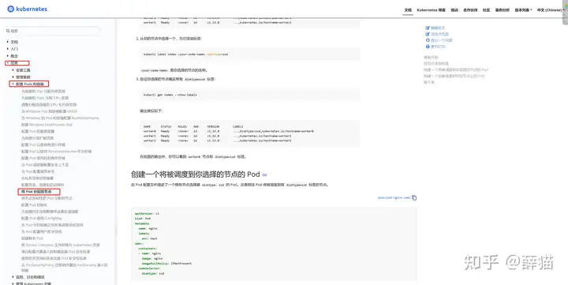
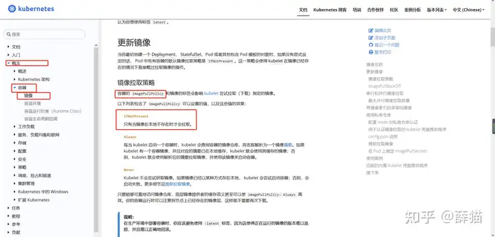

# 1 题设


设置配置环境kubectl config use-context k8s

按如下要求创建并调度一个pod：
- 名称：nginx-kusc00401
- image: nginx
- Node selector: disk=ssd


# 2 官方参考 
https://kubernetes.io/zh-cn/docs/tasks/configure-pod-container/assign-pods-nodes/

https://kubernetes.io/docs/tasks/configure-pod-container/assign-pods-nodes/







# 3 解答


1、切换答题环境（考试环境有多个，每道题要在对应的环境中作答）

kubectl config use-context k8s


2 确保 node youlable 
确保 node 有这个 labels，考试时，检查一下就行，应该已经提前设置好了 labels。
kubectl get nodes --show-labels | grep 'disk=ssd'

如果没有设置，则使用 kubectl label nodes node01 disk=ssd 命令来手动自己设置。
拷贝官文案例，修改下 pod 名称和镜像，删除多余的部分即可

2、编辑yaml文件

vi nginx-kusc00401.yaml 
注意 :set paste，防止 yaml 文件空格错序。

```
    
 
apiVersion: v1
kind: Pod
metadata:
  name: nginx-kusc00401
spec:
  containers:
  - name: nginx
    image: nginx
    imagePullPolicy: IfNotPresent #这句的意思是，如果此 image 已经有了，则不重新下载。考试时写不写这个都是可以的。
  nodeSelector:
    disk: ssd
```


3、执行yaml文件
kubectl apply -f nginx-kusc00401.yaml 

检查 

kubectl get pod nginx-kusc00401 -o wide
kubectl describe node node1 | grep ssd

