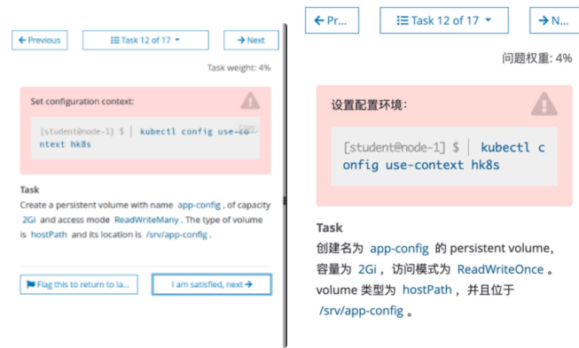
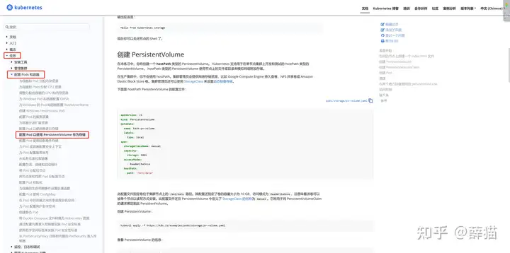

# 1 题设



设置配置环境kubectl config use-context k8s

创建名为app-data的persistent volume，容量为1Gi，访问模式为ReadWriteMany。volume类型为hostPath，位于/srv/app-data。


# 2 参考文档

https://kubernetes.io/zh-cn/docs/tasks/configure-pod-container/configure-persistent-volume-storage/#create-a-pv

中文参考地址：[配置 Pod 以使用 PersistentVolume 作为存储 | Kubernetes](https://kubernetes.io/zh/docs/tasks/configure-pod-container/configure-persistent-volume-storage/)

英语参考地址：[配置 Pod 以使用 PersistentVolume 作为存储 | Kubernetes](https://kubernetes.io/docs/tasks/configure-pod-container/configure-persistent-volume-storage/)



# 3 解答

**解答：**

> 1、切换答题环境（考试环境有多个，每道题要在对应的环境中作答）

```bash
kubectl config use-context k8s
```

> 2、创建yaml文件

注意 volume类型为hostPath, 不是 storgeClassName 为 hostPath 
只要在 `spec.<TypeofVolumes>` 如此这样的写 就直接可以表明 Volume 的类型了 

```bash
vi app-data.yaml 
#注意 :set paste，防止 yaml 文件空格错序。
 
apiVersion: v1
kind: PersistentVolume
metadata:
  name: app-data
spec:
  capacity:
    storage: 1Gi
  accessModes:
    - ReadWriteMany # 注意，考试时的访问模式可能有 ReadWriteMany 和 ReadOnlyMany 和 ReadWriteOnce，根据题目要求写。
  hostPath:
    path: "/srv/app-data"
```

> 3、执行yaml文件

```bash
kubectl apply -f app-data.yaml

kubectl get pv app-config
```

