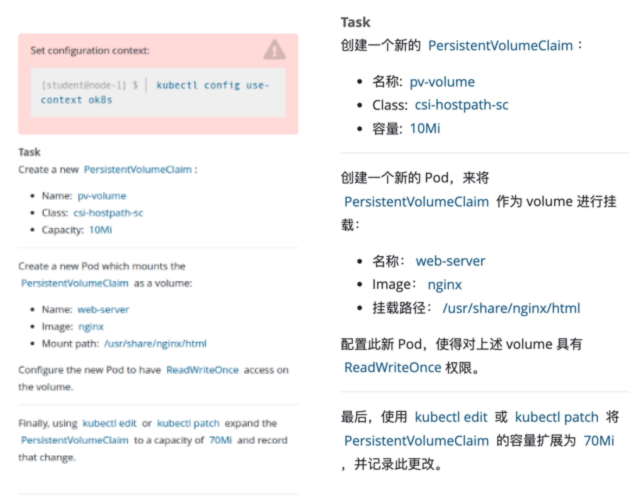
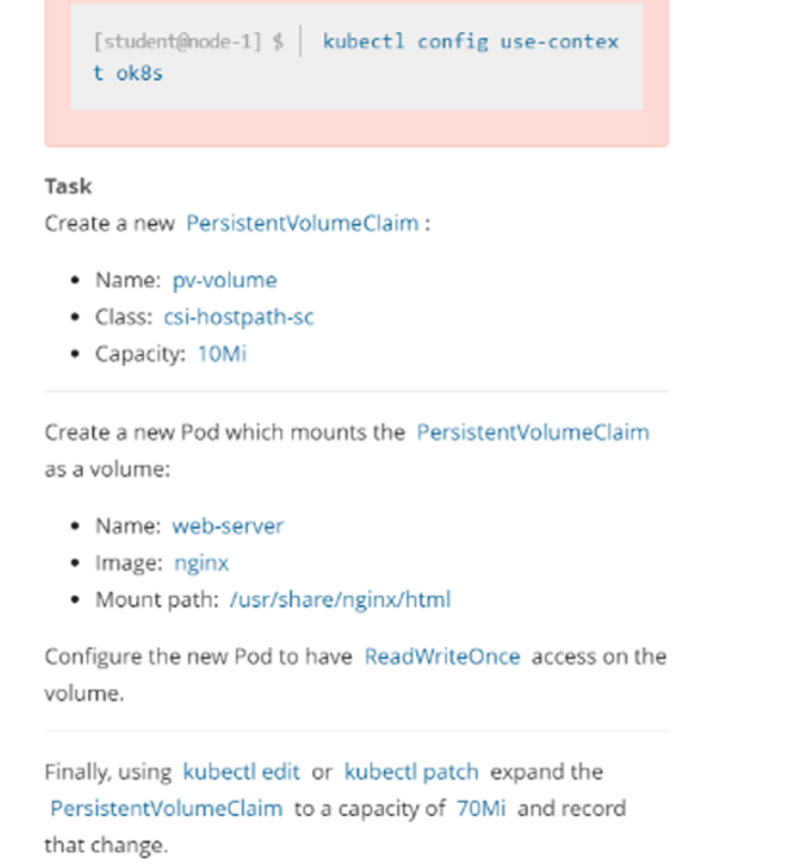
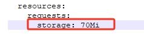
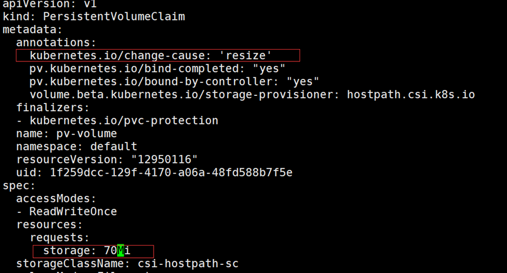

# 1 题设






设置配置环境kubectl config use-context k8s

创建一个新的PersistentVolumeClaim：
- 名称：pvvolume
- class：csi-hostpath-sc
- 容量：10Mi

创建一个新的pod，此pod 拥有 ReadWriteOnce 权限对于 volume which is defined through PersistentVolumeClaim：
- 名称：web-server
- image: nginx
- 挂载路径: /usr/share/nginx/html
- 配置新的pod，以对volume具有ReadWriteOnce 权限。  

最后，使用kubectl edit 或者kubectl patch 将PersistentVolumeClaim的容量扩展为70Mi，并记录此次更改。

# 2 参考文档 

https://kubernetes.io/docs/tasks/configure-pod-container/configure-persistent-volume-storage/#create-a-persistentvolumeclaim

中文参考地址：[Configure a Pod to Use a PersistentVolume for Storage | Kubernetes](https://kubernetes.io/zh-cn/docs/tasks/configure-pod-container/configure-persistent-volume-storage/)
英文参考地址：[Configure a Pod to Use a PersistentVolume for Storage | Kubernetes](https://kubernetes.io/docs/tasks/configure-pod-container/configure-persistent-volume-storage/)

依次点击 Tasks → Configure Pods and Containers → Configure a Pod to Use a PersistentVolume for Storage

# 3 解答

**解答：**

> 1、切换答题环境（考试环境有多个，每道题要在对应的环境中作答）

```bash
kubectl config use-context k8s
```

> 2、编辑并执行创建pvc的yaml文件
注意 :set paste，防止 yaml 文件空格错序。

vim pvvolume.yaml

```bash
apiVersion: v1
kind: PersistentVolumeClaim
metadata:
  name: pv-claim   #pvc 名字
spec:
  storageClassName: csi-hostpath-sc
  accessModes:
    - ReadWriteOnce   # 注意，考试时的访问模式可能有 ReadWriteMany 和 ReadOnlyMany 和 ReadWriteOnce，根据题目要求写。
  resources:
    requests:
      storage: 10Mi
```

kubectl apply -f pvvolume.yaml


3、编辑并执行创建pod的yaml文件
注意 :set paste，防止 yaml 文件空格错序。

vim web-server.yaml

```bash
apiVersion: v1
kind: Pod
metadata:
  name: web-server
spec:
  volumes:
    - name: pv-volume   # 这个和下面的 , 两个 name 要一样。但是不一定 使用上面创建的 pvc 名字
      persistentVolumeClaim:
        claimName: pv-claim   #这个要使用上面创建的 pvc 名字    !!!!! 我在这里出错了 
  containers:
    - name: nginx
      image: nginx:1.16   
      volumeMounts:
        - mountPath: "/usr/share/nginx/html"
          name: pv-volume    # 这的两个 name 要一样。
 
kubectl apply -f web-server.yaml
```

确保 pod 创建成功,  pod 一定要 runnning 才醒 
```
candidate@node01:~/yaml$ k get pod | grep web
web-server                      0/1     Pending            0                    2m

```

4、修改PVC容量（如下图修改为70Mi ）


方式 1
```
kubectl patch pvc pv-volume  -p '{"spec":{"resources":{"requests":{"storage": "70Mi"}}}}' --record
```

方式2 

```bash
# 方式二edit：
kubectl edit pvc pv-volume 
# 记录修改记录，需要加--record参数或--save-config
kubectl edit pvc pv-volume --record
kubectl edit pvc pv-volume --save-config

将两处10Mi都改为70Mi，如果是nfs，会因为不支持动态扩容而失败。
edit完需要稍等一会儿，容量才会变为70Mi

```





5 验证

```shell
kubectl get pvc task-pv-claim


candidate@node01:~/yaml$ k get pvc pv-volume
NAME        STATUS   VOLUME                                     CAPACITY   ACCESS MODES   STORAGECLASS      VOLUMEATTRIBUTESCLASS   AGE
pv-volume   Bound    pvc-f57ba468-784a-411a-ba09-9f0237e63297   70Gi       RWO            csi-hostpath-sc   <unset>                 16m

```


