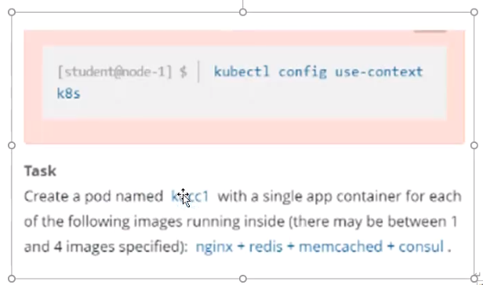

# 1 题设




设置配置环境kubectl config use-context k8s

创建一个名字为kucc4的pod，在pod里面分别为以下每个images单独运行一个app container  
（可能会有1-4 个images）：nginx+redis+memcached+consul

# 2 参考文档

中文参考地址：[Pod](https://kubernetes.io/zh-cn/docs/concepts/workloads/pods/)  
英文参考地址：[Pod](https://kubernetes.io/docs/concepts/workloads/pods/)


# 3 解答 

1 切换答题环境（考试环境有多个，每道题要在对应的环境中作答）
```bash
kubectl config use-context k8s
```


2 创建yaml文件
注意 :set paste，防止 yaml 文件空格错序。
```bash
vim kucc4.yaml 
 
apiVersion: v1
kind: Pod
metadata:
  name: kucc4
spec:
  containers:
  - name: nginx
    image: nginx
    imagePullPolicy: IfNotPresent
  - name: redis
    image: redis
    imagePullPolicy: IfNotPresent
  - name: memcached
    image: memcached
    imagePullPolicy: IfNotPresent
  - name: consul
    image: consul
    imagePullPolicy: IfNotPresent
```


或者用dry-run=client的命令快速生成yaml模板，修改yaml，加入新容器进去
```
kubectl run kucc1 --image=nginx --dry-run=client -o yaml > 11.yaml
apiVersion: v1
kind: Pod
metadata:
  labels:
    run: kucc1
  name: kucc1
spec:
  containers:
  - image: nginx
    name: nginx
  - image: redis
    name: redis
  - image: memcached
    name: memcached
  - image: consul
    name: consul
  dnsPolicy: ClusterFirst
  restartPolicy: Always
```


3 执行yaml文件

```bash
kubectl apply -f kucc4.yaml 
```

