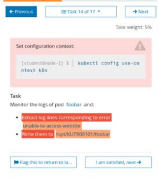
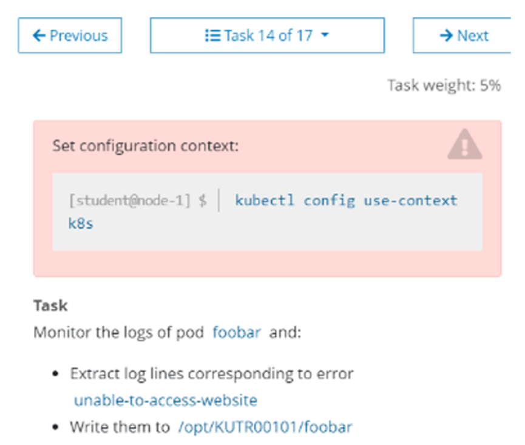

# 1 题设






设置配置环境kubectl config use-context k8s

监控pod foo的日志并：  
- 提取与错误unable-to-access-website 相对应的日志行  
    - RLIMIT_NOFILE
- 将这些日志行写入到/opt/KUTR00101/foo


---
导出Pod 日志到指定文件
监控pod foo 的日志并提取与错误RLIMIT_NOFILE 相对应
的日志行，将这些日志行写入/opt/KUTR00101/foo

# 2 官方文档 

https://kubernetes.io/zh-cn/docs/reference/kubectl/


# 3 解题 

> 1、切换答题环境（考试环境有多个，每道题要在对应的环境中作答）

```bash
kubectl config use-context k8s
```

> 2、查询并记录pod日志

```bash
kubectl logs foo | grep -i "unable-to-access-website" >/opt/KUTR00101/foo
```


检查
cat /opt/KUTR00101/foo

