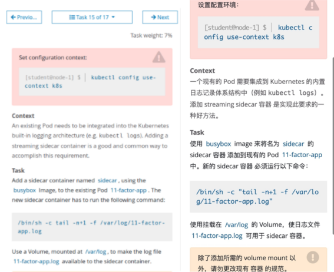
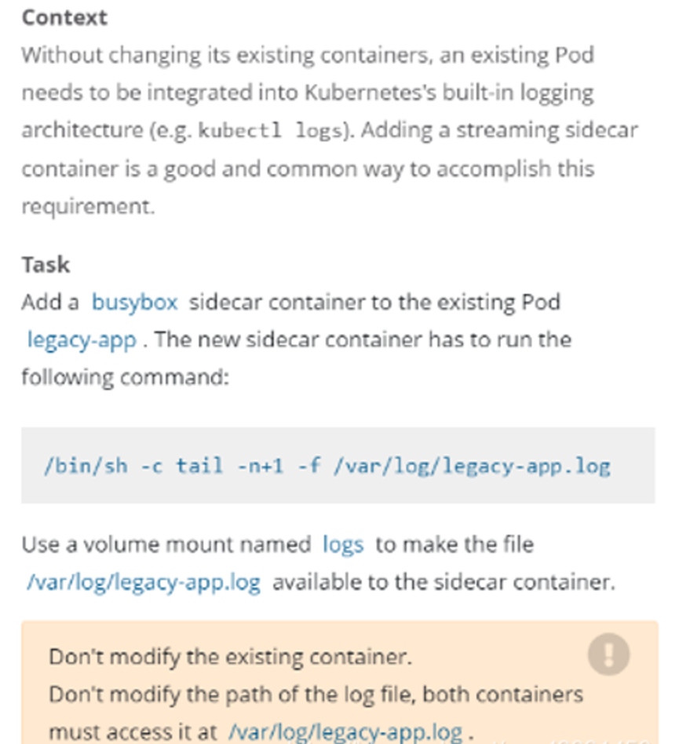

# 1 题设






设置配置环境kubectl config use-context k8s

将一个现有的 Pod 集成到 Kubernetes 的内置日志记录体系结构中（例如 kubectl logs）。添加 streaming sidecar 容器是实现此要求的一种好方法。

1 任务1
Add  a busybox sidecar container to the existing Pod legacy-app. The new sidecar container has to run the following command. 

使用busybox Image来将名为sidecar的sidecar容器添加到现有的Pod 11-factor-app上，新的sidecar容器必须运行以下命令：
`/bin/sh -c 'tail -n+1 -f /var/log/11-factor-app.log'`

```
bin/sh -c 'tail -n+1 -f /var/log/legacy-app.log'
```

- **`bin/sh`**:
    - This is likely a mistake and should be `/bin/sh`. It refers to the Bourne shell, which is a command interpreter. The command `/bin/sh -c` is used to execute the following command string.
- **`-c`**:
    - This flag tells the shell to read commands from the following string.
- **`tail -n+1 -f /var/`**:
    - **`tail`**: This command is used to display the last part of a file.
    - **`-n +1`**: This tells `tail` to start outputting from the first line of the file. 因为用的是 tail, 所以输出的是 最底下的第一行, 即为最后一行 
    - **`-f`**: This tells `tail` to follow the file as it grows, continually displaying new lines added to the file.
    - **`/var/`**: This is a directory, not a file. Typically, `tail` should be used with a specific file, not a directory.


2 任务2 
Use a volume mount named logs to make the file /var/log/11-factor-app.log available  to the sidecar container 

使用volume挂载/var/log/目录，确保sidecar能访问/var/log/11-factor-app.log文件
除了添加所需要的 volume mount 以外，请勿更改现有容器的规格。


# 2 参考文档 

中文参考地址：[日志架构 | Kubernetes](https://kubernetes.io/zh-cn/docs/concepts/cluster-administration/logging/)
https://kubernetes.io/docs/concepts/cluster-administration/logging/#sidecar-container-with-logging-agent
英文参考地址：[日志架构 | Kubernetes](https://kubernetes.io/docs/concepts/cluster-administration/logging/)


# 3 解答


1、切换答题环境（考试环境有多个，每道题要在对应的环境中作答）
```bash
kubectl config use-context k8s
```

2 首先将legacy-app的Pod的yaml导出，大致如下：
kubectl get pod 11-factor-app -o yaml > varlog.yaml

```bash
apiVersion: v1
kind: Pod
metadata:
  name: legacy-app
spec:
  containers:
  - name: count
    image: busybox
    args:
    - /bin/sh
    - -c
    - >
      i=0;
      while true;
      do
        echo "$(date) INFO $i" >> /var/log/legacy-ap.log;
        i=$((i+1));
        sleep 1;
      done   
```


```

apiVersion: v1
kind: Pod
metadata:
  annotations:
    kubectl.kubernetes.io/last-applied-configuration: |
      {"apiVersion":"v1","kind":"Pod","metadata":{"annotations":{},"name":"11-factor-app","namespace":"default"},"spec":{"containers":[{"args":["/bin/sh","-c","i=0; while true; do\n  echo \"$(date) INFO $i\" \u003e\u003e /var/log/11-factor-app.log;\n  i=$((i+1));\n  sleep 1;\ndone \n"],"image":"busybox:1.28","name":"11-factor-app"}],"nodeSelector":{"name":"node01"}}}
  creationTimestamp: "2024-06-14T14:19:07Z"
  name: 11-factor-app
  namespace: default
  resourceVersion: "21768"
  uid: 61979bb6-b3bf-44ba-86bc-a3473615babd
spec:
  containers:
  - args:
    - /bin/sh
    - -c
    - "i=0; while true; do\n  echo \"$(date) INFO $i\" >> /var/log/11-factor-app.log;\n
      \ i=$((i+1));\n  sleep 1;\ndone \n"
    image: busybox:1.28
    imagePullPolicy: IfNotPresent
    name: 11-factor-app
    resources: {}
    terminationMessagePath: /dev/termination-log
    terminationMessagePolicy: File
    volumeMounts:
    - mountPath: /var/run/secrets/kubernetes.io/serviceaccount
      name: kube-api-access-474vz
      readOnly: true
  dnsPolicy: ClusterFirst
  enableServiceLinks: true
  nodeName: node01
  nodeSelector:
    name: node01
  preemptionPolicy: PreemptLowerPriority
  priority: 0
  restartPolicy: Always
  schedulerName: default-scheduler
  securityContext: {}
  serviceAccount: default
  serviceAccountName: default
  terminationGracePeriodSeconds: 30
  tolerations:
  - effect: NoExecute
    key: node.kubernetes.io/not-ready
    operator: Exists
    tolerationSeconds: 300
  - effect: NoExecute
    key: node.kubernetes.io/unreachable
    operator: Exists
    tolerationSeconds: 300
  volumes:
  - name: kube-api-access-474vz
    projected:
      defaultMode: 420
      sources:
      - serviceAccountToken:
          expirationSeconds: 3607
          path: token
      - configMap:
          items:
          - key: ca.crt
            path: ca.crt
          name: kube-root-ca.crt
      - downwardAPI:
          items:
          - fieldRef:
              apiVersion: v1
              fieldPath: metadata.namespace
            path: namespace
status:
  conditions:
  - lastProbeTime: null
    lastTransitionTime: "2024-09-21T13:58:57Z"
    status: "True"
    type: PodReadyToStartContainers
  - lastProbeTime: null
    lastTransitionTime: "2024-06-14T14:19:07Z"
    status: "True"
    type: Initialized
  - lastProbeTime: null
    lastTransitionTime: "2024-09-21T13:58:57Z"
    status: "True"
    type: Ready
  - lastProbeTime: null
    lastTransitionTime: "2024-09-21T13:58:57Z"
    status: "True"
    type: ContainersReady
  - lastProbeTime: null
    lastTransitionTime: "2024-06-14T14:19:07Z"
    status: "True"
    type: PodScheduled
  containerStatuses:
  - containerID: containerd://a5b63f24b13e5558459486bd5b5b1ba32049864de799b3456a5c94a48894c83a
    image: docker.io/library/busybox:1.28
    imageID: sha256:8c811b4aec35f259572d0f79207bc0678df4c736eeec50bc9fec37ed936a472a
    lastState:
      terminated:
        containerID: containerd://aace21575819916cdfa3d29c15658c55e922c5167d87d88d2a91cc5b90dbb6df
        exitCode: 255
        finishedAt: "2024-09-21T15:58:26Z"
        reason: Unknown
        startedAt: "2024-06-26T01:14:00Z"
    name: 11-factor-app
    ready: true
    restartCount: 3
    started: true
    state:
      running:
        startedAt: "2024-09-21T13:58:56Z"
  hostIP: 192.168.10.61
  hostIPs:
  - ip: 192.168.10.61
  phase: Running
  podIP: 10.244.2.64
  podIPs:
  - ip: 10.244.2.64
  qosClass: BestEffort
  startTime: "2024-06-14T14:19:07Z"

```

```bash
# 备份 yaml 文件，防止改错了，回退。
cp varlog.yaml varlog-bak.yaml
```

2 删除原来的pod
k delete pod 11-factor-app

k get pod 11-factor-app 
candidate@node01:~/yaml$ k get pod 11-factor-app
Error from server (NotFound): pods "11-factor-app" not found

3 
在官网上查找sidecar 模版 
https://kubernetes.io/docs/concepts/cluster-administration/logging/#sidecar-container-with-logging-agent
根据官网模版，我们需要先声明一个EmptyDir 储存类型的volume，然后将volume 分别挂载到原有容器和新添加sidecar 容器的目录中

```bash
apiVersion: v1
kind: Pod
metadata:
  name: counter
spec:
  containers:
  - name: count
    image: busybox:1.28
    args:
    - /bin/sh
    - -c
    - >
      i=0;
      while true;
      do
        echo "$i: $(date)" >> /var/log/1.log;
        echo "$(date) INFO $i" >> /var/log/2.log;
        i=$((i+1));
        sleep 1;
      done      
    volumeMounts:
    - name: varlog
      mountPath: /var/log
  - name: count-log-1
    image: busybox:1.28
    args: [/bin/sh, -c, 'tail -n+1 -F /var/log/1.log']
    volumeMounts:
    - name: varlog
      mountPath: /var/log
  - name: count-log-2
    image: busybox:1.28
    args: [/bin/sh, -c, 'tail -n+1 -F /var/log/2.log']
    volumeMounts:
    - name: varlog
      mountPath: /var/log
  volumes:
  - name: varlog
    emptyDir: {}

```

4 
编辑yaml文件

```
#下面两行添加到原有应用的volumeMounts:下面
vim 11-factor-app.yaml

#下面两行添加到原有应用的volumeMounts:下面
- name: varlog
  mountPath: /var/log

#下面为新添加sidecar，紧跟着上面内容就行
- name: sidecar
  image: busybox:1.28
  args: [/bin/sh -c 'tail -n+1 -f /var/log/11-factor-app.log']
  volumeMounts:
  - name: varlog
    mountPath: /var/log
#一下内容添加在原POD 最下面的volumes:下面
- name: varlog
  emptyDir: {}
```


```

# 修改 varlog.yaml 文件
vim varlog.yaml

apiVersion: v1
kind: Pod
metadata:
  name: legacy-app
spec:
    containers:
    - name: count
      image: busybox
      args:
      - /bin/sh
      - -c
      - >
        i=0;
        while true;
        do
          echo "$(date) INFO $i" >> /var/log/legacy-ap.log;
          i=$((i+1));
          sleep 1;
        done  
      volumeMounts: # 非新加内容, 属于名字为 count的 container.
      - name: default-token-4l6w8 
        mountPath: /var/run/secrets/kubernetes.io/serviceaccount
        readOnly: true
      - name: varlog  #新加内容 给原有的 container 加上这个volume, 使得这个contianer 的log 可以被输出 
        mountPath: /var/log
    - name: sidecar #新加内容，注意 name 别写错了, 新开一个 container , 名字为 sidebar, 不属于 名字为 count的 container. 
      image: busybox #新加内容
      args: [/bin/sh, -c, 'tail -n+1 -f /var/log/11-factor-app.log'] #新加内容，注意 文件名 别写错了。另外是用逗号分隔的，而题目里是空格。
      volumeMounts: #新加内容, , 属于 sidecar 这个container 中的 volueMounts属性 
      - name: varlog #新加内容
        mountPath: /var/log #新加内容
        dnsPolicy: ClusterFirst
        enableServiceLinks: true
    
    volumes: #在原配置文件，灰色的这段后面添加。 属于整个 pod 的 volumene , 并不属于某个 contianer , volumes 这个词和 contianer这个词 是同级的 
     - name: kube-api-access-kcjc2
       projected:
       defaultMode: 420
       sources:
     - serviceAccountToken:
       expirationSeconds: 3607
       path: token
     - configMap:
       items:
     - key: ca.crt
       path: ca.crt
       name: kube-root-ca.crt
     - downwardAPI:
       items:
     - fieldRef:
       apiVersion: v1
       fieldPath: metadata.namespace
       path: namespace
     - name: varlog #新加内容，注意找好位置。  使得该 Pod 有用一个类型为 emptyDir的卷. 这个 pod 被挂载上了一个名字为 volumeType为emptyDir 的 Volume, 这个Volume 是自动被创建的. 这样才可以在上的的 container 中 在  volumeMounts 中 使用这个名为 varlog 的Volume   
       emptyDir: {} #新加内容`
```


```bash
vi factor-app.yaml
 
apiVersion: v1
kind: Pod
metadata:
  name: 11-factor-app
spec:
  containers:
  - name: count
    image: busybox
    args:
    - /bin/sh
    - -c
    - >
      i=0;
      while true;
      do
        echo "$i: $(date)" >> /var/log/11-factor-app.log;
        i=$((i+1));
        sleep 1;
      done      
    volumeMounts:
    - name: varlog
      mountPath: /var/log
  - name: sidecar
    image: busybox
    args: [/bin/sh, -c, 'tail -n+1 -f /var/log/11-factor-app.log']
    volumeMounts:
    - name: varlog
      mountPath: /var/log
  volumes:
  - name: varlog  # 这个 pod 被挂载上了一个名字为 volumeType为emptyDir 的 Volume, 这个Volume 是自动被创建的. 这样才可以在上的的 container 中 在  volumeMounts 中 使用这个名为 varlog 的Volume   
    emptyDir: {}
```

```
apiVersion: v1
kind: Pod
metadata:
  annotations:
    kubectl.kubernetes.io/last-applied-configuration: |
      {"apiVersion":"v1","kind":"Pod","metadata":{"annotations":{},"name":"11-factor-app","namespace":"default"},"spec":{"containers":[{"args":["/bin/sh","-c","i=0; while true; do\n  echo \"$(date) INFO $i\" \u003e\u003e /var/log/11-factor-app.log;\n  i=$((i+1));\n  sleep 1;\ndone \n"],"image":"busybox:1.28","name":"11-factor-app"}],"nodeSelector":{"name":"node01"}}}
  creationTimestamp: "2024-06-14T14:19:07Z"
  name: 11-factor-app
  namespace: default
  resourceVersion: "21768"
  uid: 61979bb6-b3bf-44ba-86bc-a3473615babd
spec:
  containers:
  - args:
    - /bin/sh
    - -c
    - "i=0; while true; do\n  echo \"$(date) INFO $i\" >> /var/log/11-factor-app.log;\n
      \ i=$((i+1));\n  sleep 1;\ndone \n"
    image: busybox:1.28
    imagePullPolicy: IfNotPresent
    name: 11-factor-app
    resources: {}
    terminationMessagePath: /dev/termination-log
    terminationMessagePolicy: File
    volumeMounts:
    - mountPath: /var/run/secrets/kubernetes.io/serviceaccount
      name: kube-api-access-474vz
      readOnly: true
    - name: varlog # 这里 
      mountPath: /var/log
  - name: sidecar  # 这里
    image: busybox:1.28
    args: [bin/s, -c, 'tail -n+1 -f /var/log/11-factor-app.log']
    volumeMounts:
    - name: vorlog
      mountPath: /var/log
  dnsPolicy: ClusterFirst
  enableServiceLinks: true
  nodeName: node01
  nodeSelector:
    name: node01
  preemptionPolicy: PreemptLowerPriority
  priority: 0
  restartPolicy: Always
  schedulerName: default-scheduler
  securityContext: {}
  serviceAccount: default
  serviceAccountName: default
  terminationGracePeriodSeconds: 30
  tolerations:
  - effect: NoExecute
    key: node.kubernetes.io/not-ready
    operator: Exists
    tolerationSeconds: 300
  - effect: NoExecute
    key: node.kubernetes.io/unreachable
    operator: Exists
    tolerationSeconds: 300
  volumes:
  - name: kube-api-access-474vz
    projected:
      defaultMode: 420
      sources:
      - serviceAccountToken:
          expirationSeconds: 3607
          path: token
      - configMap:
          items:
          - key: ca.crt
            path: ca.crt
          name: kube-root-ca.crt
      - downwardAPI:
          items:
          - fieldRef:
              apiVersion: v1
              fieldPath: metadata.namespace
            path: namespace
  - name: varlog  #这里
    emptyDir: {}
status:
  conditions:
  - lastProbeTime: null
    lastTransitionTime: "2024-09-21T13:58:57Z"
    status: "True"
    type: PodReadyToStartContainers
  - lastProbeTime: null
    lastTransitionTime: "2024-06-14T14:19:07Z"
    status: "True"
    type: Initialized
  - lastProbeTime: null
    lastTransitionTime: "2024-09-21T13:58:57Z"
    status: "True"
    type: Ready
  - lastProbeTime: null
    lastTransitionTime: "2024-09-21T13:58:57Z"
    status: "True"
    type: ContainersReady
  - lastProbeTime: null
    lastTransitionTime: "2024-06-14T14:19:07Z"
    status: "True"
    type: PodScheduled
  containerStatuses:
  - containerID: containerd://a5b63f24b13e5558459486bd5b5b1ba32049864de799b3456a5c94a48894c83a
    image: docker.io/library/busybox:1.28
    imageID: sha256:8c811b4aec35f259572d0f79207bc0678df4c736eeec50bc9fec37ed936a472a
    lastState:
      terminated:
        containerID: containerd://aace21575819916cdfa3d29c15658c55e922c5167d87d88d2a91cc5b90dbb6df
        exitCode: 255
        finishedAt: "2024-09-21T15:58:26Z"
        reason: Unknown
        startedAt: "2024-06-26T01:14:00Z"
    name: 11-factor-app
    ready: true
    restartCount: 3
    started: true
    state:
      running:
        startedAt: "2024-09-21T13:58:56Z"
  hostIP: 192.168.10.61
  hostIPs:
  - ip: 192.168.10.61
  phase: Running
  podIP: 10.244.2.64
  podIPs:
  - ip: 10.244.2.64
  qosClass: BestEffort
  startTime: "2024-06-14T14:19:07Z"

```

3、创建新pod

```bash
kubectl apply -f 11-factor-app.yaml #应用yaml 文件

kubectl get pod 11-factor-app #查看Pod 运行状况
kubectl logs 11-factor-app sidecar #日志打印输出
candidate@node01:~/yaml$ kubectl logs 11-factor-app sidecar
Sat Sep 21 19:18:55 UTC 2024 INFO 0
Sat Sep 21 19:18:56 UTC 2024 INFO 1
Sat Sep 21 19:18:57 UTC 2024 INFO 2
Sat Sep 21 19:18:58 UTC 2024 INFO 3
Sat Sep 21 19:18:59 UTC 2024 INFO 4
Sat Sep 21 19:19:00 UTC 2024 INFO 5
Sat Sep 21 19:19:01 UTC 2024 INFO 6

```


# 4 背景知识

https://kubernetes.io/zh-cn/docs/concepts/cluster-administration/logging/#cluster-level-logging-architectures


## 4.1 集群级日志架构[](https://kubernetes.io/zh-cn/docs/concepts/cluster-administration/logging/#cluster-level-logging-architectures)

虽然 Kubernetes 没有为集群级日志记录提供原生的解决方案，但你可以考虑几种常见的方法。 以下是一些选项：

- 使用在每个节点上运行的节点级日志记录代理。
- 在应用程序的 Pod 中，包含专门记录日志的边车（Sidecar）容器。
- 将日志直接从应用程序中推送到日志记录后端。

### 4.1.1 使用节点级日志代理[](https://kubernetes.io/zh-cn/docs/concepts/cluster-administration/logging/#using-a-node-logging-agent)


你可以通过在每个节点上使用**节点级的日志记录代理**来实现集群级日志记录。 日志记录代理是一种用于暴露日志或将日志推送到后端的专用工具。 通常，日志记录代理程序是一个容器，它可以访问包含该节点上所有应用程序容器的日志文件的目录。

由于日志记录代理必须在每个节点上运行，推荐以 `DaemonSet` 的形式运行该代理。

节点级日志在每个节点上仅创建一个代理，不需要对节点上的应用做修改。

容器向标准输出和标准错误输出写出数据，但在格式上并不统一。 节点级代理收集这些日志并将其进行转发以完成汇总。

### 4.1.2 使用边车容器运行日志代理[](https://kubernetes.io/zh-cn/docs/concepts/cluster-administration/logging/#sidecar-container-with-logging-agent)

你可以通过以下方式之一使用边车（Sidecar）容器：

- 边车容器将应用程序日志传送到自己的标准输出。
- 边车容器运行一个日志代理，配置该日志代理以便从应用容器收集日志。

#### 4.1.2.1 传输数据流的边车容器[](https://kubernetes.io/zh-cn/docs/concepts/cluster-administration/logging/#传输数据流的边车容器)


利用边车容器，写入到自己的 `stdout` 和 `stderr` 传输流， 你就可以利用每个节点上的 kubelet 和日志代理来处理日志。 边车容器从文件、套接字或 journald 读取日志。 每个边车容器向自己的 `stdout` 和 `stderr` 流中输出日志。

这种方法允许你将日志流从应用程序的不同部分分离开，其中一些可能缺乏对写入 `stdout` 或 `stderr` 的支持。重定向日志背后的逻辑是最小的，因此它的开销不大。 另外，因为 `stdout` 和 `stderr` 由 kubelet 处理，所以你可以使用内置的工具 `kubectl logs`。

例如，某 Pod 中运行一个容器，且该容器使用两个不同的格式写入到两个不同的日志文件。 下面是这个 Pod 的清单：

[`admin/logging/two-files-counter-pod.yaml`](https://raw.githubusercontent.com/kubernetes/website/main/content/zh-cn/examples/admin/logging/two-files-counter-pod.yaml) 

```yaml
apiVersion: v1
kind: Pod
metadata:
  name: counter
spec:
  containers:
  - name: count
    image: busybox:1.28
    args:
    - /bin/sh
    - -c
    - >
      i=0;
      while true;
      do
        echo "$i: $(date)" >> /var/log/1.log;
        echo "$(date) INFO $i" >> /var/log/2.log;
        i=$((i+1));
        sleep 1;
      done      
    volumeMounts:
    - name: varlog
      mountPath: /var/log
  volumes:
  - name: varlog
    emptyDir: {}
```


---


不建议在同一个日志流中写入不同格式的日志条目，即使你成功地将其重定向到容器的 `stdout` 流。 相反，你可以创建两个边车容器。每个边车容器可以从共享卷跟踪特定的日志文件， 并将文件内容重定向到各自的 `stdout` 流。

下面是运行两个边车容器的 Pod 的清单：

[`admin/logging/two-files-counter-pod-streaming-sidecar.yaml`](https://raw.githubusercontent.com/kubernetes/website/main/content/zh-cn/examples/admin/logging/two-files-counter-pod-streaming-sidecar.yaml) 

```yaml
apiVersion: v1
kind: Pod
metadata:
  name: counter
spec:
  containers:
  - name: count
    image: busybox:1.28
    args:
    - /bin/sh
    - -c
    - >
      i=0;
      while true;
      do
        echo "$i: $(date)" >> /var/log/1.log;
        echo "$(date) INFO $i" >> /var/log/2.log;
        i=$((i+1));
        sleep 1;
      done      
    volumeMounts:
    - name: varlog
      mountPath: /var/log
  - name: count-log-1
    image: busybox:1.28
    args: [/bin/sh, -c, 'tail -n+1 -F /var/log/1.log']
    volumeMounts:
    - name: varlog
      mountPath: /var/log
  - name: count-log-2
    image: busybox:1.28
    args: [/bin/sh, -c, 'tail -n+1 -F /var/log/2.log']
    volumeMounts:
    - name: varlog
      mountPath: /var/log
  volumes:
  - name: varlog
    emptyDir: {}
```

现在当你运行这个 Pod 时，你可以运行如下命令分别访问每个日志流：

```shell
kubectl logs counter count-log-1
```

输出类似于：

```console
0: Fri Apr  1 11:42:26 UTC 2022
1: Fri Apr  1 11:42:27 UTC 2022
2: Fri Apr  1 11:42:28 UTC 2022
...
```

```shell
kubectl logs counter count-log-2
```

输出类似于：

```console
Fri Apr  1 11:42:29 UTC 2022 INFO 0
Fri Apr  1 11:42:30 UTC 2022 INFO 0
Fri Apr  1 11:42:31 UTC 2022 INFO 0
...
```