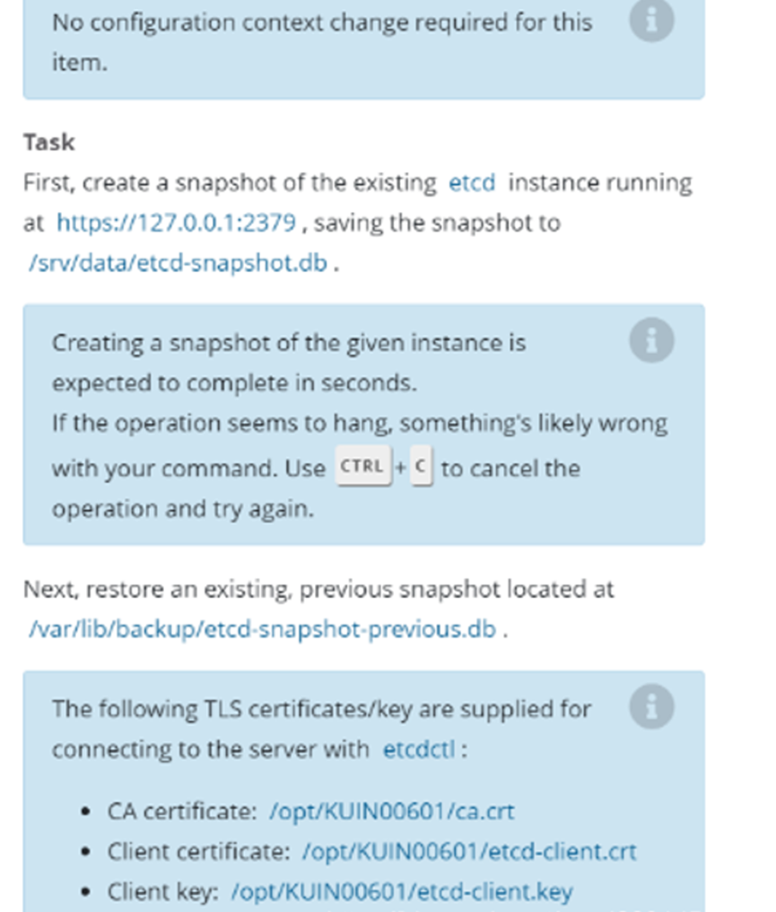

# 1 题设



此项目无需更改配置环境
`[candidate@master01] $ exit `
`#注意，这个之前是在 master01 上，所以要 exit 退到 node01，如果已经是 node01 了，就不要再 exit 了。`

1 
首先为运行在https://127.0.0.1:2379 上的现有etcd实例创建快照并将快照保存到 /var/lib/backup/etcd-snapshot.db

注：为给定实例创建快照预计能在几秒钟内完成。如果该操作似乎挂起，则命令可能有问题。用 ctrl+c 来取消操作，然后重试。

2 
然后还原位于/data/backup/etcd-snapshot-previous.db的现有先前快照。

提供了TLS 证书和密钥，以通过etcdctl 连接到服务器。
CA 证书：/opt/KUIN00601/ca.crt
客户端证书: /opt/KUIN00601/etcd-client.crt
客户端密钥:/opt/KUIN00601/etcd-client.key


# 2 官方参考

可以使用 etcdctl -h 来帮助  

依次点击 Tasks → Administer a Cluster → Operating etcd clusters for Kubernetes （看不懂英文的，可右上角翻译成中文）  
Operating etcd clusters for Kubernetes
https://kubernetes.io/docs/tasks/administer-cluster/configure-upgrade-etcd/
https://kubernetes.io/zh/docs/tasks/administer-cluster/configure-upgrade-etcd/

```
[https://kubernetes.io/zh-cn/docs/tasks/administer-cluster/configure-upgrade-etcd/](https://link.zhihu.com/?target=https%3A//kubernetes.io/zh-cn/docs/tasks/administer-cluster/configure-upgrade-etcd/)
```


# 3 解答

kubernetes的所有数据记录在etcd中，对etcd进行备份就是对集群进行备份。连接etcd需要证书，证书可以从apiserver获取，因为apiserver可以去连etcd。新版本的apiserver都是以static pod方式运行，证书通过volume挂载到pod中。
具体的证书路径和备份到的路径按题目要求设置。ssh到master节点很快，长时间没连上，可以中断重连。
恢复部分据说很容易卡住，不要花太多时间.

切换集群
kubectl config use-context k8s

## 3.1 登录master 节点

```
ssh master #因为etcd 服务在在master 节点，所以我们需要ssh 到master 节点
sudo -i #操作ETCD 服务需要管理员权限，提权
```

## 3.2 备份ETCD数据
```
# 如果不使用 export ETCDCTL_API=3，而使用 ETCDCTL_API=3，则下面每条 etcdctl 命令前都要加 ETCDCTL_API=3。
# 如果执行时，提示 permission denied，则是权限不够，命令最前面加 sudo 即可。
# etcdctl 中通过 参数 给出证书的路径 

export ETCDCTL_API=3  

etcdctl --endpoints=https://127.0.0.1:2379 --cacert=/opt/KUIN00601/ca.crt --cert=/opt/KUIN00601/etcd-client.crt --key=/opt/KUIN00601/etcd-client.key snapshot save /var/lib/backup/etcd-snapshot.db
```


检查备份的结果 
ETCDCTL_API=3  etcdutl snapshot status /var/lib/backup/etcd-snapshot.db --write-out=table 
etcdutl snapshot status /var/lib/backup/etcd-snapshot.db -wtable
```

+----------+----------+------------+------------+
|   HASH   | REVISION | TOTAL KEYS | TOTAL SIZE |
+----------+----------+------------+------------+
| a7611a81 |    26278 |       2277 |     6.4 MB |
+----------+----------+------------+------------+

```

在开始ETCD 恢复操作之前，先看一下pod presentation 个数，相当于一个状态标记，用于恢复完毕的对比，证明数据已成功恢复
kubectl get pod -n default | grep presentation | wc -l
为 1 

## 3.3 准备工作

### 3.3.1 确定 etcd的 data-dir的位置 (通常是/var/lib/etcd)

 1 先检查一下考试环境，使用的 etcd 是服务还是容器。
kubectl get pod -A
sudo systemctl status etcd 有结果 就代表 etcd 是服务 
#### 3.3.1.1 etcd 是服务

1 
etcd的service 通过systemctl status etcd即可看到文件中找到data-dir的配置

#### 3.3.1.2 etcd是二进制安装 

考试环境的etcd可能并非root用户启动的，所以可以先切换到root用户（sudo su -）
假设启动用户是etcd。所以如果是二进制安装的etcd，执行恢复时需要root权限，所以在恢复数据时，可以使用root用户恢复， 


3 确认 etcd 数据目录（--data-dir 值）
 ps aux | grep etcd 或者 ps -ef | grep etcd 中找到 配置文件, 在配置文件中找到 data-dir

在 在配置文件中找到 data-dir  
data-dir 为 etcd 数据目录
data-dir  一般默认为/var/lib/etcd

` --data-dir=/var/lib/etcd`
 
```sh
root@master:~#  ps aux | grep etcd
root        1555  1.4  2.4 11222268 62168 ?      Ssl  19:59   0:47 etcd --advertise-client-urls=https://192.168.10.60:2379 --cert-file=/etc/kubernetes/pki/etcd/server.crt --client-cert-auth=true --data-dir=/var/lib/etcd --experimental-initial-corrupt-check=true --experimental-watch-progress-notify-interval=5s --initial-advertise-peer-urls=https://192.168.10.60:2380 --initial-cluster=master=https://192.168.10.60:2380 --key-file=/etc/kubernetes/pki/etcd/server.key --listen-client-urls=https://127.0.0.1:2379,https://192.168.10.60:2379 --listen-metrics-urls=http://127.0.0.1:2381 --listen-peer-urls=https://192.168.10.60:2380 --name=master --peer-cert-file=/etc/kubernetes/pki/etcd/peer.crt --peer-client-cert-auth=true --peer-key-file=/etc/kubernetes/pki/etcd/peer.key --peer-trusted-ca-file=/etc/kubernetes/pki/etcd/ca.crt --snapshot-count=10000 --trusted-ca-file=/etc/kubernetes/pki/etcd/ca.crt
root       22559  0.0  0.0   6432   656 pts/0    S+   20:54   0:00 grep --color=auto etcd
root@master:~# systemctl status etcd
Unit etcd.service could not be found.

```


### 3.3.2 停止所有API 实例
即必须 将所有的kube相关的系统配置文件先移出, 才可以实现 停止所有API 实例

mkdir /tmp/kube_backup/
mv /etc/kubernetes/manifests/kube-* /tmp/kube_backup/
一定要是 mv 不能是 cp 

```
/etc/kubernetes/manifests/ 中有什么 
-rw------- 1 root root 4060 Jun 14 20:37 kube-apiserver.yaml
-rw------- 1 root root 3566 Jun 14 20:37 kube-controller-manager.yaml
-rw------- 1 root root 1487 Jun 14 20:37 kube-scheduler.yaml
```


### 3.3.3 备份 etcd 原目录(可以不做)
mkdir /var/lib/etcd_backup/
sudo cp -r /var/lib/etcd /var/lib/etcd_backup


```
root@master:~# ll /var/lib/etcd/
total 12
drwx------  3 root root 4096 Sep 22 19:22 ./
drwxr-xr-x 49 root root 4096 Sep 22 21:06 ../
drwx------  4 root root 4096 Sep 22 19:22 member/
```


### 3.3.4 关掉etcd服务 (如果etcd是一个service的话)
还原前最好关掉etcd服务，还原后重新开启etcd服务，
还原后etcd的状态可能有问题，最好不要去赌，失分可能性很大。
sudo systemctl stop etcd


## 3.4 根据从前的etcd 快照还原etcd 
https://kubernetes.io/docs/tasks/administer-cluster/configure-upgrade-etcd/#restoring-an-etcd-cluster

在恢复集群时，使用--data-dir 选项来指定集群应被恢复到哪个文件夹。
其中`<data-dir-location>` 是将在恢复过程中创建的目录。
自etcd v3.5.x 版本起，使用etcdctl 进行恢复的功能已被弃用，未来的可能会在etcd 版本中被移除。

==原来的 data-dir=/var/lib/etcd,  这时候一定要用一个 新的文件夹 /var/lib/etcd-restore 使得 恢复的时候产生的etcd的数据让在一个心得文件夹 ==

还原时，可以不加证书和秘钥
export ETCDCTL_API=3
sudo etcdutl snapshot restore /data/backup/etcd-snapshot-previous.db --data-dir=/var/lib/etcd-restore 

集群被恢复到 /var/lib/etcd-restore 

或者 给出证书
`etcdutl --endpoints="https://127.0.0.1:2379" --cacert=/opt/KUIN000601/ca.crt --cert=/opt/KUIN000601/etcd-client.crt --key=/opt/KUIN000601/etcd-client.key snapshot restore /var/lib/backup/etcd-snapshot-previous.db --data-dir=/var/lib/etcd-restore`

```
sudo: This command is run with superuser (root) privileges. This is necessary because managing etcd’s data directory typically requires administrative access.

etcdctl: This is the command-line client for etcd, a distributed key-value store used for configuration management, service discovery, and coordination of distributed systems.

--data-dir=/var/lib/etcd: This option specifies the data directory where the restored etcd data will be stored. /var/lib/etcd is the default data directory for etcd.

snapshot restore: This command is used to restore an etcd snapshot from a backup file.

/data/backup/etcd-snapshot-previous.db: This is the path to the etcd snapshot file that you want to restore. This file contains the backup of the etcd data.
```


验证已恢复的数据目录
ls /var/lib/etcd-restore

## 3.5 将Kubernetes 配置文件复制回原目录
cp /tmp/kube_backup/* /etc/kubernetes/manifests/

## 3.6 修改Etcd 配置文件, 使得新的data-dir 被使用

1 将原来的etcd.yaml 移出 /etc/kubernetes/manifests/etcd.yaml
必须是移出, 如果只是在源文件的原位置原来的进行修改 不起作用

mkdir  /tmp/kube_backup/
mv /etc/kubernetes/manifests/etcd.yaml /tmp/kube_backup/bak.etcd.yaml  
==文件名字必须是 bak.etcd.yaml , 不能是 etcd.yaml 否则不起作用 ==
==之所以bak 放在前面是因为实际测试时发现bak 放在后面有时会导致系统还会默认使用原先的配置文件==


2  修改 /etc/kubernetes/manifests/bak.etcd.yaml 中关于 data-dir的路径 
使得 新的 /var/lib/etcd-restore 被使用 
将volume配置的path: /var/lib/etcd改成/var/lib/etcd-restore


2 那些地方需要替换

root@master:~# cat /etc/kubernetes/manifests/etcd.yaml | grep '/var/lib/etcd'
    - --data-dir=/var/lib/etcd
    - mountPath: /var/lib/etcd
      path: /var/lib/etcd

cat /etc/kubernetes/manifests/bak.etcd.yaml > /etc/kubernetes/manifests/etcd.yaml


2 
方法1 
vim /etc/kubernetes/manifests/etcd.yaml

```

spec:
  containers:
  - command:
    - etcd
    - --advertise-client-urls=https://192.168.10.60:2379
    - --cert-file=/etc/kubernetes/pki/etcd/server.crt
    - --client-cert-auth=true
    - --data-dir=/var/lib/etcd  # 修改这里 /var/lib/etcd 改为 /var/lib/etcd-restore


    volumeMounts:
    - mountPath: /var/lib/etcd  # 修改这里 /var/lib/etcd 改为 /var/lib/etcd-restore
      name: etcd-data  
    - mountPath: /etc/kubernetes/pki/etcd
      name: etcd-certs
  hostNetwork: true
  priority: 2000001000
  priorityClassName: system-node-critical
  securityContext:
    seccompProfile:
      type: RuntimeDefault
  volumes:
  - hostPath:
      path: /etc/kubernetes/pki/etcd
      type: DirectoryOrCreate
    name: etcd-certs
  - hostPath:
      path: /var/lib/etcd  # 修改这里 /var/lib/etcd 改为 /var/lib/etcd-restore
      type: DirectoryOrCreate
    name: etcd-data


  volumes:
  - hostPath:
      path: /etc/kubernetes/pki/etcd
      type: DirectoryOrCreate
    name: etcd-certs
  - hostPath:
      path: /var/lib/etcd-restore   
```

查找 
:?string

替换
`:%s /原内容/新内容/g
所有内行内容替换 ， g 便是全局 

:%s//var/lib/etcd///var/lib/etcd-restore/g 这个方法行不通
:%s/var//lib//etcd/var//lib//etcd-restore/g   这个方法行不通 

方法2: 
替换原有配置路径并生成新的etcd.yaml 配置文件
sed 's!/var/lib/etcd!/var/lib/etcd-restore!' /etc/kubernetes/manifests/bak.etcd.yaml > /etc/kubernetes/manifests/etcd.yaml


## 3.7 更改恢复目录的权限(不需要做)
改文件属主
更改恢复目录的权限：
sudo chown -R etcd:etcd /var/lib/etcd
sudo chown -R etcd:etcd /var/lib/etcd-restore  
(将 /var/lib/etcd-restore  目录下的所有文件与子目录的拥有者皆设为 etcd，群体的使用者 etcd:)

## 3.8 重新启动 etcd 服务

然后更改data-dir配置后
sudo systemctl daemon-reload
sudo systemctl restart kubelet
如果 etcd 为一个service的话, 执行systemctl restart etcd即可

## 3.9 检验 


操作完成后需要等待三五分钟集群才会启动成功，启动完成后再验证
要不然的话会一直报错 
```
root@master:~# k get nodes
Error from server (Forbidden): nodes is forbidden: User "kubernetes-admin" cannot list resource "nodes" in API group "" at the cluster scope
```

kubectl get node 验证集群是否重启完毕
node02 是 notready 的状态:  这个可以忽略, 不重要 

kubectl get pod -n default | grep presentation | wc -l 
presentation 数量，恢复完成后获取到的数字应该是“2”


# 4 其他答案(简易版, 不需要中间那么多的配置)

```bash

# 不需要进行集群的切换，etcdctl 工具主机上已存在，无需进行安装
export ETCDCTL_API=3 

etcdctl --endpoints=https://127.0.0.1:2379 --cacert=/opt/KUIN00601/ca.crt --cert=/opt/KUIN00601/etcd-client.crt --key=/opt/KUIN00601/etcd-client.key snapshot save /var/lib/backup/etcd-snapshot.db 

etcdctl --endpoints=https://127.0.0.1:2379 --cacert=/opt/KUIN00601/ca.crt  --cert=/opt/KUIN00601/etcd-client.crt --key=/opt/KUIN00601/etcd-client.key snapshot restore /var/lib/backup/etcd-snapshot-previous.db 
```


