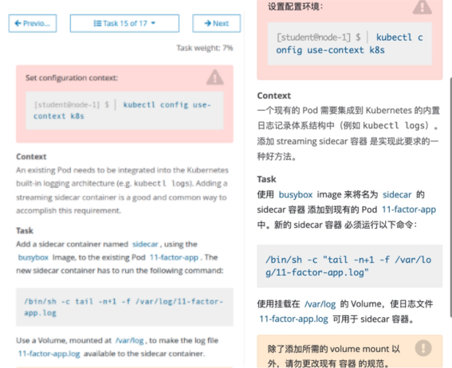
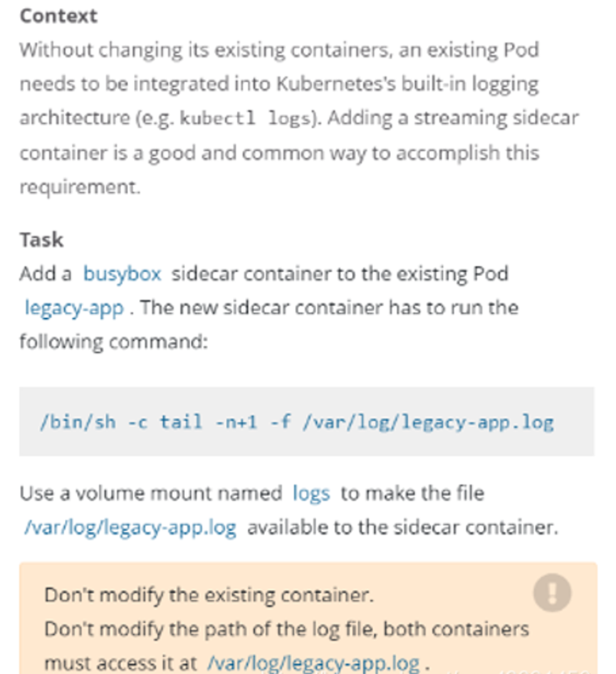

# 1 题设






设置配置环境kubectl config use-context k8s

将一个现有的 Pod 集成到 Kubernetes 的内置日志记录体系结构中（例如 kubectl logs）。添加 streaming sidecar 容器是实现此要求的一种好方法。

1 任务1
Add  a busybox sidecar container to the existing Pod legacy-app. The new sidecar container has to run the following command. 

使用busybox Image来将名为sidecar的sidecar容器添加到现有的Pod 11-factor-app上，新的sidecar容器必须运行以下命令：
/bin/sh -c tail -n+1 -f /var/log/11-factor-app.log

```
bin/sh -c tail -n +1 -f /var/log/legacy-app.log
```

- **`bin/sh`**:
    - This is likely a mistake and should be `/bin/sh`. It refers to the Bourne shell, which is a command interpreter. The command `/bin/sh -c` is used to execute the following command string.
- **`-c`**:
    - This flag tells the shell to read commands from the following string.
- **`tail -n+1 -f /var/`**:
    - **`tail`**: This command is used to display the last part of a file.
    - **`-n +1`**: This tells `tail` to start outputting from the first line of the file.
    - **`-f`**: This tells `tail` to follow the file as it grows, continually displaying new lines added to the file.
    - **`/var/`**: This is a directory, not a file. Typically, `tail` should be used with a specific file, not a directory.


2 任务2 
Use a volume mount named logs to make the file /var/log/11-factor-app.log available  to the sidecar container 

使用volume挂载/var/log/目录，确保sidecar能访问/var/log/11-factor-app.log文件
除了添加所需要的 volume mount 以外，请勿更改现有容器的规格。


# 2 参考文档 

中文参考地址：[日志架构 | Kubernetes](https://kubernetes.io/zh-cn/docs/concepts/cluster-administration/logging/)
https://kubernetes.io/zh-cn/docs/concepts/cluster-administration/logging/

英文参考地址：[日志架构 | Kubernetes](https://kubernetes.io/docs/concepts/cluster-administration/logging/)


# 3 解答


1、切换答题环境（考试环境有多个，每道题要在对应的环境中作答）
```bash
kubectl config use-context k8s
```

2 首先将legacy-app的Pod的yaml导出，大致如下：
kubectl get pod 11-factor-app -o yaml > varlog.yaml

```bash
apiVersion: v1
kind: Pod
metadata:
  name: legacy-app
spec:
  containers:
  - name: count
    image: busybox
    args:
    - /bin/sh
    - -c
    - >
      i=0;
      while true;
      do
        echo "$(date) INFO $i" >> /var/log/legacy-ap.log;
        i=$((i+1));
        sleep 1;
      done   
```


2、编辑yaml文件

```bash
# 备份 yaml 文件，防止改错了，回退。
cp varlog.yaml varlog-bak.yaml

# 修改 varlog.yaml 文件
vim varlog.yaml

apiVersion: v1
kind: Pod
metadata:
  name: legacy-app
spec:
    containers:
    - name: count
      image: busybox
      args:
      - /bin/sh
      - -c
      - >
        i=0;
        while true;
        do
          echo "$(date) INFO $i" >> /var/log/legacy-ap.log;
          i=$((i+1));
          sleep 1;
        done  
      volumeMounts: # 非新加内容, 属于名字为 count的 container.
      - name: default-token-4l6w8 
        mountPath: /var/run/secrets/kubernetes.io/serviceaccount
        readOnly: true
      - name: varlog
        mountPath: /var/log
    - name: sidecar #新加内容，注意 name 别写错了, 新开一个 container , 名字为 sidebar, 不属于 名字为 count的 container. 
      image: busybox #新加内容
      args: [/bin/sh, -c, 'tail -n+1 -f /var/log/11-factor-app.log'] #新加内容，注意 文件名 别写错了。另外是用逗号分隔的，而题目里是空格。
      volumeMounts: #新加内容, , 属于 sidecar 这个container 中的 volueMounts属性 
      - name: varlog #新加内容
        mountPath: /var/log #新加内容
        dnsPolicy: ClusterFirst
        enableServiceLinks: true
    
    volumes: #在原配置文件，灰色的这段后面添加。 属于整个 pod 的 volumene , 并不属于某个 contianer , volumes 这个词和 contianer这个词 是同级的 
     - name: kube-api-access-kcjc2
       projected:
       defaultMode: 420
       sources:
     - serviceAccountToken:
       expirationSeconds: 3607
       path: token
     - configMap:
       items:
     - key: ca.crt
       path: ca.crt
       name: kube-root-ca.crt
     - downwardAPI:
       items:
     - fieldRef:
       apiVersion: v1
       fieldPath: metadata.namespace
       path: namespace
     - name: varlog #新加内容，注意找好位置。  使得该 Pod 有用一个类型为 emptyDir的卷. 这个 pod 被挂载上了一个名字为 volumeType为emptyDir 的 Volume, 这个Volume 是自动被创建的. 这样才可以在上的的 container 中 在  volumeMounts 中 使用这个名为 varlog 的Volume   
       emptyDir: {} #新加内容`
```


```bash
vi factor-app.yaml
 
apiVersion: v1
kind: Pod
metadata:
  name: 11-factor-app
spec:
  containers:
  - name: count
    image: busybox
    args:
    - /bin/sh
    - -c
    - >
      i=0;
      while true;
      do
        echo "$i: $(date)" >> /var/log/11-factor-app.log;
        i=$((i+1));
        sleep 1;
      done      
    volumeMounts:
    - name: varlog
      mountPath: /var/log
  - name: sidecar
    image: busybox
    args: [/bin/sh, -c, 'tail -n+1 -f /var/log/11-factor-app.log']
    volumeMounts:
    - name: varlog
      mountPath: /var/log
  volumes:
  - name: varlog  # 这个 pod 被挂载上了一个名字为 volumeType为emptyDir 的 Volume, 这个Volume 是自动被创建的. 这样才可以在上的的 container 中 在  volumeMounts 中 使用这个名为 varlog 的Volume   
    emptyDir: {}
```


3、删除原pod，创建新pod


```bash
kubectl delete pod 11-factor-app
kubectl get pod 11-factor-app

kubectl apply -f factor-app.yaml
```


# 4 背景知识

https://kubernetes.io/zh-cn/docs/concepts/cluster-administration/logging/#cluster-level-logging-architectures


## 4.1 集群级日志架构[](https://kubernetes.io/zh-cn/docs/concepts/cluster-administration/logging/#cluster-level-logging-architectures)

虽然 Kubernetes 没有为集群级日志记录提供原生的解决方案，但你可以考虑几种常见的方法。 以下是一些选项：

- 使用在每个节点上运行的节点级日志记录代理。
- 在应用程序的 Pod 中，包含专门记录日志的边车（Sidecar）容器。
- 将日志直接从应用程序中推送到日志记录后端。

### 4.1.1 使用节点级日志代理[](https://kubernetes.io/zh-cn/docs/concepts/cluster-administration/logging/#using-a-node-logging-agent)


你可以通过在每个节点上使用**节点级的日志记录代理**来实现集群级日志记录。 日志记录代理是一种用于暴露日志或将日志推送到后端的专用工具。 通常，日志记录代理程序是一个容器，它可以访问包含该节点上所有应用程序容器的日志文件的目录。

由于日志记录代理必须在每个节点上运行，推荐以 `DaemonSet` 的形式运行该代理。

节点级日志在每个节点上仅创建一个代理，不需要对节点上的应用做修改。

容器向标准输出和标准错误输出写出数据，但在格式上并不统一。 节点级代理收集这些日志并将其进行转发以完成汇总。

### 4.1.2 使用边车容器运行日志代理[](https://kubernetes.io/zh-cn/docs/concepts/cluster-administration/logging/#sidecar-container-with-logging-agent)

你可以通过以下方式之一使用边车（Sidecar）容器：

- 边车容器将应用程序日志传送到自己的标准输出。
- 边车容器运行一个日志代理，配置该日志代理以便从应用容器收集日志。

#### 4.1.2.1 传输数据流的边车容器[](https://kubernetes.io/zh-cn/docs/concepts/cluster-administration/logging/#传输数据流的边车容器)


利用边车容器，写入到自己的 `stdout` 和 `stderr` 传输流， 你就可以利用每个节点上的 kubelet 和日志代理来处理日志。 边车容器从文件、套接字或 journald 读取日志。 每个边车容器向自己的 `stdout` 和 `stderr` 流中输出日志。

这种方法允许你将日志流从应用程序的不同部分分离开，其中一些可能缺乏对写入 `stdout` 或 `stderr` 的支持。重定向日志背后的逻辑是最小的，因此它的开销不大。 另外，因为 `stdout` 和 `stderr` 由 kubelet 处理，所以你可以使用内置的工具 `kubectl logs`。

例如，某 Pod 中运行一个容器，且该容器使用两个不同的格式写入到两个不同的日志文件。 下面是这个 Pod 的清单：

[`admin/logging/two-files-counter-pod.yaml`](https://raw.githubusercontent.com/kubernetes/website/main/content/zh-cn/examples/admin/logging/two-files-counter-pod.yaml) 

```yaml
apiVersion: v1
kind: Pod
metadata:
  name: counter
spec:
  containers:
  - name: count
    image: busybox:1.28
    args:
    - /bin/sh
    - -c
    - >
      i=0;
      while true;
      do
        echo "$i: $(date)" >> /var/log/1.log;
        echo "$(date) INFO $i" >> /var/log/2.log;
        i=$((i+1));
        sleep 1;
      done      
    volumeMounts:
    - name: varlog
      mountPath: /var/log
  volumes:
  - name: varlog
    emptyDir: {}
```


---


不建议在同一个日志流中写入不同格式的日志条目，即使你成功地将其重定向到容器的 `stdout` 流。 相反，你可以创建两个边车容器。每个边车容器可以从共享卷跟踪特定的日志文件， 并将文件内容重定向到各自的 `stdout` 流。

下面是运行两个边车容器的 Pod 的清单：

[`admin/logging/two-files-counter-pod-streaming-sidecar.yaml`](https://raw.githubusercontent.com/kubernetes/website/main/content/zh-cn/examples/admin/logging/two-files-counter-pod-streaming-sidecar.yaml) 

```yaml
apiVersion: v1
kind: Pod
metadata:
  name: counter
spec:
  containers:
  - name: count
    image: busybox:1.28
    args:
    - /bin/sh
    - -c
    - >
      i=0;
      while true;
      do
        echo "$i: $(date)" >> /var/log/1.log;
        echo "$(date) INFO $i" >> /var/log/2.log;
        i=$((i+1));
        sleep 1;
      done      
    volumeMounts:
    - name: varlog
      mountPath: /var/log
  - name: count-log-1
    image: busybox:1.28
    args: [/bin/sh, -c, 'tail -n+1 -F /var/log/1.log']
    volumeMounts:
    - name: varlog
      mountPath: /var/log
  - name: count-log-2
    image: busybox:1.28
    args: [/bin/sh, -c, 'tail -n+1 -F /var/log/2.log']
    volumeMounts:
    - name: varlog
      mountPath: /var/log
  volumes:
  - name: varlog
    emptyDir: {}
```

现在当你运行这个 Pod 时，你可以运行如下命令分别访问每个日志流：

```shell
kubectl logs counter count-log-1
```

输出类似于：

```console
0: Fri Apr  1 11:42:26 UTC 2022
1: Fri Apr  1 11:42:27 UTC 2022
2: Fri Apr  1 11:42:28 UTC 2022
...
```

```shell
kubectl logs counter count-log-2
```

输出类似于：

```console
Fri Apr  1 11:42:29 UTC 2022 INFO 0
Fri Apr  1 11:42:30 UTC 2022 INFO 0
Fri Apr  1 11:42:31 UTC 2022 INFO 0
...
```