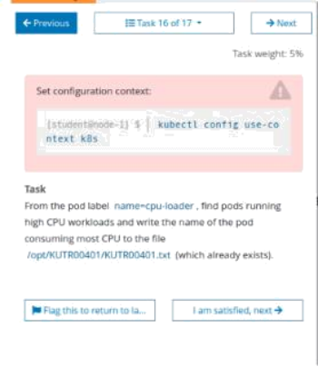
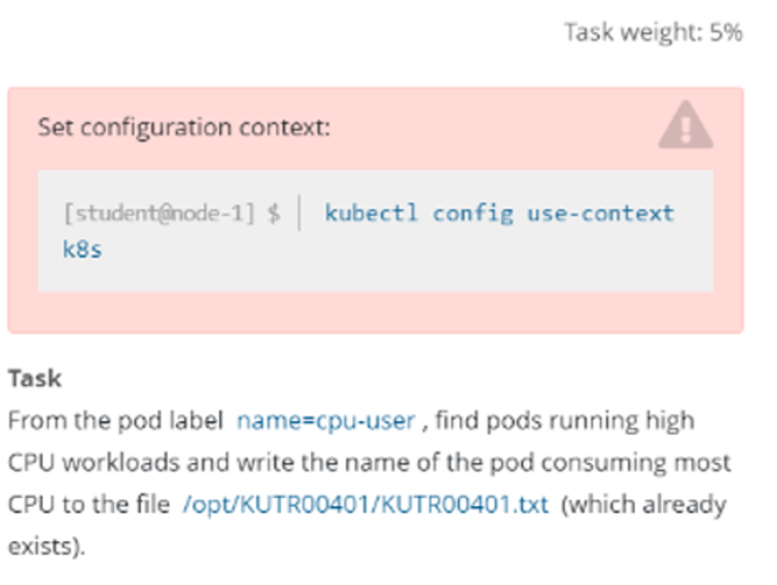

# 1 题设





设置配置环境kubectl config use-context k8s

通过pod label name=cpu-user，找到运行时占用大量CPU 的pod，并将占用CPU最高的pod名称写入到文件/opt/KUTR000401/KUTR00401.txt（已存在）


# 2 参考文档

https://kubernetes.io/zh-cn/docs/reference/kubectl/


# 3 解答


> 1、切换答题环境（考试环境有多个，每道题要在对应的环境中作答）

```bash
kubectl config use-context k8s
```


> 2、查找CPU使用率最高的Pod

```bash
kubectl get pods -A --show-labels
kubectl top pod -l name=cpu-user --sort-by=cpu -A


NAMESPACE     NAME                       CPU(cores)   MEMORY(bytes)   
kube-system   coredns-54d67798b7-hl8xc   7m           8Mi   
kube-system   coredns-54d67798b7-m4m2q   6m           8Mi


```


> 3、将查到Pod名称输出到指定文件

```bash
# 注意这里的pod名字以实际名字为准，按照CPU那一列进行选择一个最大的Pod，另外如果CPU的数值是1 2 3这样的。是大于带m这样的，因为1颗CPU等于1000m
注意要用">>"而不是">"
echo "coredns-54d67798b7-hl8xc" >> /opt/KUTR00401/KUTR00401.txt

echo ~podname~ >> /opt/KUTR000401/KUTR00401.txt
```


检查
cat /opt/KUTR000401/KUTR00401.txt


