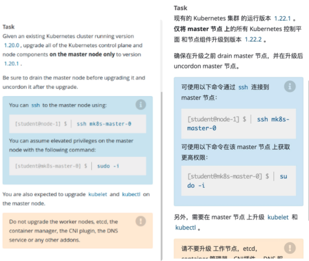
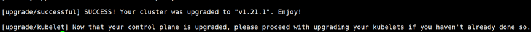

# 1 题设



设置配置环境kubectl config use-context mk8s

现有的kubernetes集群正在运行的版本是1.23.1,仅将master节点上的所有kubernetes控制平面 和 节点组件 升级到版本1.23.2；

确保在升级之前 drain master 节点，并在升级后 uncordon master 节点。
可以使用以下命令，通过 ssh 连接到 master 节点： ssh master01
可以使用以下命令，在该 master 节点上获取更高权限： sudo -i

另外，在主节点上升级 kubelet 和 kubectl。
请不要升级工作节点，etcd，container 管理器，CNI 插件， DNS 服务或任何其他插件。 


# 2 相关文档

> 依次点击 Tasks → Administer a Cluster → Administration with kubeadm → Upgrading kubeadm clusters （看不懂英文的，可右上角翻译成中文）  
> [https://kubernetes.io/zh-cn/docs/tasks/administer-cluster/kubeadm/kubeadm-upgrade/](https://link.zhihu.com/?target=https%3A//kubernetes.io/zh-cn/docs/tasks/administer-cluster/kubeadm/kubeadm-upgrade/)


# 3 解答

1、切换答题环境（考试环境有多个，每道题要在对应的环境中作答）
kubectl config use-context mk8s
kubectl get nodes

## 3.1 驱除master节点pod
（考试环境只有一个master节点）

```
# 注意，还有一个参数--delete-emptydir-data --force，这个考试时不用加，就可以正常 draini node02 的。
# 但如果执行后，有跟测试环境一样的报错，则需要加上--delete-emptydir-data --force，会强制将 pod 移除。

kubectl drain master --ignore-daemonsets (这个就足够了 )
The given node will be marked unschedulable to prevent new pods from arriving

kubectl drain k8s-master-1 --ignore-daemonsets --delete-emptydir-data  --force
```


## 3.2 升级kubeadm版本

```
ssh master01
sudo -i

# 解除应用版本锁
apt-mark unhold kubeadm kubectl kubelet

# 更新源并查询版本号
apt-get update
apt-cache madison kubeadm


# 注意版本的差异，有可能并非1.20.1升级到1.21.1
apt-get update -y && apt-get install -y kubeadm='1.30.1-*'


apt-get update -y && apt-get install -y kubeadm='1.30.1-*' kubelet='1.30.1-*' kubectl='1.30.1-*'


# 验证升级后 
kubeadm version
```

4、验证升级计划

```
kubeadm version

# 验证升级计划，会显示很多可升级的版本，我们关注题目要求升级到的那个版本。
sudo kubeadm upgrade plan

输出中找到 
得到 Target version: v1.30.5
但是 我们刚才装的是 apt-get install kubeadm=1.30.2-1.1 
所以 应该 升级到 1.30.2-1.1

Upgrade to the latest version in the v1.30 series:

COMPONENT                 NODE      CURRENT    TARGET
kube-apiserver            master    v1.30.0    v1.30.5
kube-controller-manager   master    v1.30.0    v1.30.5
kube-scheduler            master    v1.30.0    v1.30.5
kube-proxy                          1.30.0     v1.30.5
CoreDNS                             v1.11.1    v1.11.1
etcd                      master    3.5.12-0   3.5.12-0

You can now apply the upgrade by executing the following command:

        kubeadm upgrade apply v1.30.5

```


## 3.3 在 master node 上升级kubelet、kubectl

```
ssh master01
sudo -i

# 解除应用版本锁
apt-mark unhold kubectl kubelet

# 更新源并查询版本号
apt-get update
apt-cache madison kubectl
apt-cache madison kubelet

# 注意版本的差异，有可能并非1.20.1升级到1.21.1
apt-get update -y && apt-get install -y kubelet='1.30.1-*' kubectl='1.30.1-*'

# 验证 
kubelet --version
kubectl version
```


## 3.4 升级Master节点组件etcd 
选择升级的版本 v1.23.2，忽略etcd升级
```

# 开始升级Master节点，注意看题需不需要升级etcd
kubeadm upgrade apply v1.23.2 --etcd-upgrade=false -f
[upgrade/confirm] Are you sure you want to proceed with the upgrade? [y/n]: y

# 在我买的模拟环境中 应该执行 
但是 我们刚才装的是 apt-get install kubeadm=1.30.2-1.1 
所以 应该 升级到 1.30.2-1.1
kubeadm upgrade apply v1.30.1 --etcd-upgrade=false -f

这里不要写成 v1.30.2-1.1 不行的 会报错 pull image of api-server 等 发生erorr, 因为找不到对应的 version 
, 写成v1.30.2 就不会报错了  

```




### 3.4.1 可能出现的错误


1 
```bash
root@master:~# kubeadm upgrade apply v1.30.1 --etcd-upgrade=false
[preflight] Running pre-flight checks.
[upgrade/config] Reading configuration from the cluster...
[upgrade/config] FYI: You can look at this config file with 'kubectl -n kube-system get cm kubeadm-config -o yaml'
[upgrade] Running cluster health checks
[upgrade/health] FATAL: [preflight] Some fatal errors occurred:
        [ERROR CreateJob]: Job "upgrade-health-check-kbc65" in the namespace "kube-system" did not complete in 15s: no condition of type Complete
[preflight] If you know what you are doing, you can make a check non-fatal with `--ignore-preflight-errors=...`
To see the stack trace of this error execute with --v=5 or higher
```

解决方式 
```
https://github.com/kubernetes/kubeadm/issues/3050
the only problem here seems to be with the CreateJob logic.

执行 
kubeadm upgrade apply v1.30.1 --etcd-upgrade=false --ignore-preflight-errors=CreateJob
```

2 

```
# 注意：自己的环境升级，可能会报找不到coredns的镜像，可以使用如下方法解决：
所有节点
docker pull coredns/coredns:1.8.0
docker tag coredns/coredns:1.8.0
registry.cn-hangzhou.aliyuncs.com/google_containers/coredns/coredns:v1.8.0 

然后继续就行。1.8.0改成你自己CoreDNS 报错的版本
```


## 3.5 设置节点可调度
```
锁住版本
apt-mark hold kubeadm kubectl kubelet

# 通过将节点标记为可调度
kubectl uncordon master

output 为 
node/k8s-master uncordoned


# 重启kubelet
systemctl daemon-reload
systemctl restart kubelet
```


## 3.6 验证升级后的版本
kubectl get nodes

```
NAME           STATUS   ROLES                  AGE   VERSION
k8s-master01   Ready    control-plane,master   11d   v1.21.1
k8s-node01     Ready    <none>                 8d    v1.20.1
k8s-node02     Ready    <none>                 11d   v1.20.1
```

可以看到 master 节点已经升级为 1.21.1 了 

```
root@master:~# k get nodes -A
NAME     STATUS                     ROLES           AGE   VERSION
master   Ready,SchedulingDisabled   control-plane   96d   v1.30.2
node01   Ready                      worker          96d   v1.30.0
node02   NotReady                   worker          96d   v1.30.0

```

