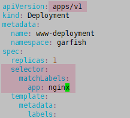

# 1 题设 


修复清单文件 /ckad/credible-mite/www.yaml 中的任何 API 弃用问题 以便可以将应用程序部署在 k8s cluster 上 。注意：该应用程序是为 Kubernetes v1.15 开发的 。k8s cluster 运行着 Kubernetes v1.26
请在 garfish namespace 中 部署 更新后的 清 单文件 /ckad/credible-mite/www.yaml 中指定的应用程序 。

# 2 参考 

kubectl explain deployment.spec
kubectl explain deployment.spec.selector


# 3 解答 

1 
kubectl create ns garfish

2 
api 版本修改为 apps/v1
并在 spec 下添加或修改 selector 标签，这个标签要和下面的 template 里的标签一致。



```sh
#编辑文件
vim /ckad/credible-mite/www.yaml


#/ckad/credible-mite/www.yaml
apiVersion: apps/v1 #修改
kind: Deployment
metadata:
  name: www-deployment
  namespace: garfish #namespace  这里要更新 
spec:
  replicas: 1
  selector:         #添加   
    matchLabels:    #添加
      app: nginx    #添加 这个标签要和下面的 template 里的标签一致。
  template:
    metadata:
      labels:
        app: nginx
    spec:
      containers:
      - name: nginx
        image: nginx:1.16
        ports:
          - containerPort: 80
        volumeMounts:
          - mountPath: /var/log/nginx
            name: logs
        env:
          - name: NGINX_ENTRYPOINT_OUIET_LOGS
            value: "1"
      volumes:
        - name: logs
          emptyDir: {}


# 应用配置
kubectl apply -f /ckad/credible-mite/www.yaml
```


1  验证并查看
```
kubectl -n garfish get all

NAME                                  READY   STATUS              RESTARTS   AGE
pod/www-deployment-7cbc59c747-b7lkg   0/1     ContainerCreating   0          22s

NAME                             READY   UP-TO-DATE   AVAILABLE   AGE
deployment.apps/www-deployment   0/1     1            0           22s

NAME                                        DESIRED   CURRENT   READY   AGE
replicaset.apps/www-deployment-7cbc59c747   1         1         0       22s
```