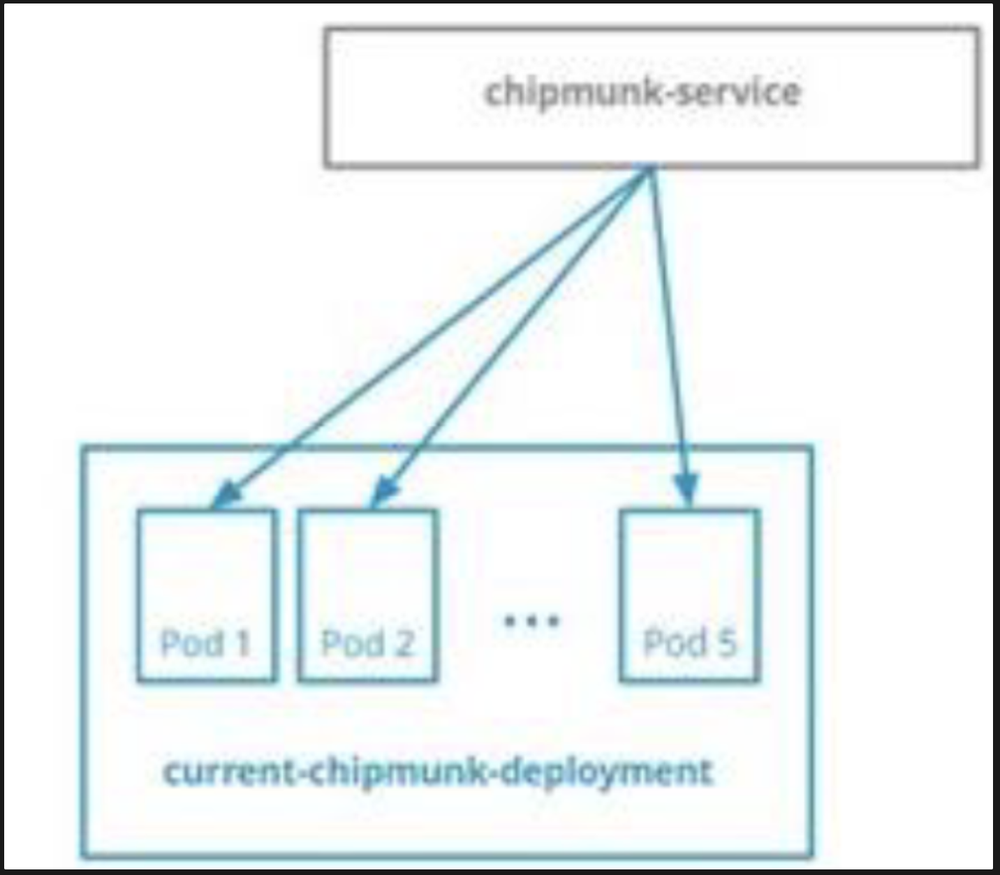
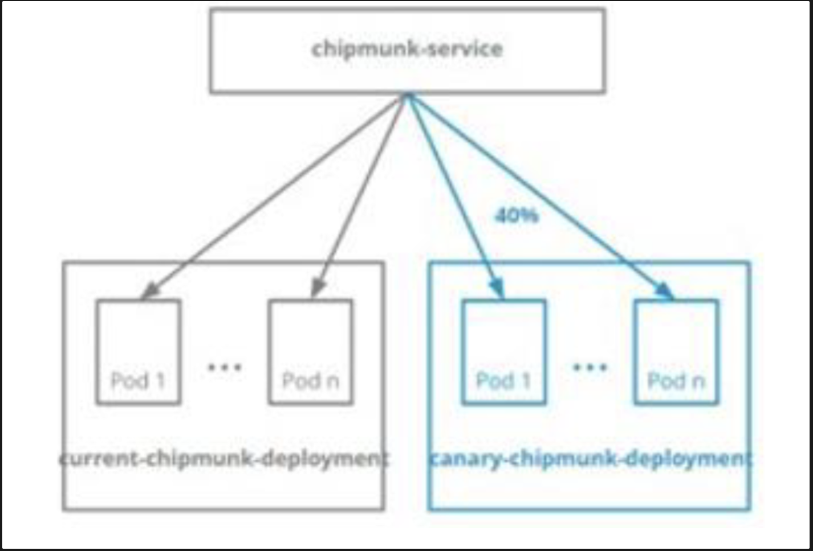
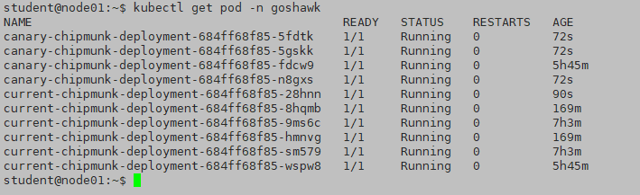

```
为了测试新的应用程序发布，您需要准备一个金丝雀部署。
```

# 1 题设
namespace goshawk 中名为 chipmunk-service 的 Service 指向名为 current-chipmunk-deployment 的 Deployment 创建的 5 个 Pod。



你可以在/ckad/goshawk/中找到 current-chipmunk-deployment 的清单文件。


1、在同一 namespace 中创建一个相同的 Deployment，名为 canary-chipmunk-deployment
2、修改 Deployment，以便：
⚫ 在 namespace goshawk 中运行的 Pod 的最大数量为 10 个
⚫ chipmunk.service 流量的 40%流向 Pod canary-chipmunk-deployment





# 2 参考 

[https://kubernetes.io/zh-cn/docs/concepts/cluster-administration/manage-deployment/#canary-deployments](https://kubernetes.io/zh-cn/docs/concepts/cluster-administration/manage-deployment/#canary-deployments)


# 3 解答

1.复制一份yaml文件,并进行编辑, 修改为canary-chipmunk-deployment部署的yaml
cd /ckad/goshawk/
cp current-chipmunk-deployment.yaml canary-chipmunk-deployment.yaml


vim canary-chipmunk-deployment.yaml
为了区分不同流量，可以在部署金丝雀的时候，修改一个 label 标签  ( app: canary-chipmunk-deployment ) ，这样，crul svc 时打印标签，会打印原先和金丝雀 pod 不同的标签了。

```
apiVersion: apps/v1
kind: Deployment
metadata:
  name: canary-chipmunk-deployment #修改为题目要求
  namespace: goshawk #修改为题目要求
spec:
  replicas: 1  #这里也先修改为 1
  selector:
    matchLabels:
      app: canary-chipmunk-deployment #修改为题目要求
      run: dep-svc #确保和current-chipmunk-deployment都有此标签
  template:
    metadata:
      labels:
        app: canary-chipmunk-deployment #修改为题目要求
        run: dep-svc #确保和current-chipmunk-deployment都有此标签
    spec:
      containers:
      - image: vicuu/nginx:hi
        name: nginx
```

创建资源
kubectl apply -f canary-chipmunk-deployment.yaml

2 
这两个 depolyment 被同一个 service 管理 , 所以能够实现 分流 
```
# 修改pod数量，要求总计10个pod，**chipmunk.servic**e 流量的 **40%** 流向 Pod **canary-chipmunk-deployment
kubectl -n goshawk scale deployment current-chipmunk-deployment --replicas 6
kubectl -n goshawk scale deployment canary-chipmunk-deployment --replicas 4
```




3 测试验证
3.1 kubectl -n goshawk get svc -owide
我们可以先检查一下 svc，你会发现，svc 暴露的服务（kubectl -n goshawk get svc -o wide）选择的是原先 deployment 中两个标签中的一个，比如是 run: depsvc（svc 选择是的 pod 的 label，而不是 deployment 的 label），那么我们只需要部署金丝雀时，修改另一个标签，就是修改 app: current-chipmunk-deployment 为 app: canary-chipmunk-deployment，这样 curl svc 时，打印的标签就是 current 和 canary，就能够显示出测试的效果了。

3.2 
for i in {1..1000} ; do  curl -qs 10.109.141.220;done | sort |uniq -c
- **`curl -qs 10.109.141.220`**:    
    - `curl` is a command-line tool for making HTTP requests.
    - `-q`: Suppresses the reading of the `~/.curlrc` file, if present.
    - `-s`: Runs `curl` in "silent" mode, which suppresses the progress meter and error messages. Combined with `-q`, this ensures that only the response body is printed, without any additional information or error messages.
    - `10.109.141.220`: This is the IP address to which the HTTP requests are sent.
- **`done`**:
    - This marks the end of the `for` loop. The loop will execute the `curl` command 1000 times.
- **`| sort`**:
    - The output of all 1000 `curl` requests is piped (`|`) into the `sort` command.
    - `sort` arranges the lines of output in alphabetical or numerical order.
- **`| uniq -c`**:
    - The sorted output is then piped into `uniq -c`.
    - `uniq` filters out adjacent duplicate lines, but with the `-c` option, it also counts the number of occurrences of each unique line.


