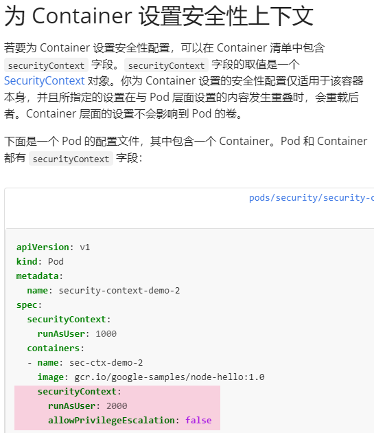
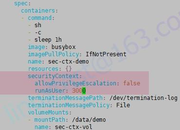

# 1 题目要求

修改运行在namespace **quetzal** 名为 **broker-deployment** 的现有 Deployment 使其容器
- 以用户 **30000** 运行
- 禁止特权提升。

您可以在 **/ckad/daring-moccasin/broker-deployment.yaml** 找 到 broker-deployment 的清单文件

# 2 [](https://www.ljohn.cn/posts/220f93d1/#参考 "参考")参考

[https://kubernetes.io/zh-cn/docs/tasks/configure-pod-container/security-context/](https://kubernetes.io/zh-cn/docs/tasks/configure-pod-container/security-context/)

搜索security context




官方示例
```
apiVersion: v1  
kind: Pod  
metadata:  
  name: security-context-demo  
spec:  
  securityContext:  
    runAsUser: 1000   # 注意这里 
    runAsGroup: 3000  
    fsGroup: 2000  
  volumes:  
  - name: sec-ctx-vol  
    emptyDir: {}  
  containers:  
  - name: sec-ctx-demo  
    image: busybox:1.28  
    command: [ "sh", "-c", "sleep 1h" ]  
    volumeMounts:  
    - name: sec-ctx-vol  
      mountPath: /data/demo  
    securityContext:  
      allowPrivilegeEscalation: false
```


# 3 解题 

kubectl -n quetzal edit deployments.apps broker-deployment

```bash
# 直接deployment配置


# 
apiVersion: apps/v1
kind: Deployment
metadata:
  annotations:
    deployment.kubernetes.io/revision: "1"
    kubectl.kubernetes.io/last-applied-configuration: |
  creationTimestamp: "2023-05-24T13:00:32Z"
  generation: 1
  name: broker-deployment
  namespace: quetzal
  resourceVersion: "19019"
  uid: 43b31f70-9362-443a-a944-52b688bd1f46
spec:
  progressDeadlineSeconds: 600
  replicas: 1
  revisionHistoryLimit: 10
  selector:
    matchLabels:
      app: broker-deployment
  strategy:
    rollingUpdate:
      maxSurge: 25%
      maxUnavailable: 25%
    type: RollingUpdate
  template:
  progressDeadlineSeconds: 600
  replicas: 1
  revisionHistoryLimit: 10
  selector:
    matchLabels:
      app: broker-deployment
  strategy:
    rollingUpdate:
      maxSurge: 25%
      maxUnavailable: 25%
    type: RollingUpdate
  template:
    metadata:
      creationTimestamp: null
      labels:
        app: broker-deployment
    spec:
      containers:
      - command:
        - sh
        - -c
        - sleep 5h
        image: busybox
        imagePullPolicy: IfNotPresent
        name: sec-ctx-demo
        resources: {}
        securityContext:      # 添加
          allowPrivilegeEscalation: false  # 添加
          runAsUser: 30000    # 添加
        terminationMessagePath: /dev/termination-log
        terminationMessagePolicy: File
        volumeMounts:
        - mountPath: /data/demo
          name: sec-ctx-vol
      dnsPolicy: ClusterFirst
      restartPolicy: Always
      schedulerName: default-scheduler
      securityContext: {}

```


