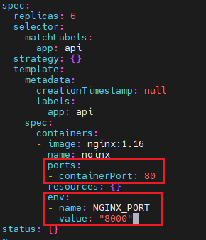

# 1 题目要求

在现有的 namespace **ckad00014** 中创建一个运行 **6** 个 Pod 副本 ,名为 **api** 的 Deployment 。 
用 **nginx:1.16** 的镜像来指定一个容器。将名为 **NGINX_PORT** 且值为 **8000** 的环境变量添加到容器中 然后公开端口 **80**

# 2 [](https://www.ljohn.cn/posts/2250b530/#参考 "参考")参考

[https://kubernetes.io/zh-cn/docs/tasks/inject-data-application/define-environment-variable-container/](https://kubernetes.io/zh-cn/docs/tasks/inject-data-application/define-environment-variable-container/)

[https://kubernetes.io/docs/reference/generated/kubectl/kubectl-commands#-em-deployment-em-](https://kubernetes.io/docs/reference/generated/kubectl/kubectl-commands#-em-deployment-em-)

# 3 [](https://www.ljohn.cn/posts/2250b530/#解答 "解答")解答

1 
创建一个deployment配置
kubectl -n **ckad00014** create deployment api --image=nginx:1.16 --port=80 --dry-run=client -o yaml > 09-deployment-with-env.yaml


2 修改配置 
```
vim 09-deployment-with-env.yaml
apiVersion: apps/v1
kind: Deployment
metadata:
  creationTimestamp: null
  labels:
    app: api
  name: api
  namespace: ckad00014
spec:
  replicas: 6  # 题目需求副本6个
  selector:
    matchLabels:
      app: api
  strategy: {}
  template:
    metadata:
      creationTimestamp: null
      labels:
        app: api
    spec:
      containers:
      - image: nginx:1.16
        env:   # 题目需求新增
        - name: NGINX_PORT  # 题目需求新增
          value: "8000"  # 题目需求新增
        name: nginx
        ports:
        - containerPort: 80  # 题目需求新增
        resources: {}
status: {}
```



kubectl apply -f 09-deployment-with-env.yaml
deployment.apps/api created


3 检查服务
```
kubectl -n ckad00014 get all
NAME                       READY   STATUS         RESTARTS   AGE
pod/api-58cc7f8d5d-rk8jk   0/1     ErrImagePull   0          2m44s

NAME                  READY   UP-TO-DATE   AVAILABLE   AGE
deployment.apps/api   0/1     1            0           2m44s

NAME                             DESIRED   CURRENT   READY   AGE
replicaset.apps/api-58cc7f8d5d   1         1         0       2m44s

```


