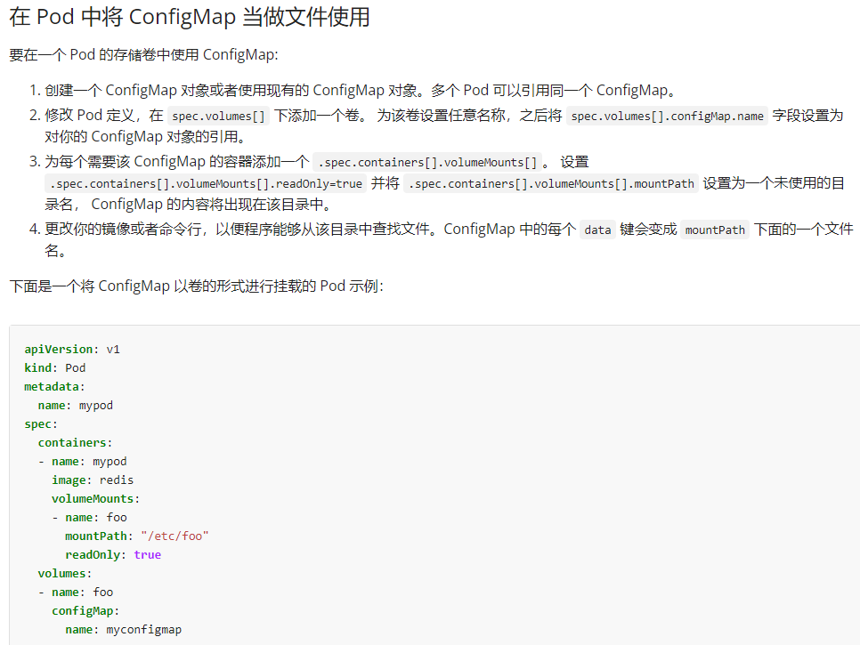
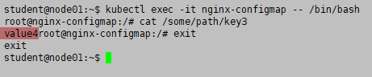

# 1 题目要求

1. 在 namespace **default** 中创建一个名为 **some-config** 并存储着以下键值对的 Configmap: **key3:value4**
2. 在 namespace **default** 中创建一个名为 **nginx-configmap** 的 Pod 。用 **nginx:stable** 的镜像来指定一个容器。
    1. 用存储在Configmap **some-config** 中的数据来填充卷 并将其安装在路径 **/some/path**

# 2 [](https://www.ljohn.cn/posts/4abda8a8/#参考 "参考")参考

[https://kubernetes.io/zh-cn/docs/concepts/configuration/configmap/](https://kubernetes.io/zh-cn/docs/concepts/configuration/configmap/)




# 3 解题 

1
在 namespace default 中创建一个名为 some-config 并存储着以下键/值对的 Configmap
kubectl create configmap some-config --from-literal=key3=value4 --dry-run=client -o yaml > configmap.yaml
cat configmap.yaml


2 在 namespace default 中创建一个名为 nginx-configmap 的 Pod。用 nginx:stable 的镜像来指定一个容器。
kubectl run nginx-configmap --image=nginx:stable --dry-run=client -o yaml  > nginx-configmap.yaml

vi nginx-configmap.yaml
```
apiVersion: v1
kind: Pod
metadata:
  creationTimestamp: null
  labels:
    run: nginx-configmap
  name: nginx-configmap
spec:
  containers:
  - image: nginx:stable
    name: nginx-configmap
    resources: {}
  dnsPolicy: ClusterFirst
  restartPolicy: Always
status: {}
```

修改 nginx-configmap.yaml
```
vim nginx-configmap.yaml
apiVersion: v1
kind: Pod
metadata:
  creationTimestamp: null
  labels:
    run: nginx-configmap
  name: nginx-configmap
spec:
  containers:
  - image: nginx:stable #  题目要求
    name: nginx-configmap
    volumeMounts:  #  题目要求
    - name: foo  #  题目要求
      mountPath: "/some/path"   #  题目要求
      readOnly: true 
  volumes: #  题目要求
  - name: foo #  题目要求
    configMap: #  题目要求
      name: some-config #  题目要求
  dnsPolicy: ClusterFirst
  restartPolicy: Always
status: {}
```


1 应用配置
kubectl apply -f nginx-configmap.yaml

2  测试验证
kubectl exec -it nginx-configmap --/bin/bash

cat /some/path/key3



