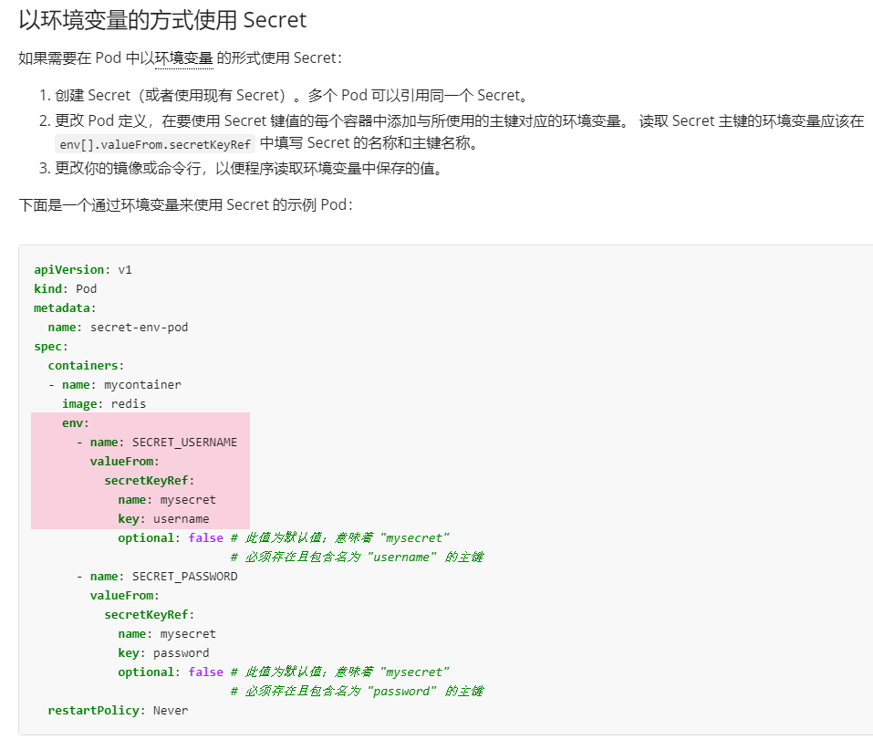

# 1 题目1
## 1.1 题目要求

1. 在 namespace **default** 中创建一个名为 **another-secret** 并包含以下单个键值对的 Secret **key1:value2**
2. 在 namespace **default** 中创建一个名为 **nginx-secret** 的 Pod 。 用 **nginx:1.16** 的镜像来指定一个容器 。添加一个名为 **COOL_VARIABLE** 的环境变量来使用 secret 键 **key1** 的值。

## 1.2 参考

[https://kubernetes.io/zh-cn/docs/concepts/configuration/secret/](https://kubernetes.io/zh-cn/docs/concepts/configuration/secret/)

[https://kubernetes.io/zh-cn/docs/tasks/inject-data-application/distribute-credentials-secure/#configure-all-key-value-pairs-in-a-secret-as-container-env-var](https://kubernetes.io/zh-cn/docs/tasks/inject-data-application/distribute-credentials-secure/#configure-all-key-value-pairs-in-a-secret-as-container-env-var)



### 1.2.1 kubectl create secret
https://kubernetes.io/docs/reference/kubectl/generated/kubectl_create/kubectl_create_secret/

kubectl create secret (docker-registry | generic | tls)
- A docker-registry type secret is for accessing a container registry.
- A generic type secret indicate an Opaque secret type.
- A tls type secret holds TLS certificate and its associated key.

## 1.3 解答


1 创建secret
kubectl create secret generic another-secret --from-literal key1=value2 

2 创建pod,并按要求修改配置
kubectl run nginx-secret --image=nginx:1.16 --dry-run=client -o yaml  > nginx-secret.yaml

vim nginx-secret.yaml
```yaml
apiVersion: v1
kind: Pod
metadata:
  creationTimestamp: null
  labels:
    run: nginx-secret
  name: nginx-secret
spec:
  containers:
  - image: nginx:1.16 # 题目要求
    name: nginx-secret
    env: # 题目要求
    - name: COOL_VARIABLE # 题目要求
      valueFrom: # 题目要求
        secretKeyRef: # 题目要求
          name: another-secret # 题目要求
          key: key1 # 题目要求
  dnsPolicy: ClusterFirst
  restartPolicy: Always
status: {}
```

应用配置
kubectl apply -f nginx-secret.yaml

测试验证
kubectl exec -it nginx-secret -- env | grep COOL


# 2 题目2

## 2.1 题目要求

```
在 test 命名空间，创建一个名为mysecret的密钥，其值 username 为 devuser 和 password为A!B*d$zDsb=

在test命名空间，创建一个pod，镜像使用 nginx:1.16, 名字为mypod, 将秘密 **mysecret** 挂载到路径 **/etc/foo** 上的卷中
```

## 2.2 参考

[https://kubernetes.io/zh-cn/docs/tasks/configmap-secret/managing-secret-using-kubectl/](https://kubernetes.io/zh-cn/docs/tasks/configmap-secret/managing-secret-using-kubectl/)

[https://kubernetes.io/zh-cn/docs/concepts/configuration/secret/#using-secrets-as-files-from-a-pod](https://kubernetes.io/zh-cn/docs/concepts/configuration/secret/#using-secrets-as-files-from-a-pod)

## 2.3 解题 

```
# 创建一个namespace
kubectl create ns **test

# 创建秘钥配置
echo -n 'devuser' > ./username.txt
echo -n 'A!B*d$zDsb=' > ./password.txt

# 创建秘钥
kubectl -n test create secret generic db-user-pass \\
    --from-file=username=./username.txt \\
    --from-file=password=./password.txt

# 创建容器挂在该secret
cat 27.secret-pod-test.yaml
apiVersion: v1
kind: Pod
metadata:
  name: mypod
  namespace: test # Specify the namespace here
spec:
  containers:
  - name: mypod
    image: nginx:1.16
    volumeMounts:
    - name: foo
      mountPath: "/etc/foo"
      readOnly: true
  volumes:
  - name: foo
    secret:   # 这个里
      secretName: mysecret
      optional: true

# 应用配置,注意上面我没加namespace，下面命令加也是一样的，别忘记就好
kubectl -n test apply -f 27.secret-pod-test.yaml**

```
