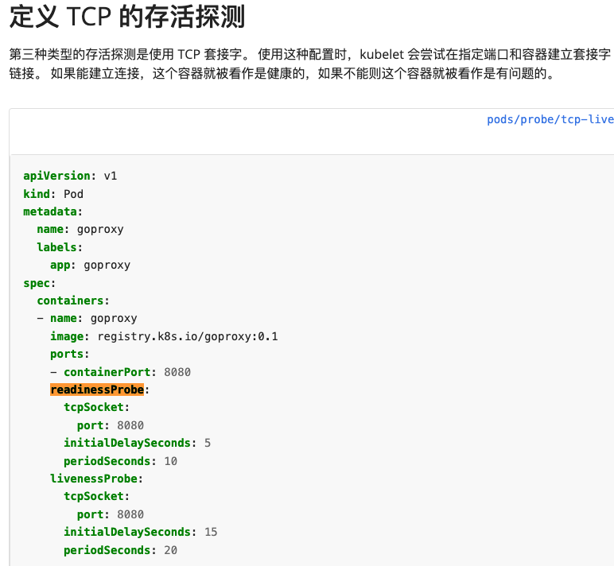

# 1 题目要求

修改现有的 deployment **probe-http** 增加 **readinessProbe** 探测 器，规格如下：

使用 httpGet 进行探测  
探测路径为 /healthz/return200  
探测端口为 80  
在执行第一次探测前应该等待 15 秒  
执行探测的时间间隔为 20 秒

# 2 参考

[https://kubernetes.io/zh-cn/docs/tasks/configure-pod-container/configure-liveness-readiness-startup-probes/](https://kubernetes.io/zh-cn/docs/tasks/configure-pod-container/configure-liveness-readiness-startup-probes/)



# 3 解答

1 现有的 depolyment probe-http 的配置 

```
# 参考如下配置
apiVersion: v1
kind: Pod
metadata:
  name: goproxy
  labels:
    app: goproxy
spec:
  containers:
  - name: goproxy
    image: registry.k8s.io/goproxy:0.1
    ports:
    - containerPort: 8080
    readinessProbe:
      tcpSocket:
        port: 8080
      initialDelaySeconds: 15
      periodSeconds: 10
    livenessProbe:
      tcpSocket:
        port: 8080
      initialDelaySeconds: 15
      periodSeconds: 20


```


2 根据题目要求修改配置

编辑 deployment probe-http
kubectl edit deployment probe-http


```
kubectl edit deployment probe-http
    readinessProbe:
      httpGet:
        path: /healthz/return200
        port: 80
      initialDelaySeconds: 15
      periodSeconds: 20
```


 3 检查

kubectl get pod

[](https://www.ljh.cool/wp-content/uploads/2023/02/image-83.png)


