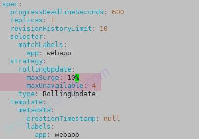

# 1 题目要求

1. 更新 namespace **ckad00015** 中的 Deployment **webapp** 的比例缩放配置 将 **maxSurge** 设置为 **10%** ，将 **maxUnavailable** 设置为 **4**
2. 更新 Deployment **webapp** 以让容器镜像 **lfccncf/nginx** 使用版本标签 **1.13.7**
3. 将 Deployment **webapp** 回滚至 **前一版本**

# 2 参考

[https://kubernetes.io/zh-cn/docs/concepts/workloads/controllers/deployment/](https://kubernetes.io/zh-cn/docs/concepts/workloads/controllers/deployment/)


# 3 解题

1 环境准备

cat ~/ckad/15-deployment-rollout  

```

apiVersion: v1  
kind: Namespace  
metadata:  
  creationTimestamp: null  
  name: ckad00015  
spec: {}  
status: {}  
---  
apiVersion: apps/v1  
kind: Deployment  
metadata:  
  creationTimestamp: null  
  labels:  
    app: webapp  
  name: webapp  
  namespace: ckad00015  
spec:  
  replicas: 1  
  selector:  
    matchLabels:  
      app: webapp  
  strategy:  
    rollingUpdate:  
      maxSurge: 25%  
      maxUnavailable: 25%  
    type: RollingUpdate  
  template:  
    metadata:  
      creationTimestamp: null  
      labels:  
        app: webapp  
    spec:  
      containers:  
      - image: lfccncf/nginx:1.12.2  
        name: nginx  
        resources: {}  
status: {}
```

2 修改deployment 滚动升级策略  
 更新 namespace **ckad00015** 中的 Deployment **webapp** 的比例缩放配置 将 **maxSurge** 设置为 **10%** ，将 **maxUnavailable** 设置为 **4**
```
kubectl -n ckad00015 edit deployments/apps webapp  
rollingUpdate:  
  maxSurge: 10%  
  maxUnavailable: 4
```


3 更新 Deployment **webapp** 以让容器镜像 **lfccncf/nginx** 使用版本标签 **1.13.7**'
先检查一下之前的 image 版本，为 lfccncf/nginx:1.12.2
kubectl -n ckad00015 get deployments webapp -o yaml|grep image

kubectl -n ckad00015 set image deployment webapp nginx=lfccncf/nginx:1.13.7


kubectl -n ckad00015 get deployments webapp -o yaml|grep image


4 回滚上一个版本  

如果需要看历史，则可以使用下面这条命令
kubectl -n ckad00015 rollout history deployment webapp

kubectl -n ckad00015 rollout undo deployment webapp
或者 kubectl rollout undo deployment webapp -n ckad00015 --to-revision=1       # --to-revision 指定回滚的版本

测试验证  
kubectl -n ckad00015 get deployments.apps webapp -o yaml | grep image

