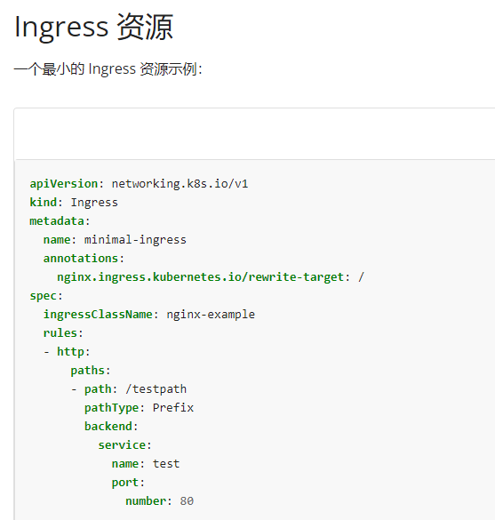

# 1 题目要求

在namespace **ingress-ckad** 下，有deployment service ingress 三个资源已经部署好了, 但是他们的配置有问题，导致的ingress 网络不通。

3个资源的配置清单在目录 **/ckad/CKAD202206** 中 ，请将其修改为正确的，并重新创建。

# 2 参考 

[https://kubernetes.io/zh-cn/docs/concepts/services-networking/ingress/](https://kubernetes.io/zh-cn/docs/concepts/services-networking/ingress/)



说明：
port是service端口，即k8s中服务之间的访问端口
targetport是pod（也就是容器）的端口

# 3 解题 

vim /ckad/CKAD202206/ingress.yaml  

```
apiVersion: apps/v1
kind: Deployment
metadata:
  name: nginx-dm
  namespace: ingress-ckad
spec:
  replicas: 2
  selector:
    matchLabels:
      name: nginx-ing
  template:
    metadata:
      labels:
        name: nginx-ing ## 1 ## 记住 Deployment 的 labels 标签，因为题目说明了 Deployment 是正确的。
    spec:
      containers:
      - name: nginx
        image: vicuu/nginx:hello81
        imagePullPolicy: IfNotPresent
        ports:
        - containerPort: 81 ## 2 ## 记住 Deployment 的容器的端口号，因为题目说明了 Deployment 是正确的。
---
apiVersion: v1
kind: Service
metadata:
  name: nginx-ing-svc ## 3 ## 记住 Service 的 name 名字
  namespace: ingress-ckad
spec:
  ports:
  - port: 80 ## 5 ## 检查一下，确保 Service 的 port 和 Ingress 的 port:number 端口一致
    targetPort: 81 ## 2 ## 修改 Service 的 targetPort 端口与上面 Deployment 的 containerPort 端口号一致，即修改为 80。
    protocol: TCP
  selector:
    name: nginx-ing ## 1 ## 修改 Service 的 selector 为上面 Deployment 的 labels 标签，即修改为 name: nginx-ing
---
apiVersion: networking.k8s.io/v1
kind: Ingress
metadata:
  name: nginx-ingress-test
  namespace: ingress-ckad
  annotations:
    kubernetes.io/ingress.class: "nginx"
    nginx.ingress.kubernetes.io/rewrite-target: /
spec:
  rules:
  - http:
      paths:
      - path: /hello ## 4 ## 检查一下 Ingress 的 path，如果题目里有要求，则修改为题目要求的路径。
        pathType: Prefix
        backend:
          service:
            name: nginx-ing-svc ## 3 ## 修改 Ingress 的 service 为上面 Service 的 name 名字，即修改为 name: nginx-ing-svc
            port:
              number: 80 ## 5 ## 检查一下，确保 Ingress 的 port:number 和 Service 的 port 端口一致
```


```
# 查看配置，进行修改  

  
apiVersion: apps/v1  
kind: Deployment  
metadata:  
  name: nginx-dm  
  namespace: ingress-ckad  
spec:  
  replicas: 2  
  selector:  
    matchLabels:  
      name: nginx-ing  
  template:  
    metadata:  
      labels:  
        name: nginx-ing #标签  
    spec:  
      containers:  
      - name: nginx  
        image: vicuu/nginx:hello81  
        imagePullPolicy: IfNotPresent  
        ports:  
          - containerPort: 81 #容器端口  
---
apiVersion: v1  
kind: Service  
metadata:  
  name: nginx-ing-svc #服务名  
  namespace: ingress-ckad  
spec:  
  ports:  
  - port: 80 #和ingress的端口一致  
    targetPort: 81 #这个端口需要和deployment的containerPort值一致  
    protocol: TCP  
  selector:  
    name: nginx-ing #修改标签 和deployment的一致  
  
---  
apiVersion: networking.k8s.io/v1  
kind: Ingress  
metadata:  
  name: nginx-ingress-test  
  namespace: ingress-ckad  
  annotations:  
    nginx.ingress.kubernetes.io/rewrite-target: /  
spec:  
  ingressClassName: nginx-example123  
  rules:  
  - http:  
      paths:  
      - path: /hello  
        pathType: Prefix  
        backend:  
          service:  
            name: nginx-ing-svc #需要和service的服务名一致  
            port:  
              number: 80 # 需要和service的port的值一致  
  

```


2 应用配置，测试验证  
kubectl apply -f /ckad/CKAD202206/ingress.yaml  
curl 10.106.76.153  
curl 10.102.130.182/hello


