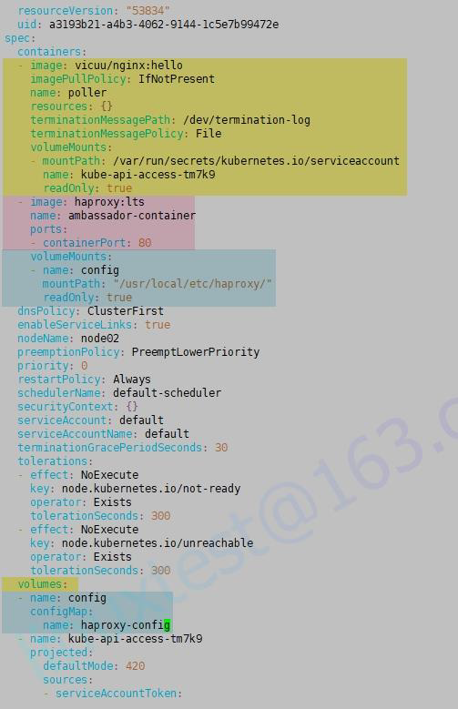

# 1 题目要求

1. 更新在 namespace **default** 中的 Service **nginxsvc** 来暴露端口 **9090** 。
2. 在 namespace **default** 中创建一个名为 **haproxy-config** 并存储着的**/ckad/ambassador/haproxy.cfg** 的内容的 ConfigMap。
3. 更新在 namespace **default** 中名为 **poller** 的 Pod：
    - 首先，添加一个使用 **haproxy:lts** 镜像、暴露端口 **80** 并名为 **ambassador-container** 的 ambassador 容器（sidecar模式）。
    - 最后，ConfigMap **haproxy-config** 要挂载到 ambassador 容器 **ambassador-container** 的**/usr/local/etc/haproxy/**目录。


# 2 参考

[https://kubernetes.io/zh-cn/docs/concepts/configuration/configmap/](https://kubernetes.io/zh-cn/docs/concepts/configuration/configmap/)
[https://kubernetes.io/docs/reference/kubectl/generated/kubectl_create/kubectl_create_configmap/](https://kubernetes.io/docs/reference/kubectl/generated/kubectl_create/kubectl_create_configmap/)


```
# 挂载示例
apiVersion: v1
kind: Pod
metadata:
  name: mypod
spec:
  containers:
  - name: mypod
    image: redis
    volumeMounts:
    - name: foo
      mountPath: "/etc/foo"
      readOnly: true
  volumes:
  - name: foo
    configMap:
      name: myconfigmap

```


# 3 解答


1 更新在 namespace default 中的 Service nginxsvc 来暴露端口 9090。
kubectl -n default get svc
kubectl edit svc nginxsvc -n default

修改为 port: 9090  
注意，不是修改 targetPort。

```
apiVersion: v1
kind: Service
metadata:
  annotations:
    kubectl.kubernetes.io/last-applied-configuration: |
      {"apiVersion":"v1","kind":"Service","metadata":{"annotations":{},"name":"nginxsvc","namespace":"default"},"spec":{"ports":[{"port":80,"protocol":"TCP","targetPort":80}],"selector":{"app":"nginxsvc"}}}
  creationTimestamp: "2023-05-24T13:45:01Z"
  name: nginxsvc
  namespace: default
  resourceVersion: "17051"
  uid: cd4c38bd-e282-414f-a4cb-9fe3a5ccd0c5
spec:
  clusterIP: 10.111.178.212
  clusterIPs:
  - 10.111.178.212
  internalTrafficPolicy: Cluster
  ipFamilies:
  - IPv4
  ipFamilyPolicy: SingleStack
  ports:
  - port: 9090 #修改这里为题目要求
    protocol: TCP
    targetPort: 80
  selector:
    app: nginxsvc
  sessionAffinity: None
  type: ClusterIP
status:
  loadBalancer: {}
```

[](https://www.ljh.cool/wp-content/uploads/2023/02/image-100.png)

测试验证  
kubectl -n default get svc nginxsvc -owide

2、在 namespace default 中创建一个名为 haproxy-config 并存储着的/ckad/ambassador/haproxy.cfg 的内容的 ConfigMap。
kubectl create configmap haproxy-config --from-file=/ckad/ambassador/haproxy.cfg -n default

3、更新在 namespace default 中名为 poller 的 Pod：
kubectl -n default get pod poller -o yaml > poller.yaml
cp poller.yaml bak-poller.yaml
kubectl delete -f poller.yaml
vi poller.yaml

```
……
  - image: haproxy:lts
    name: ambassador-container
    ports:
  - containerPort: 80
  volumeMounts:
  - name: config
    mountPath: "/usr/local/etc/haproxy/"
    readOnly: true
……
在 volumes:下面
 - name: config
 configMap:
 name: haproxy-config
……
```

kubectl apply -f poller.yaml



4 检查

kubectl get pod poller -n default
kubectl get svc -n default
curl 10.98.61.231:9090

[](https://www.ljh.cool/wp-content/uploads/2023/02/image-102.png)

