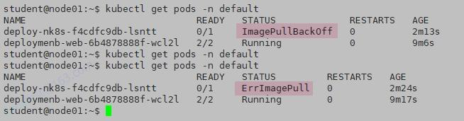
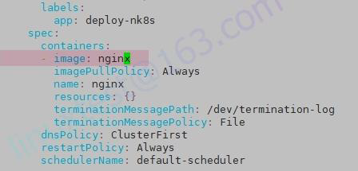

# 1 题目要求

在 namespace **default**中的一个 Deployment 由于指定了错误的容器镜像而失败。找出此 Deployment 并修复问题

# 2 解题 

1 查看default namespace空间下的所有资源信息，找到失败的deployment
kubectl -n default get all

2 发现 deploy-nk8s 出现了错误，描述看下pod拉取镜像的错误
kubectl -n default describe pod deploy-nk8s-58b86cdc9c-9vzp9

修改deployment,将错误的image修改正确
kubectl -n default edit deployments.apps deploy-nk8s
这里只要修改为nginx即可

3 再次检查

kubectl get pods -n default

