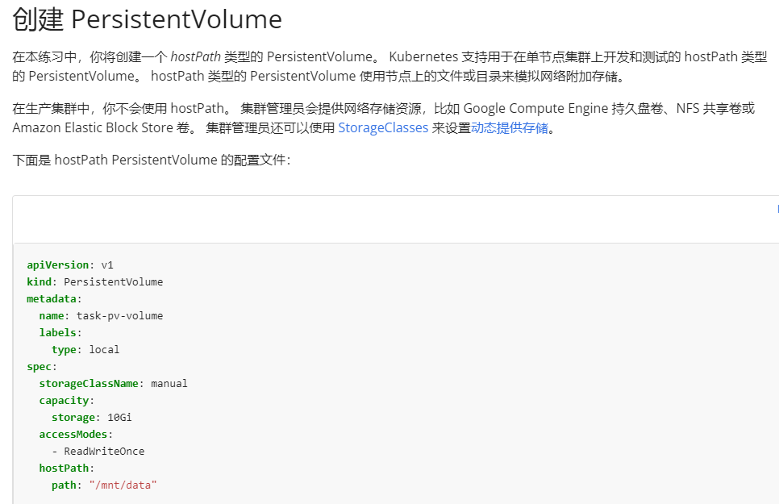

# 1 题目要求

1. 在 node02 节点上创建一个文件 **/opt/KDSP00101/data/index.html** ,内容为 **WEPKEY=7789**
2. 使用 hostPath 创建一个名为 **task-pv-volume** 的 **PersistentVolume** ，并分配 **2Gi** 容量，指定该卷位于集群节点上的 **/opt/KDSP00101/data** ，访问模式 **ReadWriteOnce** 。它应该为 **PersistentVolume** 定义 **StorageClass** 名称为 **keys** ，它将被用来绑定 **PersistentVolumeClaim** 请求到这个 **PersistenetVolume** 。
3. 创建一个名为 **task-pv-claim** 的 **PersistentVolumeClaim** ，请求容量 **200Mi** ，并指定访问模式 **ReadWriteOnce**
4. 创建一个 pod，使用 PersistentVolmeClaim 作为一个卷，带有一个标签 **app:my-storage-app** ，将卷挂载到 pod 内的 **/usr/share/nginx/html**


# 2 参考

[https://kubernetes.io/zh-cn/docs/tasks/configure-pod-container/configure-persistent-volume-storage/](https://kubernetes.io/zh-cn/docs/tasks/configure-pod-container/configure-persistent-volume-storage/)

```
# 参考官方配置
apiVersion: v1
kind: PersistentVolume
metadata:
  name: task-pv-volume
  labels:
    type: local
spec:
  storageClassName: manual
  capacity:
    storage: 2Gi
  accessModes:
    - ReadWriteOnce
  hostPath:
    path: "/mnt/**data**"
```



# 3 解答

如何将PVC绑定到特定的PV上？
简单来讲，就是给PV打上一个label，然后让PVC去匹配这个label即可。


1 从 node01 上 ssh 跳转到 node02 上
ssh node02

2 在 node02 节 点 上 创 建 一 个 文 件 /opt/KDSP00101/data/index.html ， 内 容 为 WEPKEY=7789
echo WEPKEY=7789 > /opt/KDSP00101/data/index.html

3 使用 hostPath 创建一个名为 task-pv-volume 的 PersistentVolume ，并分配 2Gi 容量，指定该卷位于集群节点上的 /opt/KDSP00101/data ，访问模式 ReadWriteOnce 。它应该为 PersistentVolume 定义 StorageClass 名称为 keys ，它将被用来绑定 PersistentVolumeClaim 请求到这个 PersistenetVolume。

vi task-pv-volume.yaml

```
apiVersion: v1
kind: PersistentVolume
metadata:
  name: task-pv-volume
spec:
  storageClassName: keys
  capacity:
    storage: 2Gi
  accessModes:
    - ReadWriteOnce
  hostPath:
    path: "/opt/KDSP00101/data"
```

kubectl apply -f task-pv-volume.yaml

4 创建一个名为 task-pv-claim 的 PersistentVolumeClaim，请求容量 200Mi ，并指定访问模式 ReadWriteOnce

vi task-pv-claim.yaml

```
apiVersion: v1
kind: PersistentVolumeClaim
metadata:
  name: task-pv-claim
spec:
  storageClassName: keys
  accessModes:
    - ReadWriteOnce
  resources:
    requests:
      storage: 200Mi
```

kubectl apply -f task-pv-claim.yaml


5 创建一个 pod，使用 PersistentVolmeClaim 作为一个卷，带有一个标签 app:my-storage-app ，将卷挂载到 pod 内的 /usr/share/nginx/html

注意：  
因为 Kubernetes supports hostPath for development and testing on a single-node cluster.  
所以，测试环境里，需要指定 Pod 在 node02 上运行，即，与 hostPath 类型的 PV 在同一个节点上。  
考试环境，一般只有一个 node 节点，所以不需要指定。但是最好你考试时，kubectl get node 先检查一下，如果有多个 node 节点，则也需要指定 Pod 在创建 PV的那个节点上运行，即，使用 nodeSelector。

vi task-pv-pod.yaml

```
apiVersion: v1
kind: Pod
metadata:
  labels:
  app: my-storage-app
  name: task-pv-pod
spec:
  containers:
    - name: nginx
      image: nginx
      volumeMounts:
      - mountPath: "/usr/share/nginx/html"
        name: task-pv-storage
   nodeSelector:
     kubernetes.io/hostname: node02 #使用 kubectl get node --show-labels 确定这个 node 的特有标签
  volumes:
    - name: task-pv-storage
      persistentVolumeClaim:
        claimName: task-pv-claim
```

kubectl apply -f task-pv-pod.yaml

6 测试

kubectl get pod -o wide | grep task-pv-pod

curl 10.244.2.35

[](https://www.ljh.cool/wp-content/uploads/2023/02/image-108.png)