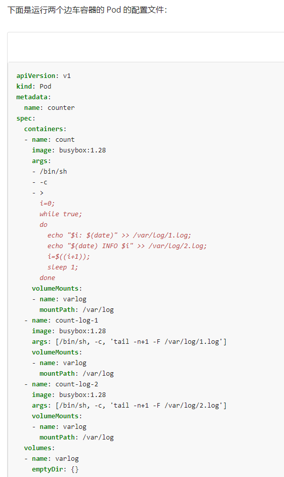

# 1 题目要求

- 在 **default** 命名空间创建一个 deployment 名为 **deploymenb-web**
- 包含一个主容器 **lfccncf/busybox:1** ，名称 **logger-123**
- 包含一个边车容器 **lfccncf/fluentd:v0.12** ，名称 **adaptor-dev**
- 在两个容器上挂载一个共享卷 **/ckad/log** ,当 pod **删除** ，这个卷 **不会持久** 。
- 在 **logger-123** 容器运行以下命令：
```
while true; do
echo "i luv cncf" >> /ckad/log/input.log; sleep 10;
done
```

- 结果会文本输出到 **/ckad/log/input.log** ，格式示例如下：
    i luv cncf
    i luv cncf
    i luv cncf
- **adaptor-dev** 容器读取 **/ckad/log/input.log** ，并将数据输出到 /ckad/log/output 格式为 Fluentd JSON

请注意 ：完成此任务不需要了解 Fluentd ， 完成此任务所需要的知识 .从/ckad/KDMC00102/fluentd-configmap.yaml 提供规范文件中创建 configmap ，并将该 configmap 挂载到边车容器 adapter-dev 中的 /fluentd/etc

# 2 参考

[https://kubernetes.io/zh-cn/docs/concepts/cluster-administration/logging/](https://kubernetes.io/zh-cn/docs/concepts/cluster-administration/logging/)

搜索Logging Architecture




# 3 解题

1  完成此任务所需要的知识 .从/ckad/KDMC00102/fluentd-configmap.yaml 提供规范文件中创建 configmap ，并将该 configmap 挂载到边车容器 adapter-dev 中的 /fluentd/etc


cp /ckad/KDMC00102/fluentd-configmap.yaml bak-2.yaml

vi /ckad/KDMC00102/fluentd-configmap.yaml

```
apiVersion: v1
kind: ConfigMap
metadata:
  name: fluentd-config
data:
  fluent.conf: |
  <source>
    @type tail
    format none
    path /ckad/log/input.log
    tag cncf #修改为 cncf 或其他包含在日志中的字段。因为从题中 echo “i luv cncf” >> /ckad/log/input.log 得知内容“i luv cncf”要写到/ckad/log/output，
所以 tag 可以过滤 cncf 字段，而得到内容“i luv cncf”。
    <parse>
      @type none
    </parse>
  </source>
  <match cncf> #修改为 cncf 或者* ，match 是匹配上面的 tag cncf，如果写为 cncf，则只匹配 tag cncf，如果写为*，则匹配上面所有的 tag。在这道题里，
也可以写为* 。
  @type file
  path /ckad/log/output #创建完成后，会自动生成/ckad/log/output.20220314.b5da2f3157860121f，其中 output.* 星号是随机字符。
  </match>
```

kubectl apply -f /ckad/KDMC00102/fluentd-configmap.yaml\


2 vi sidecar.yaml
```yaml
apiVersion: apps/v1
kind: Deployment
metadata:
  name: deploymenb-web
  namespace: default
spec:
  replicas: 1
  selector:
    matchLabels:
      app: nginx
  template:
    metadata:
      labels:
        app: nginx
    spec:
      containers:
      - image: lfccncf/busybox:1
        name: logger-123
        args:
        - /bin/sh
        - -c
        - >
          while true;
          do
            echo "i luv cncf" >> /ckad/log/input.log;
            sleep 10;
          done
        volumeMounts:
        - name: log
          mountPath: /ckad/log
      - image: lfccncf/fluentd:v0.12
        name: adaptor-dev
        volumeMounts:
        - name: log
          mountPath: /ckad/log
        - name: config
          mountPath: "/fluentd/etc"
      volumes:
      - name: log
        emptyDir: {}
      - name: config
        configMap:
          name: fluentd-config
```

kubectl apply -f sidecar.yaml


检查

kubectl get deploy,pod | grep deploymenb-web

kubectl exec deploymenb-web-xxxx -c adaptor-dev -- tail /ckad/log/input.log

[](https://www.ljh.cool/wp-content/uploads/2023/02/image-110.png)
