# 1 Link

- [https://docs.aws.amazon.com/eks/latest/userguide/autoscaling.html](https://docs.aws.amazon.com/eks/latest/userguide/autoscaling.html)
- Best Practice
    - [https://docs.aws.amazon.com/eks/latest/best-practices/cas.html](https://docs.aws.amazon.com/eks/latest/best-practices/cas.html)
    - [https://docs.aws.amazon.com/eks/latest/best-practices/karpenter.html](https://docs.aws.amazon.com/eks/latest/best-practices/karpenter.html)
    - [https://docs.aws.amazon.com/eks/latest/best-practices/automode.html](https://docs.aws.amazon.com/eks/latest/best-practices/automode.html)
- Karpenter
    - [https://karpenter.sh/docs/getting-started/getting-started-with-karpenter/](https://karpenter.sh/docs/getting-started/getting-started-with-karpenter/)

# 2 Cluster Autoscaler  (CA)

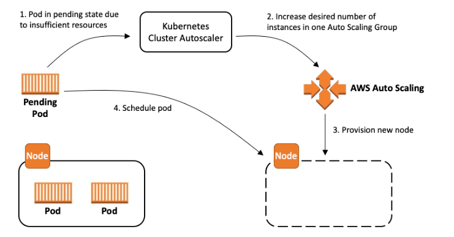


- Based on Node Group  
    - CA select a Node Group at first, then select instance type
    - respects that boundary of Node Groups — it will scale up the group only within the min–max range.
    - Dynamical selection of Instance type and pricing model  
        - When Cluster Autoscaler adds a new node, its instance type and pricing model  is not determined by the underlying Auto Scaling Groups (ASG) or EKS Managed Node Groups. 
    - If you want to use multiple Instance type, you have to define the Mixed Instance Policy of NG or depoly multiple node groups

- Scale Up (spin up new node) and Scale Down (terminate Node)  
    - If pods are in a Pending state (i.e., they cannot be scheduled due to insufficient CPU, RAM, etc.), Cluster Autoscaler will try to scale up by adding more nodes only if:  
        - There is an Auto Scaling Group (ASG) tagged correctly.
        - The new node type has enough resources to fit the pending pod(s).
    - If a node are underutilized ( if the total requested CPU and memory of the pods running on that node is below a certain threshold ) the Cluster Autoscaler will remove that node to save costs. but **only if** all the pods on it can be:
        - Safely rescheduled to other nodes without issues. (without violating affinity/anti-affinity, node selectors, taints, etc.)
        - Without causing disruption to system-critical workloads or services

## 2.1 Multiple Cluster Autoscaler/Multiple Node Group/ Mixed Instance Policy

- Multiple Cluster Autoscaler Instances  
    - The Cluster Autoscaler can be configured to operate on a specific set of Node Groups. Using this functionality, it’s possible to deploy multiple instances of the Cluster Autoscaler, each configured to operate on a different set of Node Groups. 
    - there are some side effects. Since the shards do not communicate, it’s possible for multiple autoscalers to attempt to schedule an unschedulable pod. This can result in unnecessary scale out of multiple Node Groups. These extra nodes will scale back in after the scale-down-delay
- Multiple Node Groups in Cluster Autoscaler Instance
    - Define a prioritized list of node group through ConfigMap
    - The Cluster Autoscaler has a concept of [Expanders](https://github.com/kubernetes/autoscaler/blob/master/cluster-autoscaler/FAQ.md#what-are-expanders), which provide different strategies for selecting which Node Group to scale.
- Mixed Instance Policy in Node Group
    - Define the available instance types, pricing models, their priorities, and percentage distribution within the MixedInstancePolicy.
    - The autoscaler’s scheduling simulator uses the **first** InstanceType in the MixedInstancePolicy

## 2.2 Node Scheduling

1. You define one or more node groups, each with:
    - A specific instance type (e.g. `t3.medium`, `m5.large`, etc.)
    - Desired/min/max capacity
    - (Optional) labels and taints
2. Manage node group to bump up the number of nodes and spin up the new pod into this new node.
    1. Cluster Autoscaler watches pending pods, and checks which node group can fit the workload.
    2. It selects a node group that:
        1. Matches resource requirements (CPU, memory)
        2. Satisfies scheduling constraints (labels, taints, availability zone, etc.)
        3. Is eligible for scale-up (has not reached `maxSize`)
    3. Cluster Autoscaler increases the size of that group, causing a new EC2 instance to be launched
3. Manage node group to terminate the underutilized node
    1. cutomize a set of rules and checks (checking CPU and memory usage.)
    2. Cluster Autoscaler marks a node as underutilized if the total requested CPU and memory of the pods running on that node is below a certain threshold (usually ~50% by default).
    3. Check if all pods running on it can be rescheduled on other nodes without issues.
    4. Then the node is marked for removal. Cluster Autoscaler waits for a grace period (default: 10 minutes) before actually removing the node.

## 2.3 Disadvantage

- The new node has the same size like the other existing nodes in the node group.
    - It cause the resource waste when just a samll workload has to be run in that larger node.
- increase the node group management overhead 
    - A new workload which requires a new instance type which is not included in any of the exisiting node group, it needs to update the exisiting node groups or create a new node group
- No Pod-level optimization
    - No Evict or Move Pods for Cost Optimization based on EC2 instance pricing model  
        - CA will not make decisions based on EC2 instance pricing (e.g., Spot vs. On-Demand) or attempt to evict pods from expensive nodes to cheaper ones.
    - It won't reshuffle or consolidate pods across nodes to make each of nodes more balanced packed. It makes decisions based on pending pods and underutilized nodes, not pod-level optimization.
        - Example: Suppose we have 3 nodes with the pods are loosely distributed across them. The Cluster Autoscaler cannot scale down the node group because the remaining two nodes do not have enough resources to accommodate all the pods from the third node, Or some scheduling constraints (like nodeAffinity, taints, or tolerations) prevent pods from moving,. In this case, the Cluster Autoscaler **does not redistribute** or repack the pods to balance the workload across nodes more efficiently.

# 3 Karpenter


## 3.1 event-driven, not metric-based 

In Karpenter, you don’t configure metrics directly (like CPU, memory, or custom CloudWatch metrics) to trigger scaling actions. Karpenter works differently from tools like Cluster Autoscaler or the Horizontal Pod Autoscaler (HPA). Its design is event-driven, meaning it responds to unschedulable pods — not metrics.

Karpenter watches the Kubernetes scheduler. When a pod can’t be scheduled (due to lack of resources), it will **launch a new EC2 instance** that fits the pod’s requirements (e.g., CPU, memory, zones, architectures). It **does not need** or use CPU/memory usage metrics to make this decision.

| Goal                                                   | Recommended Tool                                                                                                                |
| ------------------------------------------------------ | ------------------------------------------------------------------------------------------------------------------------------- |
| **Scale pods based on CPU or memory usage**            | Use the **Horizontal Pod Autoscaler (HPA)** — it increases pod replicas. Then, Karpenter reacts to pending pods and adds nodes. |
| **Scale nodes down when underutilized**                | Karpenter automatically checks if nodes are underutilized and safely terminates them (if no critical pods remain).              |
| **Trigger scaling based on custom CloudWatch metrics** | Karpenter doesn’t support this natively. You’d need to use **EventBridge + Lambda** (as a custom workaround).                   |

---


```
apiVersion: karpenter.sh/v1beta1
kind: NodePool
metadata:
  name: example
spec:
  template:
    spec:
      requirements:
        - key: "karpenter.sh/capacity-type"
          operator: In
          values: ["spot", "on-demand"]
  limits:  # This caps how many total resources Karpenter can provision.
    resources:
      cpu: 1000
      memory: 1000Gi
  disruption:  # Replaces underutilized nodes with fewer or cheaper instances.
    consolidationPolicy: WhenUnderutilized
    consolidateAfter: 30s

```


## 3.2 Node Managment


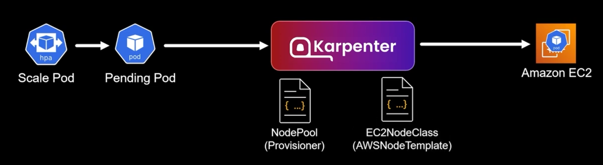

- No Node groups
- Use all instance types in default. But you can specify the instance types if you cant 
- Karpenter pick the appropriate instance type and pricing model (like spot instance) to launch a node to fit the new pod 
    - user can set up contraints to limit the instance typs that is able to use 
    - set up taints to isolate workload to specific types of nodes
- Customized AMI can be used.
- Pod-level optimization: Pod consolidation/Repack/Reschuffling


### 3.2.1 Node Pool
- Defines what kind of nodes Karpenter will create
- Define instance types, CPU architecture , number of cores, certain AZs for nodes that Karpenter will respect 
- One or multiple NodePools per Karpenter installation


**NodePool YAML**


- Instance type flexibility
    - Attribute-based requirements sizes, families, generations, CPU architectures
    - No list : picks from all instance types in EC2 universe, excluding metal
    - Limits how many EC2 instances this NodePool can provision
- AZ flexibility
    - Provision in any AZ
    - provusion in specifed AZs
- CPU architecture flexbility
    - x86-64
    - Arm64
- Purchse options flexibility
    - On-demand, if nothing specified
    - Prioritizes Spot if flexible to both capacity types

### 3.2.2 EC2 NodeClass

- Use AMI Selector to specify which AMI to use
- Specify which Subnet and SecurityGroup to use
- Speicfy which IAM role which is assigned to node


```yaml
apiVersion: karpenter.k8s.aws/v1
kind: EC2NodeClass
metadata:
  name: default
spec:
  role: "KarpenterNodeRole-${CLUSTER_NAME}" # replace with your cluster name
  amiSelectorTerms:
    - alias: "al2023@${ALIAS_VERSION}"
  subnetSelectorTerms:
    - tags:
        karpenter.sh/discovery: "${CLUSTER_NAME}" # replace with your cluster name
  securityGroupSelectorTerms:
    - tags:
        karpenter.sh/discovery: "${CLUSTER_NAME}" # replace with your cluster name
```


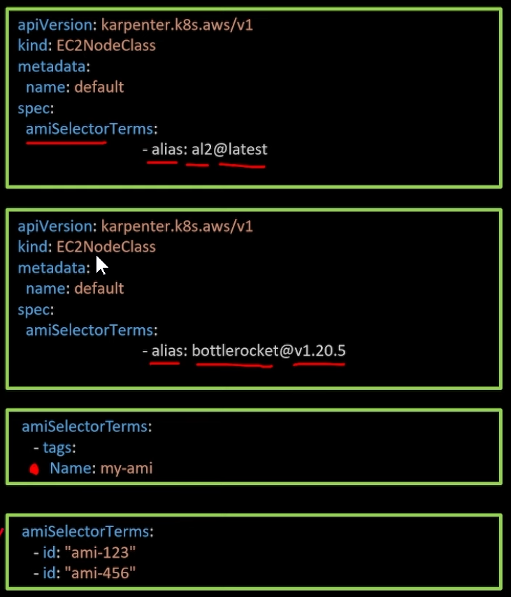


# 4 How Karpenter Determines a Node Is Underutilized:

- Karpenter **does not use CloudWatch CPU/memory metrics** to determine underutilization.
- It uses **Kubernetes scheduling logic** to simulate what would happen if the node were removed.
- You can **tune disruption behavior** to make consolidation more or less aggressive.

A node is considered **underutilized** when **all the pods running on it** can be:
1. **Evicted** (i.e., not using `node.kubernetes.io/unschedulable`, `podDisruptionBudget`, etc.),
2. **Rescheduled** onto other nodes **without violating**:
    - resource constraints (CPU, memory, GPU, etc.),
    - scheduling constraints (taints, tolerations, affinity rules, etc.),
3. **And** the node does not have **any daemonset pods that prevent termination** (unless they can be safely replaced).

## 4.1 Pod scheduling: Use label as constraints
User-defined annotation, labels, taints are added into the created nodes

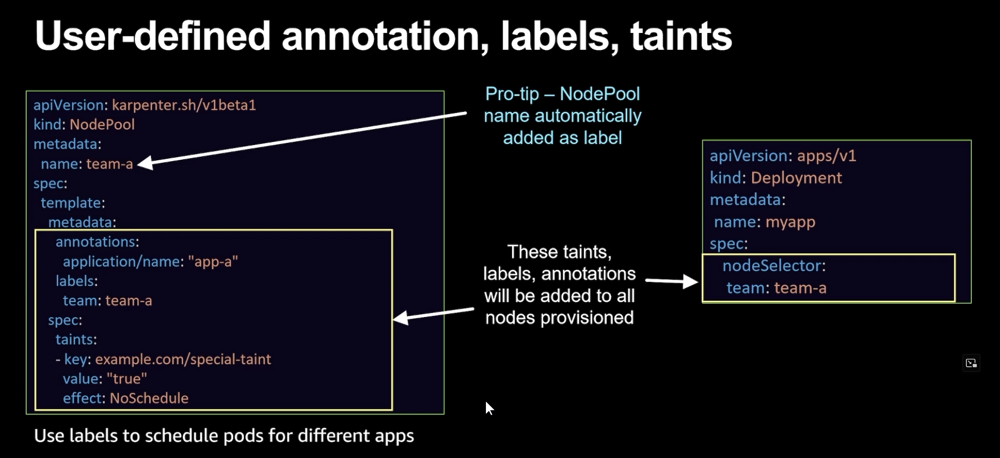


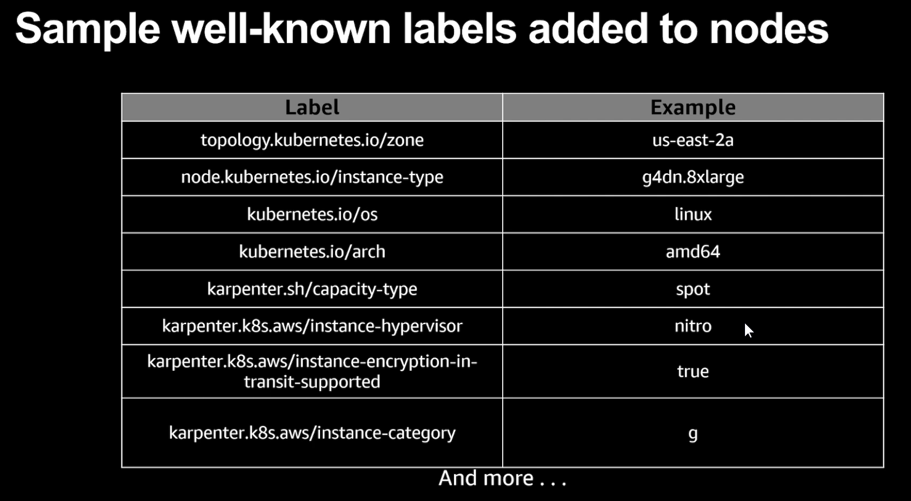


### 4.1.1 Example 

Example: AZ Scheduling

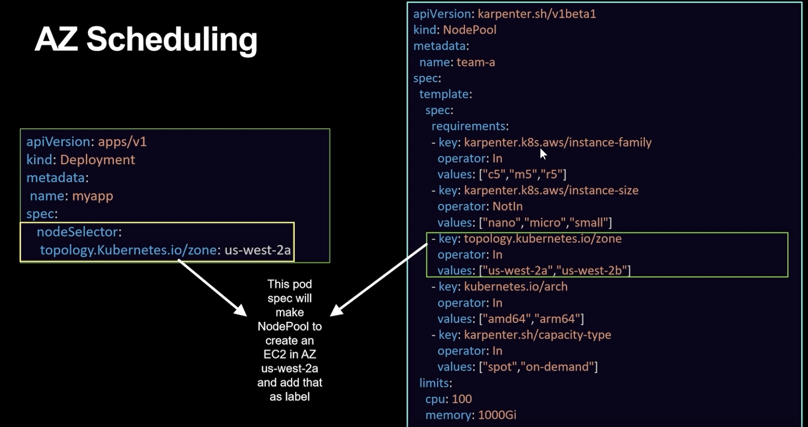

---

Example:

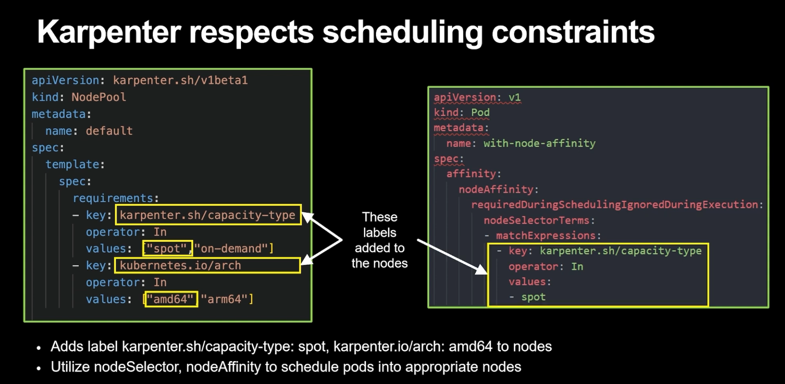

---

Example: Karpenter Supports GPUs
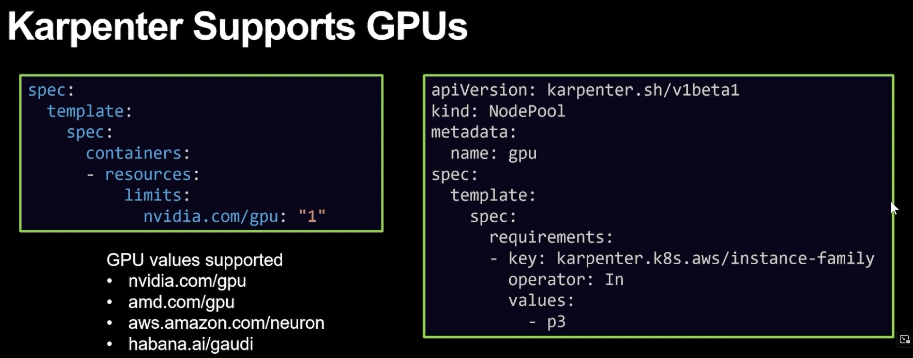

---

Example: Taint and Toleration with Karpenter 


---

Example: TopologySpread with Karpenter 


## 4.2 Pod Consolidation

- Reshuffle pods across nodes to make each of nodes more balanced packed.   
    - Example: Suppose we have 3 nodes with the pods are loosely distributed across them. The Cluster Autoscaler cannot scale down the node group because the remaining two nodes do not have enough resources to accommodate all the pods from the third node, Or some scheduling constraints (like nodeAffinity, taints, or tolerations) prevent pods from moving,. In this case, the Cluster Autoscaler **does not redistribute** or repack the pods to balance the workload across nodes more efficiently.
-  Consolidate pods to make fewer node more densely packed

---

Enable Consolidation
```
apiVersion: karpenter.sh/vlbetal
kind: NodePool
spec:
  disruption:
    consolidationPolicy: WhenUnderutilized
```

---

Consolidation Strategy

- Karpenter works to reduce cluster cost by:
    - Removing empty nodes
    - Removing node(s) by moving the pods to another underutilized node(s)
    - Replacing nodes with cheaper variants
- consolidateAfter - How many seconds to wait to scale nodes down due to low utilization
- consolidationPolicy - When Empty I WhenUnderuti1ized
    - WhenEmpty -Karpenter will only consider nodes for consolidation that contain no workload pods
    - WhenUnderutilized — Karpenter will attempt to remove or replace nodes when a node is underutilized and could be changed to reduce cost

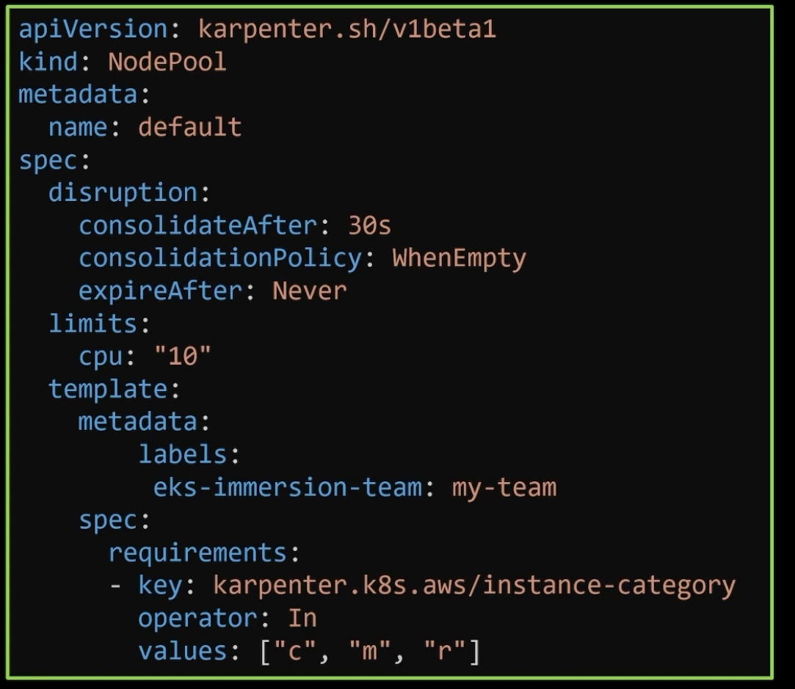


# 5 EKS Auto Mode

- Install karpenter automatically and leverages the advanteage of it 
- Node Management 
    - node is not based on node group any more
    - select the appropriate sized ec2 instance type and pricing type to provision a new node 
    - Dynamical pod consolidation
    - use **bottlesocket AMI** which is alrady baked EKS addons
- Add-ons Managament 
    - EKS can manage all addon, like karpenter , balancer,  Ingress, VPC CNI and storage CSI
    - Upgrade the Control Plane , add-on and AMI will also be upgrade automatically if they are not compatible with the Control Plane in new version

## 5.1 Add-ons Management


Non Auto Mode 
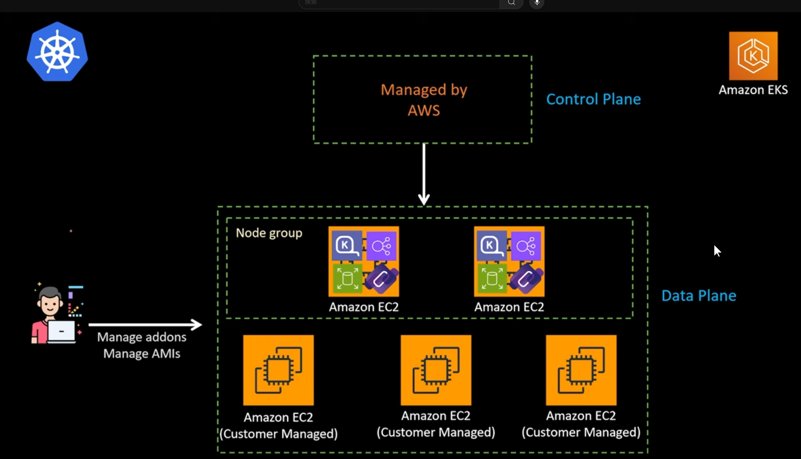


Auto Mode 


In AWS EKS Auto Mode, core add-ons such as the EBS CSI driver, AWS Load Balancer Controller, Karpenter are automatically installed in the control plane and  configured and managed by AWS.  The non core Add-ons ( e.g. prometheus ArgoCD) are not automatically installed by AWS

VPC CNI, CoreDNS, and kube-proxy are baked into AMI and embeded into node autocally

This means

- They are installed using the EKS Add-ons system (not Helm) in control plane.
- AWS will automatically keep them up to date.
    - If there is new version of addons available with the new eks version, eks auto mode will upgrade them too. 
    - You don’t need to install or upgrade them manually.
- Compatibility with your EKS cluster version
    - When you upgrade the eks control plane, the add-ons have to be upgrade for compatibility
- Integration with IAM roles and service accounts which are automatically used when auto mode is enabled
- not face the network perfomace issued because the addons runs as a system porcess, not run demonsets or deploymen


**How EKS Auto Mode takes control of the previous installed Add-ons**
- If the add-ons were previously installed not through terraform resource aws_eks_addon, but manually using Helm
    - It causes Duplicate installations, IAM/IRSA conflicts
    - Recommended Solutions: Remove the Helm-installed add-ons and migrate to EKS-managed add-ons, or Keep Helm-installed version and manually remove the AWS-managed one
- If the core EKS add-ons were previously installed using the aws_eks_addon Terraform resource
    - EKS Auto Mode will automatically manage those core add-ons going forward.
    - If you're managing versions of add-ons or IAM roles or service account explicitly in Terraform, Auto Mode will **not override** those unless you update the `aws_eks_addon` resource accordingly.
        - AWS will manage updates only if you allow it, e.g., by omitting the `addon_version`


## 5.2 Node management 

### 5.2.1 Handling the existing nodes

Once you enable EKS Auto Mode, AWS provisions and manages new nodes independently, but Existing nodes (from node groups, ASGs, or self-managed EC2 nodes) are not touched.

It can add a managed node group to an EKS Auto Mode cluster. This allows you to run static nodes alongside the autoscaling nodes provided by Auto Mode

### 5.2.2 Auto Mode Managed AMI


**Bottlerocket OS**
It is an open-source, Linux-based operating system built by AWS specifically for running containers — optimized for security, minimalism, and performance.

It's designed to:
- Be lightweight and immutable
- Run only essential components
- Integrate deeply with EKS and container runtimes (like containerd)

  

 **Bottlerocket AMI**

| Bottlerocket             | AMI                                                                                                                        |
| ------------------------ | -------------------------------------------------------------------------------------------------------------------------- |
| **Minimal OS**           | Only includes container runtime, kubelet, and essential components — no package manager, SSH by default                    |
| **Security**             | Read-only root filesystem, automatic updates, secure boot                                                                  |
| **Fast startup**         | Boots quickly and is optimized for EC2/EKS workloads                                                                       |
| **Container-first**      | Runs all user-space applications in containers                                                                             |
| **API-driven config**    | Managed via `apiclient` and TOML files                                                                                     |
| **Built-in containerd**  | Optimized for Kubernetes                                                                                                   |
| **Official EKS support** | Maintained by AWS, with EKS-optimized builds                                                                               |
| **Advantage**            | No more track, select, or update AMI version, AMI patching, hydrating ( same as managed Node Group)<br><br>AWS manages it. |

**Add-ons are baked into the AMI**
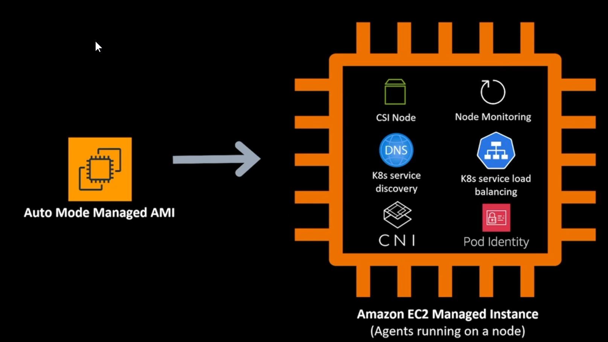

- Those components do not run as demon set and they are actually baked into the AMI and run as systemd process.
    -  Usually , Components like aws-node (VPC CNI plugin), kube-proxy, or CoreDNS run as Pods, are deployed via DaemonSets on every node.
    - But in Auto Mode: These components are not Pods. They run as native system services (systemd processes) on the EC2 instance, outside the Kubernetes layer. This means that certain essential components (like VPC CNI, CoreDNS, etc.) are pre-installed directly into the Amazon Machine Image (AMI) that Auto Mode uses.
- Why this is good:
    - high scalability and performance is not be throttled
        - When your cluster scales (i.e., more pods are created): If networking (like VPC CNI) or DNS (like CoreDNS) are Pods, they may take time to get scheduled and initialized, especially under high load. But if they are already running as system services, they are immediately available and more stable.  
            - Faster pod startup times
            - No risk of resource throttling due to Kubernetes pod scheduling delays
            - Better scalability, especially for network-heavy workloads
    - Scale to zero
        - not running add-ons in the managed node group in eks data plane when is no workload


### 5.2.3 Node management and lifecycle rule via NodePool

Karpenter use NodePool which defines,  what kind of instance should be running,  whether should be on demand or spot,  how much time after it should exprie , etc.

ESK auto mode comes with the default NodePool (a NodePool with default configuration). User can also create User Defined NodePool and use it in Eks auto mode


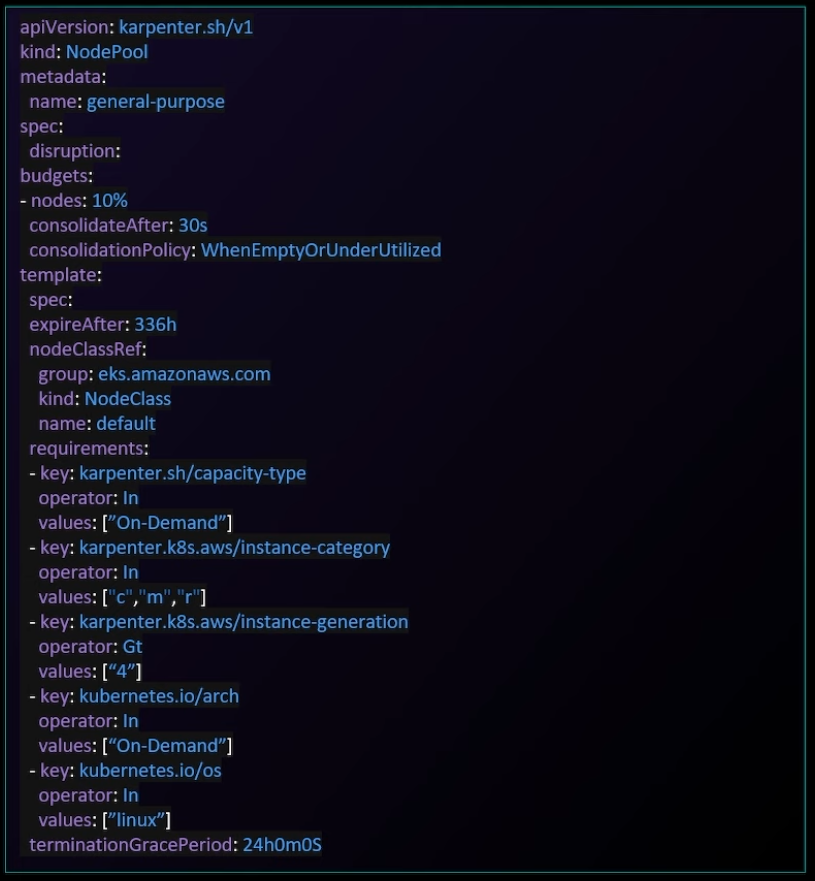

**"node expiry" in EKS Auto Mode**

In EKS Auto Mode, each worker node has a maximum lifespan of 21 days (default 15 days) . The lifespan is configurable in NodePool

- Each Worker Node will recycle after 15 days im Default and max 21 days
- will come with the latest Bottlerocker AMI
- Zero touch sercuriy 


After node expiry, AWS automatically  drains and terminates the old node,  launch a new node, reschedule the pods into new node

This helps:
- Keep nodes up-to-date with security patches
- Improve reliability
- Remove need for manual node replacement

  

**What happens to the pods on an expiring node:** 

When a node is about to expire, EKS Auto Mode automatically performs these steps:

1. Drains the node gracefully
    - Pods are evicted using the standard Kubernetes eviction API
    - AWS respects PodDisruptionBudgets (PDBs)
2. Terminates the node after pods are evicted
3. Launches a new replacement node using the same node group configuration
4. Kubernetes reschedules the evicted pods on available or new nodes
    - Controlled by the standard Kubernetes scheduler


| Behavior                      | Description                                                                                                                                 |
| ----------------------------- | ------------------------------------------------------------------------------------------------------------------------------------------- |
| Pod eviction is graceful      | AWS waits for pods to terminate or be rescheduled                                                                                           |
| PDBs are respected            | If eviction would violate a PodDisruptionBudget, termination is delayed                                                                     |
| Replacement node is automatic | AWS ensures capacity is maintained by provisioning new nodes                                                                                |
| Stateful pods                 | Pods using PVCs (e.g. from EBS) will also be rescheduled — **you must ensure proper StorageClass and pod affinity/anti-affinity if needed** |


### 5.2.4 NodeClass

Create user defined NodeClass

- Use lastest Bottelrocket AMI, no more AMI Selector. can't change AMI or Userdata
- Supports Subnet and SecurityGroup selections
- Includes network configurations such as SNAT and Network Policy


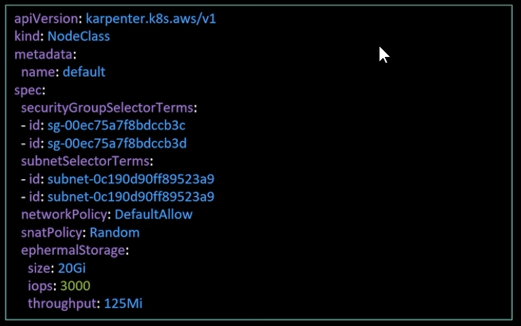


# 6 EKS with AWS Fargate 

EKS Auto mode: Automatically creates and manages EC2 node groups for you.
EKS Fargate mode: Fully serverless — you don’t manage any nodes; AWS runs each pod in its own Fargate container.


EKS Auto mode 
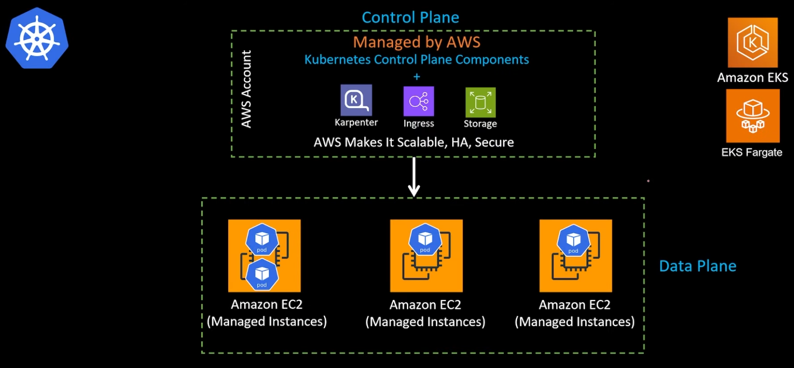

EKS Fargate Mode 
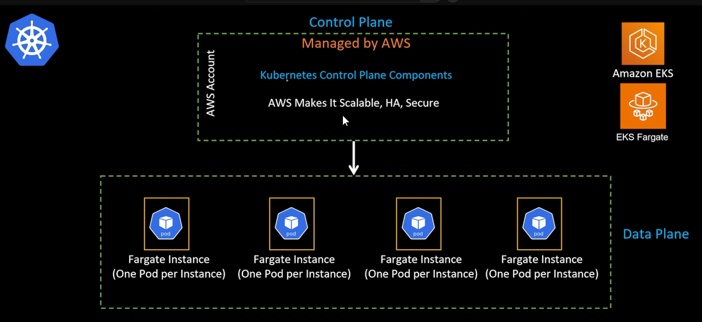


- No EC2; pods run in isolated Fargate environments which consist of Fargate Instances  
    - on fargate instance can only run one pod 
- No infrastructure to manage at all
- Do not manages core add-ons
- Limitation:
    - no DaemonSet, HostPort, or EBS volumes
    - no tools that runs on pod or sidercar 
    - Service mesh can not be used 
- Short-lived jobs, event-driven tasks, serverless workloads
- Only EFS supported (EBS not supported)

# 7 Summary and Comparison

|   |   |   |   |
|---|---|---|---|
||Cluster Auto scaler|EKS with self Managed Karpenter|EKS Auto Mode|
|Installation|Helm Chart or It's Deployment Yaml file|Helm Chart<br><br>Self-managed Karpenter in EKS<br><br>Karpenter Controller is depolyed as Pod|AWS EKS Built-in Feature.<br><br>AWS- managed Karpenter: Karpenter automatically installed in EKS control plane:|
|Addtional Cost|free|free|no addtional cost on control plane<br><br>**addtional 12 % fee on the top of on-demnad ec2 cost**|
||   |   |   |
|Based on Node Group|")<br><br>Respects that boundary of Node Groups — it will scale up the group only within the min–max range.|")<br><br>Each node is managed individually|") <br><br>**EKS Auto Mode still uses node groups, but it abstracts and manages them for you automatically, so you don’t need to define or manage them manually like in standard EKS**<br><br>don’t need to configure instance types or scaling rules – EKS Auto Mode handles it using Karpenter-like logic.|
|Node scale up when pods are pending|")|")|")|
|Node scale down unused nodes|")|")|")|
|Pod-level consolidation (move pods around to free nodes and terminate underutilized ones)|")<br><br>It makes decisions based on pending pods and underutilized nodes, not pod-level optimization.|")<br><br>reshuffle or consolidate pods across nodes to make fewer nodes more densely packed. <br><br>Example<br><br>- If <br>- Two small node contains one pod on each of them. They are underutilized. Kapenter provision a more powerful node and move pods around to this new node. Then terminate underutilized nodes|")|
|Dynamically reschedule pods for cost savings|")|")<br><br>Make decisions based on EC2 instance pricing (e.g., Spot vs. On-Demand) or attempt to evict pods from expensive nodes to cheaper ones.|")|
|Cold Start Optimization|Low ( minutes level)<br><br>Node startup relies on EC2 Auto Scaling Groups (ASG), which typically take tens of seconds to minutes to launch a new instance.|High ( tens of second-level )<br><br>Directly provisions EC2 instances via EC2 APIs, skipping Auto Scaling Groups — faster provisioning.<br><br>Usually 30–50% faster than Cluster Autoscaler. Sub-minute or near-second-level cold starts are achievable, especially with tuning.|Very High ( tens of second-level )<br><br>deliver a serverless-like experience with seconds-level startup.<br><br>AWS maintains pre-warmed pools of compute capacity, optimized AMIs, and image caches|
||   |   |   |
|Dynamically choose instance type and pricing type of new node|") <br><br>The node group (ASG or Managed Node Group) defines the instance type of new node|") <br><br>dynamically choose the best-fit instance size based on pod requirements<br><br>nodes are individually managed by AWS|") <br><br>In EKS Auto Mode, AWS introduces a new compute provisioning model that does not rely on traditional node groups like EKS Managed Node Groups or EC2 Auto Scaling Groups.<br><br>Instead , nodes are individually managed by AWS|
|AMI Selection: ec2 instance type and his network and storage configuration|") <br><br>based on the configuration of node group|") <br><br>Create user defined EC2NodeClass<br><br>- use AMI Selector to specify EKS Optimized AMI or Custom AMI to use<br>- Supports Subnet and SecurityGroup selections<br>- Support IAM Role selection|")<br><br>Create user defined NodeClass<br><br>- Only support AMIs are for Amazon-provided Bottlerocket, no more AMI Selector. can't change AMI or Userdata<br>- Supports Subnet and SecurityGroup selections<br>- Includes network configurations such as SNAT and Network Policy|
|Node lifecycle|") <br><br>based on the configuration of node group|") <br><br>Use NodePool: Run indefinitely or choose custom hours/days|") <br><br>Use NodePool: Worker nodes will recycle after maximal 21 days (default 14)|
||   |   |   |
|Control Plane management|")|")|") <br><br>User manages upgrade of control plane manually|
|EKS core Add-on management througth AWS (automatically install, configure, upgrade)|")<br><br>User manages other addons manually|") <br><br>User manages Karpenter and other addons manually|")<br><br>When control plane get upgraded , AWS will upgrade Karpenter and core addons (e.g. EBS CSI, AWS LB Controller)|


## 7.1  When to use

|   |   |   |
|---|---|---|
|Cluster Auto Scaler|EKS with self-managed Karpenter|EKS Auto mode|
|- Based no Node Group. It cause NG management overhead<br>- No Pod-level optimzation|Unprarllel Flexibility<br><br>- Have in-house Karpenter knowledge<br>- Have a platform team to manage cluster and addons<br>- You have requirements to use custom AMI, or non expiring worker nodes<br>- with good cold start performance|Superior Simplicity <br><br>- From an operations standpoint, the only difference is in EKS Auto Mode you do not need to manage the deployment, scaling, and upgrade of the Karpenter pods themselves. All other operations, like managed NodeClasses and NodePools works the same as with open source Karpenter.<br>- Do not want to manage the worker and nodes or addons<br>- You don't have nuanced requirements to use custom AMI, non expiring worker nodes<br>- If you been looking to use EKS Fargate but couldn't due to EKS Fargate limitations<br>    - e.g. EKS Fargate can not run demon sets (service mesh needs demonsets<br>    - EKS Fargate can not use GPU or spot instances<br>- with extreme good cold start performance|

# 8 EKS Basis

## 8.1 EKS Add-ons

EKS Add-ons are installed into the Kubernetes cluster (usually in the `kube-system` namespace), and some of them run on every EC2 Worker Node, while others run only once in the cluster.
- Addons like VPC CNI, kube-proxy, and CloudWatch Agent are implemented as DaemonSets, which means one pod will be scheduled on every EC2 Worker Node.
    - DaemonSets ensure node-level visibility or functionality (networking, logs, metrics).
- Others like CoreDNS are Deployments — they only run a few replicas in the cluster, not necessarily on every node. It means Kubernetes decides on which node(s) the pods will run, based on current resource availability (CPU, memory) and any scheduling rules.
    - Deployments handle cluster-level logic or services (like DNS, volume controllers).


  
|Addon Name|Runs on Every Node?|Type|Explanation|
|---|---|---|---|
|**Amazon VPC CNI**|✅ Yes|DaemonSet|Manages Pod networking. One pod per node.<br><br>Every node needs a CNI plugin to assign IPs and handle networking for its pods.|
|**kube-proxy**|✅ Yes|DaemonSet|Manages Kubernetes networking rules. One pod per node.<br><br>Handles low-level network routing rules on each node using iptables or IPVS.|
|**CloudWatch Agent (logs/metrics)**|✅ Yes|DaemonSet|Collects metrics/logs. One per node.<br><br>Collects metrics/logs directly from each node (CPU, disk, logs, etc.).|
|**CoreDNS**|❌ No|Deployment|Only runs on selected nodes, handles DNS resolution.<br><br>Only needs a few replicas to serve DNS queries for the whole cluster.|
|**EBS CSI Driver**|✅/❌ Mixed|DaemonSet + Deployment|DaemonSet runs on all nodes that mount EBS; the controller runs as Deployment.<br><br>Schedules EBS volumes across nodes, but does not need to run everywhere.|
   


## 8.2 Computer per workload scheduling requirements

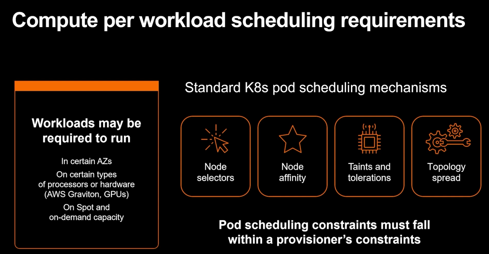

- Node Selectors
- Node affinity
- Taints and tolerations
- Topologyspread


### 8.2.1 Pod Tolerations and Node Taints 

A taint is applied to a node to repel pods unless those pods explicitly tolerate it.
`kubectl taint nodes <node-name> key=value:NoSchedule`
"No pod can be scheduled on this node unless it has a toleration for key=value:NoSchedule."


A toleration is added to a pod to allow it to be scheduled onto a node with a matching taint.
Example pod configuration:

```
tolerations:
- key: "key"
  operator: "Equal"
  value: "value"
  effect: "NoSchedule"
```

This allows the pod to be scheduled on nodes that have the taint key=value:NoSchedule.


## 8.3 Notes

- AutoScaling 
    - HPA: Use metric to decide when to spin up or down additional pods to deal with the increasing or decreasing workloads 
    - VPA: manges the resource allocation like CPU usage or memory usage of pods and make them "larger" or "smaller". No additional pods generated
    - Worker Node Autoscaling: Wenn the existing worker nodes don't have enough capacity to schedule any more pods in the node. An additional node is needed
- Node Groups   
    - **Node Groups** are an abstract Kubernetes concept for a group of nodes within a cluster. It is not a true Kubernetes resource, but exists as an abstraction in the Cluster Autoscaler, Cluster API, and other components. Nodes within a Node Group share properties like labels and taints, but may consist of multiple Availability Zones or Instance Types.
    - **EC2 Auto Scaling Groups** can be used as an implementation of Node Groups on EC2. EC2 Auto Scaling Groups are configured to launch instances that automatically join their Kubernetes Clusters and apply labels and taints to their corresponding Node resource in the Kubernetes API.
    - **EC2 Managed Node Groups** are another implementation of Node Groups on EC2. They abstract away the complexity manually configuring EC2 Autoscaling Scaling Groups and provide additional management features like node version upgrade and graceful node termination.
- EC2 Instance Type
    - 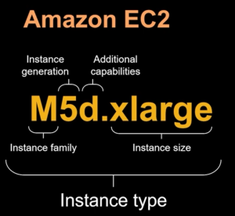

