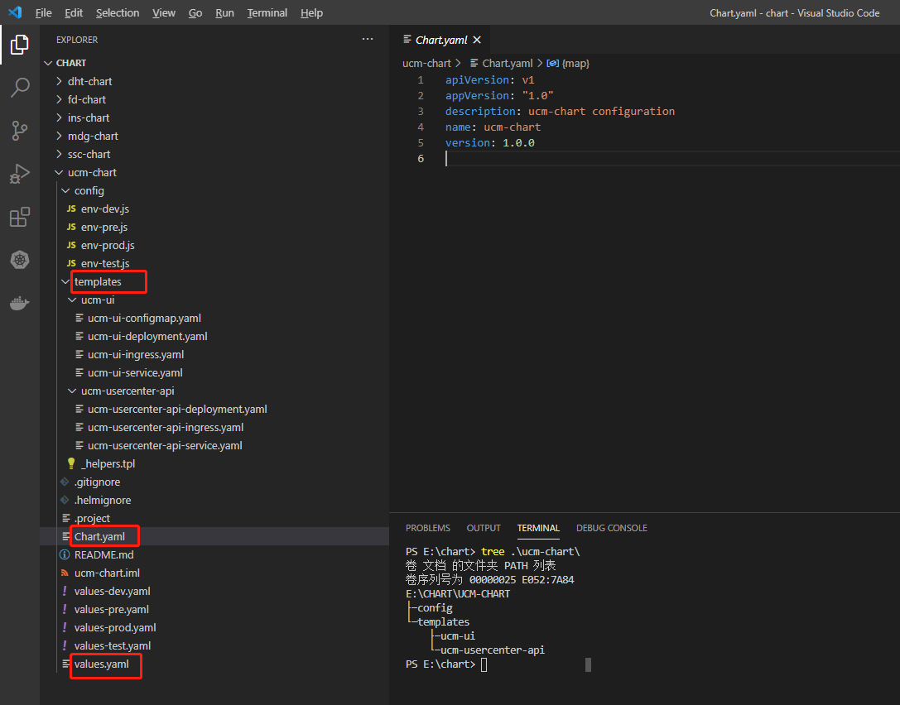

# 1 概述

- Helm 最核心的就是 Chart 模板，即模板化的 K8s manifests 文件。
- 它本质上就是一个 Go 的 template 模板。Helm 在 Go template 模板的基础上，增加了很多东西。如一些自定义的元数据信息、扩展的库以及一些类似于编程形式的工作流，例如条件语句、管道等等。这些东西都会使得我们的模板变得更加丰富。

Helm采用了Go语言的模板来编写chart。chart是Helm的应用打包格式，是一系列用于描述k8s资源相关文件的集合，由一组文件和目录构成，通常整个chart被打成tar包，而且标注上版本信息，便于Helm部署。  
其中最重要的是模板，模板中定义了 Kubernetes 各类资源的配置信息，Helm 在部署时通过 values.yaml 实例化模板。

单个的 chart 可以非常简单，只用于部署一个服务，比如 Memcached；chart 也可以很复杂，部署整个应用，比如包含 HTTP Servers、 Database、消息中间件、cache 等。

Helm 使用 Chart 对应用程序进行描述，它使用 Go Template 对应用部署所需的 YAML 进行抽象，形成应用部署模板，在需要进行部署时，可以编写 yaml 为模板中的变量进行赋值，也可以在 Helm CLI 的命令行中使用 `--set name=value` 的方式来对简单变量进行赋值，完成赋值之后，可以选择使用 `helm template` 指令将 Chart + Value 的组合渲染成为 YAML 供 `kubectl` 使用，也可以使用 `helm install` 直接通过 Tiller 进行安装。

# 2 Chart 的文件结构

- chart 是一个组织在文件目录中的集合。==目录名称就是 chart 名称（没有版本信息）==，因此描述 wordpress 的 chart 可以存储在  `wordpress/` 目录中。

```
wordpress/
├── charts # 包含chart依赖的其他chart
├── Chart.yaml # 用于描述这个 Chart 的基本信息，包括名字、描述信息以及版本等。
├── templates # 模板目录， 当和 values 结合时，可生成有效的Kubernetes manifest文件
│   ├── deployment.yaml
│   ├── _helpers.tpl # 放置可以通过 chart 复用的模板辅助对象
│   ├── hpa.yaml
│   ├── ingress.yaml
│   ├── NOTES.txt # 用于介绍 Chart 帮助信息， helm install 部署后展示给用户。例如：如何使用这个 Chart、列出缺省的设置等。
│   ├── serviceaccount.yaml
│   ├── service.yaml
│   └── tests
│       └── test-connection.yaml
└── values.yaml # chart 默认的配置值
```

- values.yaml （此chart的默认配置值，可以被templates内的yaml文件使用）  
- chart.yaml (描述 chart 概要信息的YAML 文件，是 chart 所必需的)
- templates：chart包内各种资源对象的模板。其中最重要的是“deployment.yaml”和“service.yaml”，分别是部署和服务文件. "helpers.tpl"用来定义变量，"ingress.yaml"是对外接口  
    - templates目录 各类Kubernetes资源的配置模板都放置在这里。Helm会将values.yaml中的参数值注入到模板中生成标准的YAML配置文件

一个 chart 被 Helm 运行后将会生成对应的一个 release；  
chart 和 release 的关系可以用代码和进程的关系来类比。chart 是打包了 k8s 资源的集合（比如 deployment、service 等），而 release 则是在 Helm 中运行的集合实体（比如 values ）  
Helm 由客户端和 Tiller 服务器组成。客户端负责管理 chart，服务器负责管理 release。


注意点
- 建议使用 `.yaml` 作为 YAML 文件的后缀，以 `.tpl` 作为 helper 文件的后缀。




## 2.1 Chart.yaml 中的值 

apiVersion，name 和 version 是必填项，其他都是可选。
```yaml
apiVersion: # 图表API版本，始终为“v1”（必需）
name: # 图表的名称（必需）
version: # Chart的版本号，版本号必须符合 SemVer 2：http://semver.org/(语义化版本规范)（必需）
kubeVersion: # 一系列兼容的Kubernetes版本（可选）
description: # Chart的简要描述，本项目的一句话描述（可选）
keywords:
  - # 有关此项目的关键字列表，便于检索（可选）
home: # 此项目主页的URL（可选）
sources:
  - # 指向此项目源代码的URL列表（可选）
maintainers: # 维护人员信息(可选)
  - name: # 维护者名称（每个维护者必须填写）
    email: # 维护者的电子邮件（每个维护者可选）
    url: # 维护者的URL（每个维护者可选）
engine: gotpl # 模板引擎的名称（可选，默认为gotpl）
icon: # 要用作图标的SVG或PNG图像的URL（可选）
appVersion: # 包含的应用程序版本（可选）。这不必是SemVer
deprecated: # 此“chart”是否已弃用（可选，布尔值）
tillerVersion: 此“chart”所需的“Tiller”版本。这应该表示为SemVer范围：“>2.0.0”（可选）
```


# 3 内置对象

## 3.1 概述

- 对象可以通过模板引起传递到模板中，当然我们也可以通过代码传递对象（如：`with`、`range`）。
- 对象可以非常简单仅仅有一个值，也可以包含其他对象或方法。如：`Release` 对象可以包含其他对象（如：`Release.Name`），`File` 对象有一组方法。


## 3.2 Release 对象


Release 对象是我们可以在模板中访问的顶层对象之一，Release 对象描述了 版本发布本身，包含如下对象。


## 3.3 Value 对象

- Value 对象是从 values.yaml 文件和用户提供的文件传进模板的。如：values.yaml 中的值是 `favoriteDrink: coffee`，那么在 template 目录中的模板文件中，就可以使用 `{{ .Values.favoriteDrink }}`获取到该值。


## 3.4 Chart 对象

- Chart 对象是从 Chart.yaml 文件传进模板的。Chart.yaml 里面的所有数据都可以通过 Chart 获取到，如：`{{ .Chart.Name }}-{{ .Chart.Version }}`。
- Chart.yaml 的内容如下：

```yaml
apiVersion: chart API 版本 （必需）
name: chart名称 （必需）
version: 语义化2 版本（必需）
kubeVersion: 兼容Kubernetes版本的语义化版本（可选）
description: 一句话对这个项目的描述（可选）
type: chart类型 （可选）
keywords:
  - 关于项目的一组关键字（可选）
home: 项目home页面的URL （可选）
sources:
  - 项目源码的URL列表（可选）
dependencies: # chart 必要条件列表 （可选）
  - name: chart名称 (nginx)
    version: chart版本 ("1.2.3")
    repository: （可选）仓库URL ("https://example.com/charts") 或别名 ("@repo-name")
    condition: （可选） 解析为布尔值的yaml路径，用于启用/禁用chart (e.g. subchart1.enabled )
    tags: # （可选）
      - 用于一次启用/禁用 一组chart的tag
    import-values: # （可选）
      - ImportValue 保存源值到导入父键的映射。每项可以是字符串或者一对子/父列表项
    alias: （可选） chart中使用的别名。当你要多次添加相同的chart时会很有用
maintainers: # （可选）
  - name: 维护者名字 （每个维护者都需要）
    email: 维护者邮箱 （每个维护者可选）
    url: 维护者URL （每个维护者可选）
icon: 用做icon的SVG或PNG图片URL （可选）
appVersion: 包含的应用版本（可选）。不需要是语义化，建议使用引号
deprecated: 不被推荐的chart （可选，布尔值）
annotations:
  example: 按名称输入的批注列表 （可选）.
```


## 3.5 Files 对象

- `Files`： 在chart中提供访问所有的非特殊文件的对象。你不能使用它访问`Template`对象，只能访问其他文件。 请查看这个 [文件访问](https://helm.sh/zh/docs/chart_template_guide/accessing_files)部分了解更多信息。
    - `Files.Get` 通过文件名获取文件的方法。 （`.Files.Getconfig.ini`）
    - `Files.GetBytes` 用字节数组代替字符串获取文件内容的方法。 对图片之类的文件很有用
    - `Files.Glob` 用给定的shell glob模式匹配文件名返回文件列表的方法
    - `Files.Lines` 逐行读取文件内容的方法。迭代文件中每一行时很有用
    - `Files.AsSecrets` 使用Base 64编码字符串返回文件体的方法
    - `Files.AsConfig` 使用YAML格式返回文件体的方法


## 3.6 Capabilities 对象

- `Capabilities`： 提供关于 Kubernetes 集群支持功能的信息。
    - `Capabilities.APIVersions` 是一个版本列表
    - `Capabilities.APIVersions.Has $version` 说明集群中的版本 (比如,`batch/v1`) 或是资源 (比如, `apps/v1/Deployment`) 是否可用
    - `Capabilities.KubeVersion` 和`Capabilities.KubeVersion.Version` 是Kubernetes的版本号
    - `Capabilities.KubeVersion.Major` Kubernetes的主版本
    - `Capabilities.KubeVersion.Minor` Kubernetes的次版本
    - `Capabilities.HelmVersion` 包含Helm版本详细信息的对象，和 `helm version` 的输出一致
    - `Capabilities.HelmVersion.Version` 是当前Helm语义格式的版本
    - `Capabilities.HelmVersion.GitCommit` Helm的git sha1值
    - `Capabilities.HelmVersion.GitTreeState` 是Helm git树的状态
    - `Capabilities.HelmVersion.GoVersion` 是使用的Go编译器版本


## 3.7 Template 对象

- `Template`： 包含当前被执行的当前模板信息。
    - `Template.Name`: 当前模板的命名空间文件路径 (如： `mychart/templates/mytemplate.yaml`)
    - `Template.BasePath`: 当前chart模板目录的路径 (如： `mychart/templates`)

## 3.8 建议

内置对象都是以大写字母开始，符合 Go 的命名规范；自定义名称的时候，按照团队约定即可，一般建议首字母小写，以便和内置对象区分。


# 4 values.yaml文件 

- Value 对象来源于多个位置：
    - ① chart 中的 values.yaml 文件。
    - ② 父 chart 中的 values.yaml 文件。
    - ③ 使用 -f 参数（`helm install -f myvals.yaml ./mychart`）传递到 helm install 或 helm upgrade 的 values 文件。
    - ④ 使用 --set 传递的单个参数。

- 以上列表有明确的顺序：默认使用 values.yaml ，可以被父 chart 的 values.yaml 覆盖，继而被用户提供的 values 文件覆盖，最后会被 --set 参数覆盖。


## 4.1 例子 1 

1 
 删除 values.yaml 中的默认内容，并设置一个参数： 

```
echo "" > values.yaml
echo "favoriteDrink: coffee" > values.yaml
```

2 
编辑 configmap.yaml 文件，读取 values.yaml 文件中配置的值：

vi configmap.yaml

```
kind: ConfigMap
apiVersion: v1
metadata:
  name: {{ .Release.Name }}-configmap
  namespace: default
data:
  myvalue: "Hello World"
  drink: {{ .Values.favoriteDrink }} # 注意 favoriteDrink是Values的一个属性: {{ .Values.favoriteDrink }}
```


3
用 helm install --dry-run 测试

helm install test mychart --dry-run


4 
使用 --set 参数覆盖 values.yaml 中的值：
helm install --set favoriteDrink=slurm test mychart --dry-run

## 4.2 例子2 values.yaml 设置多结构

1
编辑 values.yaml 文件，并设置内容：

vi values.yaml

```
favorite:
  drink: coffee
  food: pizza
```

2 
编辑 configmap.yaml 文件，读取 values.yaml 文件中配置的值：

vi configmap.yaml

```
apiVersion: v1
kind: ConfigMap
metadata:
  name: {{ .Release.Name }}-configmap
data:
  myvalue: "Hello World"
  drink: {{ .Values.favorite.drink }}
  food: {{ .Values.favorite.food }}
```

3 
使用 helm install --dry-run 测试：
helm install test mychart --dry-run

# 5 注释 

```
  {{/* name: {{ include "ivuplan.fullname" . }}-{{ .Values.lzm.awsAccount }}  # Notice that there should be a match between the service name and the name of the Endpoints object.
 */}} 

在 helm template 用 # sdsasda   会报错
```

# 6 给某个 keyword 赋值

```
name: {{ .Values.monitoring.appServerMetrics.existingSecretName | default (printf "%s-metrics-auth" (include "ivuplan.fullname" .)) | quote }}

metadata:
  name: {{ include "ivuplan.fullname" . }}
  labels:
    {{- include "ivuplan.labels" . | nindent 4 }}

data:
  username: {{ required ".Values.monitoring.appServerMetrics.username is required, when no existing secret is passed." .Values.monitoring.appServerMetrics.username | b64enc }}


{{- define "license-loader" -}}
- name: ivuplan-license-loader
  image: curlimages/curl:8.8.0
  imagePullPolicy: {{ $.Values.image.pullPolicy }}
  command:
    - "curl"
    - "-o"
    - "/license-dir/license.license"
    - {{ $.Values.ivuplanDb.licenseFileUrl | quote }}
  volumeMounts:
    - name: licensedir
      mountPath: "/license-dir"
{{- end }}

{{- define "ivuplan.fullname" -}}
{{- if .Values.fullnameOverride }}
{{- .Values.fullnameOverride | trunc 53 | trimSuffix "-" }}
{{- else }}
{{- $name := default .Chart.Name .Values.nameOverride }}
{{- if contains $name .Release.Name }}
{{- .Release.Name | trunc 53 | trimSuffix "-" }}
{{- else }}
{{- printf "%s-%s" .Release.Name $name | trunc 53 | trimSuffix "-" }}
{{- end }}
```


```

{{- printf "%s-%s" .Release.Name $name | trunc 53 | trimSuffix "-" }}

{{- range $as := .Values.ivuplanAs }}
apiVersion: v1
kind: Service
metadata:
  name: {{ printf "%s-%s-%s" (include "ivuplan.fullname" $) $.Values.lzm.awsAccount $as.name | quote }}
  namespace: {{ $.Values.lzm.namespace | default (printf "default" ) | quote }}
{{- end }}

```
# 7 变量 

函数、管道符、对象和控制结构都可以控制，我们转向很多编程语言中更基本的思想之一：变量。 
在模板中，很少被使用。但是我们可以使用变量简化代码，并更好地使用with和range。 

示例1 ：获取列表键值

vi values.yaml
```
favorite:
  drink: coffee
  food: pizza
```


vi configmap.yaml
```
apiVersion: v1
kind: ConfigMap
metadata:
  name: {{ .Release.Name }}-configmap
data:
  myvalue: "Hello World"
  {{- range $key, $val := .Values.favorite }} # 注意这里
  {{ $key }}: {{ $val | quote }}
  {{- end }}
```


helm install test mychart --dry-run


---

示例2 解决 with 中不能使用内置对象（使用变量对另一个对象进行命名引用）

vi configmap.yaml

```
apiVersion: v1
kind: ConfigMap
metadata:
  name: {{ .Release.Name }}-configmap
data:
  myvalue: "Hello World"
  {{- $relname := .Release.Name -}} # 提前将对象赋值给变量
  {{- with .Values.favorite }}
  drink: {{ .drink | default "tea" | quote }}
  food: {{ .food | upper | quote }}
  release: {{ $relname }} # 使用 $变量 的方式
  {{- end }}
```

helm install test mychart --dry-run


---


## 7.1 使用 $ 去引用变量 


在有range 的情况下，  底下的块 中的变量的寻找范围 都变成了 在 .Values.ivuplanAs 下去寻找变量了， 所以 必须改为 $.Values.lzm.awsAccount， 用 .Values.lzm.awsAccount 会报错 

在没有range 的情况下， 用  .Values.lzm.awsAccount  没问题 

正确的写法 
```
{{- range $as := .Values.ivuplanAs }}
apiVersion: v1
kind: Service
metadata:
  name: {{ printf "%s-%s-%s" (include "ivuplan.fullname" $) $.Values.lzm.awsAccount $as.name | quote }}
  namespace: {{ $.Values.lzm.namespace | default (printf "default" ) | quote }}
```


# 8 管道和函数 


## 8.1 函数 
- 目前为止，我们已经知道了如何将信息传到模板中，但是传入的信息并不能被修改。 而有时我们又希望以一种更有用的方式来转换所提供的数据。
- 我们可以调用模板指令中的 quote 函数将 .values 对象中的字符串属性用引号引起来，然后放到模板中。

vi configmap.yaml

```
apiVersion: v1
kind: ConfigMap
metadata:
  name: {{ .Release.Name }}-configmap
data:
  myvalue: "Hello World"
  drink: {{ quote .Values.favorite.drink }} # 注意此处，使用了 quote 函数
  food: {{ quote .Values.favorite.food }} # 注意此处，使用了 quote 函数
```


使用 helm install --dry-run 测试：
helm install test mychart --dry-run


● 模板函数的语法是 functionName arg1 arg2...。在上面的代码片段中，quote .Values.favorite.drink调用了quote函数并传递了一个参数(.Values.favorite.drink)。
● Helm 有超过60个可用函数。其中有些通过 Go模板语言本身定义。其他大部分都是 Sprig 模板库。我们可以在示例看到其中很多函数。


## 8.2 管道 

- 模板语言其中一个强大功能是 **管道** 概念。借鉴UNIX中的概念，管道符是将一系列的模板语言紧凑地将多个流式处理结果合并的工具。换句话说，管道符是按顺序完成一系列任务的方式。

- 现在使用管道父重写上面的示例：

vi configmap.yaml

```
apiVersion: v1
kind: ConfigMap
metadata:
  name: {{ .Release.Name }}-configmap
data:
  myvalue: "Hello World"
  drink: {{ .Values.favorite.drink | quote }}
  food: {{ .Values.favorite.food | quote }}
```

在这个示例中，并不是调用quote 参数，而是倒置了命令。使用管道符(|)将参数“发送”给函数： .Values.favorite.drink | quote。使用管道符可以将很多函数链接在一起：

```
apiVersion: v1
kind: ConfigMap
metadata:
  name: {{ .Release.Name }}-configmap
data:
  myvalue: "Hello World"
  drink: {{ .Values.favorite.drink | quote }}
  food: {{ .Values.favorite.food | upper | quote }}
```

倒置命令是模板中的常见做法。可以经常看到 .val | quote 而不是 quote .val。实际上两种操作都是可以的。


## 8.3 default 函数

- 模板中频繁使用的一个函数是`default`： `default DEFAULT_VALUE GIVEN_VALUE`。 这个函数允许你在模板中指定一个默认值，以防这个值被忽略。
- 使用 default 函数重写上面的示例：


1
vi configmap.yaml


```
apiVersion: v1
kind: ConfigMap
metadata:
  name: {{ .Release.Name }}-configmap
data:
  myvalue: "Hello World"
  drink: {{ .Values.favorite.drink | default "tea" | quote }}  # 注意此处
  food: {{ .Values.favorite.food | upper | quote }}
```

2
使用 helm install --dry-run 测试
helm install test mychart --dry-run


3
从values.yaml中移除设置

vi values.yaml

```
favorite:
  #drink: coffee
  food: pizza
```


4
使用 helm install --dry-run 测试：

```
helm install test mychart --dry-run
```

注意：
- 在实际的 chart 中，所有的静态默认值应该设置在 values.yaml 文件中，且不应该重复使用 default 命令（容易出现冗余），但是这个 default 函数很适合计算值，不能声明在 values.yaml 文件中。
- [模板函数列表](https://helm.sh/zh/docs/chart_template_guide/function_list/)。
- 对于模板来说，运算符(`eq`, `ne`, `lt`, `gt`, `and`, `or`等等) 都是作为函数来实现的。 在管道符中，操作可以按照圆括号分组。

# 9 流程控制 

## 9.1 概述

- 很多编程语言都提供了流程控制语言，如：if 、while 等，Helm 也不例外。
- Helm 提供了如下的三种流程控制：
    - `if/else`， 用来创建条件语句。
    - `with`， 用来指定范围。
    - `range`， 提供 `"for each"` 类型的循环。
- 除了这些之外，还提供了一些声明和使用命名模板的关键字：
    - `define` 在模板中声明一个新的命名模板。
    - `template` 导入一个命名模板。
    - `block` 声明一种特殊的可填充的模板块。


## 9.2 if-else


语法：

```
{{ if PIPELINE }}
  # Do something
{{ else if OTHER PIPELINE }}
  # Do something else
{{ else }}
  # Default case
{{ end }}
```

注意我们讨论的是 管道 而不是值。这样做的原因是要清楚地说明控制结构可以执行整个管道，而不仅仅是计算一个值。


- 如果是以下值，在 if xx 中, 管道会被认为是 false ：
    - 布尔false
    - 数字0
    - 空字符串
    - `nil` (空或null)
- 空集合(`map`, `slice`, `tuple`, `dict`, `array`)


### 9.2.1 例子 1
vi configmap.yaml

```
apiVersion: v1
kind: ConfigMap
metadata:
  name: {{ .Release.Name }}-configmap
data:
  myvalue: "Hello World"
  drink: {{ .Values.favorite.drink | default "tea" | quote }}
  food: {{ .Values.favorite.food | upper | quote }}
  {{ if .Values.favorite.drink }}mug: "true"{{ end }}
```

此时的 values.yaml 文件的内容如下：

```
favorite:
  # drink: coffee
  food: pizza
```

使用 helm install --dry-run 测试：\
helm install test mychart --dry-run


修改 values.yaml 文件，将 drink: coffee 打开：
vi values.yaml
```
favorite:
  drink: coffee # 此处原来的注释关闭了
  food: pizza
  
```


使用 helm install --dry-run 测试：
helm install test mychart --dry-run


### 9.2.2 例子2 : 缩进引起的问题 


我们不可能 { if }} xxx {{ end }} 总写在一行，那么我们对其格式化一下：


vi configmap.yaml

```
apiVersion: v1
kind: ConfigMap
metadata:
  name: {{ .Release.Name }}-configmap
data:
  myvalue: "Hello World"
  drink: {{ .Values.favorite.drink | default "tea" | quote }}
  food: {{ .Values.favorite.food | upper | quote }}
  {{ if .Values.favorite.drink }}
    mug: "true"
  {{ end }}
```

使用 helm install --dry-run 测试：
```
helm install test mychart --dry-run
```


---


取消缩进，重新执行下：
vi configmap.yaml

```
apiVersion: v1
kind: ConfigMap
metadata:
  name: {{ .Release.Name }}-configmap
data:
  myvalue: "Hello World"
  drink: {{ .Values.favorite.drink | default "tea" | quote }}
  food: {{ .Values.favorite.food | upper | quote }}
  {{ if .Values.favorite.drink }}
  mug: "true" # 注意，此处取消的缩进
  {{ end }}
```

helm install test mychart --dry-run


- 此时，又有问题，那就是出现了空行。因为当模板引擎运行时，`{{` 和 `}}` 里面的内容，但是留下的空白完全保持原样。
- YAML 认为空白是有意义的，但是此时的结果和我们预想的有所不同，我们不希望出现这多余的空行。而 Helm 是可以处理此类问题的。
- 模板声明的大括号语法可以通过特殊的字符修改，并通知模板引擎取消空白。`{{-`(包括添加的横杠和空格)表示向左删除空白， 而`-}}`表示右边的空格应该被去掉。
- 要确保-和其他命令之间有一个空格。 {{- 3 }} 表示“删除左边空格并打印3”，而{{-3 }}表示“打印-3”。

---

使用这个语法，修改我们的模板，去掉新加的空白行，重新执行下：

vi configmap.yaml


```

apiVersion: v1
kind: ConfigMap
metadata:
  name: {{ .Release.Name }}-configmap
data:
  myvalue: "Hello World"
  drink: {{ .Values.favorite.drink | default "tea" | quote }}
  food: {{ .Values.favorite.food | upper | quote }}
  {{- if .Values.favorite.drink }} # 注意，此处向左删除空白
  mug: "true" 
  {{- end }} # 注意，此处取消的缩进，# 注意，此处向左删除空白

```

helm install test mychart --dry-run


解释上面是如何删除的，用一个`*`来代替每个遵循此规则被删除的空白， 在行尾的`*`表示删除新行的字符：

```
apiVersion: v1
kind: ConfigMap
metadata:
  name: {{ .Release.Name }}-configmap
data:
  myvalue: "Hello World"
  drink: {{ .Values.favorite.drink | default "tea" | quote }}
  food: {{ .Values.favorite.food | upper | quote }}*
**{{- if eq .Values.favorite.drink "coffee" }}
  mug: "true"*
**{{- end }}
```


---


那么，如果我们在 {{ }} 左边和右边都添加 -，并重新执行：
vi configmap.yaml

```
apiVersion: v1
kind: ConfigMap
metadata:
  name: {{ .Release.Name }}-configmap
data:
  myvalue: "Hello World"
  drink: {{ .Values.favorite.drink | default "tea" | quote }}
  food: {{ .Values.favorite.food | upper | quote }}
  {{- if .Values.favorite.drink -}} # 注意，此处向左删除空白
  mug: "true" 
  {{- end -}} # 注意，此处取消的缩进，# 注意，此处向左删除空白
```

vi configmap.yaml

```
apiVersion: v1
kind: ConfigMap
metadata:
  name: {{ .Release.Name }}-configmap
data:
  myvalue: "Hello World"
  drink: {{ .Values.favorite.drink | default "tea" | quote }}
  food: {{ .Values.favorite.food | upper | quote }}
  {{- if .Values.favorite.drink -}} # 注意，此处向左删除空白
  mug: "true" 
  {{- end -}} # 注意，此处取消的缩进，# 注意，此处向左删除空白
```

helm install test mychart --dry-run


出现了错误，是因为将两边的新行都删除了，如果两边都加上 -, 结果就像 food: "PIZZA"mug:"true"，所以，使用 -}}需谨慎。


## 9.3 with

with操作。这个用来控制变量范围。回想一下，.是对 当前作用域 的引用。因此 .Values就是告诉模板在当前作用域查找Values对象。

```
{{ with PIPELINE }}
  # restricted scope
{{ end }}
```

with允许我们为特定对象设定当前作用域(.)，比如我们前面一直使用的 .Values.favorite，我们可以使用 with来将 .范围指向 .Values.favorite。

1 
修改 configmap.yaml 文件，并重新执行：

vi configmap.yaml

```
apiVersion: v1
kind: ConfigMap
metadata:
  name: {{ .Release.Name }}-configmap
data:
  myvalue: "Hello World"
  {{- with .Values.favorite }}
  drink: {{ .drink }}
  food: {{ .food }}
  {{- end }}
```


```
helm install test mychart --dry-run
```
此时的 . 的作用域已经改变了，指向了 .Values.favorite 。


---

2 
可以优化一下
vi configmap.yaml

```
apiVersion: v1
kind: ConfigMap
metadata:
  name: {{ .Release.Name }}-configmap
data:
  myvalue: "Hello World"
  {{- with .Values.favorite }}
{{- toYaml . | nindent 2  }}
  {{- end }}
```


```
helm install test mychart --dry-run
```


with 已经将 . 指向了 .Values.favorite，toYaml .就相当于 toYaml .Values.favorite，将 value.yaml 中的 favorite 下面的值原模原样放到模板中，nindent 2 的意思是，在字符串的开头添加新行，并缩进 2 个空格。


## 9.4 range

很多编程语言支持使用for循环，foreach循环，或者类似的方法机制。 在Helm的模板语言中，在一个集合中迭代的方式是使用range操作符。

```
{{- range .Values.test }}
    {{ . }}
{{- end }}

{{- define "language-files" -}}
{{- range $.Values.languages }}
- name: copy-language-files-{{ . }}
  #image: e20hub.ivu-ag.com/ptp/language-pack:24.0.0-20240411-2001-en-gb
  image: "{{ $.Values.image.registry }}/{{ $.Values.image.repository }}/language-pack:{{ $.Values.image.tag }}-{{ . }}"
  imagePullPolicy: {{ $.Values.image.pullPolicy }}
  volumeMounts:
    - name: languagedir
      mountPath: "/mnt/"
{{- end }}
{{- end }}


{{- range $as := .Values.ivuplanAs }}
apiVersion: v1
kind: Service
metadata:
  name: {{ printf "%s-%s-%s" (include "ivuplan.fullname" $) $.Values.lzm.awsAccount $as.name | quote }}
  namespace: {{ $.Values.lzm.namespace | default (printf "default" ) | quote }}
{{- end }}


  {{- range $ts := .Values.ivuplanTs }}
    - port: metrics
      scheme: http
      path: '/metrics'
      interval: 30s
      relabelings:
        - sourceLabels: [__address__]
          targetLabel: __address__
          regex: (.*)
          replacement: "{{ $ts.host }}:9182"
          action: replace
{{- end }}
```


修改 values.yaml 文件，并增加如下的内容：

vi values.yaml

```
favorite:
  drink: coffee
  food: pizza 
pizzaToppings: # 增加的内容
  - mushrooms
  - cheese
  - peppers
  - onions
```


在模板中，使用 range 遍历，并执行一下：

vi configmap.yaml

```
apiVersion: v1
kind: ConfigMap
metadata:
  name: {{ .Release.Name }}-configmap
data:
  myvalue: "Hello World"
  {{- with .Values.favorite }}
{{- toYaml . | nindent 2  }}
  {{- end }}
  toppings: |-
    {{- range .Values.pizzaToppings }}
    - {{ . | title | quote }}   
    {{- end }}
```


---

```
# -- IVU.plan terminalservers
# For example:
# ivuplanTs:
#   - name: "t01"
#     host: "t01-example.local"
#   - name: "t02"
#     host: "t02-example.local"
ivuplanTs: []
```


```
{{- if .Values.monitoring.serviceMonitors.enabled }}
apiVersion: monitoring.coreos.com/v1
kind: ServiceMonitor
metadata:
  name: {{ include "ivuplan.fullname" . }}-ts
  labels:
    {{- include "ivuplan.labels" . | nindent 4 }}
spec:
  selector:
    matchLabels:
      {{- include "ivuplan.selectorLabels" . | nindent 6 }}
      endpoints: terminalserver
  endpoints:
  {{- range $ts := .Values.ivuplanTs }}
    - port: metrics
      scheme: http
      path: '/metrics'
      interval: 30s
      relabelings:
        - sourceLabels: [__address__]
          targetLabel: __address__
          regex: (.*)
          replacement: "{{ $ts.host }}:9182"
          action: replace
{{- end }}
  targetLabels:
    - "component"
{{- end }}
```


# 10 命名模版 

## 10.1 概述 


● 我们知道，k8s 是通过标签 Label 来匹配和筛选资源的，如：Service 和 Deployment 都是通过 label 来匹配 Pod 的，那么这部分也是重复的。在 Helm 中，这类在模板中重复的地方，也可以被抽取取来，放在命名模板中（命名模板是全局的，换言之，所有的模板都可以使用）。
● 一个常见的命名惯例是用chart名称作为模板前缀：{{ define "mychart.labels" }}。使用特定chart名称作为前缀可以避免可能因为 两个不同chart使用了相同名称的模板而引起的冲突。

### 10.1.1 局部的和`_`文件

- 目前为止，我们已经使用了单个文件，且单个文件中包含了单个模板。但Helm的模板语言允许你创建命名的嵌入式模板， 这样就可以在其他位置按名称访问。
- 在编写模板细节之前，文件的命名惯例需要注意：
    - `templates/`中的大多数文件被视为包含Kubernetes清单
    - `NOTES.txt`是个例外
    - 命名以下划线(`_`)开始的文件则假定 _没有_ 包含清单内容。这些文件不会渲染为Kubernetes对象定义，但在其他chart模板中都可用。
- 这些文件用来存储局部和辅助对象，实际上当我们第一次创建`mychart`时，会看到一个名为`_helpers.tpl`的文件，这个文件是模板局部的默认位置。

### 10.1.2 用`define`和`template`声明和使用模板

`define`操作允许我们在模板文件中创建一个命名模板，语法如下

```
{{- define "MY.NAME" -}}
  # body of template here
{{- end -}}
```


现在我们将模板嵌入到了已有的配置映射中，然后使用template包含进来：

```
apiVersion: v1
kind: ConfigMap
metadata:
  name: {{ .Release.Name }}-configmap
  {{- template "mychart.labels" . }}
data:
  myvalue: "Hello World"
  {{- range $key, $val := .Values.favorite }}
  {{ $key }}: {{ $val | quote }}
  {{- end }}
```

## 10.2 例子 

`vi _helpers.tpl`

```
{{- define "mychart.labels" -}}
  labels: # 注意，这里空了2个字符
    generator: helm
    date: {{ now | htmlDate }}
{{- end -}}
```


vi configmap.yaml
```
apiVersion: v1
kind: ConfigMap
metadata:
  name: {{ .Release.Name }}-configmap
  {{- template "mychart.labels" . }}
data:
  myvalue: "Hello World"
  {{- range $key, $val := .Values.favorite }}
  {{ $key }}: {{ $val | quote }}
  {{- end }}
```


helm install test mychart --dry-run


## 10.3 include 关键词, 为了使用管道 

template 指令是将一个模板包含在另一个模板中的方法。但是，template 函数不能用于 Go 模板管道。为了解决该问题，增加include 功能。

```
vi _helpers.tpl

```


```
{{- define "mychart.labels" -}}
labels: # 注意，此处没有空格
  generator: helm
  date: {{ now | htmlDate }}
{{- end -}}
```


vi configmap.yaml

```
apiVersion: v1
kind: ConfigMap
metadata:
  name: {{ .Release.Name }}-configmap
  {{- include  "mychart.labels" . | nindent 2 }}  ## 看此处 
data:
  myvalue: "Hello World"
  {{- range $key, $val := .Values.favorite }}
  {{ $key }}: {{ $val | quote }}
  {{- end }}
```


helm install test mychart --dry-run

# 11 Note.txt 文件 

- 在`helm install` 或 `helm upgrade`命令的最后，Helm 会打印出对用户有用的信息。 使用模板可以高度自定义这部分信息。
- 要在chart添加安装说明，只需创建`templates/NOTES.txt`文件即可。该文件是纯文本，但会像模板一样处理， 所有正常的模板函数和对象都是可用的。\


```
Thank you for installing {{ .Chart.Name }}.

Your release is named {{ .Release.Name }}.

To learn more about the release, try:

  $ helm status {{ .Release.Name }}
  $ helm get all {{ .Release.Name }}
```

# 12 在模板内部访问文件

## 12.1 概述

- 有时想导入的是不是模板的文件并注入其内容，而无需通过模板渲染发送内容。
- Helm 提供了通过`.Files`对象访问文件的方法。不过，在我们使用模板示例之前，有些事情需要注意：
    - 可以添加额外的文件到chart中。虽然这些文件会被绑定。但是要小心，由于Kubernetes对象的限制，Chart必须小于1M。
    - 通常处于安全考虑，一些文件无法通过 `.Files` 对象访问：
        - 无法访问`templates/`中的文件
        - 无法访问使用`.helmignore`排除的文件
- Chart 不能保留 UNIX 模式信息，因此当文件涉及到 `.Files` 对象时，文件级权限不会影响文件的可用性。


## 12.2 基本示例


我们来写一个读取三个文件到配置映射 ConfigMap 的模板。开始之前，我们会在 chart 中添加三个文件， 直接放到mychart/目录中。


config1.toml：
```
message = Hello from config 1
```


config2.toml
```
message = This is config 2
```


config3.toml
```
message = This is config 3
```


 每个都是简单的 TOML 文件（类似于 windows 老式的 INI 文件）。我们知道这些文件的名称，因此我们使用range功能遍历它们并将它们的内容注入到我们的 ConfigMap 中。 
```
apiVersion: v1
kind: ConfigMap
metadata:
  name: {{ .Release.Name }}-configmap
data:
  {{- $files := .Files }}
  {{- range tuple "config1.toml" "config2.toml" "config3.toml" }}
  {{ . }}: |-
        {{ $files.Get . }}
  {{- end }}
```


● 这个配置映射使用了之前章节讨论过的技术。比如，我们创建了一个$files变量来引用.Files对象。我们也使用了tuple方法创建了一个可遍历的文件列表。 然后我们打印每个文件的名字({{ . }}: |-)，然后通过{{ $files.Get . }} 打印文件内容。

● 执行这个模板会生成包含了三个文件所有内容的单个配置映射：

```
# Source: mychart/templates/configmap.yaml
apiVersion: v1
kind: ConfigMap
metadata:
  name: quieting-giraf-configmap
data:
  config1.toml: |-
        message = Hello from config 1

  config2.toml: |-
        message = This is config 2

  config3.toml: |-
        message = Goodbye from config 3
```


## 12.3 Path 辅助对象

● 使用文件时，对文件路径本身执行一些标准操作会很有用。为了实现这些，Helm 从Go的 path包中导入了一些功能。 都使用了与Go包中一样的名称就可以访问。但是第一个字符使用了小写，比如Base变成了base等等。
● 导入的功能包括： 
  ○ Base
  ○ Dir
  ○ Ext
  ○ IsAbs
  ○ Clean
## 12.4 Glob patterns

● 当你的 chart 不断变大时，你会发现你强烈需要组织你的文件，所以我们提供了一个 Files.Glob(pattern string)方法来使用 全局模式的灵活性读取特定文件。
● .Glob返回一个Files类型，因此你可以在返回对象上调用任意的Files方法。
● 比如，假设有这样的目录结构：


```
foo/:
  foo.txt foo.yaml

bar/:
  bar.go bar.conf baz.yaml
```


全局模式下您有多种选择：
```
{{ $currentScope := .}}
{{ range $path, $_ :=  .Files.Glob  "**.yaml" }}
    {{- with $currentScope}}
        {{ .Files.Get $path }}
    {{- end }}
{{ end }}
```


```
# 或者
{{ range $path, $_ :=  .Files.Glob  "**.yaml" }}
      {{ $.Files.Get $path }}
{{ end }}
```


## 12.5 ConfigMap and Secrets utility functions

在 Helm 2.0.2 及后续版本可用。
- 把文件内容放入配置映射和密钥是很普遍的功能，为了运行时挂载到你的pod上。为了实现它，我们提供了一些基于`Files`类型的实用方法。
- 为了进一步组织文件，这些方法结合`Glob`方法使用时尤其有用。
- 上面的文件结构使用 [Glob](https://helm.sh/zh/docs/chart_template_guide/accessing_files/#glob-patterns)时的示例如下：


```
apiVersion: v1
kind: ConfigMap
metadata:
  name: conf
data:
{{ (.Files.Glob "foo/*").AsConfig | indent 2 }}
---
apiVersion: v1
kind: Secret
metadata:
  name: very-secret
type: Opaque
data:
{{ (.Files.Glob "bar/*").AsSecrets | indent 2 }}
```


## 12.6 Encoding


您可以导入一个文件并使用模板的base-64方式对其进行编码来保证成功传输：

```
apiVersion: v1
kind: Secret
metadata:
  name: {{ .Release.Name }}-secret
type: Opaque
data:
  token: |-
        {{ .Files.Get "config1.toml" | b64enc }}
```


上面的内容使用我们之前使用的相同的config1.toml文件进行编码：

```
# Source: mychart/templates/secret.yaml
apiVersion: v1
kind: Secret
metadata:
  name: lucky-turkey-secret
type: Opaque
data:
  token: |-
        bWVzc2FnZSA9IEhlbGxvIGZyb20gY29uZmlnIDEK
        
```

## 12.7 Lines


● 有时需要访问模板中的文件的每一行。我们提供了一个方便的Lines方法。
● 可以使用range方法遍历Lines：

```
data:
  some-file.txt: {{ range .Files.Lines "foo/bar.txt" }}
    {{ . }}{{ end }}
```

在helm install过程中无法将文件传递到chart外。因此如果你想请求用户提供数据，必须使用helm install -f或helm install --set加载。


