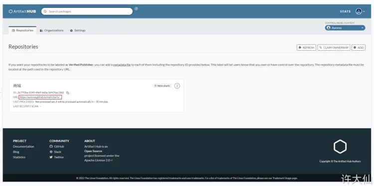

# 1 一般流程 

helm package .

helm push ivuplan-0.1.7.tgz oci://jfrog.ivu.de/ep-helm-dev

helm pull oci://jfrog.ivu.de/ep-helm-dev/ivuplan


# 2 产生一个chart 的 index file


https://helm.sh/docs/helm/helm_repo_index/
helm repo index
generate an index file given a directory containing packaged charts


https://medium.com/containerum/how-to-make-and-share-your-own-helm-package-50ae40f6c221

Now we are going to add our chart to that repo:
```

$ helm package my-app  
$ mv my-app-0.1.0.tgz helm-example  
$ helm repo index helm-example/ --url [https://gree-gorey.github.io/helm-example/](https://gree-gorey.github.io/helm-example/)
```

The last command generates `index.yaml` file. Let’s take a look at it:
```
$ cat helm-example/index.yaml   
apiVersion: v1  
entries:  
  my-app:  
  - apiVersion: v1  
    appVersion: "1.0"  
    created: 2018-03-30T14:00:56.531328411Z  
    description: A Helm chart for Kubernetes  
    digest: 29089aabaa8aa08a03215098b1982ad38f6cd9de1c9b25ff842003a53cad881d  
    name: my-app  
    urls:  
    - https://gree-gorey.github.io/helm-example/my-app-0.1.0.tgz  
    version: 0.1.0  
generated: 2018-03-30T14:00:56.530846921Z
```


Now commit & push the changes:
```
$ git commit -a -m "change index"  
$ git push origin
```


# 3 Nexus repo as Helm Repositories

https://help.sonatype.com/en/helm-repositories.html


# 4 Harbor作为chart库
https://www.yuque.com/fairy-era/yg511q/ar93ua#f6609716

## 4.1 安装 Harbor

### 4.1.1 前提条件

- ① Kubernetes版本：v 1.21.10。
- ② Helm 版本：v 3.6.3 。
- ③ 动态供应，如：nfs 等，需要设置默认的动态供应。
- ③ Ingress （本人是在每个 Node 节点上都安装 Ingress 的）。


### 4.1.2 Harbor 核心组件


● Nginx(Proxy)：用于代理 Harbor 的 registry、UI、token 等服务。
● db：负责储存用户权限、审计日志、Docker image 分组信息等数据。
● UI：提供图形化界面，帮助用户管理 registry 上的镜像, 并对用户进行授权。
● jobsevice：负责镜像复制工作的，他和 registry 通信，从一个 registry pull 镜像，然后 push 到另一个 registry ，并记录 job_log 。
● adminserver：是系统的配置管理中心附带检查存储用量，ui 和 jobsevice 启动时候需要加载 adminserver 的配置。
● Registry：原生的 docker 镜像仓库，负责存储镜像文件。
● Log：为了帮助监控 Harbor 运行，负责收集其他组件的 log，记录到 syslog 中。


### 4.1.3 安装 Harbor

生成 TLS 证书：

```
openssl req -x509 -nodes -days 3650 -newkey rsa:4096 -keyout tls.key -out tls.crt -subj "/CN=*.xudaxian.com/O=*.xudaxian.com" \
  -extensions san \
  -config <(echo '[req]'; echo 'distinguished_name=req';
            echo '[san]'; echo 'subjectAltName=DNS:*.xudaxian.com,DNS:www.xudaxian.com,DNS:harbor.xudaxian.com')
```


注意：
● 生成证书的 xudaxian.com 域名是顶级域名，像 harbor.xudaxian.com 为二级域名。
● 实际开发中，需要自己购买域名，而不是这样手动伪造证书。

创建命名空间和 secret 
```
kubectl create ns devops
kubectl create secret tls xudaxian.com --cert=tls.crt --key=tls.key  -n devops
```


添加 Harbor 的 chart 仓库：
```
helm repo add harbor https://helm.goharbor.io
```

更新本地可用 chart 信息
```
helm repo update
```

下载 Harbor ：
```
helm pull harbor/harbor --version 1.9.0 --untar
```


进入到 harbor 目录：
```
cd harbor
```


创建 override.yaml 文件
vi override.yaml
```yaml
expose:  #web浏览器访问用的证书
  type: ingress
  tls:
    certSource: "secret"
    secret:
      secretName: "xudaxian.com"
      notarySecretName: "xudaxian.com"
  ingress:
    hosts:
      core: harbor.xudaxian.com
      notary: notary-harbor.xudaxian.com
    annotations:
      kubernetes.io/ingress.class: "nginx" # 此处一定要配置
externalURL: https://harbor.xudaxian.com
internalTLS:  #harbor内部组件用的证书
  enabled: true
  certSource: "auto"
persistence:
  enabled: true
  resourcePolicy: "keep"
metrics:
  enabled: true
#开启 chartmuseum，使 Harbor 能够存储 Helm 的 chart
chartmuseum:
  enabled: true
  resources:
    requests:
     memory: 256Mi
     cpu: 500m
```

注意：
● ① 这个文件是根据实际需要对 values.yaml 增删改之后形成的。
● ② 我们完全可以使用 cp values.yaml override.yaml 命令，复制为新的 override.yaml 文件，然后增删改即可。
● ③ 在新版本的 Harbor 中，Harbor 内部组件使用的是自己默认的证书，而 Ingress 需要用我们生成的证书。


安装 Harbor ：
helm install harbor -f values.yaml -f override.yaml . -n devops


需要等所有的组件都启动完毕：


查看 ingress ：
kubectl get ing -n devops\


---


本人选择在开一台虚拟机（IP 地址是 192.168.65.137 ）作为测试，并在 /etc/hosts 中配置：

192.168.65.101 harbor.xudaxian.com


登录到 Harbor ，默认的用户名是 admin ，默认的密码是 Harbor12345 ：


## 4.2 Harbor使用 


### 4.2.1 Harbor 新建项目

- Harbor 是以项目为单位的，所以需要新建项目：


### 4.2.2 Docker 推送镜像到 Harbor 仓库中


1
由于 Harbor 使用的是 https 通信，所以需要让 Docker 信任这个 https （即 Docker 不信任自定义的域名（自签证书））：
- 将 192.168.65.100 上生成的 tls 证书复制到测试的机器上： scp tls.crt root@192.168.65.137:/root

2
在测试机器上使得 Docker 受信自定义域名：

```
cd /etc/docker/


# certs.d 是固定的名字，harbor.xudaxian.tom 和域名同名的文件夹
mkdir -pv certs.d/harbor.xudaxian.com


# 进入这个目录
cd certs.d/harbor.xudaxian.com


# 将证书文件复制到这个文件夹中
cp ~/tls.crt .

# 重启 Docker
systemctl restart docker

```


注意：
● 如果是自己购买的域名，上面的步骤就可以省略了。
● 在 192.168.65.137 机器上的 /etc/hosts 文件增加 192.168.65.102 harbor.xudaxian.com，其中 192.168.65.102 表示部署了 Ingress 的 Node 机器的 IP 地址。


3 
Docker 登录：
`docker login -u admin harbor.xudaxian.com`


4 
Docker 推送镜像

```
docker pull nginx
docker tag nginx harbor.xudaxian.com/mall/nginx:v1.0
docker push harbor.xudaxian.com/mall/nginx:v1.0

```


5 
去 Harbor 中查看镜像是否推送完毕


## 4.3 推送 Chart 

阿里云、腾讯云等云厂商都提供了 Chart 仓库的功能，但是这些都是企业版的，需要收费；所以，我采取将 Chart 推送到 Helm 的 中央仓库 以及使用 Harbor 作为演示。

注意：
- 推送到 Helm 的中央仓库需要配合 Github 使用。
- 也可以使用 Harbor 作为 Helm 的仓库。


### 4.3.1 开源项目将 Chart 推送到 Helm 的中央仓库, 通过 Github


1
下载 Github 的项目：


 2
 制作 chart :
```
 # 为什么要创建 docs ，主要是为了做 github Page。
cd mall && mkdir -pv docs && cd docs

helm create mall
```

注意：如果是微服务项目，只需要在 docs/mall/charts 目录中继续创建对应的微服务 chart 即可，此处不再展开。


3
将 chart 打包到 chart/ 目录中。

```
helm package [CHART_PATH] -d charts/ [--version 1.0.0]
```

注意：
●  CHART_PATH：表示 chart 的路径。 
●  --version ：指定打包的版本号。 

```
helm package mall -d charts/
```


4
对于每个 Helm 存储库，都必须有 index.yaml 文件，该文件保存当前存储库中的图表信息。

注意：
● 每次向在仓库中添加一个新的 chart 的时候，都需要重新生成 index 。helm repo index命令会完全无痕重建index.yaml文件。只包括在本地找到的 chart 。
● 不过，我们可以使用 -merge 参数增量添加新的 chart 到现有的 index.yaml 文件中。


5
提交代码到 GitHub 中：略


6 
GitHub 设置 Pages 


7 
Helm 中央仓库中增加 Repository 





8 
添加仓库
```
helm repo add xudaxian https://aurorxa.github.io/mall/charts/
```


9 
 安装应用

```
helm install mall xudaxian/mall
```


10 
●  这样操作，还是不太灵活，因为用户并不清楚其中的细节，我们能否提供文档，告诉其安装的步骤等。 
  ○ 在 步骤 ② 操作完之后，创建 README.md 文件，内容如下：


提交到 Github 中，并重复执行 步骤 ② 之后的步骤

注意：
- Helm 官方其实推荐是建立一个项目，名为 charts ，所有的 Helm 的 chart 都推送到此项目中，这样方便管理，可以参考 [Bitnami](https://github.com/bitnami) 。
- 如果使用 GitHub ，最好结合 GitHub 的 Action（CI/CD），这样效率更高，我上面的示例为手动版。


### 4.3.2 Helm 3.7 及以下客户端版本推送 Chart 到 Harbor

1
开启 Helm 3 的客户端实验特性

```
export HELM_EXPERIMENTAL_OCI=1
```


2
登录到 Harbor 

```
helm registry login [--insecure host] -u xxx
```

- `--insecure 192.168.86.5` ：表示不以 https 的方式登录。
- host：仓库的地址。
- u：用户名。


3
制作 Chart 包
helm create mall

4
给 chart 打包
`helm chart save [path] [ref] [flags]`

● path：chart 的路径：
● ref：harbor的域名/项目/chart名称:tag

`helm chart save mall/ harbor.xudaxian.com/mall/mall:1.0`


5
推送 Chart
`helm chart push [ref] [flags]`

ref：harbor的域名/项目/chart名称:tag

`helm chart push harbor.xudaxian.com/mall/mall:1.0`

之所以，出现错误，是因为 Harbor 中的证书是我伪造的，没有经过 CA 认证。


6 
退出
`helm registry logout [host] [flags]`


### 4.3.3 Helm 3.8 推送 Chart 到 Harbor


1
登录：
```
helm registry login [host] [flags]
```


2
 将 chart 目录打包成压缩包
```
helm package [CHART_PATH] [...] [flags]
```

3
推送
```
helm push CHART_PACKAGE oci://域名/项目名
```