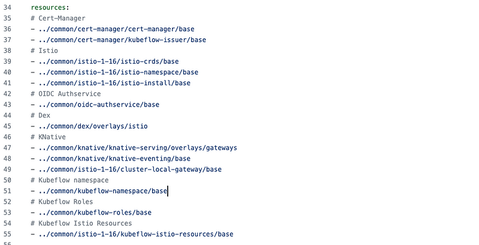

> Kustomize is built from generators and transformers; the former make kubernetes YAML, the latter transform said YAML.

我认为他们的区别主要在工作流程上：
- Helm 的基础流程比较`瀑布`：定义 Chart->填充->运行，在 Chart 中没有定义的内容是无法更改的；
- Kustomize 的用法比较`迭代`：Base 和 Overlay 都是可以独立运作的，增加新对象，或者对编写 Base 时未预料的内容进行变更，都不在话下。


例如我们定义了一个很基础的应用，由 Deployment + Service 组成，如果后续部署中需要完成两个变更：
- 新建 Ingress 对象
- 修改镜像地址/名称/TAG

在 Helm 中需要：
- 在 Chart 中加入对 Ingress 的定义
- 用变量控制 Ingress 是否进行渲染
- Ingress 模板应该包含特定的主机名、注解等变量
- 把镜像也定义成变量
- 在 Values.yaml 中对这些变量进行赋值。

而在 Kustomize 中：
- 无需对 Base 进行修改
- 直接在新的 Overlay 中写入 Ingress Resource
- 使用内置的 `image transformer` 替换原有镜像

# 1 什么时候用什么工具更合适

要公开发布一个较为复杂的应用，例如 `Istio`，编写良好的 Chart 能给用户很大帮助，用户在缺失一点发挥空间的情况下，通过对 `values.yaml` 的阅读，就能对这种复杂的部署产生一个较为深入的认识。

如果是常见的业务应用，因为不同部署之间的差异不大，但是未必可以提前做好变化限制，用 Kustomize 可能会是一个更好的选择。


# 2 多个方面进行比较 

https://xie.infoq.cn/article/088047721b3e5db17a65cf13e

## 2.1 第 1 回合：安装和设置

需要在服务器上安装 Helm，请参阅[Five ways to install Helm](https://xie.infoq.cn/link?target=https%3A%2F%2Fahmedelfakharany.com%2Ffive-ways-to-install-helm-32233ee019a2)。

虽然可以从 [https://kubectl.docs.kubernetes.io/installation/kustomize/](https://xie.infoq.cn/link?target=https%3A%2F%2Fkubectl.docs.kubernetes.io%2Finstallation%2Fkustomize%2F) 下载单独的 Kustomize 软件包，但从 1.14 版开始，就已经与 kubectl 捆绑在一起了。因此，除非你的系统中没有(或不需要)kubectl，否则只需运行 `kubectl -k` 即可调用 Kustomize。

_优胜者：Kustomize_

## 2.2 第 2 回合：软件包管理

由于 Helm 顾名思义是软件包管理器，它提供的软件仓库可以搜索和下载特定版本的 chart，也可以在同一集群中同时安装多个版本的 chart。Kustomize 不会将文件打包成可部署的单元，不过我们可以通过 Kustomize 手动实现同样的效果(Git 发布是其中一种选择)。不过，Helm 提供了开箱即用的功能。

_优胜者：Helm_

## 2.3 第 3 回合：模板化能力

Helm 完全依赖 Go 模板，此外还从 [Sprig库](https://xie.infoq.cn/link?target=http%3A%2F%2Fmasterminds.github.io%2Fsprig)中借用了一些函数，使模板功能更加多样化。Kustomize 完全不使用模板，而是在将 YAML 清单应用到集群之前，使用 overlay 和 patch 对其进行即时修改。

Go 是一种成熟的编程语言，提供了强大的文本操作技术。例如
- 循环和条件式，如(`range`)和条件式(`if`、`else`、`with`)，这在生成重复资源或根据用户提供的值进行决策时非常有用。
- 模板功能通过 Sprig 库实现，该库提供了各种功能，如`default`、`pick`、`omit`、`trim`、`upper`、`lower`、`quote`等。


而 Kustomize 却无法做到这一点。不过，它也有一些小技巧。例如
- ConfigMaps 和 Secrets 的生成器。这些都是声明式指定的，Kustomize 会在构建最终 YAML 时生成资源。
- Variants(变体)：Kustomize 使用 overlay 层来管理同一应用程序的不同变体，这有助于管理不同的环境(开发、预发、生产)。
- 用于更新资源字段的转换器(transformers)。常见的转换器包括为资源名称添加前缀/后缀、更新标签和注释以及更新命名空间。转换器可以有选择的应用于不同的资源，从而提供高度的控制。


_优胜者：不定(取决于所追求的定制化程度)_

## 2.4 第 4 回合：调试

很明显，在将 YAML 文件应用到群集之前，需要测试这些文件是否存在错误。YAML 使用空格和缩进来定义对象、列表和其他组件，一个不正确的缩进可能会毁掉整个部署。Helm 和 Kustomize 都允许我们在将 YAML 清单应用到群集之前就"查看"这些清单。

Kustomize 有`build`命令，在将所有 patch、overlay、转换器(transformers)等应用到一个包含整个有效负载的大文件后，会生成最终的清单。不过，也可以运行 `kubectl apply -k --dry-run` 来依赖 API 服务器验证 YAML 清单。

Helm 有几种方法可以做同样的事情：
- 可以使用 `helm template` 在 YAML 清单发送到 API 服务器之前对其进行渲染，还可以使用 `helm lint` 根据最佳实践检查 chart。
- 使用 `helm install --dry-run` (或 `helm upgrade` )还可以针对 API 服务器测试清单。也就是说，即使 YAML 在语法上是正确的，API 服务器也可能因为其他原因而拒绝接受(例如，缺少 CRD 或接入控制器)。Helm 允许我们在将有效负载应用到 Kubernetes 之前捕获这些错误，从而避免卸载和重新安装有问题的 chart。

_优胜者：不定_

## 2.5 第 5 回合：版本控制和回滚

如前所述，Helm 能够同时在同一集群中部署同一 chart 的多个版本。Helm 将部署版本称为`revision`(修订版)，并保留了部署到群集的 revision 版本历史记录，允许我们在需要时回滚到之前的 revision 版本。虽然 Kustomize 也可以做同样的事情，但过程复杂且容易出错。

_优胜者：Helm_

## 2.6 第 6 回合：Secrets 管理

许多情况下，我们需要存储一些敏感信息，作为应用程序部署的一部分。比如 API 密钥、用户凭证、令牌等。在所有情况下，Kubernetes 都提供了 Secret 对象，可以在其中保存机密信息。让我们看看每个工具是如何处理 Secret 创建的：

### 2.6.1 Helm

将隐私数据存储在 `values.yaml` 文件中，并使用 `b64enc` 函数在 Secret YAML 清单中将其即时转换为 base64。例如
```
# values.yaml
database:
  username: admin
  password: secret
```

以及
```
# templates/secrets.yaml
apiVersion: v1
kind: Secret
metadata:
  name: db-secret
type: Opaque
data:
  username: {{ .Values.database.username | b64enc }}
  password: {{ .Values.database.password | b64enc }}
```

由此产生的 YAML 可以是这样的
```
---
# Source: my-chart/templates/secrets.yaml
apiVersion: v1
kind: Secret
metadata:
  name: db-secret
type: Opaque
data:
  username: YWRtaW4=
  password: c2VjcmV0
```


这里的问题显而易见: 需要将 Values 文件(其中包含纯文本证书)提交到版本控制中。一个可行的解决方案是创建单独的 Values 文件来存储敏感信息，并通过将其添加到 `.gitignore` 文件来避免将其包含在 git 仓库中。不过这样需要管理多个 Values 文件，又增加了复杂性。


### 2.6.2 Kustomize

可以使用 Kustomize `secretGenerator` 自动从纯文件创建 Secret YAML。例如，可以创建如下凭证文件
```
# Create the secret file
echo -n 'admin' > ./username.txt
echo -n 'secret' > ./password.txt
```

Kustomization 文件看起来会像这样：
```
# kustomization.yaml
secretGenerator:
- name: db-secret
  files:
  - username.txt
  - password.txt
```


由此产生的清单将是
```
apiVersion: v1
kind: Secret
metadata:
  name: db-secret-8h5h97g6k8
type: Opaque
data:
  username.txt: YWRtaW4=
  password.txt: c2VjcmV0
```

虽然 `username.txt` 和 `password.txt` 也会被添加到 `.gitignore`，但除非想修改凭据，否则无需在每次部署时都重新创建它们(在运行 `git clone` 或 `git pull` 后)。

  
### 2.6.3 插件去加密

显然，用 Base64 存储敏感信息和使用纯文本是一样的，因为 Base64 是一种编码格式，而不是加密方法。也就是说，任何人都可以使用命令行工具将 Base64 字符串转换为原始格式。因此，最佳实践要求我们对 secret 数据进行加密。Helm 和 Kustomize 都可以使用第三方插件实现这一功能。

例如，如果使用 Kustomize，可以使用 kustomize-secret-generator 插件，它能让你从 Google Cloud Secret Manager、AWS Secrets Manager 或 HashiCorp 获取 secret。这样做的目的是将 secret 以加密形式存储在其中某个支持的平台中。需要时，用户可以依靠插件获取 secret、解密并将其应用于群集。下面演示了 Kustomize 如何利用 HashiCorp 的 Vault 实现这一功能：

```
# kustomization.yaml
secretGenerator:
- name: db-secret
  kvSources:
  - pluginType: vault
    name: my-vault
    namespace: default
    path: secret/data/my-service
    key: db-password
```


虽然 Helm 有 [Helm-Secrets](https://xie.infoq.cn/link?target=https%3A%2F%2Fgithub.com%2Fjkroepke%2Fhelm-secrets) 插件，但不提供从其他平台获取 secret 的本地支持。相反，它使用 Mozilla SOPS 进行加密。密钥本身可以存储在各种密钥管理系统中，如 AWS KMS、GCP KMS、Azure Key Vault 和 PGP。例如

```
helm secrets enc secrets.yaml
```


上述命令对 Secret 模板进行了静态加密，然后可以直接提交到 Git。当我们在另一台机器上重新获取时，需要先解密，然后再将其应用到 Kubernetes：
```
helm secrets dec secrets.yaml
```


_优胜者：Kustomize_


## 2.7 第 7 回合：处理超大型应用程序

如果应用程序有数百个清单，包含数千行内容，那么使用 Helm 模板处理这些清单很快就会变得力不从心，这里 Kustomize 可能是更好的选择。

  

例如著名的基于 Kubernetes 的机器学习平台 [Kubeflow](https://xie.infoq.cn/link?target=https%3A%2F%2Fgithub.com%2Fkubeflow%2Fmanifests%2Fblob%2Fmaster%2Fexample%2Fkustomization.yaml)，正在使用 Kustomize 作为部署工具。原因是该平台过于庞大，而且有许多依赖项需要按特定顺序部署。为了解释的更清楚，这是需要部署的资源的一个子集(我们甚至还没有考虑 patch 或 overlay)：




#### 2.7.1.1 第 8 回合：与 CI/CD 工具集成

Helm 已被广泛采用，被许多 CI/CD 工具所支持。对 Kustomize 的支持也在增加，但并不广泛。


_优胜者：Helm_

#### 2.7.1.2 第 9 回合(最后一轮)：次级组成部分和依赖关系

Helm 内置支持依赖关系处理。如果 chart 需要一些先决条件(数据库、缓存服务器、OAuth 服务等)，可以轻松的在 `Chart.yaml` 文件中将它们添加为`dependencies`(依赖项)。Helm 将确保在运行主 chart 前下载并提供这些先决条件，并且可以选择所需版本。而 Kustomize 则完全由用户手动处理。

_优胜者：Helm_


