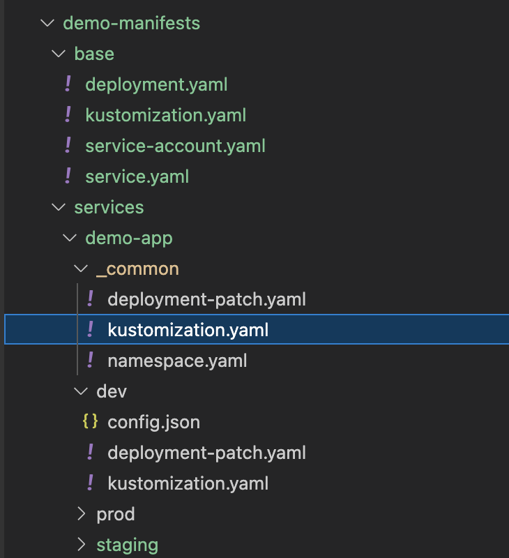

# 1 例子1

https://blog.gmem.cc/kustomize-study-note


拷贝官方HelloWorld示例：
```
mkdir -p /tmp/hello
cp -r $GOPATH/src/sigs.k8s.io/kustomize/examples/helloWorld /tmp/hello/base 
```

此示例包含以下K8S资源：

configMap.yaml
```
apiVersion: v1
kind: ConfigMap
metadata:
  name: the-map
data:
  altGreeting: "Good Morning!"
  enableRisky: "false" 
```


depolyment.yaml
```
apiVersion: apps/v1
kind: Deployment
metadata:
  name: the-deployment
spec:
  replicas: 3
  template:
    metadata:
      labels:
        deployment: hello
    spec:
      containers:
      - name: the-container
        image: monopole/hello:1
        command: ["/hello",
                  "--port=8080",
                  "--enableRiskyFeature=$(ENABLE_RISKY)"]
        ports:
        - containerPort: 8080
        env:
        - name: ALT_GREETING
          valueFrom:
            configMapKeyRef:
              name: the-map
              key: altGreeting
        - name: ENABLE_RISKY
          valueFrom:
            configMapKeyRef:
              name: the-map
              key: enableRisky
```


service.yaml
```
kind: Service
apiVersion: v1
metadata:
  name: the-service
spec:
  selector:
    deployment: hello
  type: LoadBalancer
  ports:
  - protocol: TCP
    port: 8666
    targetPort: 8080
```


## 1.1 使用 kustomization.yaml生成定制化清单

HelloWorld示例的kustomization.yaml文件如下：
```
commonLabels:
  app: hello
 
resources:
- deployment.yaml
- service.yaml
- configMap.yaml
```


此例子声明了，这个定制化里面有三个原始资源，需要为它们统一加上app: hello标签。

使用命令 kustomize build /tmp/hello/base即可生成定制化后的资源清单：
```
apiVersion: v1
data:
  altGreeting: Good Morning!
  enableRisky: "false"
kind: ConfigMap
metadata:
  labels:
    # 添加标签
    app: hello
  name: the-map
---
apiVersion: v1
kind: Service
metadata:
  labels:
    # 添加标签
    app: hello
  name: the-service
spec:
  ports:
  - port: 8666
    protocol: TCP
    targetPort: 8080
  selector:
    # 添加标签，Kustomize理解K8S资源语义
    app: hello
    deployment: hello
  type: LoadBalancer
---
apiVersion: apps/v1
kind: Deployment
metadata:
  labels:
    # 添加标签
    app: hello
  name: the-deployment
spec:
  replicas: 3
  selector:
    matchLabels:
      # 添加标签
      app: hello
  template:
    metadata:
      labels:
        # 添加标签
        app: hello
        deployment: hello
    spec:
      containers:
      - command:
        - /hello
        - --port=8080
        - --enableRiskyFeature=$(ENABLE_RISKY)
        env:
        - name: ALT_GREETING
          valueFrom:
            configMapKeyRef:
              key: altGreeting
              name: the-map
        - name: ENABLE_RISKY
          valueFrom:
            configMapKeyRef:
              key: enableRisky
              name: the-map
        image: monopole/hello:1
        name: the-container
        ports:
        - containerPort: 8080
```


## 1.2 使用overlays创建变体

下面我们创建分别基于Staging环境、Production环境的Overlay：

1. Staging环境启用一个不安全特性
2. Production增加副本数量
3. 两个环境下altGreeting取值不一样


首先为变体创建子目录：
```
cd /tmp/hello
 
mkdir -p overlays/staging
mkdir -p overlays/production
```

对于Staging变体，我们创建如下kustomization文件，在base的基础上进一步定制：
/tmp/hello/base/overlays/stagingkustomization.yaml
```
# 资源名前缀
namePrefix: staging-
# 添加标签
commonLabels:
  variant: staging
  org: acmeCorporation
# 添加注解
commonAnnotations:
  note: Hello, I am staging!
# 资源列表
resources:
- ../../base
# 将下面文件中的内容Patch到对应资源中
patchesStrategicMerge:
- map.yaml
```

需要Patch的ConfigMap内容：
/tmp/hello/base/overlays/map.yaml
```
apiVersion: v1
kind: ConfigMap
metadata:
  name: the-map
data:
  altGreeting: "Have a pineapple!"
  enableRisky: "true"
```


Production变体类似，这里就不写了。
执行 kustomize build overlays/staging，可以看到ConfigMap内容为： 
```
apiVersion: v1
data:
  # Patch的字段
  altGreeting: Have a pineapple!
  enableRisky: "true"
kind: ConfigMap
metadata:
  annotations:
    note: Hello, I am staging!
  labels:
    # base定制会首先apply
    app: hello
    org: acmeCorporation
    variant: staging
        # 资源名字加了前缀
  name: staging-the-map
```


# 2 例子2

https://www.cnblogs.com/wade-xu/p/16839829.html

```
demo-manifests
├── base
│   ├── deployment.yaml
│   ├── kustomization.yaml
│   ├── service-account.yaml
│   └── service.yaml
└── services
    ├── demo-app
    │   ├── _common
    │   │   ├── deployment-patch.yaml
    │   │   ├── kustomization.yaml
    │   │   └── namespace.yaml
    │   ├── dev
    │   │   ├── config.json
    │   │   ├── deployment-patch.yaml
    │   │   └── kustomization.yaml
    │   ├── staging
    │   │   ├── config.json
    │   │   ├── deployment-patch.yaml
    │   │   └── kustomization.yaml
    │   └── prod
    │   │   ├── config.json
    │   │   ├── deployment-patch.yaml
    │   │   └── kustomization.yaml
    └── demo-app2
        └── xxx
```

## 2.1 base

先看base 目录，有几个常见的deployment/service/service-account YAML 资源文件

还有个 kustomization.yaml 配置文件
```
apiVersion: kustomize.config.k8s.io/v1beta1
kind: Kustomization
resources:
- deployment.yaml
- service.yaml
- service-account.yaml

commonLabels:
  managed-by: Kustomize

```


这里面包含了刚才的几个resource文件以及要应用于它们的一些自定义，如添加一个通用的标签Common Labels
这时候也可以通过 kustomize build 命令来生成完整的YAML进行查看

kustomize build demo-manifests/base > base.yaml

build 出来的 YAML 每个资源对象上都会存在通用的标签 managed-by: Kustomize


## 2.2 overlays

接下来看 Service目录，此目录存放所有的服务项目，比如demo-app ， 里面的YAML就是来覆盖base 也就是官方说的 Overlays

只需要把不同的资源描述通过Patch方式覆盖掉base中的就行了。这边我又将三个环境 dev/staging/prod 公共的部分抽取出来放入 common文件夹。



### 2.2.1 `_common`

`_common/kustomization.yaml`文件如下

```
apiVersion: kustomize.config.k8s.io/v1beta1
kind: Kustomization
resources:
- ../../../base
- namespace.yaml
patchesStrategicMerge:
- deployment-patch.yaml
```

我这个demo-app 需要configMap，另外心跳接口也不一样， 所以 deployment-patch.yaml 需要写出这些不一样的，然后去覆盖base中的。

 deployment-patch.yaml 
```
apiVersion: apps/v1
kind: Deployment
metadata:
  name: NAME_PLACEHOLDER
spec:
  template:
    spec:
      serviceAccountName: NAME_PLACEHOLDER
      containers:
      - name: app
        image: wadexu007/demo:IMG_TAG_PLACEHOLDER
        livenessProbe:
          failureThreshold: 5
          httpGet:
            path: /pizzas
            port: 8080
          initialDelaySeconds: 10
          periodSeconds: 40
          timeoutSeconds: 1
        readinessProbe:
          failureThreshold: 5
          httpGet:
            path: /pizzas
            port: 8080
          initialDelaySeconds: 10
          periodSeconds: 20
          timeoutSeconds: 1
        volumeMounts:
        - name: config-volume
          mountPath: /app/conf/config.json
          subPath: config.json
      volumes:
      - name: config-volume
        configMap:
          name: demo-app-config
```

namespace.yaml
```
---
apiVersion: v1
kind: Namespace
metadata:
  name: demo
```


### 2.2.2 dev
dev/kustomization.yaml
```
apiVersion: kustomize.config.k8s.io/v1beta1
kind: Kustomization
resources:
- ../_common
namespace: demo
commonLabels:
  app: demo-app
replicas:
- count: 1
  name: demo-app
configMapGenerator:
- files:
  - config.json
  name: demo-app-config
patches:
- patch: |-
    - op: replace
      path: /metadata/name
      value: demo-app
  target:
    name: NAME_PLACEHOLDER
patchesStrategicMerge:
- deployment-patch.yaml
images:
- name: wadexu007/demo
  newTag: 1.0.0
```


dev env 里面将replicas设置成1， 用config.json 生成 configMap

config.json 
```
{
    "SOME_CONFIG": "/demo/path"
}
```


deployment-patch.yaml 里面也将container resource request/limit 配置设置小一点， 采用 patchesStrategicMerge 与 common 和 base里面的deployment资源合并。
```
apiVersion: apps/v1
kind: Deployment
metadata:
  name: NAME_PLACEHOLDER
spec:
  template:
    spec:
      containers:
      - name: app
        resources:
          limits:
            cpu: 1
            memory: 1Gi
          requests:
            cpu: 200m
            memory: 256Mi

```

另外还采用了 patch 的方式，改了每个资源的name --> demo-app
以及images 替换了原来的 image name and tag.


使用命令去生成  demo-app 的最终的 yaml 形式的 manifest 

kustomize 命令如下
 kustomize build demo-manifests/services/demo-app/dev > demo-app.yaml

如果用 kubectl 命令的话，示例如下
kubectl kustomize services/demo-app/dev/ > demo-app.yaml

```
apiVersion: v1
kind: Namespace
metadata:
  labels:
    app: demo-app
  name: demo
---
apiVersion: v1
kind: ServiceAccount
metadata:
  labels:
    app: demo-app
    managed-by: Kustomize
  name: demo-app
  namespace: demo
---
apiVersion: v1
data:
  config.json: |-
    {
        "SOME_CONFIG": "/demo/path"
    }
kind: ConfigMap
metadata:
  labels:
    app: demo-app
  name: demo-app-config-t7c64mbtt2
  namespace: demo
---
apiVersion: v1
kind: Service
metadata:
  labels:
    app: demo-app
    managed-by: Kustomize
  name: demo-app
  namespace: demo
spec:
  ports:
  - port: 8080
    protocol: TCP
    targetPort: http
  selector:
    app: demo-app
    managed-by: Kustomize
  type: ClusterIP
---
apiVersion: apps/v1
kind: Deployment
metadata:
  labels:
    app: demo-app
    managed-by: Kustomize
  name: demo-app
  namespace: demo
spec:
  replicas: 1
  selector:
    matchLabels:
      app: demo-app
      managed-by: Kustomize
  template:
    metadata:
      labels:
        app: demo-app
        managed-by: Kustomize
    spec:
      containers:
      - image: wadexu007/demo:1.0.0
        imagePullPolicy: IfNotPresent
        livenessProbe:
          failureThreshold: 5
          httpGet:
            path: /pizzas
            port: 8080
          initialDelaySeconds: 10
          periodSeconds: 40
          timeoutSeconds: 1
        name: app
        ports:
        - containerPort: 8080
          name: http
        readinessProbe:
          failureThreshold: 5
          httpGet:
            path: /pizzas
            port: 8080
          initialDelaySeconds: 10
          periodSeconds: 20
          timeoutSeconds: 1
        resources:
          limits:
            cpu: 1
            memory: 1Gi
          requests:
            cpu: 200m
            memory: 256Mi
        securityContext:
          allowPrivilegeEscalation: false
        volumeMounts:
        - mountPath: /app/conf/config.json
          name: config-volume
          subPath: config.json
      serviceAccountName: demo-app
      volumes:
      - configMap:
          name: demo-app-config-t7c64mbtt2
        name: config-volume

demo-app.yaml
```


