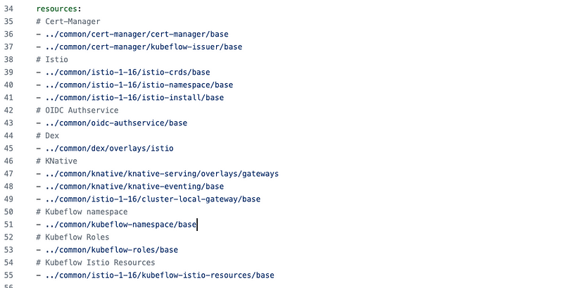

https://www.baeldung.com/ops/kubernetes-helm-vs-kustomize

These tools are designed to help developers and operations teams manage Kubernetes manifests and deployment. 

To recap, Helm is a powerful package manager that excels in managing complex deployments, providing templating capabilities, and offering robust release management. It has a steeper learning curve but offers extensive flexibility and a large ecosystem of pre-packaged charts.

On the other hand, Kustomize follows a declarative approach to configuration management, focusing on simplicity and modularity. It shines in scenarios where we need to customize and compose Kubernetes manifests without the need for complex templating. Kustomize has a gentler learning curve and integrates well with existing Kubernetes workflows.

# 1 总览

我认为他们的区别主要在工作流程上：
- Helm 的基础流程比较`瀑布`：定义 Chart->填充->运行，在 Chart 中没有定义的内容是无法更改的；
- Kustomize 的用法比较`迭代`：Base 和 Overlay 都是可以独立运作的，增加新对象，或者对编写 Base 时未预料的内容进行变更，都不在话下。

---


例如我们定义了一个很基础的应用，由 Deployment + Service 组成，如果后续部署中需要完成两个变更：
- 新建 Ingress 对象
- 修改镜像地址/名称/TAG

在 Helm 中需要：
- 在 Chart 中加入对 Ingress 的定义
- 用变量控制 Ingress 是否进行渲染
- Ingress 模板应该包含特定的主机名、注解等变量
- 把镜像也定义成变量
- 在 Values.yaml 中对这些变量进行赋值。

而在 Kustomize 中：
- 无需对 Base 进行修改
- 直接在新的 Overlay 中写入 Ingress Resource
- 使用内置的 `image transformer` 替换原有镜像


## 1.1 Helm 

Helm’s primary purpose is to make the deployment process easy, promote code reuse, and facilitate the management of complex deployments

- Helm uses a packaging format called charts
- Helm also introduces the concept of releases which represent a specific instance of a chart deployed to a Kubernetes cluster
- Helm leverages Go templates to enable the dynamic generation of Kubernetes manifest based on user-provided values.

## 1.2 Kustomize


> Kustomize is built from generators and transformers; the former make kubernetes YAML, the latter transform said YAML.

Kustomize is a declarative configuration management tool for Kubernetes that enables users to customize and compose Kubernetes manifests without modifying the underlying YAML files directly.


Features and Benefits
- declarative configuration management:
- **overlay and base customization**
- **reusability and modularity**: users can split their configurations into smaller, reusable components, define common resources such as ConfigMaps or Secrets in separate files, and reference them in multiple places
- **patch and strategic merge patch**


Kustomize introduces a straightforward workflow with key components:
- **Kustomization files**: specify the resources to include and the customizations to apply
- **base directory**: contains the original configuration
- **overlay directory**: contains modifications for specific use cases
- **patches**: apply changes to resources
- **generators**: create new resources based on predefined templates

The workflow promotes code reuse, modularity, and the ability to more easily manage multiple environments or variations of an application.


# 2 什么时候用什么工具更合适

要公开发布一个较为复杂的应用，例如 `Istio`，编写良好的 Chart 能给用户很大帮助，用户在缺失一点发挥空间的情况下，通过对 `values.yaml` 的阅读，就能对这种复杂的部署产生一个较为深入的认识。

如果是常见的业务应用，因为不同部署之间的差异不大，但是未必可以提前做好变化限制，用 Kustomize 可能会是一个更好的选择。


### 2.1.1 When to Use Helm[](https://www.baeldung.com/ops/kubernetes-helm-vs-kustomize#1-when-to-use-helm)

**Helm is particularly useful when dealing with complex deployments that involve multiple components, dependencies, and configurations**. It enables us to package all the necessary resources into a single chart making it easier to manage and deploy the entire application stack. Helm simplifies the management of complex deployments by generating manifests dynamically based on configurable values.

Furthermore, **if a project requires robust package management and versioning capabilities, Helm is a strong choice**. This is because Helm charts provide a standardized format for packaging applications and their dependencies making it easy to version, distribute, and manage them.

Moreover, **when an application requires advanced templating features or the ability to execute custom scripts during the deployment lifecycle, Helm’s templating engine and hooks come in handy**. In particular, the Go templating syntax has powerful customization and dynamic generation of manifests based on user-provided values. Hooks also enable us to perform additional actions such as running database migrations or post-deployment tasks as part of the deployment process.

### 2.1.2 When to Use Kustomize[](https://www.baeldung.com/ops/kubernetes-helm-vs-kustomize#2-when-to-use-kustomize)

Generally, **Kustomize is a good fit for simpler deployments that have fewer variations across different environments or use cases**. If an application doesn’t require extensive templating or complex customizations, Kustomize’s declarative approach can provide a straightforward and readable way to manage configurations. The overlay and patch mechanisms of Kustomize facilitate targeted modifications to the base configuration without introducing unnecessary complexity.

Additionally, Kustomize can define the desired state of Kubernetes resources using a declarative syntax. Thus, if a project prioritizes a declarative approach to configuration management, Kustomize can be the best fit for that purpose.

# 3 Comparison of Helm and Kustomize[](https://www.baeldung.com/ops/kubernetes-helm-vs-kustomize#comparison-of-helm-and-kustomize)

When it comes to managing Kubernetes configurations, Helm and Kustomize offer different approaches and capabilities. Let’s compare these tools based on various aspects to understand their similarities and differences.

## 3.1 Approach to Configuration Management[](https://www.baeldung.com/ops/kubernetes-helm-vs-kustomize#1-approach-to-configuration-management)

**Helm relies on a templating engine (Go templates) to generate Kubernetes manifests**. It also uses a combination of YAML files and templates to define the application’s components and configurations. Moreover, Helm templates enable dynamic generation of manifests based on user-provided values.

In contrast, **Kustomize follows a declarative approach to configuration management**. It uses a base configuration and applies overlay or patches to customize the manifests for different environments or use cases. Therefore, Kustomize doesn’t rely on templating but instead uses a declarative syntax to define the desired state of Kubernetes resources.

## 3.2 Complexity and Learning Curve[](https://www.baeldung.com/ops/kubernetes-helm-vs-kustomize#2-complexity-and-learning-curve)

**Helm has a steeper learning curve compared to Kustomize due to its templating language and concepts like charts and releases**. Users need to understand the Go templating syntax and the structure of Helm charts to effectively use all Helm features.

In contrast, Kustomize has a more straightforward approach to configuration management. Further, it uses a declarative syntax and relies on familiar Kubernetes concepts making it easier to understand and adopt. Kustomize’s learning curve is generally considered to be gentler compared to Helm.

## 3.3 Flexibility and Customization[](https://www.baeldung.com/ops/kubernetes-helm-vs-kustomize#3-flexibility-and-customization)

**Helm’s templating engine provides extensive customization options and dynamic generation of manifests**. It supports the use of variables, conditionals, and loops to create flexible and reusable templates. Helm also provides hooks, which are scripts that can be executed at specific points during the release lifecycle, enabling advanced customization and automation.

Conversely, **Kustomize focuses on declarative customization through overlays and patches**. It enables users to modify and compose Kubernetes manifests by specifying the desired changes in a declarative manner. While Kustomize provides flexibility through its overlay and patch mechanisms, it may not be as extensive as Helm’s templating capabilities.

## 3.4 Package Management and Distribution[](https://www.baeldung.com/ops/kubernetes-helm-vs-kustomize#4-package-management-and-distribution)

Helm excels in package management and distribution through its use of charts and repositories. Helm charts also provide a standardized format for packaging and distributing applications and their dependencies. Additionally, Helm repositories serve as a centralized location for storing and sharing charts making it easy to discover and deploy applications.

**Kustomize doesn’t have built-in package management capabilities like Helm**. However, it focuses on configuration management and relies on external tools or processes for packaging and distribution.

## 3.5 Community and Ecosystem[](https://www.baeldung.com/ops/kubernetes-helm-vs-kustomize#5-community-and-ecosystem)

Helm has a large and mature community with a wide range of contributors and users. Additionally, the official Helm Charts repository provides an extensive collection of pre-packaged applications ready for deployment.

Kustomize also has a growing community and is gaining popularity among Kubernetes users. It’s integrated with the _kubectl_ command-line tool making it easily accessible to Kubernetes users. While **Kustomize’s community is smaller compared to Helm’s**, it’s actively developing and expanding.


# 4 多个方面进行比较 

https://xie.infoq.cn/article/088047721b3e5db17a65cf13e


Helm 通过将应用抽象成 Chart 来管理, 专注于应用的操作、生命周期管理（如 install、upgrade、rollback）等, 而 kustomize 关注于 k8s API 对象的管理。
Helm 适合对外交付使用，使用的Chart 相对固定、稳定，相当于静态管理，而 kustomize 管理的是正在变更的应用，创建新的 overlay 将应用部署在新的环境，相当于动态管理，适合于 DevOps 流程。

Helm 通过 Chart 方式打包并管理应用版本，kustomize 通过 overlay 方式管理应用不同的变体，通过 Git 来版本管理。
总的来说，Helm 有自己一套体系来管理应用，而 kustomize 更轻量级，也更灵活。另外，Kustomize也有 [Terraform provider](https://registry.terraform.io/providers/kbst/kustomization/latest/docs) 通过TF来安装。

> Kustomize 没有模板语法，只需要一个二进制命令就可以生成对应的 yaml 文件非常的轻量，而 helm 支持 GoTemplate，组件上也要多一些，
> 并且 helm 通过 chart 包来进行发布相对来说还是要重量级一些。个人觉得 Kustomize 更适合做 gitops 而 helm 更合适做应用包的分发。


Helm 使用的是模板，一个 Helm Chart 包中包含了很多模板和值文件，当被渲染时模板中的变量会使用值文件中对应的值替换。而 Kustomize 使用的是一种无模板的方式，它对 YAML 文件进行修补和合并操作，此外 Kustomize 也已经被原生内置到 kubectl 中了。这两个工具在 Kubernetes 的生态系统中都被广泛使用，而且这两个工具也可以一起结合使用。

没错，对于 OpenIM 来说，光光使用 helm 其实也很难满足 OpenIM 的部署需求了，我们更倾向于来使用 Kustomize 。

我们知道很多项目其实都会为应用程序提供 Helm Chart 包，而模板变量的值通过值文件来控制。一个长期存在的问题就是我们应该如何定制上游的 Helm Chart 包，例如从 Helm Chart 包中添加或者一个 Kubernetes 资源清单，如果是通用的变更，最好的选择当然是直接贡献给上游仓库，但是如果是自定义的变更呢？

通常我们可以自己 fork 上游的 Helm Chart 仓库，然后在自己的 repo 中对 Chart 包进行额外的变动。但是这样做，显然会带来额外的负担，特别是当 Chart 包只需要一点小改动的时候。

这个时候我们可以使用 Kustomize 来定制现有的 Helm Chart，而不需要执行 fork 操作。

## 4.1 第 1 回合：安装和设置

需要在服务器上安装 Helm，请参阅[Five ways to install Helm](https://xie.infoq.cn/link?target=https%3A%2F%2Fahmedelfakharany.com%2Ffive-ways-to-install-helm-32233ee019a2)。

虽然可以从 [https://kubectl.docs.kubernetes.io/installation/kustomize/](https://xie.infoq.cn/link?target=https%3A%2F%2Fkubectl.docs.kubernetes.io%2Finstallation%2Fkustomize%2F) 下载单独的 Kustomize 软件包，但从 1.14 版开始，就已经与 kubectl 捆绑在一起了。因此，除非你的系统中没有(或不需要)kubectl，否则只需运行 `kubectl -k` 即可调用 Kustomize。

_优胜者：Kustomize_

## 4.2 第 2 回合：软件包管理

由于 Helm 顾名思义是软件包管理器，它提供的软件仓库可以搜索和下载特定版本的 chart，也可以在同一集群中同时安装多个版本的 chart。Kustomize 不会将文件打包成可部署的单元，不过我们可以通过 Kustomize 手动实现同样的效果(Git 发布是其中一种选择)。不过，Helm 提供了开箱即用的功能。

_优胜者：Helm_

## 4.3 第 3 回合：模板化能力

Helm 完全依赖 Go 模板，此外还从 [Sprig库](https://xie.infoq.cn/link?target=http%3A%2F%2Fmasterminds.github.io%2Fsprig)中借用了一些函数，使模板功能更加多样化。Kustomize 完全不使用模板，而是在将 YAML 清单应用到集群之前，使用 overlay 和 patch 对其进行即时修改。

Go 是一种成熟的编程语言，提供了强大的文本操作技术。例如
- 循环和条件式，如(`range`)和条件式(`if`、`else`、`with`)，这在生成重复资源或根据用户提供的值进行决策时非常有用。
- 模板功能通过 Sprig 库实现，该库提供了各种功能，如`default`、`pick`、`omit`、`trim`、`upper`、`lower`、`quote`等。


而 Kustomize 却无法做到这一点。不过，它也有一些小技巧。例如
- ConfigMaps 和 Secrets 的生成器。这些都是声明式指定的，Kustomize 会在构建最终 YAML 时生成资源。
- Variants(变体)：Kustomize 使用 overlay 层来管理同一应用程序的不同变体，这有助于管理不同的环境(开发、预发、生产)。
- 用于更新资源字段的转换器(transformers)。常见的转换器包括为资源名称添加前缀/后缀、更新标签和注释以及更新命名空间。转换器可以有选择的应用于不同的资源，从而提供高度的控制。


_优胜者：不定(取决于所追求的定制化程度)_

## 4.4 第 4 回合：调试

很明显，在将 YAML 文件应用到群集之前，需要测试这些文件是否存在错误。YAML 使用空格和缩进来定义对象、列表和其他组件，一个不正确的缩进可能会毁掉整个部署。Helm 和 Kustomize 都允许我们在将 YAML 清单应用到群集之前就"查看"这些清单。

Kustomize 有`build`命令，在将所有 patch、overlay、转换器(transformers)等应用到一个包含整个有效负载的大文件后，会生成最终的清单。不过，也可以运行 `kubectl apply -k --dry-run` 来依赖 API 服务器验证 YAML 清单。

Helm 有几种方法可以做同样的事情：
- 可以使用 `helm template` 在 YAML 清单发送到 API 服务器之前对其进行渲染，还可以使用 `helm lint` 根据最佳实践检查 chart。
- 使用 `helm install --dry-run` (或 `helm upgrade` )还可以针对 API 服务器测试清单。也就是说，即使 YAML 在语法上是正确的，API 服务器也可能因为其他原因而拒绝接受(例如，缺少 CRD 或接入控制器)。Helm 允许我们在将有效负载应用到 Kubernetes 之前捕获这些错误，从而避免卸载和重新安装有问题的 chart。

_优胜者：不定_

## 4.5 第 5 回合：版本控制和回滚

如前所述，Helm 能够同时在同一集群中部署同一 chart 的多个版本。Helm 将部署版本称为`revision`(修订版)，并保留了部署到群集的 revision 版本历史记录，允许我们在需要时回滚到之前的 revision 版本。虽然 Kustomize 也可以做同样的事情，但过程复杂且容易出错。

_优胜者：Helm_

## 4.6 第 6 回合：Secrets 管理

许多情况下，我们需要存储一些敏感信息，作为应用程序部署的一部分。比如 API 密钥、用户凭证、令牌等。在所有情况下，Kubernetes 都提供了 Secret 对象，可以在其中保存机密信息。让我们看看每个工具是如何处理 Secret 创建的：

### 4.6.1 Helm

将隐私数据存储在 `values.yaml` 文件中，并使用 `b64enc` 函数在 Secret YAML 清单中将其即时转换为 base64。例如
```
# values.yaml
database:
  username: admin
  password: secret
```

以及
```
# templates/secrets.yaml
apiVersion: v1
kind: Secret
metadata:
  name: db-secret
type: Opaque
data:
  username: {{ .Values.database.username | b64enc }}
  password: {{ .Values.database.password | b64enc }}
```

由此产生的 YAML 可以是这样的
```
---
# Source: my-chart/templates/secrets.yaml
apiVersion: v1
kind: Secret
metadata:
  name: db-secret
type: Opaque
data:
  username: YWRtaW4=
  password: c2VjcmV0
```


这里的问题显而易见: 需要将 Values 文件(其中包含纯文本证书)提交到版本控制中。一个可行的解决方案是创建单独的 Values 文件来存储敏感信息，并通过将其添加到 `.gitignore` 文件来避免将其包含在 git 仓库中。不过这样需要管理多个 Values 文件，又增加了复杂性。


### 4.6.2 Kustomize

可以使用 Kustomize `secretGenerator` 自动从纯文件创建 Secret YAML。例如，可以创建如下凭证文件
```
# Create the secret file
echo -n 'admin' > ./username.txt
echo -n 'secret' > ./password.txt
```

Kustomization 文件看起来会像这样：
```
# kustomization.yaml
secretGenerator:
- name: db-secret
  files:
  - username.txt
  - password.txt
```


由此产生的清单将是
```
apiVersion: v1
kind: Secret
metadata:
  name: db-secret-8h5h97g6k8
type: Opaque
data:
  username.txt: YWRtaW4=
  password.txt: c2VjcmV0
```

虽然 `username.txt` 和 `password.txt` 也会被添加到 `.gitignore`，但除非想修改凭据，否则无需在每次部署时都重新创建它们(在运行 `git clone` 或 `git pull` 后)。

  
### 4.6.3 插件去加密

显然，用 Base64 存储敏感信息和使用纯文本是一样的，因为 Base64 是一种编码格式，而不是加密方法。也就是说，任何人都可以使用命令行工具将 Base64 字符串转换为原始格式。因此，最佳实践要求我们对 secret 数据进行加密。Helm 和 Kustomize 都可以使用第三方插件实现这一功能。

例如，如果使用 Kustomize，可以使用 kustomize-secret-generator 插件，它能让你从 Google Cloud Secret Manager、AWS Secrets Manager 或 HashiCorp 获取 secret。这样做的目的是将 secret 以加密形式存储在其中某个支持的平台中。需要时，用户可以依靠插件获取 secret、解密并将其应用于群集。下面演示了 Kustomize 如何利用 HashiCorp 的 Vault 实现这一功能：

```
# kustomization.yaml
secretGenerator:
- name: db-secret
  kvSources:
  - pluginType: vault
    name: my-vault
    namespace: default
    path: secret/data/my-service
    key: db-password
```


虽然 Helm 有 [Helm-Secrets](https://xie.infoq.cn/link?target=https%3A%2F%2Fgithub.com%2Fjkroepke%2Fhelm-secrets) 插件，但不提供从其他平台获取 secret 的本地支持。相反，它使用 Mozilla SOPS 进行加密。密钥本身可以存储在各种密钥管理系统中，如 AWS KMS、GCP KMS、Azure Key Vault 和 PGP。例如

```
helm secrets enc secrets.yaml
```


上述命令对 Secret 模板进行了静态加密，然后可以直接提交到 Git。当我们在另一台机器上重新获取时，需要先解密，然后再将其应用到 Kubernetes：
```
helm secrets dec secrets.yaml
```


_优胜者：Kustomize_


## 4.7 第 7 回合：处理超大型应用程序

如果应用程序有数百个清单，包含数千行内容，那么使用 Helm 模板处理这些清单很快就会变得力不从心，这里 Kustomize 可能是更好的选择。

  

例如著名的基于 Kubernetes 的机器学习平台 [Kubeflow](https://xie.infoq.cn/link?target=https%3A%2F%2Fgithub.com%2Fkubeflow%2Fmanifests%2Fblob%2Fmaster%2Fexample%2Fkustomization.yaml)，正在使用 Kustomize 作为部署工具。原因是该平台过于庞大，而且有许多依赖项需要按特定顺序部署。为了解释的更清楚，这是需要部署的资源的一个子集(我们甚至还没有考虑 patch 或 overlay)：




## 4.8 第 8 回合：与 CI/CD 工具集成

Helm 已被广泛采用，被许多 CI/CD 工具所支持。对 Kustomize 的支持也在增加，但并不广泛。


_优胜者：Helm_

## 4.9 第 9 回合(最后一轮)：次级组成部分和依赖关系

Helm 内置支持依赖关系处理。如果 chart 需要一些先决条件(数据库、缓存服务器、OAuth 服务等)，可以轻松的在 `Chart.yaml` 文件中将它们添加为`dependencies`(依赖项)。Helm 将确保在运行主 chart 前下载并提供这些先决条件，并且可以选择所需版本。而 Kustomize 则完全由用户手动处理。

_优胜者：Helm_


